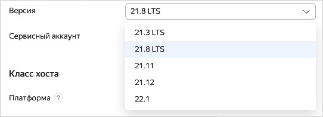

# Обновление версии {{ CH }}

Вы можете изменить версию {{ CH }}, которую использует кластер, на любую из [поддерживаемых {{ mch-name }} версий](../concepts/update-policy.md#versioning-policy), но при этом запрещен переход:

* с версии 22.0 и выше на версию ниже 22.0;
* на версию ниже {{ mch-ck-version }}, если кластер создан с поддержкой {{ CK }}.

Об обновлениях в рамках одной версии и обслуживании хостов см. в разделе [Техническое обслуживание](../concepts/maintenance.md).

## Список доступных версий



- Консоль управления

    Посмотреть список доступных версий можно на экране создания или изменения кластера в [консоли управления]({{ link-console-main }}):

    

- CLI

    

    

    Чтобы получить список доступных версий, выполните команду:

    ```bash
    yc managed-clickhouse version list
    ```

- API

    Чтобы посмотреть список доступных версий, воспользуйтесь методом REST API [list](../api-ref/Versions/list.md) для ресурса [Versions](../api-ref/Versions/index.md) или вызовом gRPC API [VersionsService/List](../api-ref/grpc/versions_service.md#List).



## Перед обновлением версии {#before-update}

Убедитесь, что это не нарушит работу ваших приложений:

1. Посмотрите в [истории изменений](https://clickhouse.com/docs/category/changelog) {{ CH }}, как обновления могут повлиять на работу ваших приложений.
1. Попробуйте обновить версию на тестовом кластере. Его можно развернуть из резервной копии основного кластера. В этом случае восстановятся только таблицы на движке MergeTree.
1. [Создайте резервную копию](cluster-backups.md) основного кластера непосредственно перед обновлением версии.

## Обновить версию {#start-update}



- Консоль управления

    1. В [консоли управления]({{ link-console-main }}) откройте страницу сервиса **{{ ui-key.yacloud.iam.folder.dashboard.label_managed-clickhouse }}** в каталоге, где нужно обновить версию {{ CH }}.
    1. В списке кластеров выберите тот, который нужно изменить.
    1. Нажмите кнопку **{{ ui-key.yacloud.mdb.cluster.overview.button_action-edit }}**.
    1. В блоке **{{ ui-key.yacloud.mdb.forms.section_base }}** в поле **{{ ui-key.yacloud.mdb.forms.base_field_version }}** выберите нужную версию.
    1. Нажмите кнопку **{{ ui-key.yacloud.mdb.forms.button_edit }}**.

    После того как изменение версии запущено, кластер переходит в статус **UPDATING**. Дождитесь окончания операции и проверьте версию кластера.

- CLI

    

    

    1. Получите список ваших кластеров {{ CH }}:

        ```bash
        {{ yc-mdb-ch }} cluster list

        +----------------------+---------------+---------------------+--------+---------+
        |          ID          |     NAME      |     CREATED AT      | HEALTH | STATUS  |
        +----------------------+---------------+---------------------+--------+---------+
        | c9q8p8j2gaih******** | clickhouse691 | 2019-04-23 12:44:17 | ALIVE  | RUNNING |
        +----------------------+---------------+---------------------+--------+---------+
        ```

    1. Получите информацию о нужном кластере и проверьте версию {{ CH }} в вашем кластере, указанную в свойстве `config.version`:

        ```bash
        {{ yc-mdb-ch }} cluster get c9q8p8j2gaih********
        id: c9q8p8j2gaih********
        folder_id: b1gqs1teo2q2********
        created_at: "2019-04-23T12:44:17.929853Z"
        name: clickhouse691
        environment: PRODUCTION
        monitoring:
        - name: Console
            description: Console charts
            link: {{ link-console-main }}/folders/b1gqs1teo2q2********/managed-clickhouse/cluster/c9q8p8j2gaih********?section=monitoring
        config:
            version: "19.1"
            ...
        ```

    1. Обновите версию {{ CH }}:

        ```bash
        {{ yc-mdb-ch }} cluster update --id c9q8p8j2gaih******** --version 19.4
        ```

    После того как обновление запущено, кластер переходит в статус **UPDATING**. Дождитесь окончания операции и затем проверьте версию кластера.

- {{ TF }}

    1. Откройте актуальный конфигурационный файл {{ TF }} с планом инфраструктуры.

        О том, как создать такой файл, см. в разделе [Создание кластера](cluster-create.md).

    1. Добавьте к описанию кластера {{ mch-name }} поле `version` или измените его значение, если оно уже существует:

        ```hcl
        resource "yandex_mdb_clickhouse_cluster" "<имя_кластера>" {
          ...
          version = "<версия_{{ CH }}>"
        }
        ```

    1. Проверьте корректность настроек.

        

    1. Подтвердите изменение ресурсов.

        

    Подробнее см. в [документации провайдера {{ TF }}]({{ tf-provider-resources-link }}/mdb_clickhouse_cluster).

    

- API

    Чтобы обновить версию, воспользуйтесь методом REST API [update](../api-ref/Cluster/update.md) для ресурса [Cluster](../api-ref/Cluster/index.md) или вызовом gRPC API [ClusterService/Update](../api-ref/grpc/cluster_service.md#Update) и передайте в запросе:

    * Идентификатор кластера в параметре `clusterId`. Чтобы узнать идентификатор, [получите список кластеров в каталоге](./cluster-list.md#list-clusters).
    * Нужное значение в параметре `configSpec.clickhouse.config.version`.
    * Список настроек, которые необходимо изменить (в данном случае — `configSpec.clickhouse.config.version`), в параметре `updateMask`.

    


