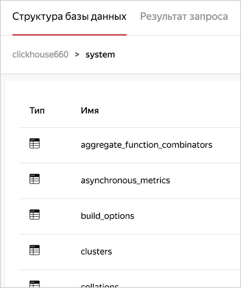
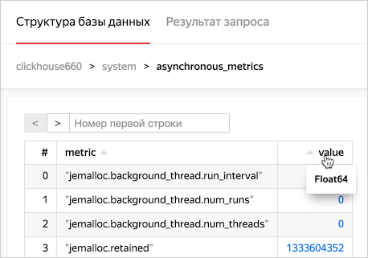
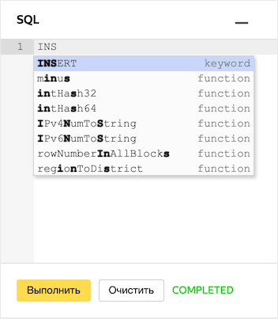
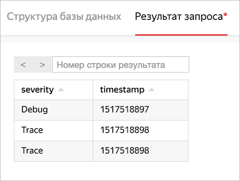

# SQL-запросы в консоли управления

{{ mch-name }} позволяет визуализировать структуру данных на вашем ClickHouse-кластере и отправлять SQL-запросы к базам из консоли управления Облака. Для этого войдите в [консоль управления]({{ link-console-main }}), откройте страницу нужного кластера и перейдите на вкладку **SQL**.

Справочник по поддерживаемым запросам можно найти в [документации ClickHouse](https://clickhouse.yandex/docs/ru/query_language/select/).

## Аутентификация

При каждом переходе на вкладку **SQL** необходимо ввести логин и пароль пользователя кластера. После этого откроется структура данных кластера и окно ввода для SQL-запросов.

Чтобы не вводить пароль слишком часто, откройте эту страницу консоли управления в новой вкладке.

## Визуализация структуры данных

После авторизации вы можете видеть структуру баз данных и таблиц в кластере:

По нажатию на таблицу выводятся первые 1000 строк результата запроса `SELECT *` для этой таблицы (полноценную навигацию по всем данным базы {{ mch-name }} не поддерживает). Наведите курсор на заголовок столбца, чтобы увидеть тип данных в столбце:

В поле **Номер первой строки** вы можете задать смещение, с которым следует показать таблицу результатов. На одной странице отображается не больше 20 строк — с помощью кнопок **<** и **>** вы можете быстро увеличивать и уменьшать смещение на 20.

 ## SQL-запросы

Справа внизу по умолчанию открыто окно ввода запроса. Начните вводить запрос, и редактор будет предлагать варианты ключевых слов:

Введите запрос и нажмите кнопку **Выполнить**. Таблица результатов или сообщение об ошибке появится на вкладке **Результат запроса**. Значок  означает, что после получения результата текст запроса изменился:

## Ограничения запросов в консоли управления

Главное ограничение запросов в консоли управления — текст запросов и их результаты доступны только пока вы не закрыли или перезагрузили страницу в браузере. Но если запрос был успешно запущен, {{ mch-name }} обработает его независимо от состояния консоли управления.

Помимо этого стоит помнить:

* Консоль управления выведет только первые 1000 строк результата, даже если данных на самом деле больше.
* Когда выполнение запроса на кластере занимает больше 10 минут, консоль управления не выведет результат и сообщит об ошибке, даже если запрос в конечном счете будет успешно обработан.
* Если в вашем кластере больше одного хоста ClickHouse, то запросы из консоли управления отправляются на случайный хост. Учитывайте это, если будете модифицировать данные: например, запрос `CREATE TABLE db1.newtable` создаст таблицу только на одном хосте. Чтобы избежать этого, используйте [распределенный запрос](https://clickhouse.yandex/docs/ru/query_language/create/#raspredelennye-ddl-zaprosy-sektsiia-on-cluster) с подстановкой имени кластера: `CREATE TABLE db1.newtable ON CLUSTER '{cluster}'`.
