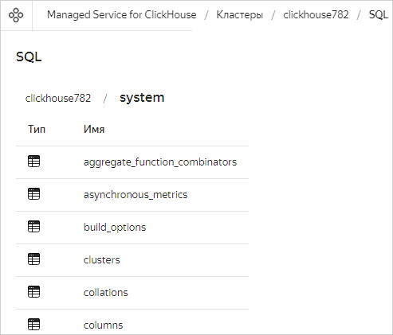
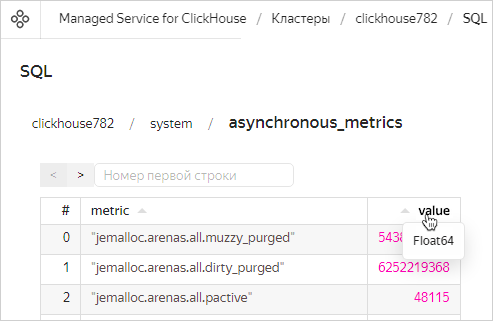

# SQL-запросы в Managed Service for ClickHouse

{{ mch-name }} позволяет визуализировать структуру данных на вашем ClickHouse-кластере и отправлять SQL-запросы к базам из консоли управления {{ yandex-cloud }}. Для этого войдите в [консоль управления]({{ link-console-main }}), откройте страницу нужного кластера и перейдите на вкладку **SQL**.

Справочник по поддерживаемым запросам можно найти в [документации ClickHouse]({{ ch.docs }}/sql-reference/statements/select/).

## Доступ к кластеру из консоли управления {#sql-cluster-access}

Чтобы подключиться из консоли управления к кластеру {{ mch-name }} и работать с данными в нем, включите опцию **Доступ из консоли управления** при [создании кластера](cluster-create.md) или [изменении его настроек](update.md#change-additional-settings).



## Визуализация структуры данных {#data-structure-visualization}

После авторизации вы можете видеть структуру баз данных и таблиц в кластере:

По нажатию на таблицу выводятся первые 1000 строк результата запроса `SELECT *` для этой таблицы (полноценную навигацию по всем данным консоль управления не поддерживает). Наведите курсор на заголовок столбца, чтобы увидеть тип данных в столбце:

В поле **Номер первой строки** вы можете задать смещение, с которым следует показать таблицу результатов. На одной странице отображается не больше 20 строк — с помощью кнопок **<** и **>** вы можете быстро увеличивать и уменьшать смещение на 20.

 ## SQL-запросы {#sql-queries}

Справа открыто окно ввода запроса. Начните вводить запрос, и редактор будет предлагать варианты ключевых слов:

Введите запрос и нажмите кнопку **Выполнить**. Таблица результатов или сообщение об ошибке появится на панели результатов под кнопками.

## Ограничения запросов в консоли управления {#query-restrictions-in-the-management-console}

Главное ограничение запросов в консоли управления — текст запросов и их результаты доступны только пока вы не закрыли или перезагрузили страницу в браузере. Но если запрос был успешно запущен, {{ mch-name }} обработает его независимо от состояния консоли управления.

Помимо этого стоит помнить:

* Консоль управления выведет только первые 1000 строк результата, даже если данных на самом деле больше.
* Когда выполнение запроса на кластере занимает больше 10 минут, консоль управления не выведет результат и сообщит об ошибке, даже если запрос в конечном счете будет успешно обработан.
* Если в вашем кластере больше одного хоста {{CH}}, то запросы из консоли управления отправляются на случайный хост. Учитывайте это, если будете модифицировать данные: например, запрос `CREATE TABLE db1.newtable` создаст таблицу только на одном хосте. Чтобы избежать этого, используйте [распределенный запрос]({{ ch.docs }}/sql-reference/statements/create/table) с подстановкой имени кластера: `CREATE TABLE db1.newtable ON CLUSTER '{cluster}'`.
