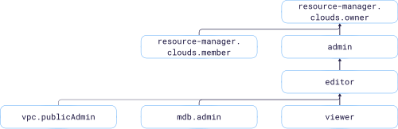

# Управление доступом в {{ mch-name }}

В этом разделе вы узнаете:

* [на какие ресурсы можно назначить роль](#resources);
* [какие роли действуют в сервисе](#roles-list);
* [какие роли необходимы](#required-roles) для того или иного действия.



## На какие ресурсы можно назначить роль {#resources}



Чтобы разрешить доступ к ресурсам сервиса {{ mch-name }} (кластеры и хосты БД, резервные копии кластеров, базы данных и их пользователи), назначьте пользователю нужные роли на каталог или облако, в котором эти ресурсы лежат.

## Какие роли действуют в сервисе {#roles-list}

На диаграмме показано, какие роли есть в сервисе и как они наследуют разрешения друг друга. Например, в `{{ roles-editor }}` входят все разрешения `{{ roles-viewer }}`. После диаграммы дано описание каждой роли.

### {{ roles-mdb-admin }} {#mdb-admin}



### {{ roles-mdb-viewer }} {#mdb-viewer}



### {{ roles-mdb-auditor }} {#mdb-auditor}



### {{ roles-cloud-member }} {#resmgr-clouds-member}



### {{ roles-cloud-owner }} {#resmgr-clouds-owner}





### {{ roles-viewer }} {#viewer}



### {{ roles-editor }} {#editor}



### {{ roles-admin }} {#admin}



### {{ roles.mch.admin }} {#mch-admin}



### {{ roles.mch.auditor }} {#mch-auditor}



### {{ roles.mch.editor }} {#mch-editor}



### {{ roles.mch.viewer }} {#mch-viewer}



## Какие роли необходимы {#required-roles}

Чтобы пользоваться сервисом, необходима [роль](../../iam/concepts/access-control/roles.md) `editor` или выше на каталог, в котором создается кластер. Роль `viewer` позволит только просматривать список кластеров.

Вы всегда можете назначить роль, которая дает более широкие разрешения. Например, назначить `admin` вместо `editor`.

## Что дальше {#whats-next}

* [Как назначить роль](../../iam/operations/roles/grant.md).
* [Как отозвать роль](../../iam/operations/roles/revoke.md).
* [Подробнее об управлении доступом в {{ yandex-cloud }}](../../iam/concepts/access-control/index.md).
* [Подробнее о наследовании ролей](../../resource-manager/concepts/resources-hierarchy.md#access-rights-inheritance).

