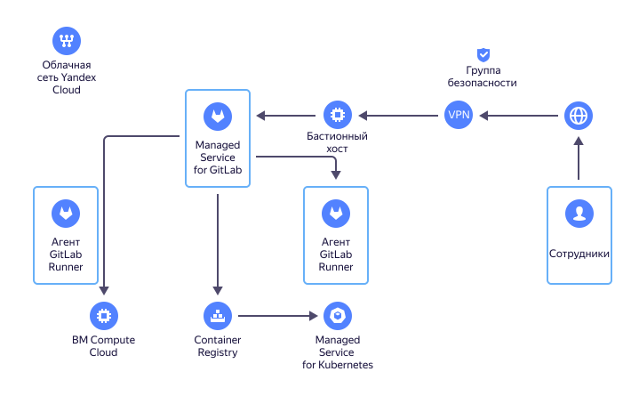

# Взаимосвязь ресурсов в {{ mgl-name }}

[{{ GL }}](https://about.gitlab.com/) — это веб-инструмент жизненного цикла [DevOps](/blog/posts/2022/03/what-is-devops) с открытым исходным кодом. Он представляет собой систему управления репозиториями кода для [Git](https://git-scm.com/) с системой отслеживания ошибок, [CI/CD](/blog/posts/2022/10/ci-cd) пайплайном, собственной Wiki и другими функциями.

{{ mgl-name }} позволяет настроить развертывание приложений на [виртуальных машинах](../../compute/concepts/vm.md) [{{ compute-full-name }}](../../compute/), а также поддерживает интеграцию с [{{ container-registry-full-name }}](../../container-registry/) и [{{ managed-k8s-full-name }}](../../managed-kubernetes/).

Схема работы {{ mgl-name }}:

## Инстанс {{ GL }} {#instance}

_Инстанс_ {{ GL }} — основная сущность, которой оперирует сервис. Это ВМ, размещенная в {{ yandex-cloud }}. {{ mgl-name }} берет на себя рутинные операции по техническому обслуживанию этой ВМ, например, обеспечение отказоустойчивости хранилища, установку обновлений безопасности, автоматизированное обновление до новых версий {{ GL }} и т. д.

## Конфигурация инстанса {#config}

При создании инстанса указываются:
* Тип инстанса — [количество ядер (vCPU) и объем памяти (RAM)](../../compute/concepts/vm-platforms.md). После создания инстанса можно [изменить его тип](../operations/instance/instance-update.md) на более производительный.
* [Подсеть](../../vpc/concepts/network.md#subnet).

  

* Размер диска. После создания инстанса размер его диска [можно увеличить](../operations/instance/instance-update.md).
* Имя в домене `.gitlab.yandexcloud.net` — адрес вашего экземпляра {{ GL }} в интернете.
* Данные администратора:
  * Электронная почта.
  * Логин.



## {{ GLR }} {#runners}

[{{ GLR }}](https://docs.gitlab.com/runner/) — приложение с открытым исходным кодом, которое выполняет задания конвейерной обработки {{ GL }} [CI/CD](/blog/posts/2022/10/ci-cd) по инструкциям из специального файла `.gitlab-ci.yml`. Оно позволяет запускать автоматизированные сборки внутри [кластеров {{ managed-k8s-name }}](../../managed-kubernetes/concepts/index.md#kubernetes-cluster) и на [виртуальных машинах {{ compute-name }}](../../compute/concepts/vm.md).

Начать работу с {{ GLR }} можно следующими способами:

* [Установить {{ GLR }} в кластер {{ managed-k8s-name }}](../../managed-kubernetes/operations/applications/gitlab-runner.md).
* Создать виртуальную машину {{ compute-name }} и [вручную установить на нее {{ GLR }}](../tutorials/install-gitlab-runner.md#install).
* [Создать с помощью консоли управления раннер](../tutorials/install-gitlab-runner.md#create-runner), который автоматически развернет указанное число виртуальных машин {{ compute-name }}.

    При создании раннера из консоли управления вы можете выбрать для хранилища ВМ следующие типы дисков объемом от 15 до 500 ГБ:

    * HDD-диски.
    * SSD-диски.

    Доступны следующие конфигурации вычислительных ресурсов:

    * 2 vCPU, 4 ГБ RAM.
    * 2 vCPU, 8 ГБ RAM.
    * 4 vCPU, 16 ГБ RAM.
    * 8 vCPU, 64 ГБ RAM.
    * 16 vCPU, 128 ГБ RAM.

      

## Примеры использования {#examples}

* [{#T}](../tutorials/gitlab-lockbox-integration.md)
* [{#T}](../tutorials/ci-cd-serverless.md)
* [{#T}](../tutorials/install-gitlab-runner.md)
* [{#T}](../tutorials/gitlab-containers.md)
