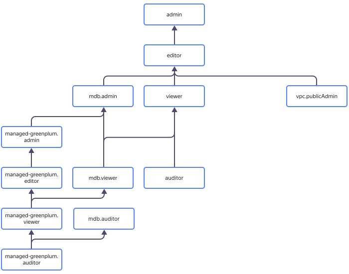

# Управление доступом в {{ mgp-name }}

В этом разделе вы узнаете:

* [на какие ресурсы можно назначить роль](#resources);
* [какие роли действуют в сервисе](#roles-list);
* [какие роли необходимы](#required-roles) для того или иного действия.



Назначать роли на ресурс могут пользователи, у которых на этот ресурс есть роль `mdb.admin`, `managed-greenplum.admin` или одна из следующих ролей:



## На какие ресурсы можно назначить роль {#resources}





## Какие роли действуют в сервисе {#roles-list}

На диаграмме показано, какие роли есть в сервисе и как они наследуют разрешения друг друга. Например, в `{{ roles-editor }}` входят все разрешения `{{ roles-viewer }}`. После диаграммы дано описание каждой роли.

### Сервисные роли {#service-roles}

#### managed-greenplum.auditor {#managed-greenplum-auditor}



#### managed-greenplum.viewer {#managed-greenplum-viewer}



#### managed-greenplum.editor {#managed-greenplum-editor}



#### managed-greenplum.admin {#managed-greenplum-admin}



#### mdb.auditor {#mdb-auditor}



#### mdb.viewer {#mdb-viewer}



#### mdb.admin {#mdb-admin}



При создании кластера {{ mgp-name }} вместе с ним автоматически создается пользователь-администратор с ролью `mdb_admin`. Эта роль заменяет суперпользователя при работе с БД и не является аналогом роли `{{ roles-mdb-admin }}` в {{ yandex-cloud }}. Подробнее читайте в разделе [{#T}](../concepts/cluster-users.md).

#### vpc.publicAdmin {#vpc-public-admin}



### Примитивные роли {#primitive-roles}





## Какие роли необходимы {#required-roles}

Чтобы пользоваться сервисом, необходима роль [{{ roles.mgp.editor }} или выше](../../iam/concepts/access-control/roles.md) на каталог, в котором создается кластер. Роль `{{ roles.mgp.viewer }}` позволит только просматривать список кластеров.

Чтобы создать кластер {{ mgp-name }}, нужна роль [{{ roles-vpc-user }}](../../vpc/security/index.md#vpc-user) и роль `{{ roles.mgp.editor }}` или выше.

Вы всегда можете назначить роль, которая дает более широкие разрешения. Например, назначить `{{ roles.mgp.admin }}` вместо `{{ roles.mgp.editor }}`.

## Что дальше {#whats-next}

* [Как назначить роль](../../iam/operations/roles/grant.md).
* [Как отозвать роль](../../iam/operations/roles/revoke.md).
* [Подробнее об управлении доступом в {{ yandex-cloud }}](../../iam/concepts/access-control/index.md).
* [Подробнее о наследовании ролей](../../resource-manager/concepts/resources-hierarchy.md#access-rights-inheritance).


