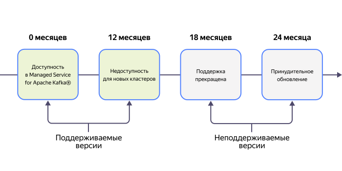

# Политика работы с версиями {{ KF }}



Политика работы с версиями {{ KF }} действует начиная с версии 3.4.



{{ KF }} выпускает новые версии три раза в год согласно [официальной документации](https://cwiki.apache.org/confluence/display/KAFKA/Time+Based+Release+Plan#TimeBasedReleasePlan-WhatIsOurEOLPolicy?).

У каждой версии в инфраструктуре {{ yandex-cloud }} есть [этапы жизненного цикла](#version-lifecycle), которые присваиваются в зависимости от даты релиза в Open Source. При устаревании используемая в кластере {{ mkf-name }} версия {{ KF }} обновляется.

Обновление до актуальных версий позволяет получать новую функциональность, патчи и исправления, направленные на улучшение безопасности, что повышает общую стабильность кластера.

## Этапы жизненного цикла версий {#version-lifecycle}

Для каждой версии определены ключевые этапы:

| Статус версии | Описание | Дата перехода статуса (от даты релиза в Open Source) |
|:---|:---|:---|
| **Поддерживаемые версии** |
| Доступность в {{ mkf-name }} | На этой версии можно создавать новые кластеры и работать с ними. | 0 месяцев |
| Недоступность для новых кластеров | На этой версии нельзя создавать новые кластеры, но текущие продолжат работать. | 12 месяцев |
| **Неподдерживаемые версии** |
| Поддержка прекращена | Прекращены техническая поддержка и обновления. | 18 месяцев |
| Принудительное обновление | Принудительное обновление существующих кластеров. | 24 месяца |



Рекомендуется самостоятельно [обновлять кластеры](../operations/cluster-version-update.md) до поддерживаемых версий, не дожидаясь автоматического обновления. Это позволит заранее протестировать совместимость приложений с новой версией.



## График поддержки версий {#version-schedule}

Срок поддержки каждой версии — минимум 18 месяцев с даты добавления в {{ mkf-name }}.

| Версия / Статус | Доступность в {{ mkf-name }} | Недоступность для новых кластеров | Поддержка прекращена | Принудительное обновление |
|:---|:---|:---|:---|:---|
| 2.8 | N/A | 1 марта 2025 | 1 сентября 2025 (предположительно) | 15 сентября 2025 (предположительно) |
| 3.0 | I квартал 2022 | 1 марта 2025 | 1 сентября 2025 (предположительно) | 15 сентября 2025 (предположительно) |
| 3.1 | II квартал 2022 | 1 марта 2025 | 1 сентября 2025 (предположительно) | 15 сентября 2025 (предположительно) |
| 3.2 | III квартал 2022 | 1 марта 2025 | 1 сентября 2025 (предположительно) | 15 сентября 2025 (предположительно) |
| 3.3 | I квартал 2023 | 1 марта 2025 | 1 сентября 2025 (предположительно) | 15 сентября 2025 (предположительно) |
| 3.4 | II квартал 2023 | 1 сентября 2025 | 1 марта 2026 | 1 сентября 2026 |
| 3.5 | IV квартал 2023 | 1 сентября 2025 | 1 марта 2026 | 1 сентября 2026 |
| 3.6 | I квартал 2025 | 1 марта 2026 | 1 сентября 2026 | 1 марта 2027 |
| 3.7 | II квартал 2025 | 1 июля 2026 | 1 января 2027 | 1 июля 2027 |
| 3.8 | II квартал 2025 | 1 июля 2026 | 1 января 2027 | 1 июля 2027 |
| 3.9 | II квартал 2025 | 1 июля 2026 | 1 января 2027 | 1 июля 2027 |



**Версия 3.9**: с данной версии доступна миграция кластеров с {{ ZK }} на {{ kraft-short-name }}.

**Версия 4.0+**: полностью прекращена поддержка {{ ZK }} (доступен только {{ kraft-name }}).



## Политика обновления {#update-policy}

Кластер {{ mkf-name }} на неподдерживаемой версии будет обновлен до ближайшей поддерживаемой версии.



Система оповещений предусматривает следующие уведомления:

- За **90 дней** до перехода версии в статус **Поддержка прекращена**.
- За **30 дней** до перехода версии в статус **Принудительное обновление**.
- За **7 дней** до начала принудительного обновления версии.

