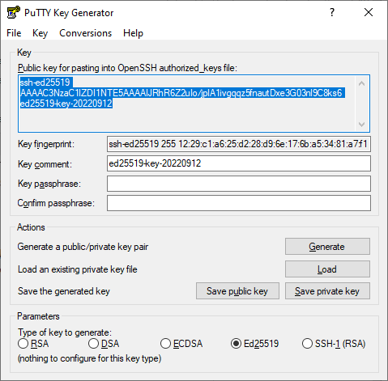

# Подключение к узлу по SSH

Чтобы подключиться к [узлу](../concepts/index.md#node-group) [кластера {{ managed-k8s-name }}](../concepts/index.md#kubernetes-cluster) по [SSH](../../glossary/ssh-keygen.md):
* Добавьте публичный ключ в метаданные при [создании группы узлов {{ managed-k8s-name }}](node-group/node-group-create.md).

  

  В образах Linux, которые используются на узлах {{ managed-k8s-name }}, возможность подключения по протоколу SSH с использованием логина и пароля по умолчанию отключена.

  

* [Настройте группы безопасности](connect/security-groups.md) кластера {{ managed-k8s-name }}.

  

  Настройки групп безопасности могут препятствовать подключению к кластеру {{ managed-k8s-name }}.

  

Подробнее см. в разделе [Подключение к виртуальной машине по SSH](../../compute/operations/vm-connect/ssh.md).





## Создайте пары ключей SSH {#creating-ssh-keys}

Подготовьте ключи для использования с вашим узлом кластера {{ managed-k8s-name }}. Для этого:



- Linux/macOS {#linux-macos}

  1. Откройте терминал.
  1. Создайте новый ключ с помощью команды `ssh-keygen`:

     ```bash
     ssh-keygen -t ed25519
     ```

     После выполнения команды вам будет предложено указать имена файлов, в которые будут сохранены ключи и ввести пароль для закрытого ключа. По умолчанию используется имя `id_ed25519`, ключи создаются в директории `~/.ssh`.

     Публичная часть ключа будет сохранена в файле с названием `<имя_ключа>.pub`.

- Windows 10/11 {#windows}

  1. Запустите `cmd.exe` или `powershell.exe`.
  1. Создайте новый ключ с помощью команды `ssh-keygen`. Выполните команду:

     ```bash
     ssh-keygen -t ed25519
     ```

     После выполнения команды вам будет предложено указать имя файлов, в которые будут сохранены ключи и ввести пароль для закрытого ключа. По умолчанию используется имя `id_ed25519`, ключи создаются в директории `C:\Users\<имя_пользователя>\.ssh\`.

     Публичная часть ключа будет сохранена в файле с названием `<имя_ключа>.pub`.

- Windows 7/8 {#windows7-8}

  Создайте ключи с помощью приложения PuTTY:
  1. [Скачайте](https://www.putty.org) и установите PuTTY.
  1. Добавьте папку с PuTTY в переменную `PATH`:

      

  1. Запустите приложение PuTTYgen.
  1. В качестве типа генерируемой пары выберите **Ed25519**. Нажмите **Generate** и поводите курсором в поле выше до тех пор, пока не закончится создание ключа.

     

  1. В поле **Key passphrase** введите надежный пароль. Повторно введите его в поле ниже.
  1. Нажмите кнопку **Save private key** и сохраните закрытый ключ. Никому не сообщайте ключевую фразу от него.
  1. Сохраните ключ в текстовом файле одной строкой. Для этого скопируйте открытый ключ из текстового поля в текстовый файл с названием `id_ed25519.pub`.



## Приведите публичный ключ к формату метаданных {#key-format}

Реквизитами для подключения к узлам кластера {{ managed-k8s-name }} по SSH являются имя пользователя и публичный ключ. Данные реквизиты передаются с помощью метаданных в определенном формате.

[Созданный ранее](#creating-ssh-keys) публичный ключ имеет следующий формат:

```text
<тип_ключа> <тело_публичного_ключа> <опциональный_комментарий>
```

Пример:

> ```text
> ssh-ed25519 AAAAB3NzaC***********lP1ww ed25519-key-20190412
> ```

Создайте файл с реквизитами для подключения по SSH в следующем формате:

```text
<имя_пользователя>:<тип_ключа> <тело_публичного_ключа> <имя_пользователя>
```

Пример:

> ```text
> testuser:ssh-ed25519 AAAAB3NzaC***********lP1ww testuser
> ```

Данный формат подходит для создания и изменения группы узлов {{ managed-k8s-name }} с помощью интерфейсов CLI, {{ TF }} и API, а также для изменения группы узлов с помощью консоли управления. При создании группы узлов в консоли управления используются отдельные поля **{{ ui-key.yacloud.compute.instances.create.field_user }}** и **{{ ui-key.yacloud.compute.instances.create.field_key }}**.

В одном файле можно передать реквизиты для нескольких пользователей.

Пример:

> ```text
> testuser1:ssh-ed25519 AAAAB3NzaC***********lP1ww testuser1
> testuser2:ssh-ed25519 ONEMOREkey***********avEHw testuser2
> ```

## Создайте группу узлов и добавьте публичный ключ {#node-create}



- Консоль управления {#console}

  1. В [консоли управления]({{ link-console-main }}) перейдите на страницу каталога и выберите сервис **{{ ui-key.yacloud.iam.folder.dashboard.label_managed-kubernetes }}**.
  1. Выберите кластер {{ managed-k8s-name }}.
  1. На панели слева выберите **{{ ui-key.yacloud.k8s.cluster.switch_nodes-manager }}**.
  1. Нажмите кнопку **{{ ui-key.yacloud.k8s.cluster.node-groups.button_create }}**.
  1. Задайте параметры группы узлов.
  1. В блоке **{{ ui-key.yacloud.k8s.node-groups.create.section_access }}** укажите данные для доступа на узел {{ managed-k8s-name }}:
      * В поле **{{ ui-key.yacloud.compute.instances.create.field_user }}** введите имя пользователя.
      * В поле **{{ ui-key.yacloud.compute.instances.create.field_key }}** вставьте содержимое файла публичного ключа.
  1. Нажмите кнопку **{{ ui-key.yacloud.common.create }}**.

- CLI {#cli}

  Метаданные с реквизитами для подключения по SSH передаются в группу узлов {{ managed-k8s-name }} в виде пар `ключ=значение`.

  

  

  

  Чтобы создать группу узлов {{ managed-k8s-name }} и передать данные пользователя для подключения по SSH, выполните команду:

  ```bash
  yc managed-kubernetes node-group create \
    --name <имя_группы_узлов> \
    --cluster-name <имя_кластера> \
    --fixed-size <количество_узлов_в_группе> \
    --network-interface security-group-ids=[<список_групп_безопасности>],subnets=<имя_подсети>,ipv4-address=nat \
    --metadata-from-file ssh-keys=<путь_к_файлу_с_реквизитами>
  ```

  Где `--metadata-from-file` — параметр для передачи метаданных в группу узлов в виде пар `ключ=значение`. Укажите в ключе `ssh-keys` путь к файлу с реквизитами для подключения по SSH.

- {{ TF }} {#tf}

  Метаданные с реквизитами для подключения по SSH передаются в группу узлов {{ managed-k8s-name }} в виде пар `ключ=значение`.

  

  1. Создайте конфигурационный файл {{ TF }} с описанием группы узлов {{ managed-k8s-name }} согласно инструкции [{#T}](./node-group/node-group-create.md).

  1. В описании группы узлов задайте значение ключа метаданных `ssh-keys` для параметра `instance_template.metadata`:

      ```hcl
      resource "yandex_kubernetes_node_group" "<имя_группы_узлов>" {
        cluster_id = yandex_kubernetes_cluster.<имя_кластера>.id
        ...
        instance_template {
          metadata = {
            "ssh-keys" = file("<путь_к_файлу_с_реквизитами>")
            ...
          }
          ...
        }
        ...
      }
      ```

  1. Проверьте корректность конфигурационных файлов.

      

  1. Подтвердите изменение ресурсов.

      

  Подробнее см. в [документации провайдера {{ TF }}]({{ tf-provider-k8s-nodegroup }}).

- API {#api}

  Метаданные с реквизитами для подключения по SSH передаются в группу узлов {{ managed-k8s-name }} в виде пар `ключ=значение`.

  

  Если вы хотите передать несколько реквизитов для подключения по SSH, преобразуйте содержимое файла с реквизитами в одну строку, отделив реквизиты друг от друга последовательностью специальных символов CRLF (`\r\n`). В запросе к API с телом в формате JSON нельзя использовать многострочные сообщения.

  Пример преобразованных реквизитов:

  > ```text
  > testuser1:ssh-ed25519 AAAAB3NzaC***********lP1ww testuser1\r\ntestuser2:ssh-ed25519 ONEMOREkey***********avEHw testuser2
  > ```

  Воспользуйтесь методом REST API [create](../managed-kubernetes/api-ref/NodeGroup/create.md) для ресурса [NodeGroup](../managed-kubernetes/api-ref/NodeGroup/index.md) или вызовом gRPC API [NodeGroupService/Create](../managed-kubernetes/api-ref/grpc/NodeGroup/create.md).

  Реквизиты для подключения по SSH передаются в параметре `nodeTemplate.metadata` в ключе `ssh-keys`.



Подробнее о создании группы узлов {{ managed-k8s-name }} и передаваемых параметрах см. на странице [{#T}](./node-group/node-group-create.md).

## Обновите ключи группы узлов {#node-add-metadata}

Чтобы изменить реквизиты для подключения по SSH к группе узлов {{ managed-k8s-name }}, обновите ее метаданные.



Реквизиты для подключения по SSH будут полностью перезаписаны. Вы не сможете подключиться к узлам кластера {{ managed-k8s-name }} с помощью прежних реквизитов.





- Консоль управления {#console}

  

  После изменения метаданных через [консоль управления]({{ link-console-main }}) группа узлов временно перейдет в статус `Reconciling`: все узлы в группе будут пересозданы для применения изменений.

  

  1. В [консоли управления]({{ link-console-main }}) перейдите на страницу каталога и выберите сервис **{{ ui-key.yacloud.iam.folder.dashboard.label_managed-kubernetes }}**.
  1. Выберите кластер {{ managed-k8s-name }}.
  1. На панели слева выберите **{{ ui-key.yacloud.k8s.cluster.switch_nodes-manager }}**.
  1. На вкладке **{{ ui-key.yacloud.k8s.nodes.label_node-groups }}** выберите группу узлов, в которой вы хотите обновить реквизиты.
  1. На панели сверху нажмите кнопку  **{{ ui-key.yacloud.common.edit }}**.
  1. Раскройте блок **{{ ui-key.yacloud.common.metadata }}**.
  1. Замените текущее значение ключа `ssh-keys` на содержимое файла с реквизитами.
  1. Нажмите кнопку **{{ ui-key.yacloud.common.save }}**.

- CLI {#cli}

  1. Посмотрите описание команды CLI для добавления и обновления метаданных группы узлов {{ managed-k8s-name }}:

      ```bash
      {{ yc-k8s }} node-group add-metadata --help
      ```

  1. Выполните команду:

      ```bash
      {{ yc-k8s }} node-group add-metadata \
        --name <имя_группы_узлов> \
        --metadata-from-file ssh-keys=<путь_к_файлу_с_реквизитами>
      ```

      Имя группы узлов можно запросить со [списком групп узлов в каталоге](./node-group/node-group-list.md#list).

- {{ TF }} {#tf}

  1. Откройте конфигурационный файл {{ TF }} с описанием группы узлов {{ managed-k8s-name }}.

      О том, как создать такой файл, см. в разделе [{#T}](./node-group/node-group-create.md).

  1. Измените в описании группы узлов значение ключа метаданных `ssh-keys` для параметра `instance_template.metadata`:

      ```hcl
      resource "yandex_kubernetes_node_group" "<имя_группы_узлов>" {
        cluster_id = yandex_kubernetes_cluster.<имя_кластера>.id
        ...
        instance_template {
          metadata = {
            "ssh-keys" = file("<путь_к_файлу_с_реквизитами>")
            ...
          }
          ...
        }
        ...
      }
      ```

  1. Проверьте корректность конфигурационных файлов.

      

  1. Подтвердите изменение ресурсов.

      

  Подробнее см. в [документации провайдера {{ TF }}]({{ tf-provider-k8s-nodegroup }}).

- API {#api}

  1. Если вы хотите передать несколько реквизитов для подключения по SSH, преобразуйте содержимое файла с реквизитами в одну строку, отделив реквизиты друг от друга последовательностью специальных символов CRLF (`\r\n`). В запросе к API с телом в формате JSON нельзя использовать многострочные сообщения.

      Пример преобразованных реквизитов:

      > ```text
      > testuser1:ssh-ed25519 AAAAB3NzaC***********lP1ww testuser1\r\ntestuser2:ssh-ed25519 ONEMOREkey***********avEHw testuser2
      > ```

  1. 

  1. Воспользуйтесь методом REST API [update](../managed-kubernetes/api-ref/NodeGroup/update.md) для ресурса [NodeGroup](../managed-kubernetes/api-ref/NodeGroup/index.md) и передайте в запросе:

      * Идентификатор группы узлов в параметре `nodeGroupId`.

      * Параметр `updateMask` со значением `nodeTemplate.metadata`.

          

      * Параметр `nodeTemplate.metadata`, в котором перечислены без изменений все существующие метаданные группы узлов в виде пар `ключ=значение`.

          Для ключа `ssh-keys` замените текущее значение на созданную строку с реквизитами.

          

          > * Существующие ключи метаданных в группе узлов:
          >
          >     ```json
          >     "nodeTemplate": {
          >         "metadata": {
          >             "ssh-keys": "<существующие_реквизиты_одной_строкой>",
          >             "<существующий_ключ_1>": "<существующее_значение_1>",
          >             "<существующий_ключ_2>": "<существующее_значение_2>"
          >         },
          >         ...
          >     }
          >     ```
          >
          > * Ключи метаданных для передачи в запросе к API:
          >
          >     ```json
          >     "nodeTemplate": {
          >         "metadata": {
          >             "ssh-keys": "<новые_реквизиты_одной_строкой>",
          >             "<существующий_ключ_1>": "<существующее_значение_1>",
          >             "<существующий_ключ_2>": "<существующее_значение_2>"
          >         }
          >     }
          >     ```

          

          



## Получите публичный IP-адрес узла {#node-public-ip}

Чтобы подключиться к узлу кластер {{ managed-k8s-name }}, укажите [публичный IP-адрес](../../vpc/concepts/address.md#public-addresses) узла {{ managed-k8s-name }}. Его можно узнать одним из следующих способов.



- Консоль управления {#console}

  1. Откройте раздел **{{ ui-key.yacloud.iam.folder.dashboard.label_compute }}** в каталоге, где создан ваш кластер {{ managed-k8s-name }}.
  1. На панели слева выберите  **{{ ui-key.yacloud.compute.instance-groups_hx3kX }}**.
  1. Нажмите на группу ВМ, имя которой соответствует идентификатору группы узлов {{ managed-k8s-name }}.
  1. В открывшемся окне перейдите на вкладку **{{ ui-key.yacloud.compute.group.switch_instances }}**.
  1. Нажмите на ВМ, публичный адрес которой хотите узнать.
  1. Публичный IP-адрес указан в блоке **{{ ui-key.yacloud.compute.instance.overview.section_network }}** в строке **{{ ui-key.yacloud.compute.instance.overview.label_public-ipv4 }}**.

- CLI {#cli}

  1. Узнайте идентификатор группы ВМ, которая соответствует группе узлов {{ managed-k8s-name }}.

     Идентификатор находится в столбце `INSTANCE GROUP ID`.

     ```bash
     yc managed-kubernetes node-group list
     ```

     Результат:

     ```text
     +----------------------+----------------------+----------------+----------------------+---------------------+---------+------+
     |          ID          |      CLUSTER ID      |      NAME      |  INSTANCE GROUP ID   |     CREATED AT      | STATUS  | SIZE |
     +----------------------+----------------------+----------------+----------------------+---------------------+---------+------+
     | cat684ojo3ir******** | cata9ertn6tc******** | test-nodegroup | cl17i6943n92******** | 2019-04-12 12:38:35 | RUNNING |    2 |
     +----------------------+----------------------+----------------+----------------------+---------------------+---------+------+
     ```

  1. Посмотрите список узлов {{ managed-k8s-name }}, которые принадлежат данной группе.

     Публичный IP-адрес узла {{ managed-k8s-name }} указан в столбце `IP` после символа `~`.

     ```bash
     yc compute instance-group list-instances cl17i6943n92********
     ```

     Результат:

     ```text
     +----------------------+---------------------------+--------------------------+---------------+----------------+
     |     INSTANCE ID      |           NAME            |            IP            |    STATUS     | STATUS MESSAGE |
     +----------------------+---------------------------+--------------------------+---------------+----------------+
     | ef31h24k03pg******** | cl17i6943n92********-itif | 10.0.0.27~84.201.145.251 | RUNNING [53m] |                |
     | ef37ddhg9i7j******** | cl17i6943n92********-ovah | 10.0.0.22~84.201.149.184 | RUNNING [53m] |                |
     +----------------------+---------------------------+--------------------------+---------------+----------------+
     ```

- kubectl CLI {#kubectl}

  1. 

  1. Выполните команду:

     ```bash
     kubectl get nodes -o wide
     ```

     Результат:

     ```bash
     NAME                       STATUS  ROLES   AGE  VERSION  INTERNAL-IP  EXTERNAL-IP     OS-IMAGE            KERNEL-VERSION     CONTAINER-RUNTIME
     cl17i6943n92********-itif  Ready   <none>  31m  v1.13.3  10.0.0.27    84.201.145.251  Ubuntu 18.04.1 LTS  4.15.0-29-generic  docker://18.6.2
     cl17i6943n92********-ovah  Ready   <none>  31m  v1.13.3  10.0.0.22    84.201.149.184  Ubuntu 18.04.1 LTS  4.15.0-29-generic  docker://18.6.2
     ```

     Публичный IP-адрес указан в столбце `EXTERNAL-IP`.



## Подключитесь к узлу {#node-connect}

Вы можете подключиться к узлу {{ managed-k8s-name }} по протоколу SSH, когда он будет запущен (в статусе `RUNNING`). Для этого можно использовать утилиту `ssh` в Linux и macOS и программу [PuTTY](https://www.chiark.greenend.org.uk/~sgtatham/putty/) для Windows.



- Linux/macOS/Windows 10 {#linux-macos-windows10}

  В терминале выполните следующую команду, указав имя пользователя и [публичный IP-адрес](#node-public-ip) узла:

  ```bash
  ssh <имя_пользователя>@<публичный_IP-адрес_узла>
  ```

  Если вы передавали реквизиты для подключения по SSH при [создании группы узлов](#node-create) с помощью консоли управления, используйте имя пользователя, которое вы указали в поле **{{ ui-key.yacloud.compute.instances.create.field_user }}**.

  Если вы передавали реквизиты для подключения по SSH при [создании группы узлов](#node-create) с помощью CLI, {{ TF }}, API или [обновляли реквизиты](#node-add-metadata), используйте имя пользователя, которое вы [указали в файле с реквизитами для подключения по SSH](#key-format).

  При первом подключении к узлу {{ managed-k8s-name }} может появиться предупреждение о неизвестном хосте:

  ```bash
  The authenticity of host '130.193.40.101 (130.193.40.101)' can't be established.
  ECDSA key fingerprint is SHA256:PoaSwqxRc8g6iOXtiH7ayGHpSN0MXwUfWHk********.
  Are you sure you want to continue connecting (yes/no)?
  ```

  Введите в терминале слово `yes` и нажмите **Enter**.

- Windows 7/8 {#windows7-8}

  В Windows соединение устанавливается с помощью приложения PuTTY.
  1. Запустите приложение Pageant.
     1. Нажмите правой кнопкой мыши на значок Pageant на панели задач.
     1. В контекстном меню выберите пункт **Add key**.
     1. Выберите сгенерированный PuTTY приватный ключ в формате `.ppk`. Если для ключа задан пароль, введите его.
  1. Запустите приложение PuTTY.
     1. В поле **Host Name (or IP address)** введите [публичный IP-адрес](#node-public-ip) ВМ, к которой вы хотите подключиться. Укажите порт `22` и тип соединения **SSH**.

        

     1. Откройте в дереве слева пункт **Connection** - **SSH** - **Auth**.
     1. Установите флаг **Allow agent forwarding**.
     1. В поле **Private key file for authentication** выберите файл с приватным ключом.

        

     1. Вернитесь в меню **Sessions**. В поле **Saved sessions** введите любое название для сессии и нажмите кнопку **Save**. Настройки сессии сохранятся под указанным именем. Вы сможете использовать этот профиль сессии для подключения с помощью Pageant.

        

     1. Нажмите кнопку **Open**. Если вы подключаетесь к узлу {{ managed-k8s-name }} в первый раз, может появиться предупреждение о неизвестном хосте:

        

        Нажмите кнопку **Да**. Откроется окно терминала с предложением ввести логин пользователя, от имени которого устанавливается соединение.

        Введите имя пользователя:
        * Если вы передавали реквизиты для подключения по SSH при [создании группы узлов](#node-create) с помощью консоли управления, введите имя пользователя, которое вы указали в поле **{{ ui-key.yacloud.compute.instances.create.field_user }}**.
        * Если вы передавали реквизиты для подключения по SSH при [создании группы узлов](#node-create) с помощью CLI, {{ TF }}, API или [обновляли реквизиты](#node-add-metadata), введите имя пользователя, которое вы [указали в файле с реквизитами для подключения по SSH](#key-format). 

        Нажмите **Enter**. Если все настроено верно, будет установлено соединение с сервером.

        

  Если вы сохранили профиль сессии в PuTTY, в дальнейшем для установки соединения можно использовать Pageant:
  1. Нажмите правой кнопкой мыши на значок pageant на панели задач.
  1. Выберите пункт меню **Saved sessions**.
  1. В списке сохраненных сессий выберите нужную сессию.


