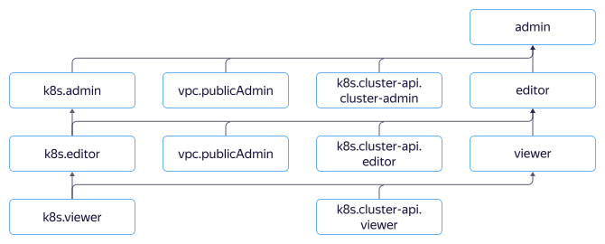

# Управление доступом в {{ managed-k8s-name }}

В этом разделе вы узнаете:
* [На какие ресурсы можно назначить роль](#resources).
* [Какие роли действуют в сервисе](#roles-list).
* [Какие роли необходимы для управления {{ managed-k8s-name }}](#required-roles).
* [Какие роли необходимы сервисным аккаунтам кластера {{ managed-k8s-name }}](#sa-annotation).
* [Какие роли нужны для работы с {{ managed-k8s-name }} через консоль управления {{ yandex-cloud }}](#ui-annotation).





## На какие ресурсы можно назначить роль {#resources}



## Какие роли действуют в сервисе {#roles-list}





### Роли для доступа к {{ k8s }} API {#k8s-api}

Следующие [роли](../../iam/concepts/access-control/roles.md) дают права на управление ресурсами [кластера {{ managed-k8s-name }}](../concepts/index.md#kubernetes-cluster) через {{ k8s }} API. Роли {{ k8s }} API работают по [модели ролевого управления доступом](https://kubernetes.io/docs/reference/access-authn-authz/rbac/) – Role-Based Access Control (RBAC). Для управления кластером {{ managed-k8s-name }} эти роли необходимо компоновать с [ролями для API {{ yandex-cloud }}](#yc-api). Подробнее о ролях в {{ k8s }} RBAC читайте в [документации {{ k8s }}](https://kubernetes.io/docs/reference/access-authn-authz/rbac/#user-facing-roles).

Чтобы просмотреть права на ресурсы кластера {{ managed-k8s-name }}, доступные для определенной роли, выполните команду:

```bash
kubectl describe clusterrole <роль_в_{{ k8s }}_RBAC>
```

#### k8s.cluster-api.viewer {#k8s-cluster-api-viewer}



#### k8s.cluster-api.editor {#k8s-cluster-api-editor}



#### k8s.cluster-api.cluster-admin {#k8s-cluster-api-cluster-admin}



### Роли {{ managed-k8s-name }} {#yc-api}

Описанные ниже роли позволяют управлять кластерами {{ managed-k8s-name }} и [группами узлов](../concepts/index.md#node-group) без публичного доступа через API {{ yandex-cloud }}. Для управления ресурсами кластера {{ managed-k8s-name }} эти роли необходимо компоновать с [ролями для {{ k8s }} API](#k8s-api). При создании кластера {{ managed-k8s-name }} проверяются роли его сервисного аккаунта.

Для управления кластером {{ managed-k8s-name }} и группой узлов без публичного доступа необходима роль `k8s.clusters.agent`.

Для управления кластером {{ managed-k8s-name }} и группой с публичным доступом необходимы роли:
* `k8s.clusters.agent`.
* `{{ roles-vpc-public-admin }}`.

Для управления кластером {{ managed-k8s-name }} с облачной сетью из другого каталога дополнительно необходимы роли в этом каталоге:
* [{{ roles-vpc-private-admin }}](../../vpc/security/index.md#vpc-private-admin)
* [{{ roles-vpc-user }}](../../vpc/security/index.md#vpc-user)
* [vpc.bridgeAdmin](../../vpc/security/index.md#vpc-bridge-admin)

Для управления кластером {{ managed-k8s-name }} с [туннельным режимом](../concepts/network-policy.md#cilium) достаточно роли `k8s.tunnelClusters.agent`.

#### k8s.viewer {#k8s-viewer}



#### k8s.editor {#k8s-editor}



#### k8s.admin {#k8s-admin}



#### k8s.tunnelClusters.agent {#k8s-tunnelclusters-agent}



#### k8s.clusters.agent {#k8s-clusters-agent}



### Примитивные роли {#primitive-roles}

#### {{ roles-viewer }} {#viewer}



#### {{ roles-editor }} {#editor}



#### {{ roles-admin }} {#admin}



## Какие роли необходимы для создания {{ managed-k8s-name }} {#required-roles}

Для создания кластера {{ managed-k8s-name }} и группы узлов [аккаунт](../../iam/concepts/users/accounts.md), с помощью которого вы собираетесь создавать кластер, должен иметь [роли](../../iam/concepts/access-control/roles.md):
* [{{ roles.k8s.editor }}](#k8s-editor) или выше.
* [iam.serviceAccounts.user](../../iam/security/index.md#iam-serviceAccounts-user).

Чтобы создать кластер {{ managed-k8s-name }} и группу узлов с публичным доступом, дополнительно нужна роль [{{ roles-vpc-public-admin }}](../../vpc/security/index.md#vpc-public-admin).

## Сервисные аккаунты кластера {{ managed-k8s-name }} {#sa-annotation}

При создании кластера {{ managed-k8s-name }} необходимо указать два [сервисных аккаунта](../../iam/concepts/users/service-accounts.md):
* **Сервисный аккаунт кластера** — от имени этого сервисного аккаунта сервис {{ managed-k8s-name }} управляет узлами кластера, [подсетями](../../vpc/concepts/network.md#subnet) для [подов](../concepts/index.md#pod) и [сервисов](../concepts/index.md#service), [дисками](../../compute/concepts/disk.md), [балансировками нагрузки](../../network-load-balancer/concepts/index.md), а также шифрует и дешифрует [секреты](../../lockbox/concepts/secret.md). Минимально рекомендуемая роль для такого аккаунта — `k8s.clusters.agent`.
* **Сервисный аккаунт группы узлов** — от имени этого сервисного аккаунта узлы кластера {{ managed-k8s-name }} аутентифицируются в [{{ container-registry-full-name }}](../../container-registry/concepts/index.md). Для развертывания в кластере {{ managed-k8s-name }} приложений с использованием [Docker-образов](../../container-registry/concepts/docker-image.md) из {{ container-registry-name }} этому аккаунту нужно назначить какую-либо [сервисную роль](../../container-registry/security/index.md#service-roles). Если используется другой container registry, то роли этому сервисному аккаунту можно не назначать.

Для управления кластером {{ managed-k8s-name }} и группами узлов с публичным доступом дополнительно необходима роль `{{ roles-vpc-public-admin }}`.

При использовании в кластере {{ managed-k8s-name }} облачной сети из другого каталога сервисному аккаунту кластера дополнительно необходимы роли в этом каталоге:
* [{{ roles-vpc-private-admin }}](../../vpc/security/index.md#vpc-private-admin)
* [{{ roles-vpc-user }}](../../vpc/security/index.md#vpc-user)
* [vpc.bridgeAdmin](../../vpc/security/index.md#vpc-bridge-admin)

## Доступ к консоли управления {{ managed-k8s-name }} {#ui-annotation}

Для доступа к {{ managed-k8s-name }} через [консоль управления]({{ link-console-main }}) {{ yandex-cloud }} минимально необходимая роль `k8s.viewer`.

Чтобы получить подробную информацию о кластере {{ managed-k8s-name }} и группе узлов необходима дополнительная роль `k8s.cluster-api.viewer`. Эта роль соответствует роли `viewer` в {{ k8s }} RBAC и предоставляет права доступа к ограниченному набору ресурсов в {{ k8s }} API, поэтому возможности консоли будут ограничены.

Пользователи с ролью `k8s.cluster-api.cluster-admin` имеют полный доступ к {{ k8s }} API кластера {{ managed-k8s-name }} и могут использовать все возможности консоли управления.

Чтобы предоставить более гранулярный доступ к необходимым ресурсам вы можете:
* Настроить дополнительные права в {{ k8s }} RBAC для соответствующих пользователей.
* Расширить роли `view` и `edit` в {{ k8s }} RBAC с помощью [агрегации ролей](https://kubernetes.io/docs/reference/access-authn-authz/rbac/#user-facing-roles). Например, вы можете разрешить всем пользователям с ролью `view` в {{ k8s }} API (в том числе пользователям с облачной ролью `k8s.cluster-api.viewer`) просмотр информации об узлах, добавив следующую роль в кластер {{ managed-k8s-name }}:

  ```yaml
  apiVersion: rbac.authorization.k8s.io/v1
  kind: ClusterRole
  metadata:
    name: view-extensions
    labels:
      rbac.authorization.k8s.io/aggregate-to-view: "true"
  rules:
  - apiGroups: [""]
    resources: ["nodes"]
    verbs: ["get", "list", "watch"]
  ```