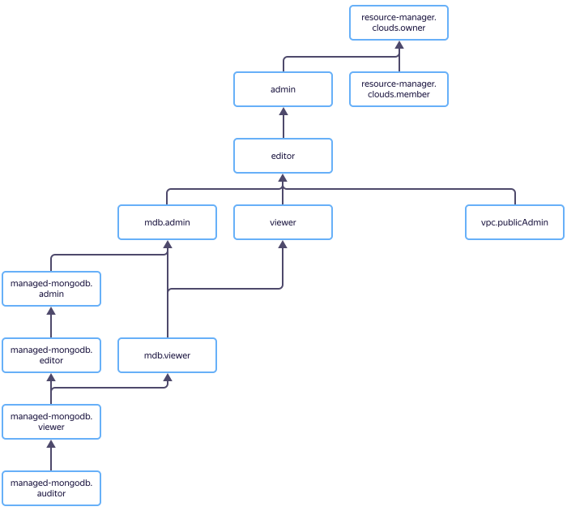

# Управление доступом в {{ mmg-name }}

В этом разделе вы узнаете:

* [на какие ресурсы можно назначить роль](#resources);
* [какие роли действуют в сервисе](#roles-list);
* [какие роли необходимы](#required-roles) для того или иного действия.



## На какие ресурсы можно назначить роль {#resources}



Чтобы разрешить доступ к ресурсам сервиса {{ mmg-name }} (кластеры и хосты БД, резервные копии кластеров, базы данных и их пользователи), назначьте пользователю нужные роли на каталог или облако, в котором эти ресурсы лежат.

## Какие роли действуют в сервисе {#roles-list}

На диаграмме показано, какие роли есть в сервисе и как они наследуют разрешения друг друга. Например, в `{{ roles-editor }}` входят все разрешения `{{ roles-viewer }}`. После диаграммы дано описание каждой роли.

### Сервисные роли {#service-roles}

















### Примитивные роли {#primitive-roles}



## Какие роли необходимы {#required-roles}

Чтобы пользоваться сервисом, необходима [роль](../../iam/concepts/access-control/roles.md) `{{ roles.mmg.editor }}` или выше на каталог, в котором создается кластер. Роль `{{ roles.mmg.viewer }}` позволит только просматривать список кластеров.

Вы всегда можете назначить роль, которая дает более широкие разрешения. Например, назначить `{{ roles.mmg.admin }}` вместо `{{ roles.mmg.editor }}`.

## Что дальше {#whats-next}

* [Как назначить роль](../../iam/operations/roles/grant.md).
* [Как отозвать роль](../../iam/operations/roles/revoke.md).
* [Подробнее об управлении доступом в {{ yandex-cloud }}](../../iam/concepts/access-control/index.md).
* [Подробнее о наследовании ролей](../../resource-manager/concepts/resources-hierarchy.md#access-rights-inheritance).

