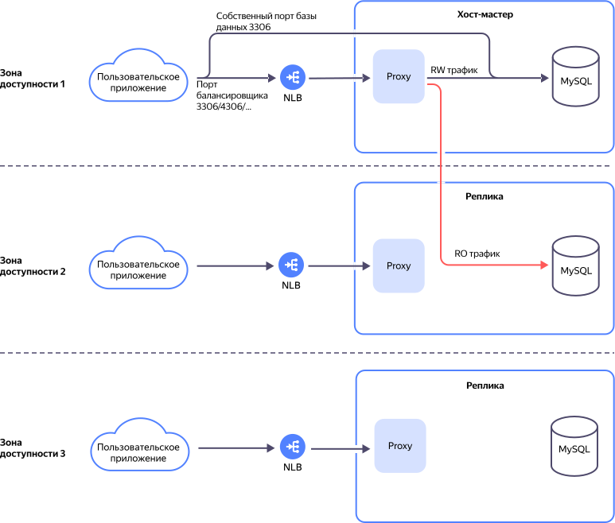

# Балансировщик нагрузки для хостов

{{ mmy-name }} позволяет использовать внутренний сетевой балансировщик для распределения нагрузки между хостами. Балансировщик работает на четвертом уровне сетевой модели OSI, но использует технологии третьего уровня для ускорения обработки пакетов.





Чтобы получить FQDN балансировщика, воспользуйтесь [инструкцией](../operations/load-balancer.md#fqdn).

Схема регулировки сетевого трафика кластера с помощью балансировщика отображена ниже:



## Политики балансировки {#balancing-policies}

Вы можете настраивать поведение балансировщика при распределении запросов по репликам кластера с помощью политик балансировки. Политика указывается для всех типов целевых подключений к репликам при создании кластера.

Для {{ mmy-name }} доступна политика `Round Robin` — выбор реплики в соответствии с политикой [Round-Robin](https://ru.wikipedia.org/wiki/Round-robin_(алгоритм)).
