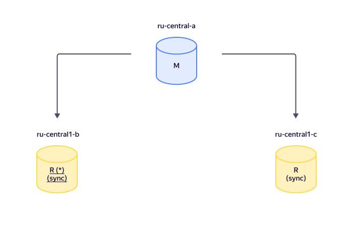

# Репликация в {{ mmy-name }}

В кластерах {{ mmy-name }} используется [полусинхронная репликация](https://dev.mysql.com/doc/refman/5.7/en/replication-semisync.html): по умолчанию мастер ожидает завершения транзакции хотя бы на одной реплике.



Число реплик, требуемых для завершения транзакции, можно изменить в настройке [Rpl semi sync master wait for slave count](settings-list.md#setting-rpl-wait-slave-count).



## Управление схемой репликации {#replication}

### Рекомендуемая конфигурация кластера {#replication-auto}

После создания кластера {{ MY }} из нескольких хостов в нем находятся один хост-мастер и реплики. Реплики используют хост-мастер в качестве источника репликации.

Пример конфигурации кластера с автоматической репликацией:

Здесь хост-мастер и две реплики размещены в разных зонах доступности. В этом случае:

* Каждая транзакция сохраняется как минимум на двух хостах.
* Кластер отказоустойчив по отношению к отключению хоста в одной из зон доступности и к двум последовательным отключениям.

Если реплика и мастер находятся в разных зонах доступности, то задержка подтверждения транзакции (latency) будет не меньше, чем время передачи данных туда и обратно (Round-Trip Time, RTT) между дата-центрами, которые размещены в этих зонах доступности. В результате при записи в один поток и включенном режиме [AUTOCOMMIT](https://dev.mysql.com/doc/refman/8.0/en/server-system-variables.html#sysvar_autocommit) производительность кластера может существенно снижаться. Чтобы достигнуть максимальной производительности, рекомендуется записывать в несколько потоков, где это возможно, а также [отключать AUTOCOMMIT](https://dev.mysql.com/doc/refman/8.0/en/commit.html) и группировать запросы в транзакции.

Особенности автоматической репликации в {{ mmy-name }}:

* При выходе из строя хоста-мастера одна из реплик становится новым мастером.
* При смене мастера источник репликации для всех хостов-реплик автоматически переключается на новый хост-мастер.

Подробнее о процессе выбора мастера см. в подразделе [Выбор мастера при выходе из строя основного мастера](#master-failover).

### Ручное управление конфигурацией кластера {#manual-source}

При ручном управлении для любой реплики кластера источником репликации могут выступать другие хосты в кластере. Реплики, в которых вручную [установлен источник репликации](../operations/hosts.md#update), называются _каскадными_. Для каскадных реплик применяется асинхронная репликация с хоста-источника. Поэтому каскадная реплика не может стать мастером при выходе из строя или ручном переключении хоста-мастера.

Кластер из двух хостов, один из которых — каскадная реплика, не является отказоустойчивым.

Пример конфигурации кластера с каскадной репликацией и хостами, размещенными в двух зонах доступности:

Назначьте для хостов кластера источник репликации, чтобы:

- Полностью управлять процессом репликации в кластере и не использовать автоматическую репликацию.
- Настроить каскадную репликацию для кластера {{ MY }} с древовидной топологией, в котором часть реплик будет управляться автоматически средствами {{ mmy-name }}, а часть — вручную. Это снизит нагрузку на сеть хоста-мастера.
- Выделить часть реплик под аналитическую нагрузку, так как они гарантированно не станут мастером.

## Выбор мастера при выходе из строя основного мастера {#master-failover}

Если хост-мастер выйдет из строя, то новым мастером станет любой из хостов кластера, доступных для репликации. Чтобы повлиять на процесс выбора мастера в кластере {{ MY }}, [установите нужные значения приоритета](../operations/hosts.md#update) для хостов кластера. Мастером будет выбран хост с наибольшим приоритетом, либо, если в кластере есть несколько реплик с одинаково высоким приоритетом, будет выбрана реплика с наименьшим отставанием от мастера. Реплики с отставанием большим, чем величина настройки [Mdb priority choice max lag](settings-list.md#setting-mdb-priority-choice-max-lag) (по умолчанию 60 с), исключаются из выбора.

Задать приоритет хоста можно:

* при [создании кластера](../operations/cluster-create.md) с помощью CLI, [API](../../glossary/rest-api.md) или {{ TF }};
* при [изменении настроек хоста](../operations/hosts.md#update).

Наименьший приоритет — `0` (по умолчанию), наивысший — `100`.
