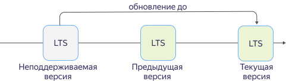
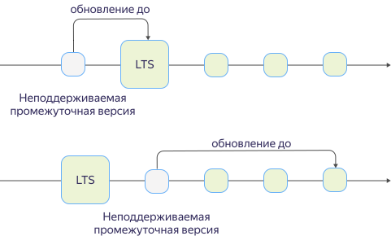

# Политика работы с версиями {{ OS }}

## Политика поддержки версий {#versioning-policy}

{{ mos-name }} работает только с теми версиями {{ OS }}, которые поддерживает производитель. Информацию о сроках прекращения поддержки отдельных версий см. в [календаре производителя](https://opensearch.org/releases.html).

{{ mos-name }} использует два типа версий {{ OS }}:

- **Мажорные**.

  Поддерживаются две мажорные версии: текущая и предыдущая. При релизе новой мажорной версии в {{ mos-name }} прекращается поддержка самой старой из доступных мажорных версий.

  Исключение — мажорная версия 1, она не поддерживается. До выхода третьей мажорной версии поддерживается только вторая мажорная версия.

- **Минорные**.

  Поддерживается последняя минорная версия {{ OS }} для каждой доступной мажорной версии. При релизе новой минорной версии {{ OS }} в {{ mos-name }} поддержка предыдущей минорной версии прекращается.



* Создание новых хостов в кластерах на неподдерживаемой версии {{ OS }} невозможно.
* Кластеры на неподдерживаемой версии {{ OS }} будут автоматически обновлены в соответствии с [политикой обновления](#update-policy).



## Политика обновления {#update-policy}



- Мажорные версии

  Кластер {{ mos-name }} на неподдерживаемой версии {{ OS }} будет обновлен до следующей мажорной версии (отмечена как LTS).
  
  

- Минорные версии

  Кластер {{ mos-name }} на неподдерживаемой версии {{ OS }} будет обновлен либо до мажорной версии, если она доступна (отмечена как LTS), либо до самой новой минорной версии.
  
  



На почту владельца кластеров заранее приходит уведомление о планируемом автоматическом обновлении. Когда приближается срок прекращения поддержки используемой версии {{ OS }}, рекомендуется самостоятельно обновить кластер до более новой версии.
