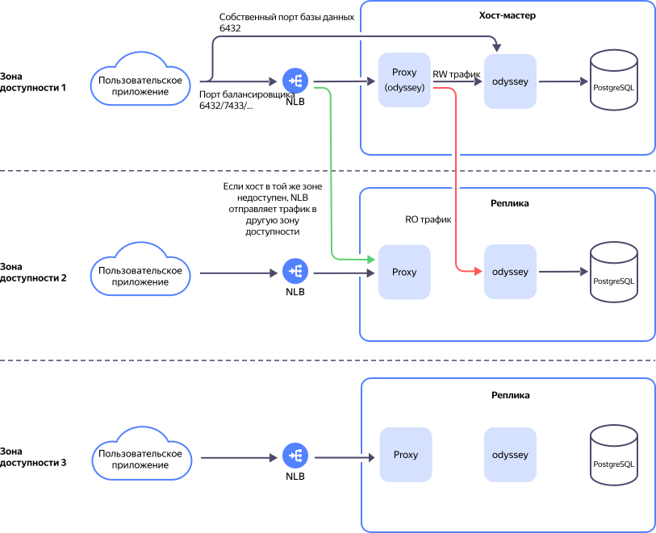

# Балансировщик нагрузки для хостов

{{ mpg-name }} позволяет использовать внутренний сетевой балансировщик для распределения нагрузки между хостами. Балансировщик работает на четвертом уровне сетевой модели OSI, но использует технологии третьего уровня для ускорения обработки пакетов.



Функциональность находится на стадии [Preview](../../overview/concepts/launch-stages.md) и предоставляется по запросу в техническую поддержку.





Схема регулировки сетевого трафика кластера с помощью балансировщика отображена ниже:





При использовании балансировщика клиентские соединения остаются под управлением [менеджера подключений Odyssey](pooling.md).


