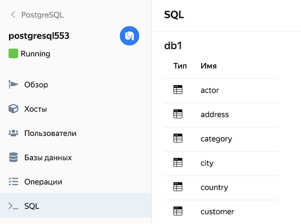
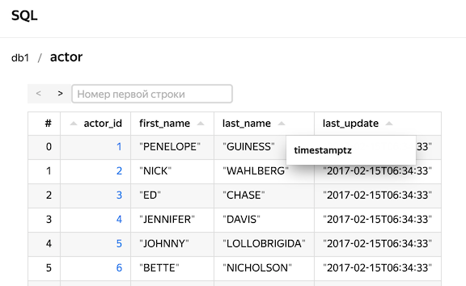
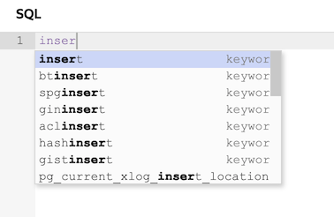
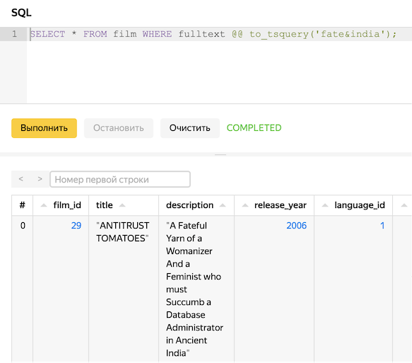

# SQL-запросы в консоли управления

{{ mpg-name }} позволяет:

* визуализировать структуру данных и планы выполнения запросов на вашем {{ PG }}-кластере;
* отправлять SQL-запросы к базам из консоли управления {{ yandex-cloud }}.



С помощью команд SQL нельзя выполнять действия, требующие прав суперпользователя.



Чтобы подключиться из консоли управления к кластеру {{ mpg-name }} и работать с данными в нем:

1. Перейдите на страницу каталога и выберите сервис **{{ mpg-name }}**.
1. Нажмите на имя нужного кластера.
1. [Включите опцию](../operations/update.md#change-additional-settings) **Доступ из консоли управления**, если она еще не включена.
1. Выберите вкладку **SQL**.



Справочник по поддерживаемым запросам можно найти в [документации {{PG}}](https://www.postgresql.org/docs/current/sql.html).

## Визуализация структуры данных {#data-structure-visualization}

После авторизации вы можете видеть структуру выбранной базы данных и ее таблиц:

По нажатию на таблицу выводятся первые 1000 строк результата запроса `SELECT *` для этой таблицы, страницами по 20 строк (полноценную навигацию по всем данным базы консоль управления не поддерживает). В поле **Номер первой строки** вы можете задать смещение, с которым следует показать таблицу результатов.

Наведите курсор на заголовок столбца, чтобы увидеть тип данных в столбце:

## SQL-запросы {#sql-queries}

Справа открыто окно ввода запроса. Начните вводить запрос, и редактор будет предлагать варианты ключевых слов:

Введите запрос и нажмите кнопку **Выполнить**. Таблица результатов или сообщение об ошибке появится на панели результатов, которая находится под кнопками управления редактором.

## Анализ запросов {#sql-analyze}

Чтобы получить визуализацию плана выполнения SQL-запроса:

1. Введите запрос.
1. Нажмите на кнопку выпадающего меню рядом с кнопкой **Выполнить**.
1. Выберите способ визуализации:

    * **Анализ запроса** — запрос выполняется с помощью `EXPLAIN ANALYZE`. План запроса строится на основе данных, полученных во время выполнения. На вкладках появится точная информация о характеристиках запроса:
        * **Cost** — стоимость частей запроса (в относительных единицах).
        * **Time** — время выполнения всего запроса и его отдельных частей.
        * **Buffers** — сведения об операциях I/O и потреблении RAM для каждой части запроса.
    * **План запроса** — запрос не выполняется, его план строится с помощью команды `EXPLAIN` на основе статистических данных, собранных {{ PG }}. На вкладке **Cost** выводится примерная оценка стоимости всего запроса и его частей (в относительных единицах).

    В обоих случаях медленные и ресурсоемкие части запроса будут выделены цветом.

    Подробнее см. в документации {{ PG }}:

    * [Единицы стоимости частей запроса](https://www.postgresql.org/docs/current/runtime-config-query.html#RUNTIME-CONFIG-QUERY-CONSTANTS).
    * [Использование `EXPLAIN` и `EXPLAIN ANALYZE`](https://www.postgresql.org/docs/current/using-explain.html).

1. Чтобы просмотреть подробный план выполнения запроса в виде дерева, нажмите на кнопку . Для выхода из этого режима нажмите клавишу **Esc**.

    Каждая часть запроса представлена в виде блока с указанием абсолютного и относительного времени выполнения. Если часть запроса выполняется значительно дольше остальных или использует ресурсоемкие операции, блок будет отмечен ярлыками с указанием причины.

    Чтобы получить более подробную информацию о части запроса, нажмите на нужный блок — в нем появится панель с вкладками:

    * **Stats** — стоимость выполнения (в относительных единицах);
    * **I/O & Buffers** — сведения об операциях I/O и потреблении RAM;
    * **Misc** —общая информация о запросе, например, список задействованных полей;
    * **Info** — дополнительная информация, например, имена использованных таблиц и индексов.

## Ограничения запросов в консоли управления {#query-restrictions-in-the-management-console}

* Если вы закроете или перезагрузите страницу, текст запроса и его результаты будут потеряны. При этом каждый запрос, который вы запустили из консоли управления, будет выполнен независимо от состояния браузера.
* Консоль управления выведет только первые 1000 строк результата.
* Если выполнение запроса на кластере длится больше 10 минут, консоль управления сообщит об ошибке и не выведет результат, даже если запрос в конечном счете будет успешно обработан.
* Если в вашем кластере больше одного хоста {{PG}}, то запросы из консоли управления отправляются на хост, который в момент запроса является мастером.
* Список таблиц берется из схемы _public_. Запросы к таблицам из других схем можно делать, явно указав схему, например: `SELECT * from information_schema.column_udt_usage`.
