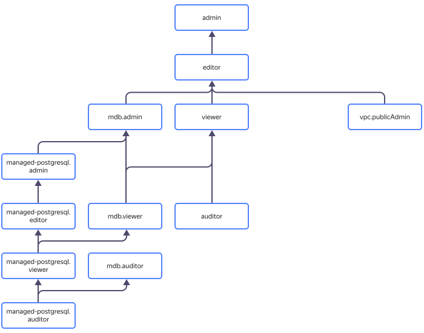

# Управление доступом в {{ mpg-name }}



В этом разделе вы узнаете:

* [на какие ресурсы можно назначить роль](#resources);
* [какие роли действуют в сервисе](#roles-list);
* [какие роли необходимы](#required-roles) для того или иного действия.



## На какие ресурсы можно назначить роль {#resources}



Чтобы разрешить доступ к ресурсам сервиса {{ mpg-name }} (кластеры и хосты БД, резервные копии кластеров, базы данных и их пользователи), назначьте пользователю нужные роли на каталог или облако, в котором эти ресурсы лежат.

## Какие роли действуют в сервисе {#roles-list}

На диаграмме показано, какие роли есть в сервисе и как они наследуют разрешения друг друга. Например, в `{{ roles-editor }}` входят все разрешения `{{ roles-viewer }}`. После диаграммы дано описание каждой роли.

### {{ roles-mdb-admin }} {#mdb-admin}



### {{ roles-mdb-viewer }} {#mdb-viewer}



### {{ roles-mdb-auditor }} {#mdb-auditor}



### {{ roles-cloud-member }} {#resmgr-clouds-member}



### {{ roles-cloud-owner }} {#resmgr-clouds-owner}





### {{ roles-viewer }} {#viewer}



### {{ roles-editor }} {#editor}



### {{ roles-admin }} {#admin}



### {{ roles.mpg.admin }} {#mpg-admin}



### {{ roles.mpg.auditor }} {#mpg-auditor}



### {{ roles.mpg.editor }} {#mpg-editor}



### {{ roles.mpg.viewer }} {#mpg-viewer}



## Какие роли необходимы {#required-roles}

Чтобы пользоваться сервисом, необходима [роль](../../iam/concepts/access-control/roles.md) `{{ roles.mpg.editor }}` или выше на каталог, в котором создается кластер. Роль `{{ roles.mpg.viewer }}` позволит только просматривать список кластеров.

Вы всегда можете назначить роль, которая дает более широкие разрешения. Например, назначить `{{ roles.mpg.admin }}` вместо `{{ roles.mpg.editor }}`.

## Что дальше {#whats-next}

* [Как назначить роль](../../iam/operations/roles/grant.md).
* [Как отозвать роль](../../iam/operations/roles/revoke.md).
* [Подробнее об управлении доступом в {{ yandex-cloud }}](../../iam/concepts/access-control/index.md).
* [Подробнее о наследовании ролей](../../resource-manager/concepts/resources-hierarchy.md#access-rights-inheritance).





## Identity Management (IDM) {#idm}

**IDM** это опция, которая включается при создании кластера, чтобы задействовать [механизм доступа к данным SOX](https://ru.wikipedia.org/wiki/Закон_Сарбейнза_—_Оксли). Она необходима для назначения _Ответственных за кластер_ и предоставления доступа к нему в сервисе [Identity Management](https://idm.yandex-team.ru/) (IDM). Опция обязательна для кластеров, создаваемых в окружении `PRODUCTION`. Выключить опцию нельзя.

_Ответственных за кластер_ утверждают _Ответственные из MDB_, после чего _Ответственный за кластер_ может вместе с MDB утверждать запросы ролей к кластеру.

С помощью опции **IDM** выдаются роли:

* Чтение.
* Запись.
* Ответственный.



Роли в ABC (_Администратор MDB_ и _Пользователь MDB_) и роли, которые назначаются с помощью опции **IDM** (_Ответственный за кластер_), это разные роли. При назначении ролей в ABC права выдаются через [API](../../glossary/rest-api.md)API на действия _над кластером_, а с включенной опцией **IDM** — _внутри самой базы_.




