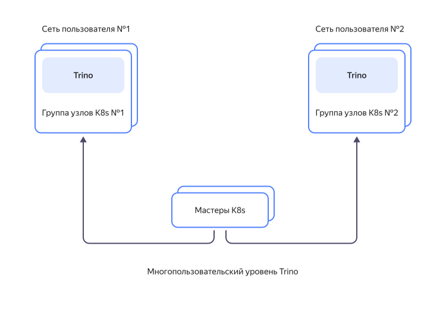
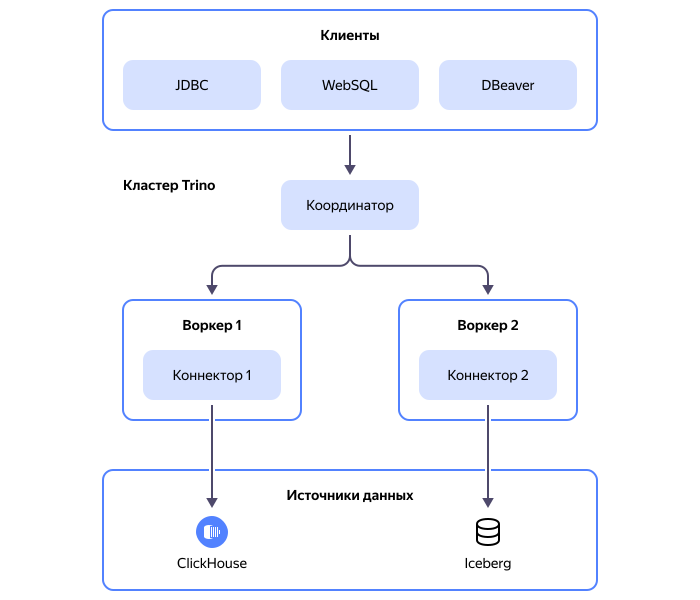

# Взаимосвязь ресурсов в {{ mtr-full-name }}

{{ TR }} — это высокопроизводительная распределенная массивно-параллельная система обработки запросов. {{ TR }} позволяет выполнять запросы к различным хранилищам данных и работать с данными в разных форматах при помощи стандартного SQL-синтаксиса.

В {{ TR }} реализовано разделение storage- и compute-слоев. {{ TR }} работает только с запросами и результатами их выполнения. Все операции с данными делегируются внешнему хранилищу данных, к которому направлен запрос, поэтому для выполнения запроса данные из хранилища не нужно загружать в {{ TR }}. Такой подход ускоряет обработку запросов и в сочетании с массивно-параллельной архитектурой облегчает масштабирование кластера {{ mtr-name }} под различные задачи.

Каждый кластер {{ mtr-name }} запускается в отдельной группе узлов {{ k8s }}, которая включает в себя необходимую сетевую инфраструктуру: [виртуальную сеть](../../vpc/concepts/network.md#network), [группу безопасности](../../vpc/concepts/security-groups.md) и [сервисный аккаунт](../../iam/concepts/users/service-accounts). Группы узлов изолированы друг от друга как средствами виртуальных сетей, так и средствами самого {{ k8s }}. Группы узлов управляются общим {{ k8s }}-мастером.

Взаимосвязь ресурсов сервиса представлена на схеме:

## Архитектура кластера {#cluster-architecture}

Основная сущность, которой оперирует сервис {{ mtr-name }} — кластер. 

Кластер {{ TR }}  состоит из _координатора_ и _воркеров_. Воркеры обращаются к источникам данных через _каталоги_. Связь с источниками данных осуществляется через _коннекторы_.

Взаимодействие компонентов кластера между собой и со внешними сервисами (клиентами и источниками данных) представлено на схеме:

### Координатор {#coordinator}

Координатор — это основной узел обработки данных. Он принимает запросы от пользователей, планирует выполнение запросов, управляет распределением заданий между воркерами и обрабатывает результаты выполнения заданий, полученные от воркеров.

На сервере координатора запущена служба обнаружения, которая отслеживает доступность воркеров. Если воркер становится недоступен, координатор не назначает на него новые задания.

В кластере {{ TR }} всегда только один координатор.

### Воркеры {#workers}

Воркеры — это рабочие узлы. Они обрабатывают запросы от координатора, выполняют операции с данными и возвращают полученные результаты координатору. При запуске воркер регистрирует себя в службе обнаружения, запущенной на сервере координатора. Таким образом воркер становится доступен для назначения заданий. Периодически воркер отправляет в службу обнаружения сигнал о доступности. Если служба обнаружения не получает такой сигнал в установленное время, на воркер не назначаются новые задания.

При [создании кластера](../operations/cluster-create.md) вы можете задать фиксированное количество воркеров от 1 до 64 или настроить автоматическое изменение количества воркеров в диапазоне от 0 до 64 в зависимости от нагрузки.

### Каталог {{ TR }} {#catalog}

Каталог — это набор параметров, которые описывают подключение к источнику данных. В кластере {{ mtr-name }} можно [создать](../operations/catalog-create.md) один или несколько каталогов. При этом {{ TR }} поддерживает работу с данными из разных каталогов в одном запросе.

Каждый каталог описывает только один источник данных. Тип источника данных определяется выбранным _коннектором_.

### Коннектор {#connector}

_Коннектор_ — это интерфейс для доступа к источнику данных определенного типа. Коннектор представляет данные из источника в виде абстрактной таблицы, к которой воркеры выполняют запросы. Эта таблица позволяет работать одинаково со всеми источниками данных, вне зависимости от их специфических требований.

В {{ mtr-name }} доступны следующие коннекторы:



Коннектор выбирается во время [создания каталога {{ TR }}](../operations/catalog-create.md).

## Выполнение запроса в кластере {{ TR }} {#query-execution}



Пользователь взаимодействует с кластером {{ TR }} через клиент, например {{ TR }} CLI. Клиент передает запросы координатору и отображает результаты их выполнения.

Выполнение запроса в кластере {{ TR }} происходит по следующей схеме:

1. Координатор получает от клиента запрос в виде SQL-выражения.

1. Координатор планирует стадии выполнения запроса и преобразует его в серию связанных заданий, которые распределяются между воркерами.

1. Воркеры выполняют запросы к источникам данных, обрабатывают полученную информацию, обмениваются результатами выполнения промежуточных заданий, после чего результаты выполнения всех заданий отправляются в координатор.

1. Координатор собирает результаты заданий от воркеров, формирует финальный результат и передает его клиенту, который отображает результат выполнения запроса для пользователя.

Воркеры взаимодействуют друг с другом и с координатором через REST API. Помимо этого, воркеры могут обмениваться промежуточными данными через Exchange Manager, который выполняет роль хранилища временных данных. Таким образом, если воркер выйдет из строя, выполнявшийся на нем процесс может быть выполнен на другом воркере с использованием промежуточных данных из Exchange Manager.
