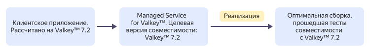
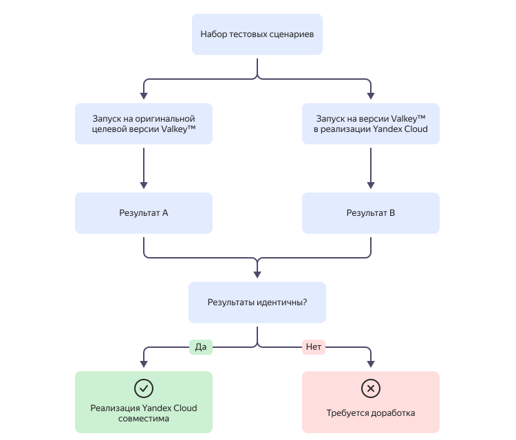

# Взаимосвязь ресурсов в {{ mrd-name }}

{{ VLK }} — это высокопроизводительная СУБД для данных типа «ключ-значение», работающая в оперативной памяти. Сервис {{ mrd-name }} позволяет легко создавать высокодоступные [кластеры](../../glossary/cluster.md) хостов {{ VLK }}.

{{ yandex-cloud }} принимает активное участие в разработке {{ VLK }}, внося свой вклад как в основной проект, так и развивая [собственные реализации](./update-policy.md#compatibility-table). Это позволяет команде сервиса {{ mrd-name }}:

* глубоко понимать внутреннее устройство {{ VLK }} и обеспечивать высокий уровень совместимости;
* постоянно улучшать производительность, надежность и безопасность собственных реализаций;
* в ряде случаев обеспечивать совместимость с целевой версией на базе более новой кодовой базы, предоставляя пользователям преимущества новых реализаций СУБД без изменения целевой версии.

Сервис {{ mrd-name }} предоставляет расширенную по времени [поддержку](./update-policy.md) версий {{ VLK }}, основанную на [гарантии совместимости](#compatibility-warranty) версий СУБД.

## Ресурсы {{ mrd-name }} {#resources}

Основная сущность, которой оперирует сервис {{ mrd-name }}, — _кластер баз данных_.

Каждый кластер состоит из одного или нескольких _хостов БД_ — виртуальных машин с развернутыми серверами СУБД. Хосты кластера могут находиться в разных зонах и даже разных регионах доступности. Подробнее о географии {{ yandex-cloud }} см. в разделе [Обзор платформы](../../overview/concepts/geo-scope.md).

[Высокая доступность кластера {{ mrd-name }}](high-availability.md) определяется количеством и расположением его хостов, настройками репликации и другими параметрами кластера.

При создании кластера необходимо указывать:
* _Класс хостов_ — шаблон виртуальной машины, по которому будут развертываться хосты кластера. Список доступных классов хостов и их характеристики см. в разделе [Классы хостов](instance-types.md).

* _Окружение_ — среду, в которой будет развертываться кластер:
   * `PRODUCTION` — для стабильных версий ваших приложений.
   * `PRESTABLE` — для тестирования. Prestable-окружение аналогично Production-окружению и на него также распространяется SLA, но при этом на нем раньше появляются новые функциональные возможности, улучшения и исправления ошибок. В Prestable-окружении вы можете протестировать совместимость новых версий с вашим приложением.



Выделенный для хоста объем памяти также определяет параметр конфигурации `maxmemory` для хостов {{ VLK }}: максимальный объем данных равен 75% доступной памяти. Например, для класса хоста с 8 ГБ памяти значение `maxmemory` будет 6 ГБ.



Созданный в каталоге кластер доступен по сети для всех виртуальных машин, подключенных к этой же облачной сети. Подробнее о работе сети см. в [документации {{ vpc-name }}](../../vpc/).





## Гарантия совместимости версий {#compatibility-warranty}

Сервис {{ mrd-full-name }} предоставляет своим пользователям не какую-то конкретную версию {{ VLK }}, а услугу с _гарантией совместимости_ СУБД с конкретной версией {{ VLK }}. Для каждой версии СУБД в [реализации {{ yandex-cloud }}](./update-policy.md#compatibility-table), совместимой с определенной версией {{ VLK }}, сервис гарантирует:

* полную обратную совместимость с API и функциональностями оригинальной целевой версии;
* поддержку всех команд и протоколов оригинальной версии;
* корректную работу существующих приложений пользователя без необходимости внесения изменений в их работу;
* расширенную поддержку, равную или превышающую официальный жизненный цикл оригинальной версии {{ VLK }}.

Например, версия СУБД, **совместимая с версией {{ VLK }} 7.2**, предоставляет:

* **современную версию {{ VLK }}** (`8.1`) со всеми преимуществами современной версии (производительность, безопасность, функциональность);
* **специальный режим совместимости** с настройками для полной обратной совместимости и **гарантию совместимости** с приложениями, разработанными для версии `7.2`.

Подробнее о совместимости версий {{ VLK }} читайте в разделе [{#T}](./update-policy.md#compatibility-table).

### Тестирование версий на совместимость {#compatibility-testing}

Для подтверждения совместимости версий используется протокол сравнительного тестирования: один и тот же набор тестовых сценариев выполняется одновременно как в оригинальной целевой версии {{ VLK }}, так и на версии {{ VLK }} в реализации {{ yandex-cloud }}. Если полученные результаты оказываются идентичными, то реализация {{ yandex-cloud }} считается совместимой.

Тестовые сценарии охватывают следующие ключевые аспекты поведения {{ VLK }}:

* команды и протокол — корректность выполнения команд и соответствие протоколу [RESP](https://valkey.io/topics/protocol/);
* структуры данных — поведение всех типов данных (`strings`, `hashes`, `lists`, `sets`, `sorted sets`, `streams` и др.);
* обработка ошибок — идентичность ответов при некорректных запросах;
* конфигурация — поддержка параметров конфигурации целевой версии;
* [Pub/Sub](https://valkey.io/topics/pubsub/), транзакции, скрипты — корректность работы при сложных сценариях взаимодействия.

Перед развертыванием новой реализации версии {{ VLK }} от {{ yandex-cloud }} она обязательно проходит полный набор тестов совместимости с целевой версией. [Обновление кластеров](./update-policy.md#update-policy) и их переход на новую реализацию выполняется только при полном и успешном прохождении всех тестов.



Если для вашего приложения критичны определенные сценарии использования {{ VLK }}, вы можете [обратиться]({{ link-console-support }}) в службу технической поддержки с предложением включить эти сценарии в набор тестов совместимости {{ mrd-name }}. Команда сервиса рассмотрит каждое обращение и при необходимости расширит набор используемых тестов.

