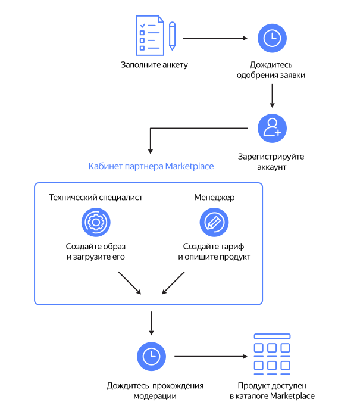

# Обзор кабинета партнера {{ marketplace-name }}

{{ marketplace-name }} дает возможность размещать свои продукты в каталоге готовых решений {{ yandex-cloud }} и зарабатывать на них. Вы можете разместить только готовые образы, которые поддерживают работу в облаке, и решения для сервиса {{ datalens-full-name }}.

## Подать заявку {#send-application}

Заполните анкету на [странице Marketplace]({{ link-cloud-marketplace }}) и опишите ваш продукт. Подробное описание полезных для пользователей функций и особенностей продукта поможет быстрее рассмотреть вашу заявку. Отправка заявки означает принятие [оферты](https://yandex.ru/legal/marketplace_offer/) на предоставление доступа к программному продукту в Marketplace. Если у вашего юридического лица уже есть платежный аккаунт, укажите его при подаче заявки.

После прохождения модерации вы получите письмо с подтверждением на электронный адрес, указанный в анкете. 

## Зарегистрировать аккаунт {#registration}

Для доступа в кабинет партнера {{ marketplace-name }} вам потребуется платежный аккаунт юридического лица — резидента РФ или РК. Если у вас еще нет платежного аккаунта, [создайте его](operations/registration.md). 

## Создать и загрузить образ продукта {#create-image}

Образы продуктов для загрузки в Marketplace могут быть созданы на базе ОС Linux или Windows Server из публичных образов {{ yandex-cloud }}. Требования к образам и рекомендации по созданию образов описаны в инструкциях:
* [{#T}](operations/create-image.md)
* [{#T}](operations/create-image-ms.md)

## Создать тариф {#create-tariff}



Тариф определяет стоимость использования вашего продукта. 

[Создайте тариф](operations/create-tariff.md), чтобы назначить его продукту.

## Создать продукт {#create-product}

Добавьте информацию о продукте, которая будет отображаться в публичном каталоге Marketplace. Укажите особенности и преимущества вашего продукта, примеры использования и сценарии. Опишите начало работы и возможные трудности при развертывании. Добавьте информацию о том, как пользователи могут связаться с вами. Подробную инструкцию о создании продукта см. на странице [{#T}](operations/create-product.md). 

## Создать первую версию продукта {#create-version}

О том, как создать первую версию продукта в кабинете партнера {{ marketplace-name }}, см. на странице [{#T}](operations/create-new-version.md).

Первая версия продукта отправится на модерацию в {{ yandex-cloud }}. После проверки вы получите письмо с подтверждением того, что ваш продукт доступен пользователям в публичном каталоге Marketplace.