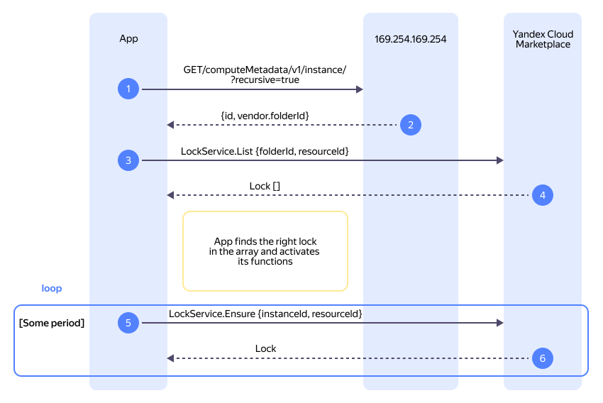

# Как начать работать с {{ marketplace-short-name }} {{ license-manager }} API

В этом разделе вы узнаете, как интегрировать [продукт](../../concepts/product.md) c {{ marketplace-full-name }} {{ license-manager }} API.

## Схема взаимодействия с API {#visualization}




На схеме:

1. Приложение [запрашивает](#get-metadata) метаданные виртуальной машины. Для этого используется адрес сервиса метаданных, доступный изнутри ВМ.
1. В [ответе](#metadata-response) приложение получает значения полей `id` и `vendor.folderId`. Эти значения используются для получения списка привязок.
1. Приложение [запрашивает](#get-locks) в {{ marketplace-short-name }} {{ license-manager }} API список привязок, передавая в качестве параметров полученные значения в полях `resourceId` и `folderId`.
1. В [ответе](#lock-list-response) приложение получает массив привязок, выбирает нужную и активирует с ее помощью некую функциональность.
1. Периодически приложение [запрашивает](#ensure-lock) подтверждение привязки к ресурсу.
1. В [ответе](#lock-ensured) приложение получает подтверждение привязки и продолжает работу.

## Перед началом работы {#before-you-begin}

Чтобы начать работать c {{ marketplace-short-name }} {{ license-manager }} API:




## Настройте интеграцию с API {#integrate}

Чтобы реализовать бизнес-логику вашего продукта, самостоятельно доработайте код вашего приложения, [настроив интеграцию](../../operations/license-manager-integration.md) с {{ license-manager }} API для проверки статуса и типа подписок.


### Запросите метаданные виртуальной машины {#get-metadata}

1. [Подключитесь](../../../compute/operations/vm-connect/ssh.md) к виртуальной машине с вашим продуктом.
1. В терминале ВМ выполните команду:

    ```bash
    curl \
      --header Metadata-Flavor:Google \
      169.254.169.254/computeMetadata/v1/instance/?recursive=true
    ```

    Где `169.254.169.254` — адрес сервиса метаданных, доступный изнутри виртуальной машины.

    Результат:
    {#metadata-response}
    ```json
    {
      "attributes": {
        "install-unified-agent": "0",
        "serial-port-enable": "0",
        "ssh-keys": "user1:ssh-rsa ABC...",
        "user-data": "#cloud-config\ndatasource:\n Ec2:\n  strict_id: false\nssh_pwauth: no\nusers:\n- name: user1\n  sudo: ALL=(ALL) NOPASSWD:ALL\n  shell: /bin/bash\n  ssh_authorized_keys:\n  - ssh-rsa ABC..."
      },
      "description": "",
      "disks": [
        {
          "deviceName": "epdjv70ebov2********",
          "index": 0,
          "mode": "READ_WRITE",
          "type": "PERSISTENT"
        }
      ],
      "hostname": "compute-vm.ru-central1.internal",
      "id": "epdg9mn1pd9j********",
      "maintenanceEvent": "NONE",
      "name": "compute-vm",
      "networkInterfaces": [
        {
          "accessConfigs": [
            {
              "externalIp": "158.160.**.***",
              "type": "ONE_TO_ONE_NAT"
            }
          ],
          "forwardedIps": [],
          "ip": "10.12*.*.*",
          "mac": "d0:0d:10:4d:**:**",
          "network": "e2lb1da2dd9v********",
          "targetInstanceIps": []
        }
      ],
      "serviceAccounts": {},
      "tags": [],
      "vendor": {
        "cloudId": "b1gia87mbaom********",
        "environment": "ru-central1",
        "folderId": "b1g681qpemb4********",
        "identity": {
          "base64": "VPb...",
          "document": "{\"instanceId\":\"epdg9mn1pd9j********\",\"productCodes\":null,\"imageId\":\"fd8hp9las7k4********\",\"productIds\":[\"f2egeq0c2kd6********\"],\"createdAt\":\"2024-11-13T13:33:42Z\",\"version\":\"2023-03-01\"}",
          "dsa": "-----BEGIN PKCS7-----\nMI...\n-----END PKCS7-----\n",
          "rsa": "-----BEGIN PKCS7-----\nMI...-----END PKCS7-----\n"
        },
        "labels": {}
      },
      "virtualClock": {
        "driftToken": 0
      },
      "zone": "projects/b1g681qpemb4********/zones/ru-central1-b"
    }
    ```

    Сохраните значения полей `id` и `vendor.folderId`. Они потребуются для запроса списка привязок.


### Получите список привязок {#get-locks}

Чтобы получить список привязок подписок к ресурсам, воспользуйтесь методом REST API [List](../api-ref/Lock/list.md) для ресурса [Lock](../api-ref/Lock/index.md) или вызовом gRPC API [LockService/List](../api-ref/grpc/Lock/list.md):



- REST API {#api}

  ```bash
  curl \
    --request GET \
    --url 'https://marketplace.{{ api-host }}/marketplace/license-manager/v1/locks?folderId=<идентификатор_каталога>&resourceId=<идентификатор_ресурса>' \
    --header 'Authorization: Bearer <IAM-токен>' \
    --header 'Content-Type: application/json'
  ```

  Где:

  * `folderId` — идентификатор каталога, в котором находится ресурс. Соответствует значению поля `vendor.folderId`, полученному на предыдущем шаге.
  * `resourceId` — идентификатор ресурса. Соответствует значению поля `id`, полученному на предыдущем шаге.

- gRPC API {#grpc-api}

  ```bash
  grpcurl \
    -rpc-header "Authorization: Bearer <IAM-токен>" \
    -d '{
        "folderId": "<идентификатор_каталога>",
        "resourceId": "<идентификатор_ресурса>"
    }' \
    marketplace.{{ api-host }}:443 yandex.cloud.marketplace.licensemanager.v1.LockService/List
  ```

  Где:

  * `folderId` — идентификатор каталога, в котором находится ресурс. Соответствует значению поля `vendor.folderId`, полученному на предыдущем шаге.
  * `resourceId` — идентификатор ресурса. Соответствует значению поля `id`, полученному на предыдущем шаге.



Результат:
{#lock-list-response}
```json
{
  "locks": [
    {
      "id": "enp0asmd9pr9********",
      "instanceId": "epdg9mn1pd9j********",
      "resourceId": "epdg9mn1pd9j********",
      "startTime": "2024-01-01T12:34:56.123456789Z",
      "endTime": "2024-01-01T13:34:56.123456789Z",
      "createdAt": "2024-01-01T12:34:56.123456789Z",
      "state": "LOCKED",
      "templateId": "enpbhhpl3vs5********"
    }
  ]
} 
```

Сохраните значения полей `instanceId` и `resourceId`. Они потребуются для привязки подписки к ресурсу.


### Запросите привязку к ресурсу {#ensure-lock}

Чтобы привязать подписку к ресурсу, а также убедиться в наличии такой привязки, воспользуйтесь методом REST API [Ensure](../api-ref/Lock/ensure.md) для ресурса [Lock](../api-ref/Lock/index.md) или вызовом gRPC API [LockService/Ensure](../api-ref/grpc/Lock/ensure.md):



- REST API {#api}

  ```bash
  curl \
    --request POST \
    --url 'https://marketplace.{{ api-host }}/marketplace/license-manager/v1/locks/<идентификатор_инстанса>:ensure' \
    --header 'Authorization: Bearer <IAM-токен>' \
    --header 'Content-Type: application/json' \
    --data '{
        "resourceId": "<идентификатор_ресурса>"
    }'
  ```

  Где:

  * `<идентификатор_инстанса>` — значение поля `instanceId`, полученное на предыдущем шаге.
  * `resourceId` — значение поля `resourceId`, полученное на предыдущем шаге.

- gRPC API {#grpc-api}

  ```bash
  grpcurl \
    -rpc-header "Authorization: Bearer <IAM-токен>" \
    -d '{
        "instanceId": "<идентификатор_инстанса>",
        "resourceId": "<идентификатор_ресурса>"
    }' \
    marketplace.{{ api-host }}:443 yandex.cloud.marketplace.licensemanager.v1.LockService/Ensure
  ```

  Где:

  * `instanceId` — значение поля `instanceId`, полученное на предыдущем шаге.
  * `resourceId` — значение поля `resourceId`, полученное на предыдущем шаге.



Результат:
{#lock-ensured}
```json
{
  "id": "e2371l9d5u8a********",
  "description": "lock ensured",
  "done": true,
  "metadata": {
    "@type": "type.googleapis.com/yandex.cloud.marketplace.licensemanager.v1.EnsureLockMetadata",
    "lockId": "enp0asmd9pr9********"
  },
  "response": {
    "@type": "type.googleapis.com/yandex.cloud.marketplace.licensemanager.v1.Lock",
    "id": "enp0asmd9pr9********",
    "instanceId": "epdg9mn1pd9j********",
    "resourceId": "epdg9mn1pd9j********",
    "startTime": "2024-01-01T12:34:56.123456789Z",
    "endTime": "2024-01-01T13:34:56.123456789Z",
    "createdAt": "2024-01-01T12:34:56.123456789Z",
    "state": "LOCKED",
    "templateId": "enpbhhpl3vs5********"
  }
}
```

В результате сервис привяжет подписку к ресурсу. Если подписка уже привязана, сервис просто вернет подтверждение привязки.