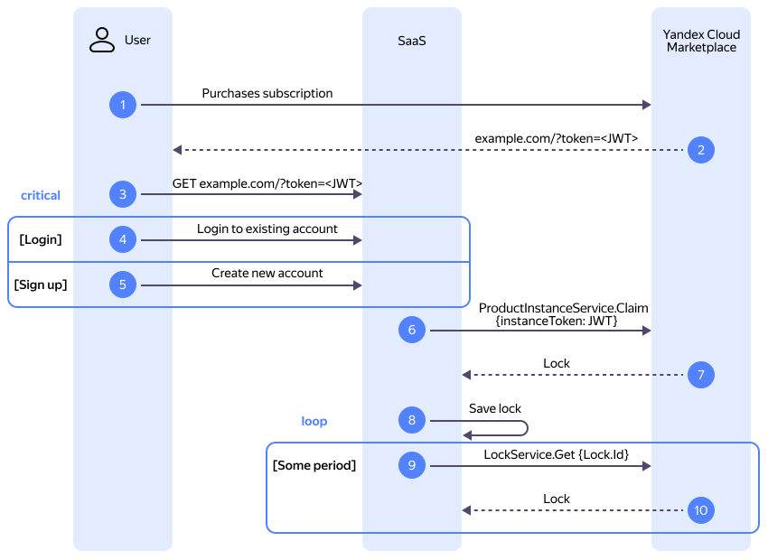

# Как начать работать с {{ marketplace-short-name }} {{ license-manager }} SaaS API

В этом разделе вы узнаете, как интегрировать SaaS-[продукт](../../../concepts/product.md) c {{ marketplace-full-name }} {{ license-manager }} SaaS API.

## Схема взаимодействия с API {#visualization}




На схеме:

1. Пользователь приобретает подписку на SaaS-продукт в {{ marketplace-short-name }}.
1. {{ marketplace-short-name }} передает пользователю ссылку на SaaS-продукт. URL-параметр `token` в передаваемой ссылке содержит JWT-токен.
    Адрес для перехода задается при [создании](../../../operations/create-new-version.md) версии продукта в {{ marketplace-short-name }} в поле **Ссылка на лендинг**.
1. Пользователь переходит по ссылке, в результате SaaS-продукту передается JWT-токен.
1. _Первый вариант аутентификации_: у пользователя уже есть учетная запись в SaaS-продукте. В этом случае он вводит свои учетные данные и входит в систему.
1. _Второй вариант аутентификации_: у пользователя нет учетной записи в SaaS-продукте. В этом случае он создает новую учетную запись и входит в систему.
1. SaaS-продукт [отправляет](#lock-subscription) в {{ marketplace-short-name }} запрос `LockService.Ensure`, содержащий полученный от пользователя токен и идентификатор ресурса в SaaS-продукте.
1. В результате {{ marketplace-short-name }} привязывает подписку к ресурсу и возвращает SaaS-продукту привязку (объект `Lock`).
1. SaaS-продукт сохраняет полученную привязку и начинает предоставлять доступ к ресурсу.
1. SaaS-продукт периодически [запрашивает](#get-lock) привязку в {{ marketplace-short-name }}.
1. {{ marketplace-short-name }} возвращает SaaS-продукту привязку до тех пор, пока подписка активна.

## Перед началом работы {#before-you-begin}

Чтобы начать работать c {{ marketplace-short-name }} {{ license-manager }} SaaS API:




## Настройте интеграцию с API {#integrate}

Чтобы реализовать бизнес-логику продукта, самостоятельно доработайте код вашего приложения, [настроив интеграцию](../../../operations/license-manager-integration.md) с {{ license-manager }} SaaS API для проверки статуса и типа подписок.


### Привяжите подписку к ресурсу {#lock-subscription}

Чтобы привязать подписку к ресурсу, воспользуйтесь методом REST API [Ensure](../api-ref/Lock/ensure.md) для ресурса [Lock](../api-ref/Lock/index.md) или вызовом gRPC API [LockService/Ensure](../api-ref/grpc/Lock/ensure.md):



- REST API {#api}

  ```bash
  curl \
    --request POST \
    --url 'https://marketplace.{{ api-host }}/marketplace/license-manager/saas/v1/locks/ensure' \
    --header 'Authorization: Bearer <IAM-токен>' \
    --header 'Content-Type: application/json' \
    --data '{
        "instanceToken": "<JWT-токен>",
        "resourceId": "<идентификатор_ресурса>"
    }'
  ```

  Где:

  * `instanceToken` — JWT-токен, полученный от пользователя.
  * `resourceId` — идентификатор ресурса в SaaS-продукте.

- gRPC API {#grpc-api}

  ```bash
  grpcurl \
    -rpc-header "Authorization: Bearer <IAM-токен>" \
    -d '{
        "instanceToken": "<JWT-токен>",
        "resourceId": "<идентификатор_ресурса>"
    }' \
    marketplace.{{ api-host }}:443 yandex.cloud.marketplace.licensemanager.saas.v1.LockService/Ensure
  ```

  Где:

  * `instanceToken` — JWT-токен, полученный от пользователя.
  * `resourceId` — идентификатор ресурса в SaaS-продукте.



В результате:

* {{ marketplace-short-name }} привяжет подписку к ресурсу и вернет привязку (объект `Lock`).
* SaaS-продукт сохранит привязку и начнет предоставлять доступ к ресурсу.


### Получите информацию о привязке {#get-lock}

Чтобы получить информацию о привязке, воспользуйтесь методом REST API [Get](../api-ref/Lock/get.md) для ресурса [Lock](../api-ref/Lock/index.md) или вызовом gRPC API [LockService/get](../api-ref/grpc/Lock/get.md):



- REST API {#api}

  ```bash
  curl \
    --request GET \
    --url 'https://marketplace.{{ api-host }}/marketplace/license-manager/saas/v1/locks/<идентификатор_привязки>' \
    --header 'Authorization: Bearer <IAM-токен>' \
    --header 'Content-Type: application/json'
  ```

  Где `<идентификатор_привязки>` — значение поля `lockId`, полученное на предыдущем шаге.

- gRPC API {#grpc-api}

  ```bash
  grpcurl \
    -rpc-header "Authorization: Bearer <IAM-токен>" \
    -d '{
        "lockId": "<идентификатор_привязки>"
    }' \
    marketplace.{{ api-host }}:443 yandex.cloud.marketplace.licensemanager.saas.v1.LockService/Get
  ```

  Где `lockId` — значение поля `lockId`, полученное на предыдущем шаге.



В результате {{ marketplace-short-name }} вернет привязку (объект `Lock`), если подписка активна.


### Отследите продление подписки {#track-subscription-renewal}

Чтобы отслеживать продление подписки, необходимо контролировать изменение значения поля `end_time` в экземпляре подписки.

Чтобы получить данные об экземпляре подписки, воспользуйтесь методом REST API [Get](../api-ref/Instance/get.md) для ресурса [Instance](../api-ref/Instance/index.md) или вызовом gRPC API [InstanceService/Get](../api-ref/grpc/Instance/get.md):



- REST API {#api}

  ```bash
  curl \
    --request GET \
    --url 'https://marketplace.{{ api-host }}/marketplace/license-manager/saas/v1/instances/<идентификатор_экземпляра>' \
    --header 'Authorization: Bearer <IAM-токен>'
  ```

  Где `<идентификатор_инстанса>` — идентификатор экземпляра подписки.

- gRPC API {#grpc-api}

  ```bash
  grpcurl \
    -rpc-header "Authorization: Bearer <IAM-токен>" \
    -d '{
        "instanceId": "<идентификатор_экземпляра>"
    }' \
  marketplace.{{ api-host }}:443 yandex.cloud.marketplace.licensemanager.saas.v1.InstanceService/Get
  ```

  Где `instanceId` — идентификатор экземпляра подписки.

