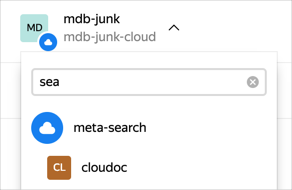

# Облака и каталоги внутри Яндекса

Ресурсы MDB выделяются на облако, соответствующее сервису ABC. Внутри каждого облака есть один каталог.



## Как узнать идентификатор каталога или облака {#find-id}

Идентификаторы каталога и облака могут понадобиться для вызовов CLI и API.



- Веб-интерфейс

  1. Чтобы получить идентификатор каталога, выберите его в [списке каталогов облака](https://yc.yandex-team.ru). Идентификатор каталога можно скопировать из URL страницы, например: `https://yc.yandex-team.ru/folders/**foodqkuj4ge5j9sg34uq**`.

  2. Чтобы получить идентификатор облака, откройте [страницу обзора облака](https://yc.yandex-team.ru/?tab=info). Чтобы переключиться на другое облако или каталог, раскройте выпадающий список в шапке справа (работает поиск по имени):

     

- CLI

  Чтобы получить идентификатор облака для настроенного профиля CLI, выполните команду:
  ```bash
  yc config list
  token: AQAD...
  endpoint: gw.db.yandex-team.ru:443
  cloud-id: fooubdgo8ls21u7u4enm
  folder-id: foo1sbbr3283m80ss5tp
  ```

  Эта команда также выведет текущий каталог по умолчанию. Чтобы получить идентификатор другого каталога:

  1. Скопируйте слаг ABC-сервиса, например, `https://abc.yandex-team.ru/services/**chemodan**/`.
  1. Выполните команду:
      ```bash
      yc resource-manager folder get chemodan
      id: foodqkuj4ge5j9sg34uq # идентификатор каталога
      cloud_id: fooubdgo8ls21u7u4enm
      created_at: "2018-10-21T23:55:16Z"
      name: chemodan
      description: Яндекс.Диск https://abc.yandex-team.ru/services/chemodan/
      labels:
        abc_service_id: "406"
        abc_service_slug: chemodan
      status: ACTIVE
      ```



## Сетевые доступы {#network-access}

В [Панчере](https://puncher.yandex-team.ru/) уже сделаны правила для доступа к кластерам MDB:

- из [всех серверных сетей Яндекса](https://puncher.yandex-team.ru/?id=5ce6a766d89cb04f14acafb3),
- для [всех штатных разработчиков и администраторов](https://puncher.yandex-team.ru/?id=61f8da624928bbfd5d61d651).

Поэтому в общем случае ковырять дырки не требуется.
