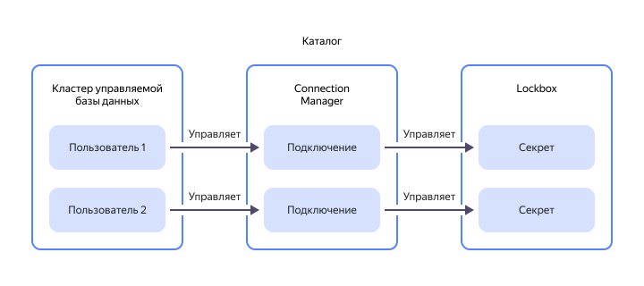

# Подключение





Вы также можете [создать новые подключения](../../metadata-hub/operations/create-connection.md) с безопасным хранением пароля к пользовательским инсталляциям базы данных и использовать их в доступных сервисах {{ yandex-cloud }}.

Вы можете [настроить доступ к подключениям](../security/index.md) с помощью ролей {{ connection-manager-full-name }}. Роли можно назначать на [облако](../../resource-manager/concepts/resources-hierarchy.md#cloud), [каталог](../../resource-manager/concepts/resources-hierarchy.md#folder) или на отдельное [подключение](../operations/connection-access.md). Они будут действовать и на вложенные ресурсы.