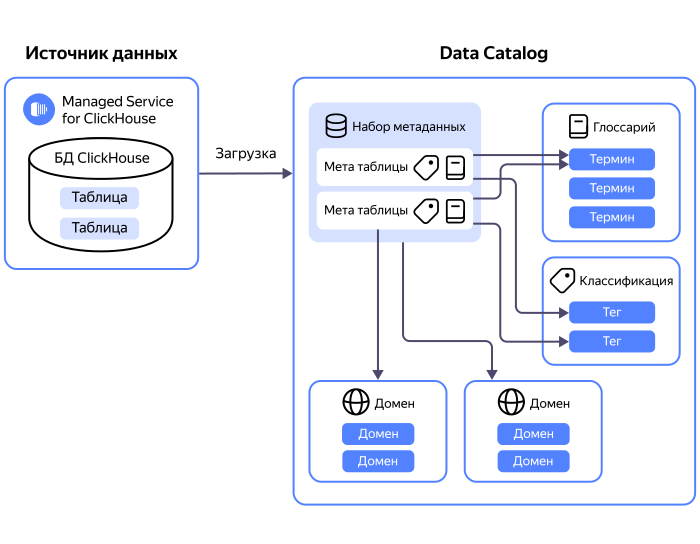

# Взаимосвязь ресурсов сервиса {{ data-catalog-full-name }}









Основная сущность, которой оперирует сервис {{ data-catalog-name }} — _каталог метаданных_. Каталог одновременно является:

* местом сбора и хранения метаданных из различных источников;
* рабочим пространством для разметки метаданных. 

Метаданные загружаются в каталог при помощи [источников и загрузок](#metadata-upload). Для хранения метаданных используется внутреннее хранилище.

Для первичного распределения метаданных, например по отделам компании, применяются [домены и поддомены](#domains-and-subdomains). Для более детальной разметки метаданных вы можете использовать:

* [классификации и теги](#classifications-and-tags),
* [глоссарии и термины](#glossaries-and-terms).

## Загрузка метаданных {#metadata-upload}

Для загрузки метаданных используются _источники_ и _загрузки_.

Источник — это подключение, через которое загружаются метаданные. В этом подключении хранится информация о БД или другом сервисе, из которого загружаются метаданные, а также данные для аутентификации. [Подробнее о доступных бэкендах](../operations/data-catalog/create-source.md).

Источник может подключаться как к кластерам управляемых БД в облаке {{ yandex-cloud }}, так и к пользовательским инсталляциям этих БД. Также поддерживается поставка связей между объектами на основе запущенных поставок данных в сервисе {{ data-transfer-full-name }}.

Если в одном каталоге создать несколько источников для одного и того же экземпляра БД или трансфера, для них автоматически будет создан единый объект типа `data store`, ассоциированный с этим экземпляром БД. Этот объект объединяет все загруженные метаданные по всем источникам для этого экземпляра БД или кластера.

Загрузка — это процесс, который подключается к указанному в источнике хранилищу данных или сервису и загружает его метаданные в каталог. В загрузке вы можете настроить:

* Фильтры, чтобы получать только нужные вам метаданные.
* Профилирование, чтобы выгружать нужные вам данные о статистике.

Загрузка привязывается к конкретному источнику и работает только с ним. При этом к одному источнику можно привязывать несколько загрузок. Это позволяет создать несколько загрузок с разными фильтрами для одного источника.

Загрузку можно запускать вручную или настроить ее запуск по расписанию. В указанное время загрузка всегда выполняется однократно, даже если в расписании указан период, а не конкретный час.

Максимальное количество источников и загрузок в каталоге определяется квотами сервиса.

## Разметка метаданных {#metadata-markup}

### Домены и поддомены {#domains-and-subdomains}

_Домен_ — это группа метаданных. Домены позволяют группировать метаданные под потребности вашего рабочего процесса, например по принадлежности метаданных к конкретному отделу компании или направлению бизнеса. Для каждого домена можно создать поддомен для более гранулярной группировки метаданных.

Каждому набору метаданных или элементу в нем можно назначить только один домен или поддомен. При этом для разных элементов в наборе метаданных можно назначить разные домены или поддомены.

Максимальное количество доменов в каталоге определяется квотами сервиса. Максимальная глубина вложенности доменов — 5.

### Классификации и теги {#classifications-and-tags}

_Классификация_ — это группа тегов, которые используются для разметки метаданных.

Максимальное количество классификаций в каталоге определяется квотами сервиса.

_Теги_ — это метки, которые используются для разметки данных по их типам, например чувствительные данные, характеристики таблиц и т. д. Одному и тому же набору метаданных или элементу в нем может быть присвоено несколько тегов, в том числе из разных классификаций. Если в классификации включена опция **Взаимоисключение**, то на набор метаданных или элемент в нем может быть назначен только один тег из этой классификации.

Кроме наборов метаданных и элементов в них теги можно присвоить:

* доменам и поддоменам,
* глоссариям,
* отдельным терминам в глоссарии.

Максимальное количество тегов в классификации определяется квотами сервиса. 

### Глоссарии и термины {#glossaries-and-terms}

_Глоссарий_ — это словарь узкоспециализированных терминов для определенной отрасли, с толкованием этих терминов. Глоссарии позволяют сформировать в компании единое понимание общей терминологии. В зависимости от границ применимости выделяются следующие глоссарии:

* Отраслевые — применимы для отдельной отрасли или направления работы.
* Проектные — применимы в рамках отдельного проекта или серии связанных проектов.
* Корпоративные — применимы для всех проектов и направлений деятельности компании.

Максимальное количество глоссариев в каталоге определяется квотами сервиса.

_Термины_ — это понятия, которые используются для разметки данных по их семантическому значению в рамках бизнеса, например «выручка», «расходы» и т. д. Для каждого термина вы можете задать его синоним или создать дочерний термин для более гранулярной разметки данных. Одному и тому же набору метаданных или элементу в нем может быть присвоено несколько терминов, в том числе:

* термины из разных глоссариев;
* дочерние термины разных родительских терминов.

Максимальное количество терминов в глоссарии определяется квотами сервиса. Максимальная глубина вложенности терминов — 5.

## Примеры использования {#examples}

* [{#T}](../operations/data-catalog/create-term.md) в глоссарии.
* [{#T}](../operations/data-catalog/create-term-child.md).
* [{#T}](../operations/data-catalog/update-glossary.md).
* [{#T}](../operations/data-catalog/update-term.md).
* [{#T}](../operations/data-catalog/create-tag.md) в классификации.
* [{#T}](../operations/data-catalog/update-classification.md).
* [{#T}](../operations/data-catalog/update-tag.md) в классификации.