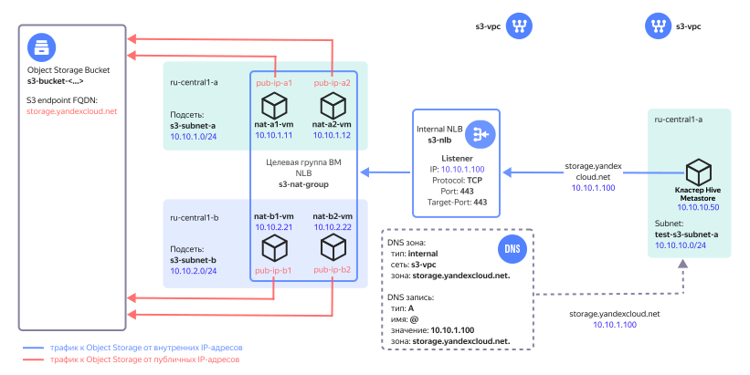

# Подключение к бакету {{ objstorage-full-name }} с политикой доступа

В сервисе {{ metastore-full-name }} вы можете работать с бакетом {{ objstorage-full-name }}, для которого настроены [политики доступа](../../../storage/security/policy.md). Доступ к бакету осуществляется из отдельной DNS-зоны через внутренний балансировщик, который распределяет трафик по ВМ с NAT. Схема такого подключения приведена ниже. Вместо ВМ `test-s3-vm` будет использоваться кластер {{ metastore-name }}.

## Перед началом работы {#before-you-begin}

1. Создайте сетевую инфраструктуру для доступа к бакету {{ objstorage-name }}, которая изображена на рисунке выше. Создание такой инфраструктуры описано в [практическом руководстве](../../../storage/tutorials/storage-vpc-access.md).
1. [Протестируйте созданную инфраструктуру](../../../vpc/tutorials/storage-vpc-access.md#check). 

## Подготовьте кластер {{ metastore-name }} {#prepare-metastore}

1. [Создайте сервисный аккаунт](../../../iam/operations/sa/create.md) `my-account` с ролями `storage.uploader` и `managed-metastore.integrationProvider`.
1. [Выдайте разрешение](../../../storage/operations/buckets/edit-acl.md) `READ и WRITE` сервисному аккаунту `my-account` на созданный ранее бакет.
1. [Настройте сеть и создайте кластер](cluster-create.md) {{ metastore-name }}. При создании укажите сервисный аккаунт `my-account`.

## Проверьте подключение {#check-connection}

Чтобы проверить подключение к бакету {{ objstorage-name }}, [экспортируйте в него данные кластера {{ metastore-name }}](export-and-import.md#export). 
