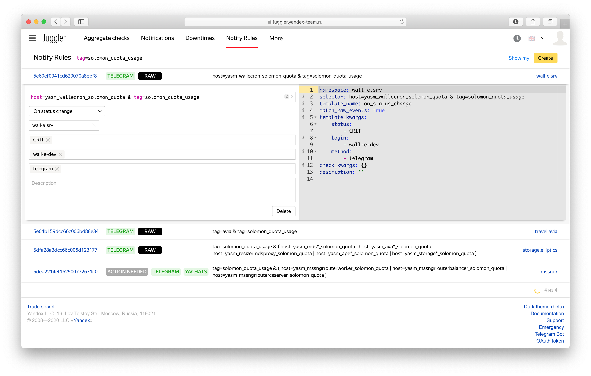

# Мониторинг квот

В данном разделе описывается как настроить мониторинг квот для проекта в Solomon.

## Обзор {#overview}

В системе Solomon существуют следующие квоты:
- количество метрик, записываемых в долговременное хранилище (файловые метрики);
- количество [memonly-метрик](../concepts/glossary.md#memonly)memonly-метрик, хранящихся только в памяти процессов Solomon для вычисления пред-агрегатов при записи (подробнее этот механизм описан в разделе [{#T}](../concepts/aggregation.md#aggregation-on-write));
- количество метрик в ответе, принимаемых от одного источника.

Подробнее о квотах можно узнать в разделе [Квоты](../concepts/limits.md#quotas).

## Метрики в Solomon {#metrics}

Значения текущего потреблениия и значения квот доступны в Solomon в виде метрик со следующими метками:

- `project="solomon"`;
- `cluster="production"`;
- `service="coremon"`;
- `host` — датацентр, в котором расположена одна из реплик [кластера](../overview/clusters.md)кластера Solomon (`Sas`, `Vla`, и т.п.);
- `projectId` — идентификатор проекта Solomon;
- `shardId` — идентификатор шарда Solomon;
- `sensor` — название метрики.

| Название метрики | Описание | Единица измерения |
| ------- | -------- | ----------------- |
| `engine.fileSensors` | Текущее потребление квоты на количество метрик в долговременном хранилище (файловые метрики)| Единицы |
| `engine.fileSensorsLimit` | Значение квоты на количество метрик в долговременном хранилище (файловые метрики)| Единицы |
| `engine.inMemSensors` | Текущее потребление квоты на количество метрик, использующихся для вычисления пред-агрегатов (memonly-метрики)| Единицы |
| `engine.engine.inMemSensorsLimit` | Значение квоты на количество метрик, использующихся для вычисления пред-агрегатов (memonly-метрики) | Единицы |
| `engine.pushSensorsToStorage` | Текущее значение потока на запись в хранилище, который генерируется шардом <small>Поток на запись в шард в настоящий момент не квотируется, но при превышении [лимитов на размер шарда](../concepts/limits.md#shard-limits) качество обслуживания для шарда не гарантируется.</small> | Точки в секунду

Пример графика с потреблением и значением квоты для шарда `solomon_production_sys` в проекте `solomon` доступен [по ссылке](https://solomon.yandex-team.ru/?project=solomon&cluster=production&host=Sas&service=coremon&sensor=engine.fileSensors%7Cengine.fileSensorsLimit&projectId=solomon&shardId=solomon_production_sys&stack=false&graph=auto&autorefresh=false&b=31d).

Графики по всем квотам шарда собраны на вкладке *Metrics limits* на странице со статусом шарда (*Shard Status*).

{ width="1552"}

<small>Вкладка Metrics limits для [шарда solomon_production_sys](https://solomon.yandex-team.ru/admin/projects/solomon/shards/solomon_production_sys).</small>

Solomon позволяет настроить уведомления о превышении квот. Подробнее в разделе [{#T}](../concepts/alerting/index.md).

## События в Juggler {#juggler}

В Solomon создан [специальный алерт](https://solomon.yandex-team.ru/admin/projects/solomon/alerts/solomon-all-shards-quota), который для каждого шарда отправляет в Juggler события о превышении порогов потребления квоты на количество метрик в долговременном хранилище (файловые метрики). В алерте установлены следующие пороги:
- 80% от потребления квоты приведет к отправке WARN-события.
- 90% от потребления квоты — CRIT-события.



Для выставления произвольных порогов создайте собственный алерт в Solomon в своём проекте.



События отправляются в Juggler со следующими параметрами:

| Параметр события | Описание |
| ---------------- | -------- |
| `host=${projectId}_solomon_quota` | `projectId` — идентификатор проекта Solomon. Например, `yasm_strmsalt`. |
| `service=${shardId}` | `shardId` — идентификатор шарда Solomon. Например, `yasm_strmsalt_host_0`|
| `tag=${projectId}` | `projectId` — идентификатор проекта Solomon. Например, `yasm_strmsalt`. |
| `tag=solomon_quota_usage` | Общий тег для всех событий. |

### Настройка уведомлений {#notifications}

По умолчанию для событий отправляемых из Solomon в Juggler не настроены никакие уведомления. Пользователям необходимо самостоятельно создать в Juggler [правило уведомлений](https://docs.yandex-team.ru/juggler/notifications/basics) или [агрегатную проверку](https://docs.yandex-team.ru/juggler/aggregates/basics).



При настройке правила уведомлений необходимо явно выставлять значение параметра `match_raw_events` в `true`, а также указать свой `namespace`.



Пример настройки правила уведомлений в Телеграм для проекта `yasm_wallecron` показан на скриншоте:

{ width="1552"}

