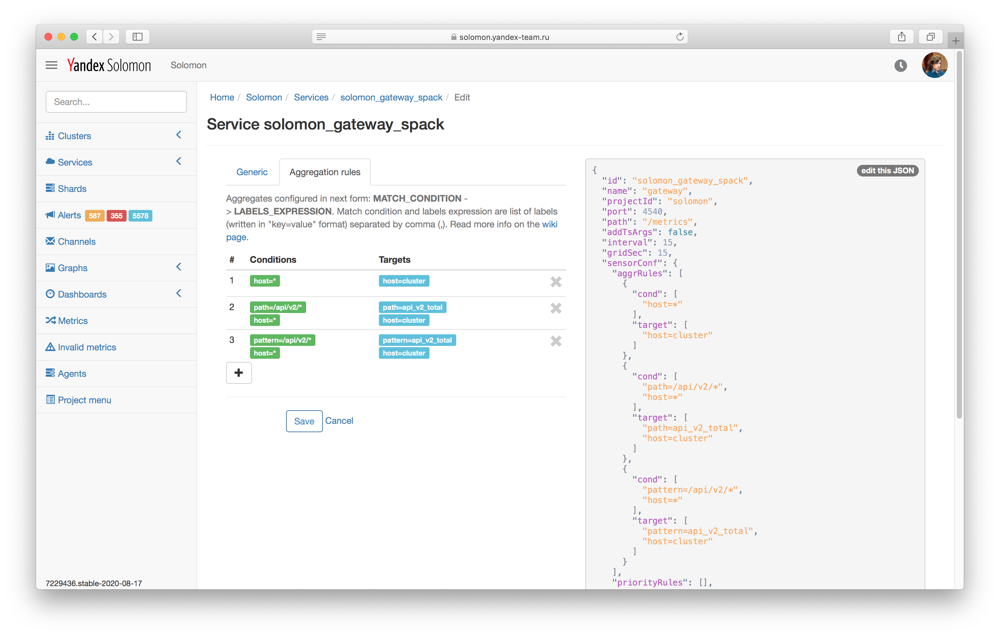
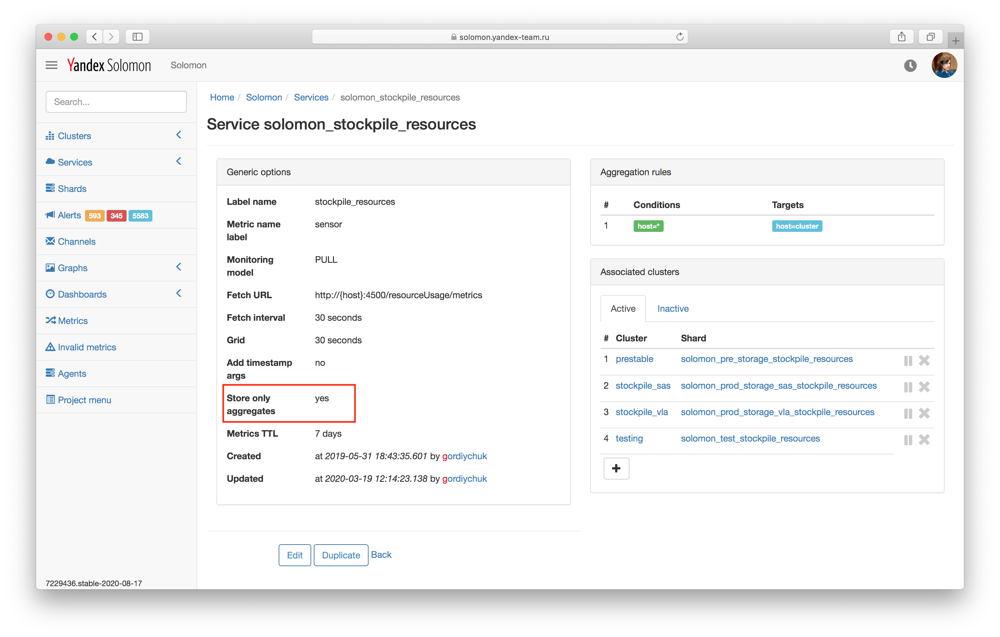

# Агрегация метрик

В данном разделе описаны способы агрегации метрик в Solomon.

## Способы агрегации

Многомерная [модель данных](./data-model.md) Solomon предполагает передачу метрик в разрезе по нескольким измерениям, описанных метками. Типичной задачей является агрегация значений метрик по одному или нескольким измерениям: например, по хостам кластера или по датацентрам.

Solomon поддерживает два способа агрегации метрик:
1. [при чтении](#aggregation-on-read) — с помощью функций [комбинирования](./querying.md#combination) или [ранжирования](./querying.md#rank-functions) из языка запросов Solomon при отображении графика на дашборде или вычислении алерта;
1. [при записи](#aggregation-on-write) — в момент записи метрик в хранилище Solomon может вычислить дополнительную метрику-агрегат на основе записываемых данных.

## Агрегация при чтении метрик {#aggregation-on-read}

Для агрегации по измерениям небольшой размерности (по меткам с не более чем 10 000 различных значений) используйте агрегацию при чтении метрик. Для этого воспользуйтесь функциями [комбинирования](./querying.md#combination) или [ранжирования](./querying.md#rank-functions) из языка запросов Solomon.

В этом случае указанные метрики будут прочитаны из хранилища Solomon, на основе их значений будет вычислено выражение на языке запросов, а результат вычисления — отображен на графике или использован в алерте.

Например, чтобы построить график со средним значением по множеству метрик, воспользуйтесь функцией [series_avg](./querying.md#series_avg):

```js
series_avg{...})
```



При помощи языка запросов можно проагрегировать не более, чем 10 000 метрик на одном графике и не более, чем 100 метрик в одном алерте. Для агрегации большего количества метрик воспользуйтесь [агрегацией при записи](#aggregation-on-write).




## Агрегация при записи метрик {#aggregation-on-write}

Для агрегации по измерениям большой размерности (по меткам с большим количеством значений) или по измерениям, которые невозможно проагрегировать на клиенте при передаче метрик, используйте агрегацию при записи метрик.

В этом случае для всех метрик, записываемых в шарды определенного solomon-сервиса, проверяется выполнение условий *правил агрегации*. Значения метрик, удовлетворяющих правилу агрегации, агрегируются в специальной метрике, называемой *агрегатом* (или пред-агрегатом). В отличие от обычной метрики, агрегат работает как аккумулятор, объединяя (merge) поступающие в него значения согласно функции агрегации.


<small>Рисунок 1 — Аккумуляция значений в агрегате.</small>



На данный момент в агрегации при записи метрик поддерживается только функции `SUM` (суммирование значений) и `LAST` (последнее значение).

В следующих версиях Solomon планируется поддержать следующие функции: минимум (`MIN`), максимум (`MAX`) и среднее значение (`AVG`). Смотри также тикет [SOLOMON-1315](https://st.yandex-team.ru/SOLOMON-1315).



Таким образом, значения метрики, подпадающей под правило агрегации, записываются в хранилище Solomon несколько раз: как в саму метрику, так и в каждую метрику-агрегат.

### Правила агрегации {#aggregation-rules}

Правила агрегации указываются в настройках solomon-сервиса в разделе *Aggregation rules* в виде: `Conditions -> Targets`, где:
  * **Conditions** — селектор, который задает множество метрик, для которых будет выполняться агрегация при записи. Например, `host=*` или `host=*, response_code=*`, или `code=500|502|503`.
  * **Targets** — список меток и их значений, которыми дополнительно будет обладать метрика-агрегат.

В значениях меток, указанных в параметре **Targets**, поддерживается [mustache-шаблонизация](http://mustache.github.io/) для подстановки значений других меток. Например, `host=not_var{{DC}}` подставит в метку `host` значение метки `DC`. 

Если у метрики-агрегата необходимо убрать метку с именем `label`, укажите в параметре **Targets** значение `label=-` (дефис). Пример можно прочитать в разделе [{#T}](#aggregation-with-drop-label).

Порядок перечисления правил агрегации важен. Если по нескольким правилам агрегации получается одна метрика-агрегат, то в агрегат запишется результат применения последнего по порядку правила.


<small>Рисунок 2 — Правила агрегации на странице редактирования сервиса.</small>



В правилах агрегации не поддерживается использование меток `project`, `cluster` и `service`. То есть невозможно создать правило, которое будет агрегировать метрики между различными шардами.





В настройках одного solomon-сервиса возможно создать не более 10 правил агрегации.



### Хранение агрегатов и memonly-метрики {#store-only-aggregates}

Для уменьшения количества метрик, хранящихся в Solomon, существует возможность сохранять при записи только метрики-агрегаты и не сохранять исходные метрики. Для этого включите настройку *Store only aggregates* на странице solomon-сервиса. В этом случае исходные метрики хранятся только в оперативной памяти процессов Solomon, обрабатывающих поступающий поток метрик, и не сохраняются в долговременное хранилище. Таким образом, они становятся memonly-метриками.


<small>Рисунок 3 — Настройка *Store only aggregates* на странице сервиса.</small>



Метрики, записываемые в шарды сервиса с включенной настройкой **Store only aggregates**, не потребляют квоту на хранимые (файловые) метрики, но потребляют квоту на memonly-метрики.



### Выравнивание по сетке {#aggregates-and-grid}




### Типичные сценарии {#best-practices}

#### Агрегация по датацентру {#aggregation-by-dc}

Для агрегации метрик по датацентру используйте правило `host=* -> host=not_var{{DC}}`. Всем метрикам, собираемым при помощи Pull-режима, добавляется метка `host`, если она не указана в поступающих метриках, а также неявная метка `DC`. Значение метки `host` равно имени хоста, с которого были собраны метрики. Значение метки `DC` Solomon заполняет, получая информацию из Racktables о расположении хостов в датацентрах.

Например, если Solomon собрал с хоста метрику с единственной меткой `name=some_value`, то полный список меток метрики будет следующим:

```js
{name='some_value', host='hostname', DC='dc_for_host'}
```



Метка `DC` используется только для вычисления агрегатов и недоступна в селекторах и при навигации по метрикам.



В результате выполнения правила агрегации `host=* -> host=not_var{{DC}}` у метрики-агрегата будут следующие метки:

```js
{name='some_value', host='dc_for_host'}
```

#### Агрегация по нескольким меткам {#aggregation-by-many-labels}

Правила агрегации не являются рекурсивными, то есть применяются только к поступающим в Solomon метрикам и не применяются к агрегатам.

Рассмотрим агрегацию по нескольким меткам на примере. Допустим, в Solomon собирается следующий набор метрик, с количеством 500-х кодов ответа на HTTP-запросы на каждом из хостов кластера:

```js
name='http.requests.total', host='solomon-00', code='500'
name='http.requests.total', host='solomon-00', code='502'
name='http.requests.total', host='solomon-00', code='503'
...
name='http.requests.total', host='solomon-01', code='500'
name='http.requests.total', host='solomon-01', code='502'
name='http.requests.total', host='solomon-01', code='503'
...
```

Правило `host=* -> host=cluster` проагрегирует метрики по всем значениям метки `host`, в результате чего в Solomon будет дополнительно записан следующий набор метрик:

```js
name='http.requests.total', host='cluster', code='500'
name='http.requests.total', host='cluster', code='502'
name='http.requests.total', host='cluster', code='503'
...
```

Если добавить в настройках solomon-сервиса второе правило агрегации `code=* -> code=All`, то для каждого из хостов появятся метрики-агрегаты по всем кодам ответа:

```js
name='http.requests.total', host='solomon-00', code='All'
name='http.requests.total', host='solomon-01', code='All'
...
```

При этом правило **не применится** к метрикам-агрегатам `{host='cluster', code='500'}, ...`. Чтобы получить метрику с суммой всех метрик по хостам и по коду ответа, необходимо создать правило, агрегирующее по нескольким меткам: `host=*, code=* -> host=cluster, code=All`{.js}.

#### Агрегация со снятием метки{#aggregation-with-drop-label}

Чтобы убрать у метрики-агрегата метку `host`, по которой выполняется агрегация, создайте правило агрегации `host=* -> host=-`. Правило сработает таким образом, что набор метрик

```js
name='http.requests.total', code='200', host='solomon-00'
name='http.requests.total', code='200', host='solomon-01'
...
```

проагрегируется в следующую метрику:

```js
name='http.requests.total', code='200'
```
