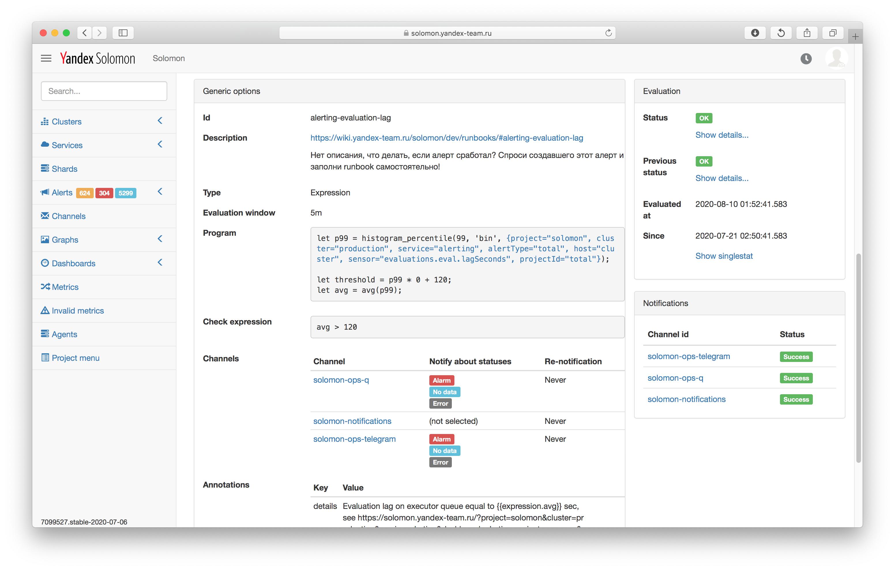

# Алертинг

В данном разделе описана система алертинга Solomon. Смотри также [пошаговые инструкции по работе с алертами](../../operations/#working-with-alerts), а также [каталог примеров алертов](./examples.md).

## Основные понятия {#intro}

Важнейшим свойством системы мониторинга является оповещение пользователя об изменениях в наблюдаемых метриках. Для решения этой задачи в Solomon используются алерты. Ниже перечислены основные понятия, использующиеся в разделе.

* **Алерт** (Alert) — некоторая функция над множеством метрик, вычисляемая раз в 1 минуту, и условие (предикат), по которому алерт переходит в один из статусов.

* **Мульти-алерт** (Multi-alert) — набор алертов, сгруппированных по одной или нескольким меткам наблюдаемых метрик.

* **Под-алерт** (Sub-alert) — один из алертов мульти-алерта, рассчитываемый для каждого конкретного значения метки или всех их возможных сочетаний, если настроена группировка по нескольким меткам.

* **Аннотации** (Annotations) — дополнительная метаинформация по алерту, которую можно использовать в шаблонах уведомлений.

* **Канал уведомлений** (Notification channel) — определяет получателя, транспорт и содержание уведомлений о переходе алерта в определенный статус.

* **Мьют** (Mute) — правило, позволяющее временно отключить нотификации по одному или нескольким алертам.

## Алерты {#alerts}

**Алерт** (Alert) — некоторая функция над множеством метрик, вычисляемая раз в 1 минуту, и условие (предикат), по которому алерт переходит в один из статусов.

### Статусы алертов {#alert-statuses}

В зависимости от результата вычислений и настроенных условий срабатывания (предикатов) алерт может перейти в один из следующих статусов:

* **<span style="color: green;">OK</span>** — предикат не выполняется, алерт не требует внимания пользователя.

* **<span style="color: orange;">Warning</span>** — выполняется предикат предупреждения.

* **<span style="color: red;">Alarm</span>** — выполняется предикат критического статуса. Как правило, именно о таких ситуациях пользователь ожидает получить уведомление.

* **<span style="color: blue;">No data</span>** — метрика, по которой настроено срабатывание алерта, не существует, или во временном окне, с которым работает алерт, нет точек. Например, в имени метрики допущена ошибка и такой метрики не существует или указанная метрика был удалена по TTL или в метрику перестали записываться свежие данные.

* **<span style="color: gray;">Error</span>** — пользовательская или системная ошибка. Например, алерт некорректно сконфигурирован и не может быть вычислен. Подробности доступны по кнопке *Show details* на странице алерта.

### Параметры алертов {#alert-params}

Красной звёздочкой ( <span style="color: red;">^*^</span> ) обозначены параметры, обязательные при создании алерта.

* **Id** — уникальный строковый идентификатор алерта. Если не задан, будет сгенерирован автоматически, например, `5527e727a4b2c2164c7c770e`. Это поле нельзя отредактировать после создания алерта.

* **Name**<span style="color: red;">^*^</span> — человекочитаемое название алерта. Например, `Solomon: Free space is too low`.

* **Evaluation window**<span style="color: red;">^*^</span> — временнóе окно, в котором рассчитывается алерт. Например, `5m` (5 минут).

* **Delay** — сдвиг временного окна назад во времени в секундах (аналог функции [shift](../querying.md#shift) из языка запросов). По умолчанию равен 0.



Например, если временное окно выставлено в 5 минут, а сдвиг равен 60 секундам, то в 9:00 в алерт будут загружены точки из интервала с 8:54 до 8:59.

Это полезно при создании алертов на [агрегаты](../aggregation.md#aggregation-on-write), чтобы избавиться от эффекта долгого накопления последней точки: для ее вычисления нужно получить значения всех метрик, для которых выполняется правило агрегации, а на момент вычисления алерта может быть получена только часть данных и значение точки оказывается меньше, чем ожидается. Поэтому для алертов на агрегаты рекомендуется устанавливать *Delay* равный двум интервалам сбора данных.



* **Type**<span style="color: red;">^*^</span> — тип алерта: Threshold или Expression.

* **Group by** — группировка по меткам, позволяющая создать мульти-алерт (**multi-alert**), который сгенерирует набор **под-алертов** (sub-alert). Для каждого значения метки (или для всех возможных их сочетаний, если указана группировка по нескольким меткам) будет независимо вычисляться свой под-алерт. Например, легко получить набор алертов, рассчитываемый для каждого хоста, если указать группировку по метке `host`. Подробнее в разделе [{#T}](#multi-alerts)

* **Annotations** — аннотации — дополнительная метаинформация по алерту, которую можно использовать в шаблонах уведомлений. Например, при помощи аннотаций можно сохранить время и значение метрики в момент срабатывания алерта или составить ссылку на нужный график.

* **Channels** — подключенные каналы уведомлений для алерта. Каналы определяют получателя, транспорт и содержание уведомлений о переходе алерта в определенный статус. Имеет следующие настройки:

  * **Notify about statuses**  — список статусов алерта, о которых будут отправляться уведомления в канал. 
  
    Имеет приоритет над аналогичной deprecated-настройкой канала.

  * **Re-notification** — задержка перед повторной отправкой уведомления о том, что алерт находится в том же статусе. Например, раз в 1 час. Значение по умолчанию *Never* означает, что уведомления отправятся только об изменениях статуса алерта. Не распространяется на статус **<span style="color: green;">OK</span>**.
  
    Имеет приоритет над аналогичной deprecated-настройкой канала.


### Типы алертов {#alert-types}

#### Threshold

Threshold-алерты срабатывают при сравнении значения метрики с пороговым значением. У них есть следующие параметры:

* **Selectors** — список селекторов, по которым будут загружены метрики. Например,

  <small>Листинг 2 — Пример списка селекторов для загрузки метрик в алерт.</small>

  ```js
  project='solomon', cluster='kikimr_solomon_man', service='stockpile', host='*', group='shard_count_by_state', load_state='DONE'
  ```

  

  Если в селекторах явно не указана метка `project`, то метрики будут загружены из проекта, в котором создан алерт.

  

* **Predicate rules** — набор условий (предикатов), при выполнении которых алерт переходит в определенный статус. Условия проверяются последовательно, сверху вниз. Первое условие, для которого предикат оказался истинным, переводит алерт в указанный статус, после чего проверка остальных условий не производится. Каждое условие описывается следующие набором параметров:

  * **Aggregation** — функция агрегации, применяемая к значениям метрик во временном окне. При расчете значений функции используются значения метрик без прореживания.
    * **Any** — условие срабатывания выполнено хотя бы для одного значения метрики во временном окне.
    * **All** — условие срабатывания выполнено для всех значений метрики во временном окне.
    * **Last** — условие срабатывания выполнено для последнего значения метрики в указанном временном окне.
    * **Avg** — условие срабатывания выполнено для среднего значения метрики в указанном временном окне.
    * **Min** — условие срабатывания выполнено для минимального значения метрики в указанном временном окне.
    * **Max** — условие срабатывания выполнено для максимального значения метрики в указанном временном окне.
    * **Sum** — условие срабатывания выполнено для суммы значений метрики в указанном временном окне.
    * **Count** — условие срабатывания выполнено для количества значений метрики в указанном временном окне.

  * **Comparison** — функция сравнения агрегированного значения метрики с пороговым значением **Threshold**.

    * Простой случай: по селекторам загружена единственная метрика. Если предикат для нее принимает истинное значение — алерт переходит в состояние **Target status**.

    * Сложный случай: по селекторам загружено много метрик и группировка по меткам выключена. Тогда при расчете алерта значение *каждой из метрик* будет сравниваться с порогом, и если предикат принял истинное значение *хотя бы для одной метрики*, алерт перейдет в состояние **Target status**. Это удобно для случая, когда важен сам факт нарушения порога, но неважно какой именно метрикой из множества.

    

    В один алерт (или под-алерт) может быть загружено не более 100 метрик. Для вычислений над большим количеством метрик воспользуйтесь одним из следующих способов:
    * создайте мульти-алерт, включив группировку по меткам (подробнее в разделе [{#T}](#multi-alerts));
    * используйте пред-агрегацию метрик, записываемых в Solomon (подробнее в разделе [{#T}](../aggregation.md#aggregation-on-write));
    * используйте пред-агрегацию на стороне клиента, передающего метрики.

    

  * **Threshold** — пороговое значение, при достижении которого условие считается выполненным.

  * **Target status** — статус, в который перейдет алерт, при выполнении условия.



Чтобы создать алерт, который переходит в статус **<span style="color: orange;">Warning</span>** при умеренных отклонениях метрики, а в **<span style="color: red;">Alarm</span>** — при сильных отклонениях, укажите предикат для **<span style="color: red;">Alarm</span>** статуса **первым**, а предикат для **<span style="color: orange;">Warning</span>** статуса — вторым.

Иначе последовательная проверка условий никогда не дойдет до предиката для **<span style="color: red;">Alarm</span>** статуса, так как условие для **<span style="color: orange;">Warning</span>** статуса сработает раньше и прекратит дальнейшую проверку.



{ width="1552" }
<small>Рисунок 1 — Параметры Threshold-алерта.</small>

#### Expression

Expression-алерты вычисляют значение произвольного выражения на [языке запросов](../querying.md) и выполняют предикат, на основе вычисленных значений. Например, при помощи expression-алертов можно сделать алерт на процентиль по значению многих метрик.



В один алерт (или под-алерт) может быть загружено не более 100 метрик. Для вычислений над большим количеством метрик создайте мульти-алерт, включите группировку по меткам (подробнее в разделе [{#T}](#multi-alerts)) или используйте пред-агрегацию метрик, записываемых в Solomon или на стороне клиента, передающего метрики.



У expression-алертов есть следующие параметры:

* **Program** — программа на [языке запросов](../querying.md). В программе поддерживаются [переменные](../querying.md#variables).



В переменные можно загружать данные из других проектов: достаточно явно указать метку `project`, как указано в Листинге 3.

<small>Листинг 3 — Пример загрузки метрик из проекта `solomon`.</small>

```js
let data = project='solomon', cluster='kikimr_solomon_man', service='stockpile', host='*', load_state='DONE'`
```



* **Check expression** — предикат, который определяет условия срабатывания алерта. Как только предикат становится истинным (выражение возвращает `true`), алерт переходит в состояние **<span style="color: red;">Alarm</span>**. В случае отсутствия предиката статус алерта можно изменить с помощью [функций управления статусами алерта](#status-functions).

{ width="1552" }
<small>Рисунок 2 — Параметры Expression-алерта.</small>

##### Управление статусами expression-алерта {#status-functions}

Для управления статусами алерта в языке запросов Solomon существуют [специальные функции](../querying.md#alert-functions).

<small>Листинг 4 — Список функий для управления статусом алерта.</small>

```js
alarm_if(condition: Boolean): Void
warn_if(condition: Boolean): Void
no_data_if(condition: Boolean): Void
ok_if(condition: Boolean): Void
```

Функции управления алертами при выполнении условия *condition* прерывают выполнение программы expression-алерта и переводят алерт в определенный статус. Эти функции не возвращают никакого значения и их результат нельзя присваивать переменной.

Рассмотрим работу функций на примере expression-алерта с программой, описанной в Листинге 5.

<small>Листинг 5 — Пример программы expression-алерта с использованием функций управления статусом алерта.</small>

```js
// Если по селектору не находится ни одна метрика, то статус алерта будет NO_DATA еще до начала выполнения программы
let data = {project="examples", cluster="test", service="json_push", sensor="sinusoid"};

// Если метрика существует, но в окно алерта (evaluation window) не попало ни одной точки — перевести алерт в статус No data
no_data_if(count(data) == 0);

let value = avg(data);

alarm_if(value > 100); // Выставить статус Alarm, если value превысило 100
warn_if(value > 10); // Выставить статус Warning, если value превысило 10
```

Данный алерт перейдет в статус <span style="color: blue;">**No data</span>**, если указанной метрики нет в Solomon (например, метрика была удалена по TTL), либо во временном окне нет точек (например, в метрику перестали писать точки).

Если же в окне алерта есть хотя бы одна точка, программа будет исполняться дальше, будет вычислена переменная `value`. Если ее значение окажется больше 100, то конструкция alarm_if прервет выполнение программы и выставит алерту статус <span style="color: red;">**Alarm</span>**. В противном случае выполнение программы продолжится и значение `value` будет сравнено с 10. Если `value > 10`, то алерту будет выставлен статус <span style="color: orange;">**Warning</span>**.

Если же `value <= 10`, программа алерта будет выполнена полностью, а статус алерта будет выставлен в <span style="color: red;">**Alarm</span>** либо <span style="color: green;">**OK</span>** по результатам проверки **Check expression**. При отсутствующем **Check expression** статус будет выставлен в <span style="color: green;">**OK</span>**.

#### Особенности работы с функциями управления статусами алерта

1. В примере, приведенном в Листинге 6, важен порядок функций `alarm_if` и `warn_if`, поскольку следующий код никогда не выставит статус <span style="color: red;">**Alarm</span>** (при пустом **Check expression**), так как значения `value > 100` будут переводить алерт в <span style="color: orange;">**Warning</span>** статус с прекращением исполнения программы.

    <small>Листинг 6 — Пример неправильного использования функций управления статусом алерта.</small>

    ```js
    let data = {project="examples", cluster="test", service="json_push", sensor="sinusoid"};

    no_data_if(count(data) == 0);
    let value = avg(data);

    warn_if(value > 10);
    alarm_if(value > 100);
    ```

    Такую программу следует исправить, как указано в Листинге 7.

    <small>Листинг 7 — Исправленный пример использования функций управления статусом алерта.</small>

    ```js
    let data = {project="examples", cluster="test", service="json_push", sensor="sinusoid"};

    no_data_if(count(data) == 0);
    let value = avg(data);

    warn_if((value > 10) && (value <= 100));
    alarm_if(value > 100);
    ```

2. Если в программе объявлена переменная после вызова любой из функций **alarm_if**, **warn_if**, **no_data_if** или **ok_if**, то значение переменной не будет доступно в аннотациях, если выполнение программы было прервано.

    Например, в программе из Листинга 8 в аннотациях `not_var{{expression.valuePretty}}` будет подставляться только для статуса <span style="color: green;">**OK</span>**, а для остальных статусов будет пустой строкой.

    <small>Листинг 8 — Пример использования функций управления статусом алерта и переменных.</small>

    ```js
    let data = {project="examples", cluster="test", service="json_push", sensor="sinusoid"};

    no_data_if(count(data) == 0);
    let value = avg(data);

    warn_if(value > 10);
    alarm_if(value > 100);

    let valuePretty = to_fixed(100 * value, 2) + '%';
    ```

1. С помощью нескольких вызовов функции **alarm_if** возможно разбить сложное условие срабатывания алерта на несколько, добавив поясняющие комментарии.

    Например, условие срабатывания  `(requests < 100) || (errors > 20)` можно записать так, как указано в Листинге 9.

    <small>Листинг 9 — Пример разбиения сложного условия срабатывания на несколько.</small>

    ```js
    ...
    let reason = 'Number of requests is low!';
    alarm_if(requests < 100);
    let reason = 'Number of errors is large!';
    alarm_if(errors > 20);
    let reason = 'Everything is ok';
    ```

    Добавив в алерт аннотацию со значением переменной `not_var{{expression.reason}}` можно сохранить информацию о том, по какому из условий сработал алерт.

### Обработка отсутствия данных {#no-data-policies}

Существует два способа обработать в алерте отсутствие точек во временном окне или отсутствие метрик: перевести алерт в определенный статус при помощи политик [No metrics policy](#no-metrics-policy) и [No points policy](#no-points-policy) или [обработать эту ситуацию вручную](#manual-policy).

Политики алертов позволяют указать, в какой статус алерт перейдет при отсутствии данных. Политики применяются до вычисления предикатов Threshold-алерта или программы Expression-алерта.



Рекомендуется для всех типов алертов явно выставить значения политик в *No data*, чтобы алерты переходили в статус **<span style="color: blue;">No data</span>** как при отсутствии метрик, так и при отсутствии точек во временном окне алертов.

Использовать значение *Default* или *Manual* **не рекомендуется**, так как это требует дополнительных действий [по ручной обработке](#manual-policy).



#### No metrics policy {#no-metrics-policy}

Политика *No metrics policy* определяет, в какой статус перейдет алерт, если по хотя бы по одному селектору из алерта не найдено метрик (например, их не существует или они были удалены по [TTL](../../concepts/deletion/ttl.md)).

Возможные значения:
- *Default* — значение по умолчанию — *No data* для Threshold и для Expression-алертов.
- *OK* — переводит алерт в статус **<span style="color: green;">OK</span>**;
- *Warning* — переводит алерт в статус **<span style="color: orange;">Warning</span>**;
- *Alarm* — переводит алерт в статус **<span style="color: red;">Alarm</span>**;
- *No data* — переводит алерт в статус **<span style="color: blue;">No data</span>**;
- *Manual* — передает управление программе expression-алерта для [обработки ситуации вручную](#manual-policy).



Значение *Manual* для *No metrics policy* поддерживается только для Expression-алертов и не поддерживается для Threshold-алертов.



[Пример алерта](./examples.md#ignore-no-metrics), для которого *No metrics policy* выставлена в *OK*, чтобы алерт не срабатывал при отсутствии метрик.



Если для Expression-алерта в параметре *No metrics policy* указано *Manual*, хотя бы одному слектору не нашлось метрик и в программе алерта не сработала никакая [функция управления статусом](#status-functions) – алерт перейдет в состояние **<span style="color: green;">OK</span>**.

Рекомендуется использовать значение *No data* для *No metrics policy*. Если используется *Manual* — следует [обрабатывать отсутствие точек вручную](#no-points-manual).



#### No points policy {#no-points-policy}

Политика *No points policy* определяет, в какой статус перейдет алерт, если хотя бы для одной из метрик во временном окне алерта нет точек.

<!-- В пороговых алертах NO_POINTS_POLICY применяется 2 раза: до трансформаций и после -->



Для пороговых алертов, настроенных на несколько метрик, предикаты выполняются для каждой метрики независимо. Итоговый статус алерта получается агрегацией статусов для каждой из метрик в следующем порядке: **<span style="color: blue;">No data</span>** < **<span style="color: green;">OK</span>** < **<span style="color: orange;">Warning</span>** < **<span style="color: gray;">Error</span>** < **<span style="color: red;">Alarm</span>**.

Если политика *No points policy* переведет такой пороговый алерт, например, в статус **<span style="color: orange;">Warning</span>** из-за отсутсвтия точек в одной линии, а для другой линии выполнится предикат, переводящий алерт в статус **<span style="color: red;">Alarm</span>**, то итоговый статус алерта будет **<span style="color: red;">Alarm</span>**.



Возможные значения:
- *Default* — значение по умолчанию — *No data* для Threshold-алертов и *Manual* для Expression-алертов.
- *OK* — переводит алерт в статус **<span style="color: green;">OK</span>**;
- *Warning* — переводит алерт в статус **<span style="color: orange;">Warning</span>**;
- *Alarm* — переводит алерт в статус **<span style="color: red;">Alarm</span>**;
- *No data* — переводит алерт в статус **<span style="color: blue;">No data</span>**;
- *Manual* — передает управление предикатам Threshold-алерта или программе Expression-алерта для [обработки ситуации вручную](#manual-policy).

[Пример алерта](./examples.md#ignore-no-points), для которого *No points policy* выставлена в *OK*, чтобы алерт не срабатывал при отсутствии точек.



Если для Expression-алерта в параметре *No points policy* указано *Manual* или *Default*, во временном окне нет точек и в программе алерта не сработала никакая [функция управления статусом](#status-functions) – алерт перейдет в состояние **<span style="color: green;">OK</span>**.

Рекомендуется использовать значение *No data* для *No points policy*. Если используется *Manual* или *Default* — следует [обрабатывать отсутствие точек вручную](#no-points-manual).



#### Ручная обработка отсутствия данных {#manual-policy}

Если для любой политики указано значение *Manual*, управление будет передано предикатам Threshold-алерта или программе Expression-алерта.



Значение *Manual* не рекомендуется использовать, так как это усложняет программу алерта. В большинстве случаев достаточно воспользоваться значением политики *No data*.



##### Отсутствие метрик {#no-metrics-manual}

Чтобы вручную обработать отсутствие метрик в Expression-алерте воспользуйтесь функцией [size](../../concepts/querying.md#size), которая вернет количество метрик по заданному селектору, и [функцями управления статусами](#status-functions).

Пример программы, которая переведет алерт в статус **<span style="color: green;">OK</span>**, если по селектору указанному в переменной `xx5` нашлось 0 метрик:

```js
let xx5 = {project="solomon", cluster="production", service="gateway", endpoint="*", code="5*", method="*", host="cluster", sensor="http.server.requests.status"};
...
ok_if(size(xx5) == 0);
...
```



Для Threshold-алертов невозможна ручная обработка отсутствия метрик. Воспользуйтесь [политикой No metrics policy](#no-metrics-policy).



##### Отсутствие точек {#no-points-manual}

Чтобы вручную обработать отсутствие точек, воспользуйтесь функцией [count](../../concepts/querying.md#count), которая возвращает количество точек для заданного селектора точек во временном окне алерта, и [функцями управления статусами](#status-functions).

Пример программы, которая переведет алерт в статус **<span style="color: blue;">No data</span>**, если для метрики в переменной `source` во временом окне алерта нет точек:

```js
let source = {project="solomon", cluster="production", service="alerting", endpoint="api.telegram.org/send*", host="cluster", sensor="http.client.call.inFlight"};
...
no_data_if(count(source) == 0);
...
```

### Аннотации {#annotations}

Аннотации позволяют сохранить какую-либо дополнительную информацию в момент вычисления алерта, которую можно вставить в текст уведомлений или отобразить на [светофорных панелях](#traffic-lights).
Про использование аннотаций в тексте уведомлений читайте далее в разделе [Шаблоны уведомлений](#templates)

#### Шаблонизация в Аннотациях

В аннотациях поддерживается [mustache-шаблонизация](http://mustache.github.io/), при помощи которой в аннотацию можно передать параметры алерта.

Примеры аннотаций перечислены в листинге 10.

<small>Листинг 10 — Примеры использования аннотаций.</small>

```
Alert `not_var{{alert.name}}` is in not_var{{status.code}} state
```

```
Stockpile shards not_var{{pointValue}}, but expected 4096
```

```
Graph link: https://solomon.yandex-team.ru/?cluster=production&project=solomon&dashboard=alerting-projects-assignment-summary-dashboard&b=not_var{{fromTime}}&e=not_var{{toTime}}
```

Полный список параметров алертов доступных в аннотациях перечислен в таблице 1.

<small>Таблица 1 — Параметры алертов доступные в аннотациях.</small>

Название | Описание | Threshold | Expression
---------|----------|:---------:|:---------:
**alert.projectId**</br>**alert.id**</br>**alert.name**</br>**alert.state**</br>**alert.createdAt**</br>**alert.updatedAt**</br>**alert.createdBy**</br>**alert.updatedBy**</br>**alert.version**</br> | Общие параметры алерта. | ✅ | ✅
**alert.selectors**</br>**alert.aggregation**</br>**alert.comparison**</br>**alert.threshold** | Параметры Threshold-алерта. | ✅ |
**alert.program**</br>**alert.checkExpression** | Программа и предикат expression-алерта.| | ✅
**fromTime** | Начало временного интервала, в котором рассчитывается алерт. Строчка в формате ISO8601, например, `2017-09-07T11:30:00Z`. | ✅ | ✅
**toTime** | Конец временного интервала, в котором рассчитывается алерт. Строчка в формате ISO8601, например, `2017-09-07T12:00:00Z`. | ✅ | ✅
**pointValue** | Значение метрики в последней точке (для *All* и *Any* — в первой точке на отрезке *periodMillis*, где предикат не выполняется). | ✅ |
**pointTime** | Время в последней точке (см. **pointValue**). Строчка в формате ISO8601, например, `2017-09-07T11:33:00Z`. | ✅ |
**labels** | Словарь со значениями меток метрики, по которой сработал алерт, использовавшимися в группировке (если группировка не используется — пустая строка). Например, можно получить значение конкретной метки`host`, записав в значение аннотации `not_var{{labels.host}}`. | ✅ | ✅
**labelsString** | Строка с метками метрики, по которой сработал алерт (если группировка не используется — пустая строка)).Например, `{host=cluster, shard_id=my_shard}`.</br></br>Полезно вставить это значение в заголовок письма, чтобы понять какой именно под-алерт отправил уведомление. | ✅ | ✅
**status.code** | Статус алерта: **<span style="color: green;">OK</span>**, **<span style="color: red;">ALARM</span>**, **<span style="color: orange;">WARN</span>**, **<span style="color: blue;">NO_DATA</span>** или **<span style="color: gray;">ERROR</span>**. | ✅ | ✅
**isOk**</br>**isWarn**</br>**isAlarm**</br>**isNoData**</br>**isError** | Булевы переменные, через которые можно узнать статус алерта. Например:</br></br>`not_var{{#isAlarm}}Disk usage is too high!not_var{{/isAlarm}}`</br>`not_var{{^isAlarm}}Disk usage is ok.not_var{{/isAlarm}}`| ✅ | ✅
**expression** | Словарь со значениями переменных из программы алерта. Например, если в программе определена переменная `let avgDeadline = avg(deadline);`, то ее значение можно получить так: `not_var{{expression.avgDeadline}}`| | ✅

### Мульти-алерты {#multi-alerts}

**Мульти-алерты** позволяют настроить одинаковые алерты для однотипных сущностей, например, по всем хостам кластера или шардам базы данных.

Чтобы создать мульти-алерт, сгруппируйте алерт по одной или нескольким меткам. Для этого укажите в параметре *Group by* имена меток, значения которых различаются у метрик, загруженных в алерт.

Для каждого значения метки (или всех их возможных сочетаний, если группировка выполняется по нескольким меткам) сгенерируется отдельный **под-алерт** (sub alert).

Под-алерт — автоматически генерируемый алерт, который нельзя отредактировать вручную. Параметры под-алерта определяются соответствующими параметрами мульти-алерта, которому он принадлежит. Каждый под-алерт вычисляется и срабатывает независимо от других под-алертов одного мульти-алерта. Новые под-алерты генерируются автоматически при появлении метрик с новыми значениями меток. Аналогично под-алерты автоматически удаляются, если метрики с определенными значениями меток были удалены.

Например, если указать в параметре *Group by* метку *host*, то для каждого значения метки сгенерируется под-алерт. Если указать в параметре *Group by* несколько меток, например, *host* и *disk*, то под-алерты сгенерируются для каждого сочетания этих меток.

Группировка не применяется к селекторам, условие которых указано как "точное совпадение" (`label=="value"`) или "отсутствие значения" (`label="-"`). Благодаря этому можно создать мульти-алерт для всех хостов кластера, в котором метрика каждого отдельного хоста делится на значение метрики общей для всех хостов (например, агрегата по кластеру). В программе expression-алерта это так указано в Листинге 11.

<small>Листинг 11 — Пример использования группировки с фиксированием общего для всех под-алертов значения метки `host`.</small>

```js
// Example #1
// group by host
let used = {sensor=quoteUsed, host='*'};
let limit = {sensor=quoteLimit, host=='cluster'};
let percent = last(used / limit);

// Example #2
let used = {sensor=quoteUsed, host='*'};
let limit = {sensor=quoteLimit, host='-'}; // У метрики quoteLimit нет метки 'host'
let percent = last(used / limit);
```

Здесь в переменную `used` будет подставлено каждое значение метки `host`, а значение переменной `limit` будет одинаковым для каждого под-алерта.

{ width="1552" }
<small>Рисунок 3 — Страница Multi threshold алерта.</small>

На странице мульти-алерта в блоке *Evaluation stats* отображается сводная информация о количестве под-алертов в каждом статусе. По ссылке *Show all subalerts* открывается список под-алертов, где их можно отфильтровать по значению меток и статусу, переключиться между отображением в виде таблицы или светофорной панели (подробнее в [следующем разделе](#traffic-lights)), а также включить полноэкранный режим для удобного отображения на дашбордах и телевизорах.

{ width="1552" }
<small>Рисунок 4 — Таблица состояний под-алертов.</small>

### Светофорные панели {#traffic-lights}

Удобным способом отображения состояния большого количества под-алертов являются светофорные панели. Цвет панели кодирует статус алерта, как сигнал светофора, а текст на плитке содержит идентификатор алерта или его [аннотации](#annotation). В таком виде можно отображать как состояние одного алерта, так и состояние всех под-алертов мульти-алерта.

Чтобы включить отображение алерта в виде светофорной панели, перейдите по ссылке *Show singlestat*, как показано на Рисунке 5.

{ width="1552" }
<small>Рисунок 5 — Кнопка Show singlestat на странице алерта.</small>

Чтобы перейти к настройке светорной панели для мульт-алерта, перейдите по ссылке *Show all subalerts*, как показано на Рисунке 6.

{ width="1552" }
<small>Рисунок 6 — Кнопка Show all subalerts на странице мульти-алерта.</small>

Чтобы вывести на панели дополнительную информацию про алерт, выберите [аннотации](#annotations), которые будут отображаться на каждой панели.

{ width="1552" }
<small>Рисунок 7 — Пример светофорной панели.</small>

Чтобы вставить светофорную панель от алертов на дашборд, укажите в поле `url` адрес страницы со светофорной панелью, переключенной в полноэкранный режим.

<small>Листинг 12 — Пример кода дашборда, добавляющий светофорную панель.</small>

```
  elements {
    url: "/admin/projects/solomon/alerts/fetch_errors_man/subAlerts/fullscreen?view=tiles&annotationKeys=trafficLight.color%2Cvalue"
    title: "Fetch Error traffic lights"
  }
```


## Каналы уведомлений {#channels} {#notifications}

Чтобы получать уведомления о переход алерта в определенный статус, подключите к нему канал уведомлений, в котором описаны получатели, транспорт и содержание уведомления.

Алерты и каналы связаны отношением «многие ко многим»: один канал может быть подключен к нескольким алертам, а один и тот же алерт может отправлять события в несколько каналов.

### Статусы каналов уведомлений {#channel-statuses}

В зависимости от результата отправки очередного события, поступившего в канал, получает один из следующих статусов:

* **<span style="color: green;">Success</span>** — сообщение успешно отправлено.

* **<span style="color: red;">Error</span>** — сообщение не удалось отправить из-за неизвестной ошибки.

* **<span style="color: gray;">Invalid request</span>** — сообщение не удалось отправить, из-за некорректных настроек канала уведомлений. Например, имя сервиса в Juggler, содержащее пробелы. После такой ошибки Solomon </span>**не будет</span>** пытаться делать повторные попытки отправки.

* **<span style="color: blue;">Obsolete</span>** — сообщение не удалось отправить (возможно, из-за повторных попыток отправки) до прихода в канал следующего события. Также этот статус имеет канал до отправки в него первого события.

* **<span style="color: gray;">Retry error</span>** — сообщение не удалось отправить, из-за временных ошибок транспорта. В этом случае Solomon **будет** пытаться делать повторные попытки до тех, пока отправка не завершится успешно или в канал не придёт следующее событие.

* **<span style="color: orange;">Resource exhausted</span>** — сообщение не удалось отправить, из-за ограничений транспорта. Например, слишком много отправленных SMS.

### Параметры каналов уведомлений {#channel-params}

Красной звёздочкой ( <span style="color: red;">^*^</span> ) обозначены параметры, обязательные при создании канала.

* **Id** — уникальный идентификатор канала. Если не задан, будет сгенерирован автоматически, например, `1b35e865-1652-4715-9310-7a0091cb2632`. Это поле нельзя отредактировать после создания канала.

* **Name**<span style="color: red;">^*^</span> — человекочитаемое название канала. Например, `E-mail to solomon-dev@`.

* **Method**<span style="color: red;">^*^</span> — используемый [метод уведомлений](#channel-methods).

* **Default for project** — признак канала по умолчанию для проекта. В проекте может быть несколько каналов по умолчанию. В такие каналы отправляются уведомления, если они были предназначены для несуществующих или удаленных каналов.

* **Notify about statuses** (deprecated) — список статусов алерта, о которых будут отправляться уведомления в канал. Рекомендуется использовать вместо этого поля аналогичное поле в настройках канала в алерте.

* **Re-notification** (deprecated) — задержка перед повторной отправкой уведомления о том, что алерт находится в том же статусе. Например, раз в 1 час. Значение по умолчанию *Never* означает, что уведомления отправятся только об изменениях статуса алерта. Рекомендуется использовать вместо этого поля аналогичное поле в настройках канала в алерте.

### Методы уведомлений {#channel-methods}

Настройки метода уведомлений определяют используемый транспорт для доставки сообщения, а также содержание его полей. Во всех параметрах конкретного метода уведомлений поддерживается [mustache-шаблонизация](http://mustache.github.io/). Подробнее в разделе [{#T}](#templates).

#### E-mail

При срабатывании алерта отправится письмо с адреса `solomon@yandex-team.ru`.

* **Recipients**<span style="color: red;">^*^</span> — список e-mail адресов, куда будет отправлено письмо.

* **Subject** — mustache-шаблон с темой письма.

* **Content** — mustache-шаблон с содержанием письма в формате HTML.



Количество получателей в канале типа e-mail ограничено 25. При превышении лимита набор получателей будет ограничен случайным набором из 25 получателей, в письмо будет добавлено предупреждение об этом. 



#### SMS

При срабатывании алерта отправится SMS.

* **Login**<span style="color: red;">^*^</span> — логин пользователя со Staff, которому будет отправлено сообщение. Если в анкете указан номер телефона «Для мониторинга» — будет использоваться он, иначе — первый номер в анкете.

* **Text template** — mustache-шаблон с содержанием SMS-сообщения.



Количество отправляемых SMS в сутки ограничено 20 сообщениями на канал. При достижении лимита статус очередного сообщения будет равен **<span style="color: orange;">Resource Exhausted</span>** с описанием `Daily sms limit on one phone reached`.



#### Телефонный звонок

При срабатывании алерта происходит звонок на телефон.

Параметры:
* **Recipient** — получатель алертов: пользователь или выбранное дежурство в ABС-сервисе.

    * **Login** — логин пользователя со Staff, кому будет отправлено уведомлений. Для звонка в приоритете используется телефон **для мониторинга**, указанный в анкете.

    * **Duty** — слаг дежурства в указанном ABC-сервисе. Уведомление будет отправлено текущему дежурному.



Уведомления можно посмотреть в JNS, указав проект алерта. Например уведомления по алертам проекта [solomon](https://jns.yandex-team.ru/projects/solomon/inbox).



#### Juggler

Solomon может отправлять [сырые события](https://docs.yandex-team.ru/juggler/raw_events) в Juggler при каждом вычислении алерта.



Для получения уведомлений от Juggler настройте [агрегат](https://docs.yandex-team.ru/juggler/aggregates/basics) или [правила уведомлений по сырым событиям](https://docs.yandex-team.ru/juggler/notifications/rules).



Параметры интеграции с Juggler (все поля опциональны):
* **Host** — значение метки `host` у события. Как правило, это FQDN хоста. По умолчанию равен `solomon-alert`.

* **Service** — значение метки `service` у события. Пробелы не допускаются. По умолчанию равен `not_var{{alertId}}`.

* **Tags** — список тегов сырого события в Juggler. Чтобы задать несколько тегов через значение аннотации, перечислите их через запятую (пробелы обрезаются). Например, если в аннотации `jugglerTags` записано значение `tag1, someTag, oneMoreTag`, то в параметре **Tags** канала уведомлений можно написать `not_var{{annotations.jugglerTags}}`, и тогда у сырых событий в Juggler будут проставлены все три тега.

* **Description** — описание (тело) события.



Чтобы события, отправленные в Juggler разными алертами или под-алертами, не перетирали друг друга, обязательно указывайте различные значения параметров *Host* и *Service* у разных алертов. Для мульти-алертов добавляйте в эти параметры значение меток, по которым выполняется группировка, используя аннотацию `not_var{{labels}}`.

Например, параметр *Host* может быть равен `sbyt-not_var{{labels.cluster}}.yt.yandex.net`. Иначе возможно смешение состояний у одного хоста от разных алертов, что приведет к «флапанию» агрегата и ложной рассылке уведомлений от Juggler.

В случае когда значения меток в `not_var{{labels}}` не удовлетворяют строгим правилам валидации Juggler (например, содержат `/`), рекомендуется в настройках Juggler канала указывать `not_var{{alert.id}}` в качестве **Host** либо **Service**.



<small>Таблица 2 — Соответствие между статусами алертов и статусами событий в Juggler.</small>

Статус алерта| Статус события в Juggler
:-----------:|:-----------------------:
**<span style="color: green;">OK</span>** | **<span style="color: green;">OK</span>**
**<span style="color: orange;">Warning</span>** | **<span style="color: orange;">WARN</span>**
**<span style="color: red;">Alarm</span>** | **<span style="color: red;">CRIT</span>**
**<span style="color: blue;">No data</span>** | **<span style="color: blue;">INFO</span>**
**<span style="color: gray;">Error</span>** | **<span style="color: orange;">WARN</span>**

#### Особенности работы со статусом No data {#juggler-no-data}

Согласно таблице выше, при переходе алерта в состояние **<span style="color: blue;">No data</span>** в Juggler отправится события типа **<span style="color: blue;">INFO</span>**. Как правило, пользователи не настраивают уведомления о события с таким статусом в Juggler, поэтому чтобы получать уведомления о том, что данные в систему мониторинга перестали поступать рекомендуется **выключить** уведомления о статусе **<span style="color: blue;">No data</span>** в канале уведомлений. В таком случае Juggler отправит свое уведомление об отсутствии данных по истечении ttl, который можно переопределить в настройках [агрегата](https://wiki.yandex-team.ru/sm/juggler/objects/) или [уведомлений](https://wiki.yandex-team.ru/sm/juggler/notifications/).

#### Webhook

В качестве реакции на срабатывание алерта Solomon может вызывать веб-хук (webhook) — выполнить POST-запрос по определенному адресу.



При необходимости [закажите сетевые доступы](../../network_access.md) от серверов Solomon до адреса, обрабатывающего веб-хук.



В зависимости от полученного кода ответа, статус отправленного уведомления будет следующий:

* **<span style="color: green;">Success</span>** — в ответ на запрос получен успешный код ответа (`2xx`).

* **<span style="color: orange;">Invalid request</span>** — в ответ на запрос получен один из клиентских кодов ошибки (`4xx`). После такой ошибки Solomon </span>**не будет</span>** пытаться делать перезапросы.

* **<span style="color: gray;">Retry error</span>** — в ответ на запрос получен код ошибки сервера (`5xx`). В этом случае Solomon **будет** пытаться делать перезапросы до тех, пока запрос не завершится успешно или в канал не придёт следующее событие.

* **<span style="color: blue;">Obsolte</span>** — веб-хук не успел успешно отработать до прихода в канал следующего события.

* **<span style="color: red;">Error</span>** — любая другая ошибка.



Перенаправления (коды ответа `3xx`) не обрабатываются. При использовании HTTP убедитесь, что web-сервер принимающий запрос не перенаправляет его на HTTPS, либо используйте HTTPS.



Параметры настройки веб-хука:
* **Url**<span style="color: red;">^*^</span> — HTTP(S) URL, куда Solomon обратится с POST-запросом. Например, `https://myhost:8181/alert`.

* **Headers** — HTTP-заголовки, которые будут добавлены к запросу. Например, `Content-Type: application/json`.

* **Body** — тело запроса в формате JSON. Значение по умолчанию указано в Листинге 13.

  <small>Листинг 13 — Значение по умолчанию для тела POST-запроса.</small>

  ```json
  {
    "alertName": "not_var{{alert.name}}",
    "alertId": "not_var{{alert.id}}",
    "alertVersion": "not_var{{alert.version}}",
    "status": "not_var{{status.code}}",
    "statusDetails": "not_var{{status.details}}",
    "since": "not_var{{since}}",
    "latestEval": "not_var{{evaluatedAt}}"
  }
  ```

#### Telegram

Уведомления от алертов можно получать в мессенджер Telegram. Поддерживается отправка как в личные сообщения, так и в группы (телеграм-каналы не поддерживаются). Чтобы бот мог отправлять личные сообщения, добавьте его в контакты и отправьте команду `/start`.

Чтобы бот отправлял уведомления в групповой чат, добавите его в **уже существующий** чат, после чего бот напишет `User/Group chat registered in Solomon`, а в настройках канала уведомлений появится возможность выбрать этот чат.



При добавлении бота в групповой чат он отправляет два сообщения. Одно — `Group chat registered in Solomon`, второе — `Unfortunately chat with name "..." already exist, you should rename your chat`. Второе сообщение является ложным, после добавления бота в чат его можно использовать для уведомлений. Эта ошибка будет исправлена в тикете [SOLOMON-8306](https://st.yandex-team.ru/SOLOMON-8306).





Если создать новый групповой чат с участием бота, то бота нужно удалить из чата и добавить заново, чтобы Solomon зарегистрировал новый чат и появилась возможность выбрать его в настройках канала.

Также важно, чтобы выполнялись следующие условия:
1. Бота можно добавить только в группу, но нельзя добавить в канал
2. Телеграммный аккаунт человека, добавляющего бота, должен быть указан на стаффе и отмечен как рабочий
3. При апгрейде группы на супергруппу у нее меняется id, и бота нужно удалить из чата и добавить заново



<small>Таблица 3 — Имена Telegram-ботов для окружений Solomon.</small>

Окружение Solomon | Имя бота
------------------|:-------:
Production | [@SolomonMonitoringBot](https://t.me/SolomonMonitoringBot)
Prestable | [@SolomonPreMonitoringBot](https://t.me/SolomonPreMonitoringBot)
Testing | [@SolomonTestMonitoringBot](https://t.me/SolomonTestMonitoringBot)

Параметры:
* **Recipient** — получатель алертов: пользователь или Telegram-группа.

  * **Login** — логин пользователя со Staff, кому будет отправлено уведомлений. Для отправки используется первый **рабочий** контакт типа Telegram, указанный в анкете. Если в анкете указан только личный контакт, уведомления отправляться не будут.

  * **Group title** — название Telegram-группы. В списке отображаются все группы, в которых состоят боты. После успешного добавления в группу бот отправляет сообщение `bot was successfully added`.

* **Text template** — mustache-шаблон содержимого сообщения.

* **Send screenshot** — если выставить в `true`, вместе с сообщением об алерте будет приходить скриншот графика с метриками, на которые настроен алерт.

#### Яндекс.Мессенджер {#yandex-messenger}

Уведомления о срабатывании алерта можно получать в Яндекс.Мессенджер.

Для получения алертов в личные сообщения необходимо написать первое сообщение боту `robot-solomon`.

Для получения алертов в чат добавьте в него бота, а затем в настройках канала уведомлений выберите нужный чат.

Параметры:
* **Recipient** — получатель алертов: пользователь или id чата.

  * **Login** — логин пользователя со Staff, которому будет отправлены уведомления.

  * **Group id** —  id чата. В списке отображаются название, описание и id всех групп, в которых состоит бот.

* **Text template** — mustache-шаблон содержимого сообщения.



В шаблонах уведомлений для Telegram-каналов cледует всегда использовать экранированные mustache-шаблоны вида `not_var{{something}}` с двойными скобками, а не `{not_var{{something}}}` с тройными скобками, которые отключают экранирование спецсимволов. 

Если использовать шаблон без экранирования вида `{not_var{{something}}}` и если переменная `something` будет содержать спецсимволы (например, `<` или `>`), это приведет к ошибке отправки сообщения в канал следующего вида `Bad Request: can't parse entities: Unsupported start tag "</pre" at byte offset 5`.



### Шаблоны уведомлений {#templates}

Во всех параметрах конкретного метода уведомлений поддерживается [mustache-шаблонизация](http://mustache.github.io/) через двойные фигурные скобки (`not_var{{someVar}}`). Например, добавить название алерта в тему письма, заполнив поле *Subject* таким значением: `[Solomon Alerting] Notification from not_var{{alertName}}`.



По умолчанию mustache экранирует спецсимволы. Если в переменной находится HTML-текст или URL, то используйте тройные фигурные скобки: `{not_var{{url}}}`.





Настраиваемые шаблоны уведомлений не поддерживаются для мульти-алертов. Для них отправляются стандартные уведомления со сводной информацией по статусу всех под-алертов. В следующих версиях Solomon планируется добавить возможность настраивать шаблоны уведомлений для мульти-алертов. Смотри также тикет [SOLOMON-3660](https://st.yandex-team.ru/SOLOMON-3660/).



В шаблонах можно использовать переменные из [аннотаций](#annotations), а также служебные параметры, список которых перечислен в таблице 4.

<small>Таблица 4 — Параметры досупные в шаблонах уведомлений.</small>

Название | Описание
---------|---------
**alert.id**</br>**alert.parent.id**</br>**alert.name**</br>**alert.program**</br>**alert.createdAt**</br>**alert.updatedAt**</br>**alert.version** | Параметры алерта.
**since** | Время, начиная с которого, алерт находится в текущем состоянии. Строчка в формате ISO8601.
**evaluatedAt** | Время последнего расчета алерта. Строчка в формате ISO8601.
**labels** | Словарь со значениями меток метрики, по которой сработал алерт, использовавшимися в группировке (если группировка не используется — пустая строка). Например, можно получить значение конкретной метки `host`, записав в значение аннотации `not_var{{labels.host}}`.
**labelsString** | Строка с метками метрики, по которой сработал алерт (если группировка не используется — пустая строка)). Например, `{host=cluster, shard_id=my_shard}`. Полезно вставить это значение в заголовок письма, чтобы понять какой именно под-алерт отправил уведомление.
**status.code** | Статус алерта: **<span style="color: green;">OK</span>**, **<span style="color: red;">Alarm</span>**, **<span style="color: orange;">Warning</span>**, **<span style="color: blue;">No data</span>** или **<span style="color: gray;">Error</span>**.
**annotations** | Словарь с [аннотациями](#annotations) алерта. Значение конкретной аннотации получается через точку, например, `{not_var{{annotations.details}}}`.
**annotations.causedBy** | Подробное сообщение об ошибке (текст исключения) в случае, если алерт перешел в статус **<span style="color: gray;">Error</span>**.
**url** | Ссылка на страницу алерта или саб-алерта в Solomon UI.


## Мьюты {#mutes}

Мьюты позволяют временно отключить уведомления от определенного алерта или группы алертов. Мьюты не влияют на процесс вычисления алерта, актуальный статус будет отображаться в интерфейсе и на [светофорных панелях](#traffic-lights). Если на алерт действует мьют, то на светофорной панели соответствующая плитка будет отображаться заштрихованной.

### Параметры мьюта {#mute-parameters}

Красной звёздочкой ( <span style="color: red;">^*^</span> ) обозначены параметры, обязательные при создании мьюта.

* **Id** — уникальный строковый идентификатор мьюта. Если не задан, будет сгенерирован автоматически, например, `de870188-3e2f-4c29-b842-e1f1ca04b6d9`. Это поле нельзя отредактировать после создания мьюта.

* **Name**<span style="color: red;">^*^</span> — человекочитаемое название мьюта. Например, `Релиз Solomon`.

* **Description** — необязательное поле для развернутого описания причин, по которым был выставлен мьют.

* **Ticket** — тикет в Трекере. В данный момент не используется, но в будущем может использоваться для интеграции мьютов со статусами тикета.

* **From** — дата и время начала мьюта. Если не указано, то используется текущий момент времени.

* **To**<span style="color: red;">^*^</span> — дата и время окончания мьюта.

* **Alert selector**<span style="color: red;">^*^</span> — [селектор](../glossary#selector) идентификатора алерта или алертов, на которые действует мьют. Должен иметь вид `alert <op> <pattern>`, например, `alert==my-spamy-alert`, `alert=*` или `alert!=disaster-*`.

* **Subalert labels selectors** — дополнительные [селекторы](../glossary#selector) позволяющие выбрать подмножество под-алертов у мультиалерта по значениям их меток группировки. Например, `host=*sas*`, `cluster=production, service=coremon`. По умолчанию используется пустое значение, что означает, что под мьют попадут все под-алерты мультиалерта.



При создании мьюта кнопка `Explain` позволяет просмотреть какие алерты подходят под селекторы мьюта.



### Состояния мьютов {#mute-states}

В зависимости от своих настроек и текущего времени мьют может переходить между следующими состояниями:

* **<span style="color: blue;">Pending</span>** — мьют запланирован, но пока еще не действует на алерты.

* **<span style="color: green;">Active</span>** — мьют активен и подавляет все сообщения алертов и под-алертов, которые подпадают под селекторы мьюта.

* **<span style="color: red;">Expired</span>** — мьют закончился и больше не действует на алерты.

* **<span style="color: gray;">Archived</span>** — мьют закончился более суток назад.

Мьюты в статусах **<span style="color: blue;">Pending</span>**, **<span style="color: green;">Active</span>** и **<span style="color: red;">Expired</span>** отображаются в специальном блоке на страницах состояния связанных алертов и под-алертов. Мьюты в состоянии **<span style="color: gray;">Archived</span>** не считаются связанными с алертами, даже если идентификатор алерта подпадает под селектор мьюта. Эти мьюты хранятся для истории и удаляются через механизм TTL спустя 6 дней после перехода в статус **<span style="color: gray;">Archived</span>**.



Через сутки после времени окончания мьюта он переходит в статус **<span style="color: gray;">Archived</span>**. Еще через 6 дней после перехода в этот статус мьют удаляется полностью.




### Взаимодействие мьютов с Juggler каналом уведомлений {#mutes-for-juggler}

Отправка статусов алерта в Juggler происходит посредством сырых событий. Не существует возможности отправлять "замьюченное" сырое событие в Juggler, а установить связанный мьют в Juggler невозможно из-за отсутствия жесткой схемы отображения меток под-алертов на ключи `host`:`service` сырых событий. В текущей реализации мьют на алерте отправляет в Juggler сырые события со статусом **<span style="color: green;">OK</span>** (то есть работает по аналогии с Juggler'ными даунтаймами).
