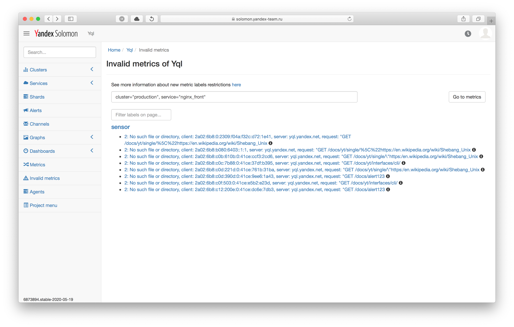

# Модель данных в {{ monitoring-name }}Solomon



Данные в сервисе {{ monitoring-full-name }} хранятся в виде [временных рядов](https://en.wikipedia.org/wiki/Time_series).

## Метрики {#metric}
_Метрика_ — это временной ряд, который показывает изменение какой-либо величины во времени. Например, состояние ресурса одного из сервисов {{ yandex-cloud }}: количество занятого места на диске, скорость передачи данных по сети и т. д.

Для идентификации метрик используются текстовые метки.

### Метки {#label}
_Метка_ — характеристика метрики в формате `ключ: "значение"`. Каждая метрика идентифицируется неупорядоченным набором меток. Обычно в качестве метки используется параметр, который принимает ограниченное множество значений. Например, код состояния HTTP, тип выполняющихся процедур в базе данных и т. д.

Метки бывают обязательные и дополнительные. Список обязательных меток:

- `cloudId` — [идентификатор облака](../../resource-manager/operations/cloud/get-id.md), в котором находится ресурс.
- `folderId` — идентификатор каталога, в котором находится ресурс.
- `service` — указывает на сервис {{ yandex-cloud }}, которому принадлежит ресурс. Например, `compute` или `managed-postgresql`.



При загрузке пользовательских метрик необходимо записать значение `custom` в метку `service`.



### Типы метрик {#metric-types}
В сервисе {{ monitoring-full-name }} есть следующие типы метрик:

Тип | Описание
----- | -----
`DGAUGE` | Числовой показатель (дробное число). Показывает значение метрики в определенный момент времени. Например, количество занятой оперативной памяти
`IGAUGE` | Числовой показатель (целое число). Показывает значение метрики в определенный момент времени.
`COUNTER` | Счетчик. Показывает значение метрики, которое растет со временем. Например, количество дней непрерывной работы сервиса.
`RATE` | Производная. Показывает изменение значения метрики во времени. Например, количество запросов в секунду

### Запросы {#queries}

{{ monitoring-full-name }} позволяет строить запросы для выборки набора метрик и отображения их на графике. В качестве значений меток могут использоваться шаблоны.

В сервисе {{ monitoring-full-name }} доступны следующие шаблоны:

Синтаксис | Описание
----- | -----
`label="*"` | Выводит все метрики с указанной меткой. Например, запрос `host="*"` выведет все метрики, у которых есть метка `host`.
`label="glob"` | Выводит все метрики, значение метки которого удовлетворяет [glob-выражению](https://ru.wikipedia.org/wiki/Шаблон_поиска)(https://en.wikipedia.org/wiki/Glob_(programming)):<br/><br/>`*` — любое количество символов (в том числе отсутствие). Например, `name="folder*"` выведет все метрики, у которых значение метки `name` начинается с префикса `folder`.<br/><br/>`?` — один произвольный символ. Например, `name="metric?"` выведет все метки, у которых есть в значении есть один символ после `metric`<br/><br/>`|` — все указанные варианты. Например, `name="metric1|metric2"` — две метрики, со значениями метки `metric1` и `metric2`.

#### См. также {#see-also}

- [{#T}](visualization/index.md)





## Определения {#definitions}

Базовым понятием системы Solomon является [временной ряд](https://ru.wikipedia.org/wiki/Временной_ряд) (time series) – упорядоченное множество значений какой-либо величины с указанием времени каждого измерения: `[(временная_метка_1, значение_1), (временная_метка_2, значение_2), ...]`. Временные ряды хранятся в долговременном хранилище системы Solomon, отображаются на графиках и дашбордах, а также являются результатом вычисления выражения на языке запросов Solomon.

Для идентификации временных рядов и их фильтрации по различным срезам в Solomon используются текстовые **метки** (labels). Меткой является пара строк в формате `<имя>=<значение>`. Метки описывают измерения (dimensions) пространства характеристик пользовательской системы. Например, если с помощью Solomon измеряется количество HTTP-запросов, обслуживаемых системой пользователя, то измерениями будут являться хост, обслуживающий запрос, тип HTTP-запроса, статус-код ответа, название вызываемого метода и так далее.

**Метрикой** (или сенсором) называется временной ряд и идентифицирующий его неупорядоченный список меток, записанный в фигурных скобках: `{<имя_метки_1>=<значение_метки_1>, <имя_метки_2>=<значение_метки_2>, ...}`. Все метки равнозначны между собой.



Как правило, одна из меток содержит имя (название) метрики, описывающее природу наблюдаемой величины: количество HTTP-запросов, счётчик ошибок и тому подобное. Обычно в качестве имени используются метка с именем `sensor`.

В следующих версиях Solomon планируется сделать имя метрики свойством отдельным от меток. Вместе с этим станет возможна идентификация метрик в формате `<имя метрики>{<имя_метки_1>=<значение_метки_1>, ...}`, который используется в таких система мониторинга как [Prometheus](https://prometheus.io/docs/concepts/data_model/) и [OpenTSDB](http://opentsdb.net/).



Проиллюстрируем использование меток для идентификации метрик на примере. Предположим, что пользовательское приложение передаёт в систему Solomon метрики с количеством выполняющихся HTTP-запросов к разным методам API этого приложения. Тогда идентификатор метрики, содержащей количество GET-запросов к API методу `/api/v2/projects` будет выглядеть следующим образом:

```js
{project="solomon", cluster="production", service="gateway", sensor="http.requests.count", host="solomon-kfront-man-00", method="GET", pattern="/api/v2/projects"}
```

У данной метрики есть следующие метки или измерения:
  * `project`, `cluster`, `service` — обязательные метки, идентифицирующие проект, кластер и сервис. 
  * `sensor` – метка с именем метрики.
  * `host` — метка с именем хоста, с которого получена метрика;
  * `method` – метка с типом выполняющего HTTP-запроса;
  * `pattern` – метка, содержащая путь до наблюдаемого API-метода.


## Ограничения на метки и их значения {#limits}

Для меток и их значений действуют следующие ограничения:

* метрика может иметь не более 16 меток, включая обязательные метки `project`, `cluster`, `service`;
* имя метки должно удовлетворять регулярному выражению `^[a-zA-Z][0-9a-zA-Z_.]{0,31}$`;
* значение метки должно удовлетворять регулярному выражению `^[ -!#-&(-)+->@-_a-{}-~]{1,200}$` (от 1 до 200 печатных ASCII-символов, кроме символов `` |*?"'\` ``) .

Код, проверяющий ограничения, доступен в Аркадии [в модуле arcadia/solomon/libs/cpp/labels](https://a.yandex-team.ru/arcadia/solomon/libs/cpp/labels).



Список метрик, не удовлетворяющий ограничениям, отображается в разделе *Invalid metrics* интерфейса [Admin UI](https://solomon.yandex-team.ru/admin)

{ width="1552" }

<small>Рисунок 1 — Раздел *Invalid metrics* в Admin UI.</small>



## Рекомендации по использованию меток {#best-practices}

Поскольку каждая уникальная комбинация имён и значений меток идентифицирует новый временной ряд, то неосторожное использование меток может существенно увеличить количество метрик, записываемых в Solomon и, как следствие, привести к быстрому исчерпанию квот.

Не рекомендуется использовать метки для сохранения параметров, которые могут варьироваться в широком (или потенциально неограниченном) диапазоне, например, IP-адрес или идентификатор процесса. Хороший пример использования меток — параметры, принимающие заранее известное ограниченное множество значений, например, код ответа HTTP, название стадии обработки запроса и тому подобное. Рекомендуемое количество различных значений меток — не более 10 000.

<!-- Подробнее читайте в разделе [Антипаттерны в организации метрик](../best-practices/antipatterns.md). -->

## Типы метрик {#metric-kinds}

Все метрики в Solomon помимо идентификатора имеют тип. Информация о типе метрики используется при записи и хранении метрик в долговременном хранилище, при визуализации метрик, при вычислении выражений на языке запросов Solomon, а также при вычислении [пред-агрегатов](./aggregation.md). Метрикам разных типов соответствуют разные базовые классы [клиентских библиотек Solomon](https://wiki.yandex-team.ru/solomon/libs/) для инструментирования кода пользовательских приложений. Типы метрик, доступные в Solomon перечислены ниже.

### DGAUGE {#dgauge} {#gauge}

Тип метрики `DGAUGE` (или `GAUGE`) предназначен для наблюдения мгновенного значения какой-либо вещественной величины. Например, текущего значения температуры в градусах или курса доллара к рублю.

### IGAUGE {#igauge}

Тип метрики `IGAUGE` предназначен для наблюдения мгновенного значения какой-либо целочисленной величины. Например, количество занятой оперативной памяти в байтах.

### COUNTER {#counter}

Тип метрики `COUNTER` предназначен для наблюдения [монотонно возрастающей](https://ru.wikipedia.org/wiki/Монотонная_функция) целочисленной величины, значение которой может только увеличиваться или быть сброшено в ноль. Например, количество секунд непрерывной работы пользовательского приложения с момента запуска или рестарта или количество ошибок, возникших в работе приложения с момента его запуска.



Следует быть осторожным при совместном использовании COUNTER-метрик и [агрегации](./aggregation.md). Не рекомендуется вычислять производную от суммы нескольких COUNTER-метрик, так как это может привести к отображению ложного пика на графике агрегата, в момент, когда один из хостов, передающих метрики, перезапускается и не передает значение метрики.

Для отображения производной от суммы нескольких метрик, рекомендуется сначала вычислить производные (например, используя RATE-метрики вместо COUNTER), а затем просуммировать их. Аналогичная рекомендация дается авторами [системы мониторинга Prometheus](https://www.robustperception.io/rate-then-sum-never-sum-then-rate).



### RATE {#rate}

Тип метрики `RATE` предназначен для наблюдения за величинами, которые по смыслу являются [производными](https://ru.wikipedia.org/wiki/Производная_(математика)). Для вычисления производной Solomon запоминает последнее полученное значение RATE-метрики. При получении очередного значения вычисляется разница между ним и предыдущим значением, после чего делится на интервал в секундах между временными метками этих значений.

Чаще всего RATE-метрики используются для сбора наблюдения за количеством запросов в секунду (RPS), которое обслуживает пользовательское приложение. Чтобы записать в Solomon RPS обслуживаемых запросов, пользовательское приложение должно передавать количество запросов, которое было обслужено с момента старта приложения. Тогда производная от этой величины покажет RPS к приложению в каждый момент времени.

Solomon вычисляет только положительные производные. Если очередное поступившее значение RATE-метрики меньше предыдущего и, таким образом, значение вычисленной производной будет отрицательным, то это значение не будет записано в Solomon, а на графике RATE-метрики в этот момент будет пропуск. Однако новое поступившее значение RATE-метрики, в отличие от производной, сохранится, и дельнейшие значения производной будут считаться от последнего полученного значения RATE-метрики. Таким образом, при рестарте приложения, не обязательно сохранять последнее значение RATE-метрики, если пропуск одного значения при старте приложения не критичен.



По определению вычисление производной требует двух значений метрики. Поэтому для RATE-метрики значения начнут записываться в Solomon только после передачи второго значения. Подробнее описано в Таблице 1.



В Таблице 1 приведен пример передаваемых и записываемых значений RATE-метрики, с учетом различных особенностей.

<small>Таблица 1 — Пример передаваемых и записываемых значений RATE-метрки.</small>

Временная метка | Переданное значение | Записанное значение (RPS) | Как вычисляется значение
:---------------|:------------------------------------------------------------- |:------------------------------------- |:------------------------
2020-07-08 10:37:30 | 5 | -- | Ничего, так как получено только первое значение
2020-07-08 10:37:45 | 5 | 0 | $\frac{5-5}{15}$
2020-07-08 10:38:00 | 10 | 0.333 | $\frac{10-5}{15}$
2020-07-08 10:38:15 | 15 | 0.333 | $\frac{15-10}{15}$
2020-07-08 10:38:30 | -- | -- |
2020-07-08 10:38:45 | 20 | -- | Ничего, так как `20 - NaN = NaN`
2020-07-08 10:39:00 | 25 | 0.333 | $\frac{25-20}{15}$
2020-07-08 10:39:15 | 30 | 0.333 | $\frac{30-25}{15}$
2020-07-08 10:39:30 | 29 | -- | Ничего, так как $29 - 30 < 0$

<!-- https://wiki.yandex-team.ru/solomon/userguide/rate/ -->



Тип метрики `RATE` поддерживается только в pull-режиме передачи метрик и **не поддерживается** в push-режиме. Для записи `RATE`-метрик при использовании push-режима передачи метрик рекомендуется вычислять производную на стороне клиентского приложения и записывать полученное значение как метрику типа [DGAUGE](#dgauge).



### HIST {#hist} {#histogram}

Тип метрики `HIST` предназначен для наблюдения за величинами, имеющими некоторое распределение. В качестве значения метрики используется мгновенное значение гистограммы, сэмплирующей выборку значений наблюдаемой величины по интервалам (бакетам).

Границы и количество интервалов настраиваются пользователем. Гистограмма описывается верхними (правыми) границами интервалов. Значение в каждом интервале (бакете) имеет тип `IGAUGE` и равно количеству элементов выборки, попавших в этот интервал. Максимальное количество интервалов — 50.

Пример HIST-метрики — распределение количества объектов по значению какой-либо характеристики. [Пример графика в Solomon](https://solomon.yandex-team.ru/?project=solomon&cluster=stockpile_sas&service=stockpile&l.host=cluster&l.sensor=stockpile.host.twoHours.snapshot.count&graph=auto).

### HIST_RATE {#hist_rate}



Тип метрики `HIST_RATE` поддерживается только в pull-режиме передачи метрик и **не поддерживается** в push-режиме. <!-- Подробнее в разделе [{#T}](./data-collection/overview.md). -->



Тип метрики `HIST_RATE` — является гистограммой, у которой значения бакетов в очередной точке будут вычислены как производная.

Значение каждого интервала имеет тип `RATE`. Максимальное количество интервалов — 50. Пример HIST_RATE-метрики — распределение времени обслуживания API-запросов пользовательским приложением. [Пример графика в Solomon](https://solomon.yandex-team.ru/?project=solomon&cluster=production&service=gateway&l.bin=*&l.host=cluster&l.method=POST&l.endpoint=%2Fapi%2Fv2%2Fpush&l.sensor=http.server.requests.elapsedTimeMs&graph=auto).

### DSUMMARY {#dusmmary} {#summary}



Тип метрики `DSUMMARY` находится в разработке и будет доступен в следующих версиях Solomon.



`DSUMMARY` – это метрика, содержащая набор статистик по наблюдаемой величине: сумма, среднее, максимальное и минимальные значения.

## Временные метки {#timestamps}

Все временные метки в Solomon хранятся в [UTC](https://ru.wikipedia.org/wiki/Всемирное_координированное_время) без указания на конкретную временную зону. При отображении графиков используется локальная временная зона, определенная в браузере пользователя. 

При передаче метрик в Solomon временные метки могут передаваться либо в формате [ISO 8601](https://ru.wikipedia.org/wiki/ISO_8601), либо в формате [Unix time](https://ru.wikipedia.org/wiki/Unix-время) (подробнее в разделе [{#T}](./data-collection/dataformat/json.md)).

Временные метки в Solomon указываются с точностью до одной секунды. Запись более точных значений — в миллисекундах, микросекундах или наносекундах — не поддерживается. Повторная передача значения какой-либо метрики с одной и той же временной меткой приведет либо к перезаписи значения метрики, либо к увеличению значения метрики на переданное значение, если метрика является агрегатом (подробнее в разделе [{#T}](./aggregation.md#aggregation-on-write)).

Допустимый диапазон значений для временных меток — между `2000-01-01T00:00:00Z` и `2038-01-19T03:14:07Z` включительно.



