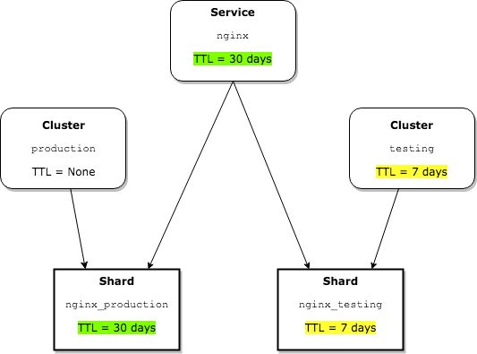
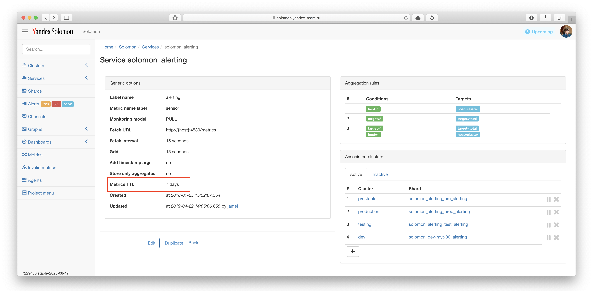
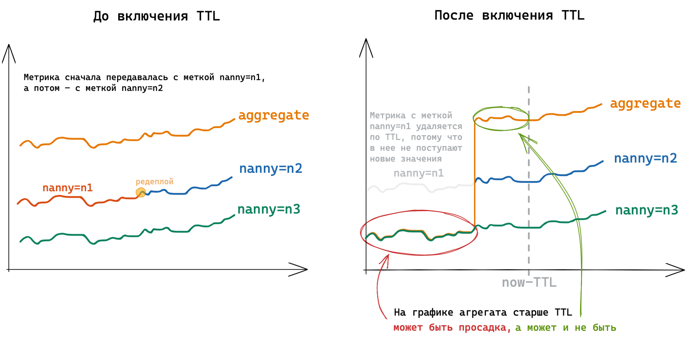

# Удаление устаревших метрик (TTL)

В данном разделе описан механизм работы автоматического удаления устаревших метрик.

Автоматическое удаление устаревших метрик полезно в следующих ситуациях:
* чтобы удалить тестовые данные, которые были отправлены во время настройки мониторинга;
* чтобы удалить метрики по неактуальным хостам, которые больше не подключены к мониторингу;
* чтобы автоматически удалять метрики по быстроустаревающим сущностям, которые не требуется хранить вечно: например, в ситуации, когда в метках используется версия пользовательской программы, которая передает метрики в Solomon.



Чтобы удалить метрики по определенному набору селекторов, [воспользуйтесь операцией удаления](./operation.md).



## Принцип работы {#how-it-works}

Устаревшими метриками считаются такие метрики, для которых не поступали новые значения дольше, чем время жизни (TTL). Раз в сутки для каждого [шарда](../glossary.md#shard) запускается фоновый процесс, который для всех метрик шарда сравнивает временную метку последней точки с временем устаревания равным `время запуска процесса удаления метрик - TTL в днях`. Метрики, у которых самая старшая временная метка из всех записанных точек меньше, чем время устаревания, удаляются из шарда.

Например, если процесс автоматического удаления устаревших метрик запустился 15 сентября в 10:00 UTC для шарда, у которого выставлен TTL в 7 дней, то из него будут удалены все метрики, у которых временная метка последней точки меньше, чем 8 сентября 10:00 UTC.



Устаревшие метрики, которые были автоматически удалены, не подлежат восстановлению.



Так как при принятии решения об удалении метрики проверяется самая старшая временная метка, то продолжающаяся запись новых точек с одним и тем же значением (например, 0) не приведет к удалению метрики. Запись значений метрики в прошлое не защитит метрику от удаления, если при очередном запуске процесса последняя временная метка окажется меньше времени устаревания.



Если в шарде настроен TTL, следует с осторожностью проводить изменения схемы именования метрик. Поскольку для старых метрик с прежними метками перестают поступать новые значения, то они будут удалены спустя `TTL` дней. Если при переименовании метрик важно сохранить историю, свяжитесь с командой Solomon и попросите заархивировать данные.



## Настройки TTL {#enable}



Для проектов Solomon по умолчанию TTL выключен и устаревшие метрики не удаляются. Для проектов YASM включен TTL в 30 дней для хостовых метрик. Устаревшие групповые метрики (агрегаты) YASM по умолчанию не удаляются. Подробнее в разделе [{#T}](#yasm-ttl).



Настройки TTL у разных объектов конфигурации Solomon переопределяют друг друга в следующем порядке (от менее строгих к более строгим):
* сервис;
* кластер;
* шард.

Пусть в каком-то проекте Solomon существует сервис `nginx` с TTL в 30 дней. Если в кластере `production`, подключенному к этому сервису, не указывать TTL, он будет взят из настроек сервиса — 30 дней, а если в кластере `testing` задать TTL в 7 дней, то настройка переопределяется.

<small>Рисунок 1 — Порядок переопределения настроек TTL между сервисами, кластерами и шардами.</small>

Чтобы настроить TTL, откройте интерфейс [Admin UI](https://solomon.yandex-team.ru/admin), перейдите на страницу сервиса, кластера или шарда и укажите необходимое значение в параметре Metrics TTL.

<small>Рисунок 2 — Настройки TTL на странице сервиса.</small>



После первого выставления настройки TTL для шарда автоматическое удаление запускается в течение 10 минут.



## Особенности работы TTL для данных YASM {#yasm-ttl}

Для групповых метрик (агрегатов) YASM TTL выключен. Его включение может привести к побочным эффектам, суть которых изображена на Рисунке 3. Из-за особенностей устройства YASM ситуация, изображенная на Рисунке 3, может возникнуть в любой момент времени: как при явном действии пользователя (редеплой сервиса, изменение имен хостов) так и без участия пользователя (переезд пода с одного железного хоста RTC на другой).

Таким образом, после включения TTL нельзя будет рассчитывать что исторические данные старше TTL показывают корректные данные. Поэтому TTL для групповых данных YASM включать нельзя.

{ width="1552"}

<small>Рисунок 3 — Работа TTL для данных YASM.</small>
