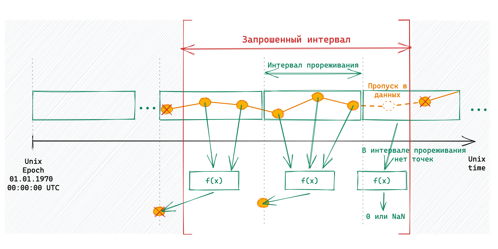

# Прореживание при чтении данных

Значения метрик могут поступать в Solomon с большой частотой: по умолчанию новые значения поступают каждые 15 секунд, а в пределе — каждую секунду.

Если на графике (или в запросе к Solomon API) запрошен достаточно широкий временной интервал, из хранилища Solomon потребуется прочитать большой объем данных, что может привести к нескольким проблемам. Либо такой запрос не сможет выполниться за отведенное время (сработают таймауты или другие лимиты), либо такой объем данных будет будет невозможно отобразить на графике: для этого потребуется больше точек, чем есть пикселей на экране монитора.

Чтобы решить эти проблемы, Solomon выполняет прореживание данных при чтении данных из хранилища.

## Описание механизма прореживания {#downsampling}

_Прореживание_ — это механизм, который при помощи заданной функции агрегации `f(x)` уменьшает количество точек, которые вернет Solomon при чтении данных, а также выравнивает временные метки возвращаемых точек по определенной сетке.

Прореживание работает следующим образом:
1. На основе запрошенного временного интервала и настроек прореживания вычисляется _интервал прореживания_.
2. Время от начала до конца запрашиваемого интервала разбивается на последовательные непересекающиеся «окна» размером с _интервал прореживания_. Начало каждого интервала выбирается согласованно с началом [«эпохи UNIX»](https://ru.wikipedia.org/wiki/Unix-время).
3. К значениям метрики, попавшим в каждое окно, применяется функция агрегации `f(x)` (например, среднее значение за интервал прореживания) в результате чего получается прореженное значение. Отсутствие любых значений метрики в интервале прореживания трактуется в зависимости от настроек заполнение отсутствующих значений. Подробнее см. далее в разделе [{#T}](#fill-option).
4. В качестве временной метки прореженного значения используется начало окна, в котором оно вычислено. Если эта временная метка находится вне запрошенного интервала, то это прореженное значение будет отброшено.

Иллюстрация работы прореживания при чтении приведена на рисунке 1.

{ width="800" }
<small>Рисунок 1 — Иллюстрация работы прореживания.</small>


## Режимы прореживания при чтении данных {#downsampling-methods}

### Автоматическое прореживание {#auto-downsampling}

По умолчанию в Solomon используется режим автоматического прореживания. В этом случае в качестве интервала прореживания выбирается такой временной интервал, чтобы значения в нем встречались не чаще, чем одно на два пикселя монитора. Пример работы автоматического прореживания приведен на рисунке 2.

{ width="800" }
<small>Рисунок 2 — Пример автоматического прореживания интервала в 30 дней для метрики с точками каждые 15 секунд.</small>


### Прореживание по временному интервалу {#downsampling-by-interval}

В режиме прореживания по временном интервалу пользователь указывает _размер интервала прореживания_, например, 1 минута, 3 часа или 1 день.



Так как начало каждого интервала выбирается согласованно с началом [«эпохи UNIX»](https://ru.wikipedia.org/wiki/Unix-время), которая началась в 00:00 UTC (см. также раздел [{#T}](#downsampling)), то прореживание по временному интервалу не подходит для агрегации метрик по календарным дням. 

Например, для московской временной зоны, прореживание по временному интервалу в 1 день приведет к агрегации в окнах от 03:00 часов до 03:00 часов по Москве, что отличается от календарных суток.



### Прореживание по количеству точек {#downsampling-by points}

В режиме прореживания по количеству точек пользователь указывает максимальное количество точек, которое получится в результате прореживания. Интервал прореживания подбирается таким образом, чтобы в результате прореживания вернулось не больше точек, чем указано.

### Отключение прореживания {#disable-downsampling}

Для просмотра исходных значений метрики в том виде, в котором они были записанны в хранилище Solomon (без прореживания и других преобразований), прореживание можно отключить. 



Отключить прореживание можно только для временных диапазонов до 7 дней включительно. При этом даже на диапазонах менее 7 дней запрос с отключенным прореживанием может не выполнится из-за лимита на объем прочитанных данных в одном запросе (100 МБ).



## Функции агрегации для прореживания при чтении данных {#downsampling-functions}

В качестве функции агрегации для вычисления прореженных значений поддерживаются следующие функции:
- По умолчанию (`DEFAULT`) в качестве функции агрегации 
    * для данных, записанных в Solomon – используется среднее значение;
    * для данных, записанных в YASM – используется функция в соответствии [с четвертой буквой в суффиксе сигнала](https://wiki.yandex-team.ru/golovan/userdocs/aggregation-types/).
- Среднее (`AVG`) - среднее значение за интервал. Отсутствие значений (`NaN`) трактуется как `NaN`.
- Максимальное (`MAX`) - максимальное значение за интервал прореживания. Отсутствие значений (`NaN`) трактуется как `NaN`.
- Минимальное (`MIN`) - минимальное значение за интервал прореживания. Отсутствие значений (`NaN`) трактуется как `NaN`.
- Последнее (`LAST`)- последние значение в интервале прореживания. Отсутствие значений (`NaN`) трактуется как `NaN`.
- Сумма (`SUM`) — суммарное значение за интервал прореживания. Отсутствие значений (`NaN`) трактуется как 0.
- Количество (`COUNT`) — количество значений в интервале прореживания. Отсутствие значений (`NaN`) трактуется как 0.

## Заполнение отсутствующих значений {#fill-option}

Если в очередном окне прореживания у метрики отсутствуют любые значения, 

* По умолчанию (`DEFAULT`) для заполнения отсутствующих значений используется Null-значение.
* Null-значение (`NULL`) — в качестве временной метки прореженного значения вернется начало очередного интервала прореживания, а в качестве значения — `null`.
* Предыдущее значение (`PREVIOUS`) — в качестве временной метки прореженного значения вернется начало очередного интервала прореживания, а в качестве значения — прореженное значение предыдущего интервала.
* Без значения (`NONE`) – интервал прореживания пропускается.

<!-- See also: https://st.yandex-team.ru/MONITORING-2393#5f5a52e882abf505ed91f89c -->

## Настройки прореживания при чтении данных{#downsampling-settings}



- Monitoring UI

    Чтобы задать настройки прореживания в Monitoring UI:
    1. На странице графика перейдите на вкладку _Прореживание_.
    2. В параметре _Метод_ выберите метод прореживания: автоматический, по временному интервалу, по количеству точек или отсутствие прореживания.
    3. В параметре _Агрегация_ выберите функцию агрегации, которая будет использована при вычислении прореживания значений.
    4. В параметре _Заполнение_ выберите способ заполнения отсутствующих значений.

    

- Solomon UI

  Чтобы задать настройки прореживания в Solomon UI:
  1. На странице графика нажмите кнопку _Configure_ в левом верхнем углу.
  2. В параметре _Downsampling_ выберите метод прореживания: автоматический, по временному интервалу, по количеству точек или отсутствие прореживания.
  3. В параметре _Aggregation function use for downsampling_ выберите функцию агрегации, которая будет использована при вычислении прореженных значений.
  4. В параметре _Fill option_ выберите способ заполнения отсутствующих значений.

    

- API
  
  Чтобы задать настройки прореживания в запросе к [Solomon API](../api-ref/rest.md) для выгрузки значений метрик (метод `/api/v2/projects/{projectId}/sensors/data`) укажите следующие параметры в поле `downsampling`тела запроса:

  ```json
  "downsampling": {
    "aggregation": "MAX",       // функция агрегации
    "disabled": true,           // отключить прореживание
    "fill": "PREVIOUS",         // заполнение отсутствующих значений
    "gridMillis": 3600000,      // интервал прореживания в миллисекундах
    "maxPoints": 500            // максимальное количество точек для каждой метрики
    }
  ```




## Сглаживание пиков из-за прореживания {#downsampling-smoothes-spikes}

Так как по умолчанию для прореживания используется среднее значение, прореживание приводит к сглаживанию редких пиков или провалов на графиках метрик. Пример такого сглаживания приведен на рисунке 3. 



Чтобы пики или провалы не сглаживались, используйте в настройках прореживания в качестве функции агрегации максимальное или минимальное значение соответственно. Такое прореживание будет корректно работать на интервалах меньших, чем интервал прореживания исторических данных. См. также следующий раздел.



{ width="500" }
<small>Рисунок 3 — Сглаживание пиков при прореживании.</small>




## Особенности совместной работы прореживания при чтении данных и прореживания исторических данных {#downsampling-with-decimation}

Если в настройках прореживания в качестве функции агрегации используется суммарное значение, а запрашиваемый интервал больше, чем 7 дней (интервал [прореживания исторических данных](decimation.md) по умолчанию), на графиках может возникнуть «ступенька».



Вместо функции агрегации «суммарное значение» рекомендуется пользоваться функцией [integrate](./querying.md#integrate) из языка запросов.



«Ступенька» возникает из-за того, что прореживание исторических данных уменьшает количество хранимых значений для метрики. Например, если при отображении графика в качестве функции прореживания выбрано суммарное значение, то на интервале больше 7 дней суммируется меньше точек, чем на «свежих» данных за последние 7 дней. Пример такой ситуации изображен на рисунке 4.



В будущих версиях Solomon планируется при прореживании исторических данных сохранять не только среднее значение метрики, но и другие статистики — суммарное значение, минимум или максимум. Это позволит использовать отображать исторические данные в соответствии с выбранной функцией прореживания . Смотри также тикет [SOLOMON-6947](https://st.yandex-team.ru/SOLOMON-6947).



{ width="500" }
<small>Рисунок 4 — «Ступенька» на границе прореживания исторических данных.</small>


