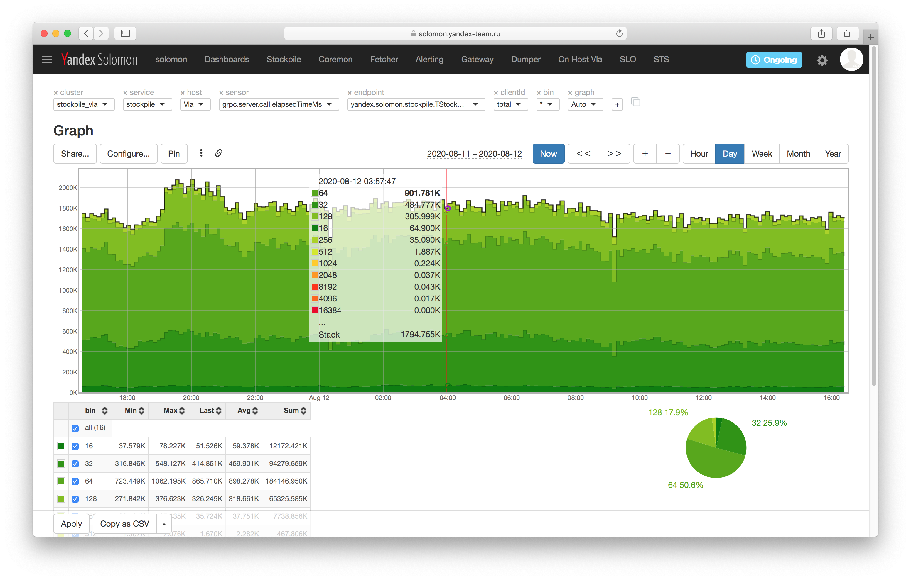
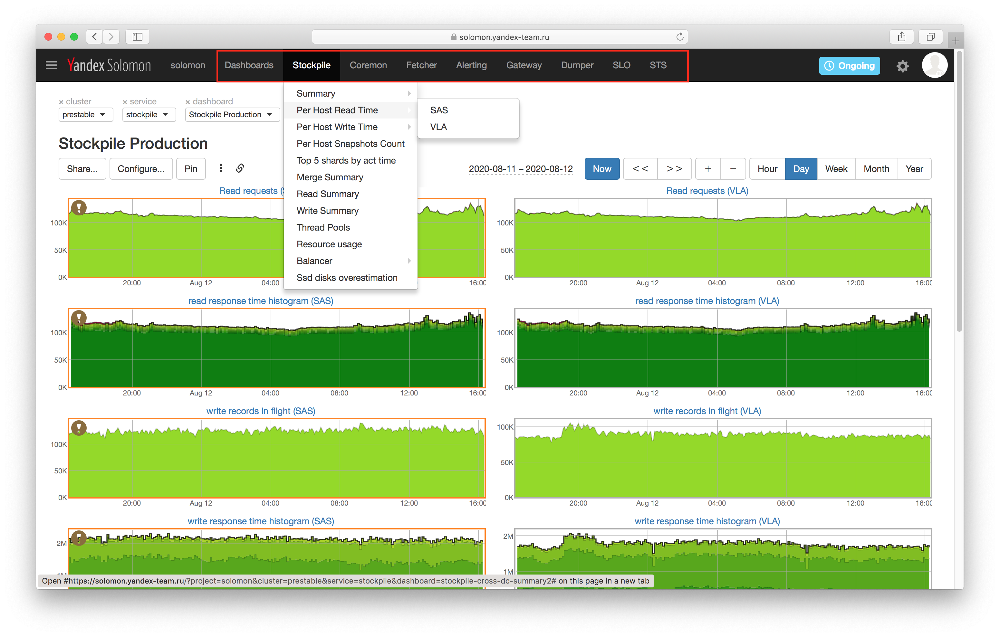

# Глоссарий

В данном разделе описаны термины и определения, использующиеся в документации.

## Авто-график (Auto graph) {#auto-graph}

*Авто-график* (Auto graph) — [график](#graph) метрик, который не сохранен как самостятельный объект (смотри [{#T}](#saved-graph)) и доступный только по URL.

## Алерт (Alert) {#alert}

*Алерт* (Alert) — объект конфигурации Solomon, периодически вычисляемая функция над [метриками](#metric), например, сравнивающая значение метрики с порогом, или вычисляющая выражение на [языке запросов](#query-language). Уведомления о переходе алерта в определенный статус отправляются через *[каналы уведомлений](#notification-channel)*, например, через Email, SMS, Telegram или Juggler. Подробнее в разделе [{#T}](alerting/index.md#alerts).

## Агрегат {#aggregate}

*Агрегат* (или пред-агрегат) — метрика, вычисляемая на стороне Solomon в момент записи пользовательских метрик, согласно *правилу агрегации*. Например, пользовательское приложение, запущенное на разных хостах, передает одну метрику, а Solomon вычисляет сумму этой метрики по всем хостам и записывает в новую метрику, называемую *агрегатом*.

Подробнее в разделе [{#T}](aggregation.md#aggregation-on-write).

## Аннотация (Annotation) {#annotation}

*Аннотация* (Annotation) — дополнительная метаинформация по алерту, которую можно использовать в шаблонах уведомлений. Подробнее в разделах [{#T}](alerting/index.md#annotations) и [{#T}](alerting/index.md#templates).

## Бакет (Bucket) {#bucket}

*Бакет (Bucket)* — смотри *[{#T}](#histogram)*.

## Временной ряд (Timeseries) {#timeseries}

*Временной ряд* (Timeseries) — упорядоченное по времени множество значений какой-либо величины с указанием времени каждого измерения: `[(временная_метка_1, значение_1), (временная_метка_2, значение_2), ...]`. Подробнее в разделе [{#T}](data-model.md).

## График {#graph}

*График* — это:

1. визуализация набора [метрик](#metric) в виде [авто-графика](#auto-graph) или [конфигурируемого графика](#saved-graph);
1. элемент [дашборда](#dashboard).

## Гистограмма {#histogram}

*Гистограмма* — метрика (или набор метрик), использующаяся для мониторинга величин, имеющих распределение (например, время ответа сервиса). Значение гистограмной метрики в каждой временной точке показывает распределение наблюдаемой величины по *интервалам* (или *бакетам*).

Гистограммы в Solomon описываются *правыми* границами интервалов. Например, набор границ `[100, 200, 300, 400, 500, inf]` описывает гистограмму со следующими интервалами:
* `(-inf, 100]`;
* `(100, 200]`;
* `(200, 300]`;
* `(300, 400]`;
* `(400, 500]`;
* `(500, inf)`.

Как правило, гистограмма визуализируется в виде графика «Область с накоплением» (Area/Stack) и цветовой схемой «градиент», как показано на рисунке 1. Значение каждой линии на графике для каждого момента времени показывает сколько значений наблюдаемой величины попало в соответствующий интервал гистограммы.

{ width="1552" }
<small>Рисунок 1 — Пример визуализации гистограммы в виде графика.</small>

## Дашборд (Dasboard) {#dashboard}

*Дашборд* (Dasboard) — объект конфигурации Solomon, содержащий набор [графиков](#graph) и настройки их отображения.

## Интервал гистограммы {#hist-interval}

*Интервал гистограммы* — смотри *[{#T}](#histogram)*.

## Канал уведомлений (Notification channel) {#notification-channel}

*Канал уведомлений* (Notification channel) — объект конфигурации Solomon, определяет получателя, транспорт и содержимое уведомлений о переходе [алерта](#alert) в определенный статус. Подробнее в разделе [{#T}](alerting/index.md#channels).

## Кластер (Cluster) {#cluster}

*Кластер (Cluster)* — объект конфигурации Solomon, определяющий множество хостов, которые Solomon будет опрашивать для сбора метрик при использовании pull-режима передачи метрик. <!--[](../data-collection/overview.md#pull).-->

Как правило, кластер соответствует окружению (инсталляции) клиентского приложения, которое передаёт метрики, — например, production-кластер или тестовый кластер.

## Конфигурируемый (сохраненный) график {#saved-graph}

*Конфигурируемый (сохраненный) график* — объект конфигурации Solomon, содержащий указание на то какие метрики визуализируются на [графике](#graph), а также настройки их отображения.

## Меню проекта {#project-menu} {#menu}

*Меню проекта* — набор ссылок, который отображается в веб-интерфейсе Solomon для каждого проекта. Меню настраивается пользователями проекта через веб-интерфейс или API.

{ width="1552" }
<small>Рисунок 2 — Меню проекта.</small>

## Метка (Label) {#label}

*Метка* (Label) — пара строк в формате `<имя>="<значение>"`, например, `host="solomon-kfront-man-00"` или `code="200"`. Метки описывают различные срезы, по котором необходимо визуализировать метрики, передаваемые в Solomon. Набор меток идентифицирует [метрику](#metric). Подробнее в разделе [{#T}](data-model.md).

## Метрика {#metric}

*Метрика* (Metric) — [временной ряд](#timeseries) и идентифицирующий его набор [меток](#label), записанный в фигурный скобках.

Например, следующий набор меток идентифицирует временной ряд в проекте `solomon`, который показывает изменение во времени количества GET-запросов, обслуживаемых хостом `solomon-kfront-man-00`:

```js
{project="solomon", cluster="production", service="gateway", sensor="http.requests.count", host="solomon-kfront-man-00", method="GET
```

Подробнее в разделе [{#T}](data-model.md).

## Мульти-алерт (Multi-alert) {#multi-alert}

*Мульти-алерт* (Multi-alert) — набор алертов, сгруппированный по одной или нескольким меткам наблюдаемых метрик. Подробнее в разделе [{#T}](alerting/index.md#multi-alerts).

## Параметр дашборда {#dashboard-param}

*Параметры дашборда* позволяют создавать интерактивные дашборды, содержание которых изменяется в зависимости от выбора пользователя. Например, дашборд, показывающий сводную информацию о состоянии виртуальной машины, можно параметризовать идентификатором виртуальной машины.

## Под-алерт (Sub-alert) {#sub-alert}

*Под-алерт* (Sub-alert) — один из алертов [мульти-алерта](#multi-alert), рассчитываемый для каждого конкретного значения метки или всех их возможных сочетаний, если настроена группировка по нескольким меткам. Подробнее в разделе [{#T}](alerting/index.md#multi-alerts).

## Правило агрегации {#aggregation-rule}

*Правило агрегации* — смотри *[{#T}](#aggregate)*.

## Пред-агрегат {#pre-agregate}

*Пред-агрегат* — смотри *[{#T}](#aggregate)*.

## Проект (Project) {#project}

*Проект* (Project) — объект конфигурации Solomon, предназначенный для логического разделения данных и объектов конфигурации между разными ABC-сервисами и пользователями Solomon. Один пользователь, как и один ABC-сервис, может использовать несколько проектов для удобной организации своих данных.

## Прореживание {#downsampling} {#retention} {#decimation}

1. *Прореживание* — механизм, ограничивающий количество отображаемых точек на [графике](#graph). Подробнее в разделе [{#T}](downsampling.md).

1. *Прореживание* — механизм архивирования исторических данных в Solomon. Для уменьшения объема хранимых исторических данных значения всех метрик, записываемых в Solomon, спустя определенное время агрегируются по некоторой сетке. По умолчанию спустя неделю значения метрик усредняются по сетке в 5 минут. Подробнее в разделе [{#T}](decimation.md).


## Сетка (Grid) {#grid}

*Сетка* (Grid) — параметр [сервиса](#service) и [шарда](#shard), указывающий гранулярность (интервал между временными метками) метрик, поступающих в Solomon.

Временные метки записываемых точек округляются по сетке. Например, для сетки в 15 секунд, временная метка `14:01:33` будет записана как `14:01:30`. Интервал, с которым отображаются точки на графиках (смотри *[{#T}](#downsampling)*), выбирается кратным сетке.

Подробнее в разделе [{#T}](grid.md)

## Селектор (Selector) {#selector}

*Селектор* (Selector) — фильтр множества значений [меток](#label). Селекторы используются для описания множества значений метрик, которые будут отображаться на [графике](#graph) или использоваться в [алерте](#alert). Подробнее в разделе [{#T}](querying.md#selectors).

## Сенсор (Sensor) {#sensor}

*Сенсор* (Sensor) — смотри *[{#T}](#metric)*.

## Сервис (Service) {#service}

*Сервис (Service)* — объект конфигурации Solomon, определяет способ передачи данных в Solomon — Pull или Push.

Как правило, сервис соответствует клиентскому приложению, которое передаёт метрики: веб-сервер, база данных, или другой компонент.

## Светофорная панель {#traffic-lights}

*Светофорная панель* — визуализация [алерта](#alert) или [мульти-алерта](#multi-alert) в виде набора цветных панелей (плиток). Цвет панели кодирует статус алерта, как сигнал светофора (все хорошо, внимание, ошибка), а текст на плитке содержит идентификатор алерта или его [аннотации](#annotation).

## Шард (Shard) {#shard}

*Шард* — объект конфигурации Solomon, которому принадлежат метрики, собирающиеся из конкретной пары [сервиса](#service) и [кластера](#cluster), а также ряд настроек хранения этих метрик: [TTL](#ttl), политика [прореживания](#retention) и другие.

## Язык запросов (Expression Language) {#query-language}

*Язык запросов* (Expression Language или просто Expression) — способ описать вычисления и преобразования метрик при настройке графиков и алертов, а также для выгрузки данных через API. Подробнее в разделе [{#T}](querying.md).

## Expression

*Expression* — смотри *[{#T}](#query-language)*.

## memonly-метрика {#memonly}

*memonly-метрика* — метрика, использующаяся только для вычисления [агрегатов](#aggregate) и не сохраняющаяся в хранилище Solomon. Подробнее в разделе [{#T}](aggregation.md#store-only-aggregates).

## Solomon Agent {#solomon-agent}

*Solomon Agent* — программа для сбора, хранения, преобразования и доставки метрик в Solomon. Предоставлялась как основной агент для поставки метрик до появления Unified Agent. Подробнее в разделе [{#T}](./data-collection/agents/solomon-agent.md).

## sysmond {#sysmond}

*sysmond* — агент (программа-демон), предназначен для сбора базовых системных метрик хоста или porto-контейнера. Не требует конфигурации. Подробнее в разделе [{#T}](./data-collection/agents/sysmond/overview.md).

## TTL

*TTL* — механизм автоматического удаления устаревших метрик, в которые не поступали новые значения в течение определенного времени.

Например, TTL равный 7 дням означает, что метрики, у которых временная метка последней точки находится в прошлом больше, чем на 7 дней, будут автоматически удалены.

Подробнее в разделе [{#T}](./deletion/ttl.md)

## Unified Agent {#unified-agent}

*Unified Agent* — программа для сбора, хранения, преобразования и доставки метрик в Solomon. Также поддерживает работу с логами. Является рекомендуемым агентом для поставки метрик, заменяя собой [Solomon agent](#solomon-agent). Подробнее в разделе [{#T}](./data-collection/agents/unified-agent.md).
