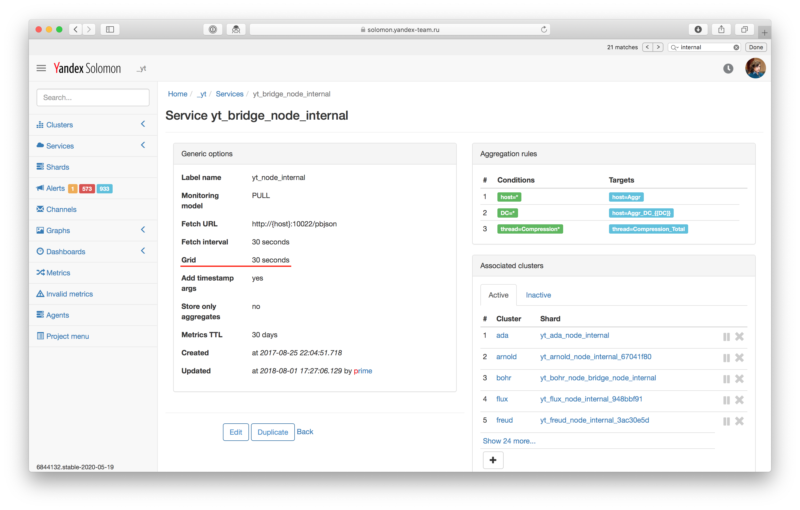

# Сетка



Сетка является экспериментальной функциональностью Solomon и по умолчанию выключена для всех проектов. Чтобы включить сетку в своем проекте, [свяжитесь с командой Solomon](../problems/howtoreport.md).



**Сетка** (Grid) — это параметр solomon-сервиса, указывающий интервал в секундах, по которому будут округлены влево временны́е метки данных, поступающе в мониторинг.

Например, если точки были получены с временны́ми метками `14:01:33, 14:01:45, 14:02:01`, а сетка выставлена в 15 секунд, то в хранилище значения метрик будут записаны с метками `14:01:30, 14:01:45, 14:02:00`.

<small>Рисунок 1 — Параметр *Grid* в настройках сервиса.</small>

Если сетка не указана (или указано значение 0 секунд), в качестве сетки используется значение параметра **Fetch interval**.

Значение сетки должно быть согласовано с интервалом прореживания исторических данных, который равняется 300 секундам: значение параметра *Grid* должно быть либо делителем 300, либо кратным 300.

Такое требование налагается для того, чтобы избежать артефактов при отображении графиков за период больше двух недель от текущего момента (момент, когда начинается [прореживание исторических данных](../concepts/decimation.md)). Если сетка и интервал прореживания будут несогласованы, то в каждый 300-секундный интервал прореживания попадет разное количество исходных «сырых» точек.

Сетка может принимать значения 1, 5, 10, 15, 30, 60 секунд (делители числа 300) и не может — значения 7, 23, 42 секунд.

В случае, когда требуется сохранить оригинальные временны́е метки, укажите значение параметра Grid равное 1 секунде, так как это минимальное разрешение точек с которыми работает Solomon.

Исторические данные, записанные в проект до включения сетки, дополнительно не выравниваются, так как через две недели из-за прореживания исторических данных все точки будут приведены к сетке в 300 секунд.
