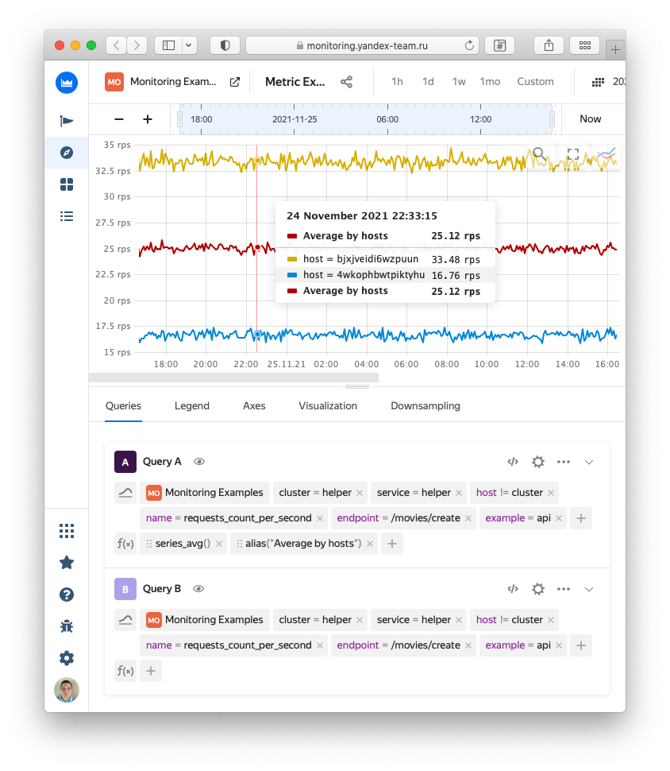
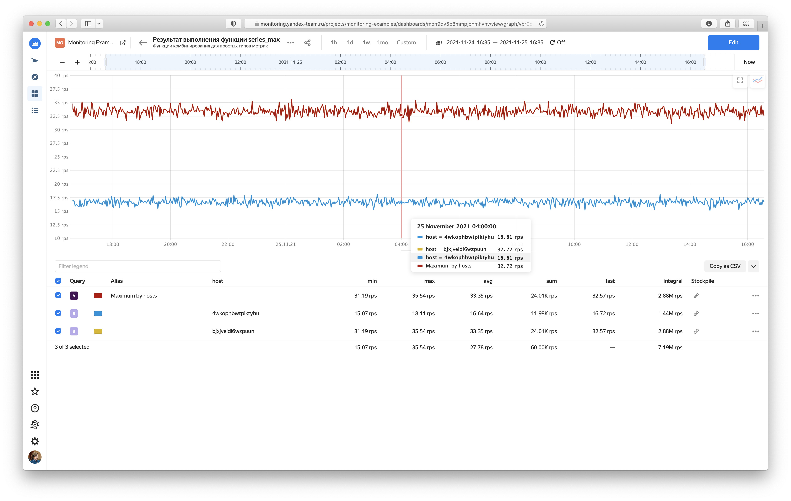
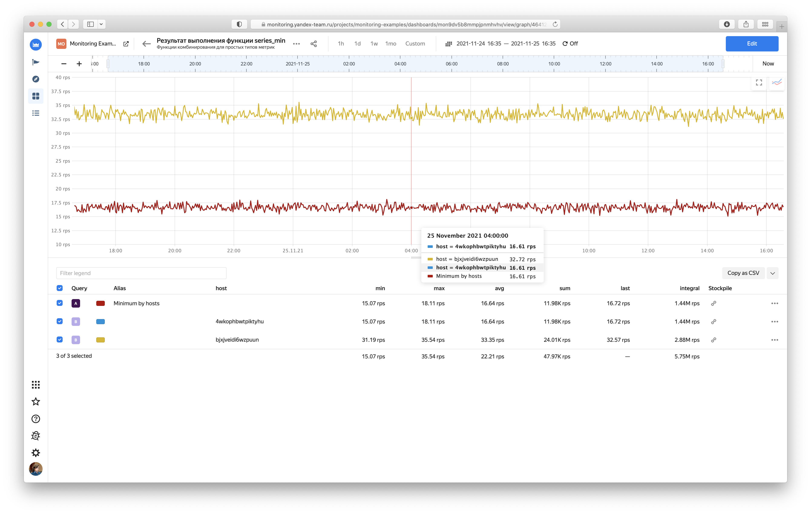
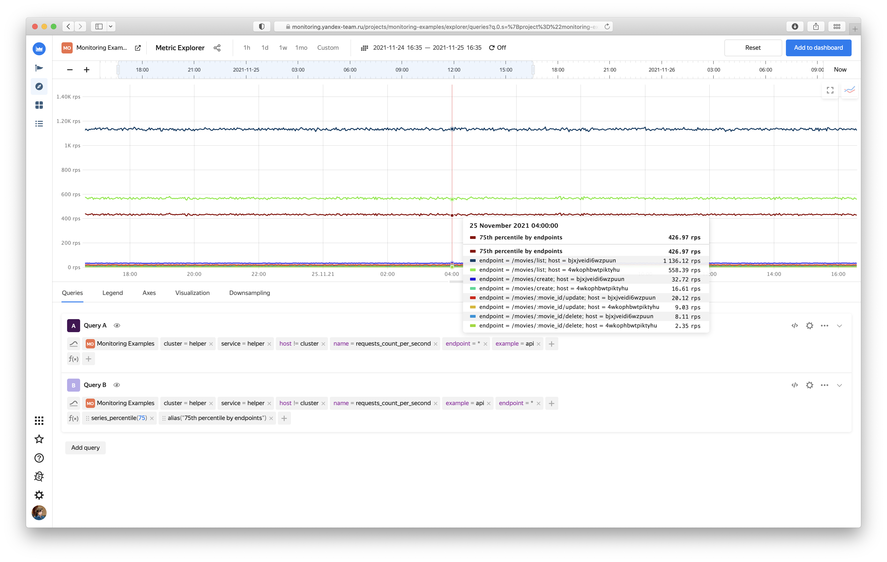
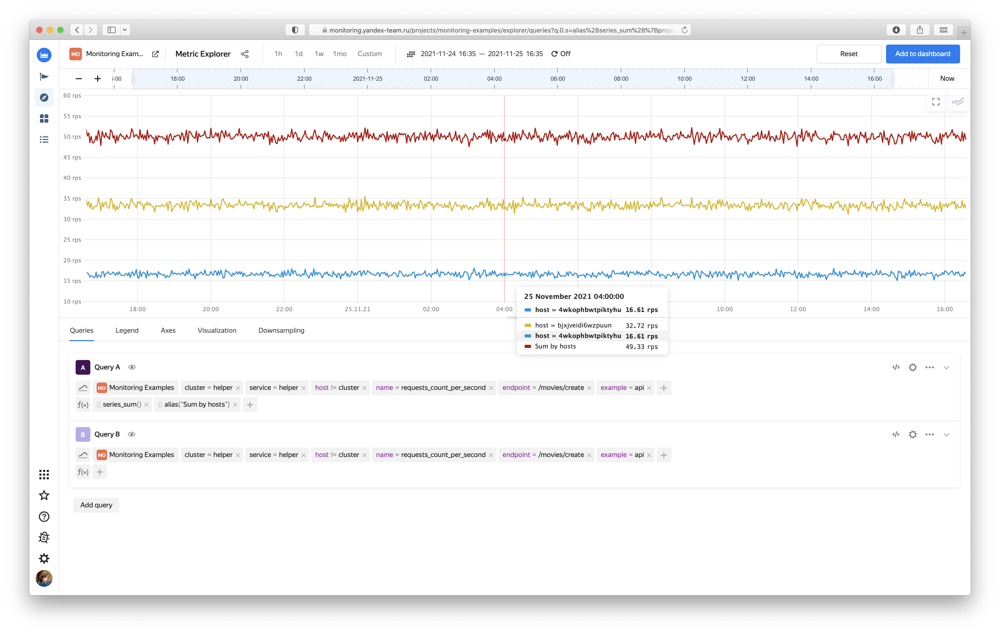
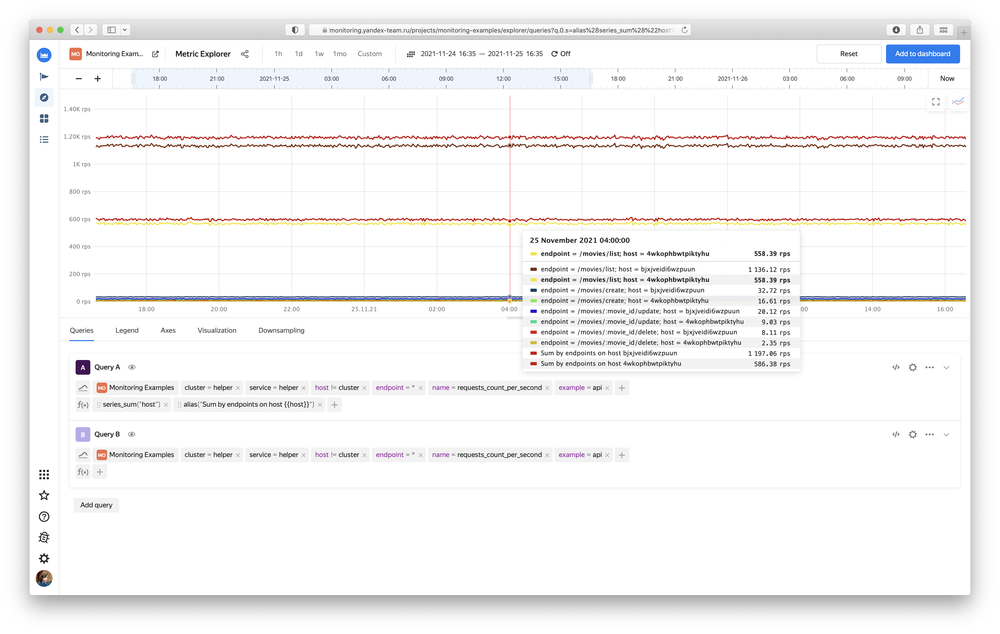

# Язык запросов в {{ monitoring-name }}



В этом разделе описан язык запросов {{monitoring-full-name}}. Он используется для преобразования метрик при настройке [дашбордов](./visualization/dashboard.md) и [алертов](./alerting.md), а также в API-методе [MetricsData.read](../api-ref/MetricsData/read.md).


## Загрузка метрик {#selectors}

Выбирайте множество метрик с помощью имени метрик и набора _селекторов_, фильтрующих значения меток (подробнее в разделе [{#T}](./data-model.md#label)). Получившиеся наборы метрик можно использовать в алертах или передавать в функцию в качестве аргумента.

> Укажите имя метрики, а также обязательные метки `folderId` и `service`. Тогда запрос `cpu_usage{folderId="zoeu2rgjpqakq377q1h6", service="compute"}` вернет метрики с именем `cpu_usage` для всех виртуальных машин сервиса {{compute-full-name}} в каталоге с идентификатором `zoeu2rgjpqakq377q1h6`.

_Селектор_ состоит из имени метки, оператора и выражения, описывающего множество значений меток.

В языке запросов {{monitoring-full-name}} поддерживаются следующие выражения для фильтрации значений меток:

- `label="*"` — возвращает все метрики, у которых присутствует указанная метка.

  > Селектор `host="*"` вернет все метрики, у которых есть метка `host`.

- `label="<glob>"` — возвращает все метрики, у которых есть метки, значения которых удовлетворяют [glob-выражению](https://ru.wikipedia.org/wiki/Шаблон_поиска)(https://en.wikipedia.org/wiki/Glob_(programming)).
  - `*` — любое количество символов (в том числе отсутствие).

    > `name="folder*"` вернет все метрики, у которых значение метки `name` начинается с префикса `folder`.

  - `?` — один произвольный символ.

    > `name="metric?"` вернет все метки, у которых в значении метки `name` есть один символ после `metric`.

  - `|` — все указанные варианты.

    > `name="metric1|metric2"` вернет две метрики со значениями метки `name=metric1` и `name=metric2`.


## Типы данных {#data-types}
В языке запросов {{monitoring-full-name}} существуют следующие типы данных:

* _timeseries_vector_ — набор временных рядов (метрик).
* _number_ — вещественное число;
* _string_ — строка в одинарных или двойных кавычках;
* _duration_ — временной промежуток в формате `15s, 10m, 3h, 7d, 2w.` (записывается без кавычек);

## Функции {#functions}

- [Комбинирование](#combine-functions)
  - [histogram_avg](#histogram_avg)
  - [histogram_cdfp](#histogram_cdfp)
  - [histogram_count](#histogram_count)
  - [histogram_percentile](#histogram_percentile)
  - [histogram_sum](#histogram_sum)
  - [series_avg](#series_avg)
  - [series_max](#series_max)
  - [series_min](#series_min)
  - [series_percentile](#series_percentile)
  - [series_sum](#series_sum)
- [Ранжирование](#rank-functions)
  - [bottom_avg](#bottom_avg)
  - [bottom_count](#bottom_count)
  - [bottom_last](#bottom_last)
  - [bottom_max](#bottom_max)
  - [bottom_min](#bottom_min)
  - [bottom_sum](#bottom_sum)
  - [top_avg](#top_avg)
  - [top_count](#top_count)
  - [top_last](#top_last)
  - [top_max](#top_max)
  - [top_min](#top_min)
  - [top_sum](#top_sum)
- [Преобразование](#transform-functions)
  - [abs](#abs)
  - [asap](#asap)
  - [ceil](#ceil)
  - [derivative](#derivative)
  - [diff](#diff)
  - [drop_above](#drop_above)
  - [drop_below](#drop_below)
  - [drop_nan](#drop_nan)
  - [exp](#exp)
  - [floor](#floor)
  - [fract](#fract)
  - [heaviside](#heaviside)
  - [integral](#integral)
  - [log](#log)
  - [moving_avg](#moving_avg)
  - [moving_percentile](#moving_percentile)
  - [non_negative_derivative](#non_negative_derivative)
  - [pow](#pow)
  - [ramp](#ramp)
  - [replace_nan](#replace_nan)
  - [round](#round)
  - [shift](#shift)
  - [sign](#sign)
  - [sqrt](#sqrt)
  - [trunc](#trunc)
- [Другое](#other-functions)
  - [alias](#alias)
  - [drop_empty_series](#drop_empty_series)

### Комбинирование {#combine-functions}

Функции комбинирования агрегируют вектор метрик в одну метрику или вектор метрик.

#### histogram_avg

**histogram_avg**(*[bucketLabel: string]*, *source: timeseries_vector*): *timeseries_vector*

Вычисляет среднее значение распределения, заданного гистограммой. Опциональный параметр _bucketLabel_ указывает, в какой метке содержатся значения интервалов гистограммы.

#### histogram_cdfp

Функция **histogram_cdfp** имеет следующие варианты использования (перегрузки функции) в зависимости от типа входных параметров _from_ и _to_ (число или массив чисел):

- **histogram_cdfp**(*[from: number*, *to: number*, *bucketLabel: string]*, *source: timeseries_vector*): *timeseries_vector*
- **histogram_cdfp**(*[from: number*, *to: number[]*, *bucketLabel: string]*, *source: timeseries_vector*): *timeseries_vector*
- **histogram_cdfp**(*[from: number[]*, *to: number*, *bucketLabel: string]*, *source: timeseries_vector*): *timeseries_vector*
- **histogram_cdfp**(*[from: number[]*, *to: number[]*, *bucketLabel: string]*, *source: timeseries_vector*): *timeseries_vector*

Вычисляет долю значений в гистограмме между интервалами, заданными в опциональных параметрах _from_ и _to_. Если параметры не заданы, используются первый и последний интервал соответственно. Опциональный параметр _bucketLabel_ указывает, в какой метке содержатся значения интервалов гистограммы.

#### histogram_count

Функция **histogram_count** имеет следующие варианты использования (перегрузки функции) в зависимости от типа входных параметров _from_ и _to_ (число или массив чисел):

- **histogram_count**(*[from: number*, *to: number*, *bucketLabel: string]*, *source: timeseries_vector*): *timeseries_vector*
- **histogram_count**(*[from: number*, *to: number[]*, *bucketLabel: string*], *source: timeseries_vector*): *timeseries_vector*
- **histogram_count**(*[from: number[]*, *to: number*, *bucketLabel: string]*, *source: timeseries_vector*): *timeseries_vector*
- **histogram_count**(*[from: number[]*, *to: number[]*, *bucketLabel: string]*, *source: timeseries_vector*): *timeseries_vector*

Вычисляет количество значений в гистограмме между интервалами, заданными в опциональных параметрах _from_ и _to_. Если параметры не заданы, будет использоваться первый и последний интервал соответственно. Опциональный параметр _bucketLabel_ указывает, в какой метке содержатся значения интервалов гистограммы.

#### histogram_percentile

Функция **histogram_percentile** имеет следующие варианты использования (перегрузки функции) в зависимости от типа входных параметров _from_ и _to_ (число или массив чисел):

- **histogram_percentile**(*percentileLevel: number*, *[bucketLabel: string]*, *source: timeseries_vector*): *timeseries_vector*
- **histogram_percentile**(*percentileLevel: number[]*, *[bucketLabel: string]*, *source: timeseries_vector*): *timeseries_vector*

Вычисляет значения процентиля распределения, заданного гистограммой. Уровень процентиля задается в обязательном параметре _percentileLevel_ в виде одного числа или массива чисел от 0 до 100. Опциональный параметр _bucketLabel_ указывает, в какой метке содержатся значения интервалов гистограммы.

#### histogram_sum

**histogram_sum**(*[bucketLabel: string]*, *source: timeseries_vector*): *timeseries_vector*

Вычисляет сумму значений гистограммы. Опциональный параметр _bucketLabel_ указывает, в какой метке содержатся значения интервалов гистограммы.

#### series_avg

Функция **series_avg** имеет следующие варианты использования (перегрузки функции) в зависимости от типа входного параметра _key_ (строка или массив строк):

- **series_avg**(*[key: string]*, *source: timeseries_vector*): *timeseries_vector*
- **series_avg**(*[key: string[]]*, *source: timeseries_vector*): *timeseries_vector*

Агрегирует временные ряды в один (или несколько), применяя агрегационную функцию avg (среднее) для каждого момента времени. Опциональный параметр _key_ содержит строку или массив строк со списком меток, по которым выполняется группировка.

Например, запрос `series_avg({...})` в каждой точке вычислит среднее значение среди всех загруженных метрик.

Запрос `series_avg("host", {...})` для каждого значения метки `host` вычислит среднее значение среди всех загруженных метрик.

Запрос `series_avg(["host", "disk"], {...})` для каждой комбинации значений меток `host` и `disk` вычислит среднее значение среди всех загруженных метрик.


#### series_max

Функция **series_max** имеет следующие варианты использования (перегрузки функции) в зависимости от типа входного параметра _key_ (строка или массив строк):

- **series_max**(*[key: string]*, *source: timeseries_vector*): *timeseries_vector*
- **series_max**(*[key: string[]]*, *source: timeseries_vector*): *timeseries_vector*

Агрегирует временные ряды в один (или несколько), применяя агрегационную функцию max (максимум) для каждого момента времени. Опциональный параметр _key_ содержит строку или массив строк со списком меток, по которым выполняется группировка. Примеры запросов с использованием параметра _key_ смотрите в разделе [series_avg](#series_avg).

#### series_min

Функция **series_min** имеет следующие варианты использования (перегрузки функции) в зависимости от типа входного параметра _key_ (строка или массив строк):

- **series_min**(*[key: string]*, *source: timeseries_vector*): *timeseries_vector*
- **series_min**(*[key: string[]]*, *source: timeseries_vector*): *timeseries_vector*

Агрегирует временные ряды в один (или несколько), применяя агрегационную функцию min (минимум) для каждого момента времени. Опциональный параметр _key_ содержит строку или массив строк со списком меток, по которым выполняется группировка. Примеры запросов с использованием параметра _key_ смотрите в разделе [series_avg](#series_avg).

#### series_percentile

Функция **series_percentile** имеет следующие варианты использования (перегрузки функции) в зависимости от типа входного параметра _rank_ (число или массив чисел):

- **series_percentile**(*rank: number*, *source: timeseries_vector*): *timeseries_vector*
- **series_percentile**(*rank: number[]*, *source: timeseries_vector*): *timeseries_vector*

Агрегирует временные ряды в один (или несколько), применяя агрегационную функцию percentile (процентиль) для каждого момента времени.

#### series_sum

Функция **series_sum** имеет следующие варианты использования (перегрузки функции) в зависимости от типа входного параметра _key_ (строка или массив строк):

- **series_sum**(*[key: string]*, *source: timeseries_vector*): *timeseries_vector*
- **series_sum**(*[key: string[]]*, *source: timeseries_vector*): *timeseries_vector*

Агрегирует временные ряды в один (или несколько), применяя агрегационную функцию sum (сумма) для каждого момента времени. Опциональный параметр _key_ содержит строку или массив строк со списком меток, по которым выполняется группировка. Примеры запросов с использованием параметра _key_ смотрите в разделе [series_avg](#series_avg).


### Ранжирование {#rank-functions}

Функции ранжирования упорядочивают вектор метрик по значению агрегационной функции в текущем временном окне и возвращают из него несколько первых (верхних) или последних (нижних) временных рядов. Параметр _limit_ указывает, какое количество метрик вернет функция.

#### bottom_avg

**bottom_avg**(*limit: number*, *source: timeseries_vector*): *timeseries_vector*

Возвращает _limit_ метрик с минимальным средним значением.

#### bottom_count

**bottom_count**(*limit: number*, *source: timeseries_vector*): *timeseries_vector*

Возвращает _limit_ метрик с минимальным количеством значений.

#### bottom_last

**bottom_last**(*limit: number*, *source: timeseries_vector*): *timeseries_vector*

Возвращает _limit_ метрик с минимальным последним значением.

#### bottom_max

**bottom_max**(*limit: number*, *source: timeseries_vector*): *timeseries_vector*

Возвращает _limit_ метрик с минимальным значением максимума.

#### bottom_min

**bottom_min**(*limit: number*, *source: timeseries_vector*): *timeseries_vector*

Возвращает _limit_ метрик с минимальным значением минимума.

#### bottom_sum

**bottom_sum**(*limit: number*, *source: timeseries_vector*): *timeseries_vector*

Возвращает _limit_ метрик с минимальным значением суммы.

#### top_avg

**top_avg**(*limit: number*, *source: timeseries_vector*): *timeseries_vector*

Возвращает _limit_ метрик с максимальным средним значением.

#### top_count

**top_count**(*limit: number*, *source: timeseries_vector*): *timeseries_vector*

Возвращает _limit_ метрик с максимальным количеством значений.

#### top_last

**top_last**(*limit: number*, *source: timeseries_vector*): *timeseries_vector*

Возвращает _limit_ метрик с максимальным последним значением.

#### top_max

**top_max**(*limit: number*, *source: timeseries_vector*): *timeseries_vector*

Возвращает _limit_ метрик с максимальным значением максимума.

#### top_min

**top_min**(*limit: number*, *source: timeseries_vector*): *timeseries_vector*

Возвращает _limit_ метрик с максимальным значением минимума.

#### top_sum

**top_sum**(*limit: number*, *source: timeseries_vector*): *timeseries_vector*

Возвращает _limit_ метрик с максимальным значением суммы.


### Преобразование {#transform-functions}

Функции преобразования метрик для каждого временного ряда из набора метрик вычисляют в каждой точке новое значение.

#### abs

**abs**(*source: timeseries_vector*): *timeseries_vector*

Вычисляет абсолютное значение.

#### asap

**asap**(*source: timeseries_vector*): *timeseries_vector*

Сглаживает временные ряды по [алгоритму ASAP](http://futuredata.stanford.edu/asap/).
Точки временного ряда усредняются при помощи скользящего среднего с динамическим окном. Ширина окна автоматически выбирается таким образом, чтобы убрать как можно больше шума, сохраняя при этом важную информацию.

#### ceil

**ceil**(*source: timeseries_vector*): *timeseries_vector*

Округляет значения точек вверх до ближайшего целого числа.

#### derivative

**derivative**(*source: timeseries_vector*): *timeseries_vector*

Вычисляет производную: разность между значениями соседних точек, поделенную на интервал между ними.

#### diff

**diff**(*source: timeseries_vector*): *timeseries_vector*

Вычисляет разность между значениями каждой пары соседних точек.

#### drop_above

**drop_above**(*source: timeseries_vector*, *threshold: number*): *timeseries_vector*

Отбрасывает точки со значением выше порога _threshold_ (значение не включается). В отброшенных точках значение метрики будет равно `NaN`.

#### drop_below

**drop_below**(*source: timeseries_vector*, *threshold: number*): *timeseries_vector*

Отбрасывает точки со значением ниже порога _threshold_ (значение не включается). В отброшенных точках значение метрики будет равно `NaN`.

#### drop_nan

**drop_nan**(*source: timeseries_vector*): *timeseries_vector*

Отбрасывает точки со значением `NaN`.

#### exp

Вычисляет экспоненциальную функцию: возводит _e_ в степень, равную значению точек, где _e=2.718281..._ — основание натурального логарифма.

#### floor

**floor**(*source: timeseries_vector*): *timeseries_vector*

Округляет значения точек вниз до ближайшего целого числа.

#### fract

**fract**(*source: timeseries_vector*): *timeseries_vector*

Выделяет вещественную часть значений точек.

#### heaviside

**heaviside**(*source: timeseries_vector*): *timeseries_vector*

Вычисляет [функцию Хевисайда](https://ru.wikipedia.org/wiki/Функция_Хевисайда)(https://en.wikipedia.org/wiki/Heaviside_step_function). Функция равна 1, если значения точек положительные, и равна 0, если значения точек отрицательные.

#### integral

**integral**(*source: timeseries_vector*): *timeseries_vector*

Вычисляет неопределенный интеграл [методом трапеций](https://ru.wikipedia.org/wiki/Метод_трапеций)(https://en.wikipedia.org/wiki/Trapezoidal_rule).

#### log

**log**(*source: timeseries_vector*): *timeseries_vector*

Вычисляет натуральный логарифм.

#### moving_avg

**moving_avg**(*source: timeseries_vector*, *window: duration*): *timeseries_vector*

Вычисляет скользящее среднее с шириной окна _window_.

Например, запрос `moving_avg({...}, 1d)` вернет скользящее среднее с окном в 1 день.

#### moving_percentile

**moving_percentile**(*source: timeseries_vector*, *window: duration*, *rank: number*): *timeseries_vector*

Вычисляет скользящий процентиль: процентиль уровня _rank_ (от 0 до 100) среди точек, попавших в окно шириной _window_.

Например, запрос `moving_percentile({...}, 1h, 99.9)` вернет скользящий 99,9-й процентиль с окном в 1 час.

#### non_negative_derivative

**non_negative_derivative**(*source: timeseries_vector*): *timeseries_vector*

Вычисляет производную: разность между значениями соседних точек, поделенную на интервал между ними. Если значение производной принимает отрицательное значение, вместо него используется значение `NaN`.

#### pow

**pow**(*source: timeseries_vector*, *power: number*): *timeseries_vector*

Вычисляет степенную функцию: возводит значение точек в степень *power*.

#### ramp

**ramp**(*source: timeseries_vector*): *timeseries_vector*

Заменяет точки с отрицательным значением на 0.

#### replace_nan

**replace_nan**(*source: timeseries_vector*, *replace: number*): *timeseries_vector*

Заменяет точки со значением `NaN` на значение `replace`.

#### round

**round**(*source: timeseries_vector*): *timeseries_vector*

Округляет значения до ближайшего целого.

#### shift

**shift**(*source: timeseries_vector*, *window: duration*): *timeseries_vector*

Добавляет к временным меткам точек значение `window`. Эта функция позволяет сравнивать текущие значения метрики со значениями за другой временной интервал.

Например, `shift({...}, 1w)` — вернет метрики со смещением на неделю вперед, то есть в выбранном временном окне будут значения недельной давности.

#### sign

**sign**(*source: timeseries_vector*): *timeseries_vector*

Вычисляет функцию *sgn(x)*. Функция равна 1 для положительных значений точек, 0 — для нулевых значений и -1 — для отрицательных значений.

#### sqrt

**sqrt**(*source: timeseries_vector*): *timeseries_vector*

Вычисляет квадратный корень значения точек.

#### trunc

**trunc**(*source: timeseries_vector*): *timeseries_vector*

Отбрасывает вещественную часть значения точек.


### Другое {#other-functions}

#### alias

**alias**(*source: timeseries_vector*, *arg1: string*): *timeseries_vector*

Переименовывает метрики. В аргументе можно использовать [mustache-шаблонизацию](https://mustache.github.io/) в формате `not_var{{label}}`, чтобы подставить в новое имя метрики значение метки.

#### drop_empty_series

**drop_empty_series**(*source: timeseries_vector*): *timeseries_vector*

Отбрасывает временные ряды, в которых в заданном временном диапазоне либо нет точек, либо все точки со значением `NaN`.





В этом разделе описан язык запросов Solomon. Он используется для преобразования метрик при настройке графиков и [алертов](alerting/index.md), а также для выгрузки данных через [{#T}](../api-ref/rest.md).

## Основы языка {#basics}

### Типы данных {#data-types}

В языке запросов Solomon поддерживаются следующие типы данных:
* [Bool](#bool) – логический тип;
* [Scalar](#scalar) — вещественное число;
* [String](#string) — строка;
* [Duration](#duration) — временной промежуток;
* [Timeseries](#timeseries) — метрика (временной ряд);
* [Vector\<T\>](#vector) — вектор значений определенного типа;
* [Lambda](#lambda) — лямбда-функция.

#### Bool {#bool}

Тип *Bool* является логическим типом данных, объекты которого принимает одно из двух значений — `true` или `false`.

#### Scalar {#scalar}

Тип *Scalar* представляет собой вещественное число с плавающей точкой двойной точностью по [стандарту IEEE 754](https://ru.wikipedia.org/wiki/IEEE_754-2008), включая специальное значение `NaN`.

При записи чисел поддерживаются запись с мантиссой, а также следующие суффиксы:
* `k` — 10^3^;
* `M` — 10^6^;
* `G` — 10^9^;
* `T` — 10^12^;
* `P` — 10^15^;
* `E` – 10^18^.

Примеры записи чисел перечислены в Листинге 1.

<small>Листинг 1 — Примеры объектов типов *Scalar*.</small>

```
101
75.3
20G
1E-3
```

#### String {#string}

Тип *String* представляет собой строку в одинарных или двойных кавычках.

В объектах типа *String* поддерживается интерполяция строк, т.е. строка может содержать значения других переменных в двойных фигурных скобках.

Единственная операция, поддерживающая строки в качестве аргументов — [конкатенация](#concat-operations).

Строки используются в [аннотациях](alerting/index.md#annotations) алертов, [шаблонах уведомлений](alerting/index.md#templates) и для отображения нужной информации на [светофорных панелях](alerting/index.md#traffic-lights).

<small>Листинг 2 — Примеры объектов типов *String*.</small>

```
"Hello, world!"
"This is a message from not_var{{user}}."
```

#### Duration {#duration}

Тип *Duration* представляет собой временной промежуток в специальном формате — целое число с одним из следующих суффиксов:
* `s` — секунды;
* `m` – минуты;
* `h` — часы;
* `d` – сутки (в предположении, что в каждых сутках всегда 24 часа);
* `w` — недели (в предположении, что в каждой неделе всегда 7 дней).

<small>Листинг 3 — Примеры объектов типов *Duration*.</small>

```
15s
10m
3h
3d
2w
```

#### Timeseries {#timeseries}

Тип *Timeseries* представляет собой метрику (временной ряд) — упорядоченное множество временных меток и значений метрики в них (подробнее в разделе [{#T}](data-model.md)). *Timeseries* является неиндексируемым типом, то есть невозможно обратиться к его конкретному элементу (точке).

Метрика может быть результатом вычисления выражения на языке запросов для отображения на графике или аргументом какой-либо [функции](#functions).

Подробнее адресация и загрузка метрик в выражение на языке запросов описана в разделе [{#T}](#selectors).

#### Vector {#vector}

Сложный тип *Vector\<T\>* представляет собой вектор значений определенного типа, например, вектор метрик (`Vector<Timeseries>`) или вектор чисел (`Vector<Scalar>`);

Например, следующее выражение вернет вектор метрик (`Vector<Timeseries>`) с различными значениями метки `host`.

```js
{cluster='proxy', service='frontend', host='*', sensor='exceptionCount'}
```

#### Lambda {#lambda}

Тип *Lambda* представляет собой [лямбда-функцию](https://ru.wikipedia.org/wiki/Анонимная_функция) в следующем формате `x -> expression(x)`.

<small>Листинг 4 — Примеры объектов типов *Lambda*.</small>

```
x -> x + 2
t -> group_lines('sum', t)
```



Тип *Lambda* поддерживается только в функциях [{#T}](#group_by_labels) и [{#T}](#map).




### Переменные {#variables}

В языке запросов Solomon поддерживается определение переменных в следующем формате:
```js
let <varName> = <expression>;
```



Переменные поддерживаются только в [алертах](alerting/index.md) и [{#T}](../api-ref/rest.md), и не поддерживаются в [конфигурируемых графиках](glossary.md#saved-graph).



### Комментарии {#comments}

В языке запросов Solomon поддерживаются комментарии в следующем формате:
```js
let a = 10 + 20; // this is a comment
```

### Загрузка метрик {#selectors}

Для выбора множества метрик используется набор _селекторов_, фильтрующих значения меток (подробнее в разделе [{#T}](data-model.md#definitions)). Получившиеся наборы метрик можно использовать в алертах или передавать в функцию в качестве аргумента.

_Селектор_ состоит из имени метки, оператора и выражения, описывающего множество значений меток.

В языке запросов Solomon поддерживаются выражения для фильтрации значений меток, перечисленные в Таблице 1.

<small>Таблица 1 — Виды селекторов, использующиеся для загрузки метрик.</small>

Вид селектора |Описание |Примеры
--------------|---------|------
`label="<value>"`| Возвращает все метрики, у которых есть метки, значения которых совпадают со значением value. В значении поддерживаются [glob-выражения](https://ru.wikipedia.org/wiki/Шаблон_поиска) (только символы `*`, `?` и `\|`, символы `[` и `]` не поддерживаются). | `host="Vla"` – вернет все метрики, у которых значение метки host равно `Vla`.<br/><br/>`host="*"` – вернет метрики, у которых есть метка `host`.<br/><br/>`host="solomon-*"` – вернет метрики, у которых значение метки `host` начинается с префикса `solomon-`.<br/><br/>`host=solomon-?00` – вернет метрики, со значениями метки `host` равными `solomon-100`, `solomon-200` и т.д.<br/><br/>`host="Sas*\|Vla*"` — вернет метрики, у которых значение метки `host` начинается с префиксов `Sas` или `Vla`.
`label="-"` | Возвращает все метрики, у которых отсутствует указанная метка. | `host="-"` – вернет метрики, у которых нет метки `host`.<br/><br/>`host="-\|myhost"` – вернет метрики, у которых нет метки `host` или значение метки host равно `myhost`.
`label!="<value>"` | Противоположность селектору `label="<value>"`. | `host!="solomon-*"` – вернет метрики, у которых значения метки `host` не начинаются с префикса `solomon-*`.<br/><br/>`host!="-\|cluster"` — вернет метрики, у которых отсутствует метка `host`, а так же метрики, у которых значение метки `host` не совпадает со строкой `cluster`.
`label=="<value>"` | Возвращает метрики, у которых значение метки `label` точно совпадает со значением `<value>`, без поддержки `glob`. | `host=="cluster"` – вернет метрики, у которых значение метки `host` совпадает со строкой `cluster`.<br/><br/>`host=="*"` — вернёт метрики, у которых значение метки `host` содержит буквальное значение `*` (такое использование символа `*` не рекомендуется).
`label!=="<value>"` | Противоположность селектору `label=="<value>"`. | `host!=="cluster"` – вернет метрики, у которых значение метки `host` не совпадает со строкой `cluster`.
`label=~"<regex>"` | Возвращает метрики, у которых значение метки `label` удовлетворяет регулярному выражению `<regex>`. |
`label!~"<regex>"` | Противоположность селектору `label=~"<regex>"`.|

Допускается перечислять несколько селекторов для одной и той же метки. Например, набор селекторов `{ host="*", host!="vla-3954" }` вернет метрики, у которых метка `host` принимает любые значения, кроме значения `vla-3954`.


## Операции {#operations}

### Арифметические {#arithmetic-operations}

В языке запросов Solomon поддерживаются следующие арифметические операции:
- `+` — сложение;
- `-` — вычитание;
- `*` — умножение;
- `/` — деление.

В качестве аргументов арифметических операций поддерживаются:
- *Scalar* `<op>` *Scalar*: *Scalar*
    > Например, `10 * 20 // 200`

- *Scalar* `<op>` *Timeseries*: *Timeseries*
    > Например, `10 * line{...}`. Значение метрики в каждой точке будет умножено на 10.

- *Timeseries* `<op>` *Timeseries*: *Timeseries*
    >  Например, `line1{...} + line2{...}`. В каждой точке метрики будет вычислена сумма значений двух метрик. Подробнее в разделе [{#T}](#one-to-one-matching).

- *Timeseries* `<op>` *Vector\<Timeseries\>*: *Vector\<Timeseries\>*
    > Подробнее в разделе [{#T}](#one-to-many-matching).

- *Vector\<Timeseries\>* `<op>` *Vector\<Timeseries\>*: *Vector\<Timeseries\>*
    > Подробнее в разделе [{#T}](#many-to-many-matching).



В арифметических операциях над временными рядами выполняется линейная интерполяция временных рядов в отсутствующих точках, в отличие от функции [{#T}](#group_lines). Кроме того, при сложении и вычитании будут игнорироваться точки со значением `NaN`.



#### Операции над единичными метриками {#one-to-one-matching}

Рассмотрим арифметические операции над единичными метриками на примере операции сложения. В каждой точке результирующей метрики будет вычислена сумма значений двух исходных метрик. В метках результирующей метрики будут только общие для двух исходных метрик метки.

Пример сложения двух временных рядов:

```js
{sensor="http.requests.total", handler="/one", method="get", code="500"} + {sensor="http.requests.total", handler="/one", method="post", code="400"}
```

Допустим, в какой-то одной временной точке у этих метрик следующие значения (указаны через пробел от идентификатора):

```js
{sensor="http.requests.total", handler="/one", method="get", code="500"} 100
{sensor="http.requests.total", handler="/one", method="post", code="400"} 200
```

Тогда результатом сложения двух временных рядов будет метрика со следующим значением в этой точке:
```js
{sensor="http.requests.total", handler="/one"} 300 // 100 + 200
```

#### Операции над единичной метрикой и вектором метрик {#one-to-many-matching}

При арифметических операциях между единичной метрикой и вектором метрик операция выполняется между единичной метрикой и каждой метрикой из вектора. Таким образом, результатом такой операции всегда будет вектор метрик, того же размера, что и исходный вектор. При этом в метках результирующих метрик будут только общие метки метрик из вектора.

Пример деления вектора метрик на единичную метрику:

```js
{sensor="system.filesystem.freeSpaceMb", host="solomon-stp-man-*", mountpoint="/"} / {sensor="system.filesystem.usedSpaceMb", host="Man", mountpoint="/"}
```

Допустим, в какой-то одной временной точке у этих метрик следующие значения (указаны через пробел от идентификатора):
```js
{sensor="system.filesystem.freeSpaceMb", host="solomon-stp-man-01", mountpoint="/"} 100
{sensor="system.filesystem.freeSpaceMb", host="solomon-stp-man-02", mountpoint="/"} 200
{sensor="system.filesystem.freeSpaceMb", host="solomon-stp-man-03", mountpoint="/"} 400
{sensor="system.filesystem.freeSpaceMb", host="solomon-stp-man-04", mountpoint="/"} 400

{sensor="system.filesystem.usedSpaceMb", host="Man", mountpoint="/"} 1000
```

Тогда результатом деления вектора метрик на одну метрику будет вектор метрик со следующими значениям в этой точке:
```js
{sensor="system.filesystem.freeSpaceMb", host="solomon-stp-man-01", mountpoint="/"} 0.1 // 100 / 1000
{sensor="system.filesystem.freeSpaceMb", host="solomon-stp-man-02", mountpoint="/"} 0.2 // 200 / 1000
{sensor="system.filesystem.freeSpaceMb", host="solomon-stp-man-03", mountpoint="/"} 0.4 // 400 / 1000
{sensor="system.filesystem.freeSpaceMb", host="solomon-stp-man-04", mountpoint="/"} 0.4 // 400 / 1000
```

#### Операции между множествами временных рядов {#many-to-many-matching}

При арифметических операциях между векторами метрик находится соответствие между множествами по одинаковым меткам, за исключением общих несовпадающих меток (аналог inner join из SQL). Соответствие определяется аналогично [one-to-one vector matching](https://prometheus.io/docs/prometheus/latest/querying/operators/#one-to-one-vector-matches) из языка запросов PromQL без поддержки ключевых слов `on` и `ignoring`.

Пример сложения двух векторов метрик:
```js
{sensor="system.filesystem.freeSpaceMb", host="*", mountpoint="/"} + {sensor="system.filesystem.usedSpaceMb", host="*", mountpoint="/"}
```

Допустим, в какой-то одной временной точке у этих метрик следующие значения (указаны через пробел от идентификатора)
```js
{sensor="system.filesystem.freeSpaceMb", host="solomon-stp-man-01", mountpoint="/"} 10
{sensor="system.filesystem.freeSpaceMb", host="solomon-stp-man-02", mountpoint="/"} 20
{sensor="system.filesystem.freeSpaceMb", host="solomon-stp-man-03", mountpoint="/"} 40
{sensor="system.filesystem.freeSpaceMb", host="solomon-stp-man-04", mountpoint="/"} 40

{sensor="system.filesystem.usedSpaceMb", host="solomon-stp-man-01", mountpoint="/"} 20
{sensor="system.filesystem.usedSpaceMb", host="solomon-stp-man-02", mountpoint="/"} 10
{sensor="system.filesystem.usedSpaceMb", host="solomon-stp-man-03", mountpoint="/"} 20
```

Тогда результатом сложения этих двух векторов метрик будет вектор метрик со следующими значениям в этой точке:
```js
{host="solomon-stp-man-01", mountpoint="/"} 30 // 10 + 20
{host="solomon-stp-man-02", mountpoint="/"} 30 // 20 + 10
{host="solomon-stp-man-03", mountpoint="/"} 60 // 40 + 20
```

### Сравнения {#comparison-operations}
В языке запросов Solomon поддерживаются следующие операторы сравнения:
- `<` — меньше;
- `<=` — меньше или равно;
- `==` — равно;
- `!=` — не равно;
- `>=` — больше или равно;
- `>` — больше.

В качестве аргументов операторов сравнения поддерживаются только числа: *Scalar* \<op\> *Scalar*: *Bool*

Например:
```js
avg({sensor="cpu_usage"}) > 0 // `true` или `false`
```

### Логические {#logical-operations}
В языке запросов Solomon поддерживаются следующие логические операторы:
- унарный оператор отрицания: `!`;
- бинарные операторы конъюнкции и дизъюнкции: `&&, ||`;
- тернарное условие: `<condition> ? <trueStatement> : <falseStatement>`.

Например:
```js
count(now) == 0 || count(past) == 0
(code == "504" || code == "503") && path == "/push"
get_label(errors, "type") == "IPC_QUEUE_OVERFLOW" ? 1000 : 100
```

### Конкатенация {#concat-operations}

В языке запросов Solomon поддерживается оператор конкатенации `+`.

В качестве аргументов арифметических операций поддерживаются строки и числа:
- *String* + *String*: *String*
    > Например, выражение `"Hello " + "world!"` возвращает строку `"Hello world!"`.

- *String* + *Scalar*: *String*
    > Например, выражение `"Answer is " + 42` возвращает строку `"Answer is 42"`


## Функции {#functions}

В данном разделе перечислены функции, поддерживающиеся в языке запросов Solomon. Сигнатуры функций описаны в следующем формате:

```js
<имя_функции>(<аргумент_1>: <тип_аргумента_1>, <аргумент_2>: <тип_аргумента_2>,...): <возвращаемый_тип>
```

- [Агрегация](#aggregation-functions)
  - [avg](#avg)
  - [count](#count)
  - [integrate](#integrate)
  - [iqr](#iqr)
  - [last](#last)
  - [max](#max)
  - [median](#median)
  - [min](#min)
  - [percentile](#percentile)
  - [random](#random)
  - [std](#std)
  - [sum](#sum)
- [Комбинирование](#combination)
  - [group_by_labels](#group_by_labels)
  - [histogram_avg](#histogram_avg)
  - [histogram_cdfp](#histogram_cdfp)
  - [histogram_count](#histogram_count)
  - [histogram_percentile](#histogram_percentile)
  - [histogram_sum](#histogram_sum)
  - [series_avg](#series_avg)
  - [series_max](#series_max)
  - [series_min](#series_min)
  - [series_percentile](#series_percentile)
  - [series_sum](#series_sum)
- [Преобразование](#transformation-functions)
  - [abs](#abs)
  - [asap](#asap)
  - [ceil](#ceil)
  - [crop](#crop)
  - [delta_to_rate](#delta_to_rate)
  - [derivative](#derivative)
  - [diff](#diff)
  - [drop_above](#drop_above)
  - [drop_below](#drop_below)
  - [drop_head](#drop_head)
  - [drop_if](#drop_if)
  - [drop_nan](#drop_nan)
  - [drop_tail](#drop_tail)
  - [exp](#exp)
  - [filter_by_time](#filter_by_time)
  - [floor](#floor)
  - [fract](#fract)
  - [group_by_time](#group_by_time)
  - [head](#head)
  - [heaviside](#heaviside)
  - [integrate_fn](#integrate_fn)
  - [log](#log)
  - [moving_avg](#moving_avg)
  - [moving_percentile](#moving_percentile)
  - [moving_sum](#moving_sum)
  - [non_negative_derivative](#non_negative_derivative)
  - [pow](#pow)
  - [ramp](#ramp)
  - [rate_to_delta](#rate_to_delta)
  - [replace_nan](#replace_nan)
  - [round](#round)
  - [shift](#shift)
  - [sign](#sign)
  - [sqr](#sqr)
  - [sqrt](#sqrt)
  - [tail](#tail)
  - [take_if](#take_if)
  - [trunc](#trunc)
- [Ранжирование](#rank-functions)
  - [bottom_avg](#bottom_avg)
  - [bottom_count](#bottom_count)
  - [bottom_last](#bottom_last)
  - [bottom_max](#bottom_max)
  - [bottom_max](#bottom_max)
  - [bottom_min](#bottom_min)
  - [bottom_sum](#bottom_sum)
  - [top_avg](#top_avg)
  - [top_count](#top_count)
  - [top_last](#top_last)
  - [top_max](#top_max)
  - [top_max](#top_max)
  - [top_min](#top_min)
  - [top_sum](#top_sum)
- [Прогнозирование](#predict-functions)
  - [exponential_trend](#exponential_trend)
  - [linear_trend](#linear_trend)
  - [logarithmic_trend](#logarithmic_trend)
  - [seasonal_mean](#seasonal_mean)
  - [seasonal_variance](#seasonal_variance)
  - [seasonal_adjusted](#seasonal_adjusted)
- [Управление алертами](#alert-functions)
  - [alarm_if](#alarm_if)
  - [warn_if](#warn_if)
  - [no_data_if](#no_data_if)
  - [ok_if](#ok_if)
- [Другое](#other-functions)
  - [alert_evaluation_history](#alert_evaluation_history)
  - [alias](#alias)
  - [all_of](#all_of)
  - [any_of](#any_of)
  - [as_vector](#as_vector)
  - [binominal_distribution](#binominal_distribution)
  - [constant_line](#constant_line)
  - [drop_empty_lines](#drop_empty_lines)
  - [flatten](#flatten)
  - [get_label](#get_label)
  - [get_timestamps](#get_timestamps)
  - [inf](#inf)
  - [map](#map)
  - [random01](#random01)
  - [single](#single)
  - [size](#size)
  - [time_interval](#time_interval)
  - [time_interval_begin](#time_interval_begin)
  - [time_interval_end](#time_interval_end)
  - [to_fixed](#to_fixed)
  - [to_string](#to_string)
  - [to_vector](#to_vector)
- [Устаревшее](#deprecated-functions)
  - [bottom](#bottom)
  - [group_lines](#group_lines)
  - [load](#load)
  - [load1](#load1)
  - [percentile_group_lines](#percentile_group_lines)
  - [top](#top)
  - [transform](#transform)

### Агрегация {#aggregation-functions}

Функции агрегации агрегируют значения временного ряда в текущем временном диапазоне.



Агрегационные функции могут принимать в качестве входного аргумента как единичную метрику (*Timeseries*), так и вектор метрик (*Vector\<Timeseries\>*). В этом случае вектор метрик должен содержать только один временной ряд, в противном случае функция возвращает ошибку выполнения.

При использовании агрегационных функций убедитесь, что селектор возвращает один временной ряд. При необходимости воспользуйтесь [функциями комбинирования](#combination).



#### avg

Возвращает среднее значение (для временных рядов — взвешенное среднее) набора элементов или `NaN` для пустого временного ряда.

Функция **avg** имеет следующие варианты использования (перегрузки функции) в зависимости от типа входного параметра _arg0_ (массив чисел, метрика или вектор метрик):

- **avg**(*_arg0_: Vector\<Scalar\>*): *Scalar*
- **avg**(*_arg0_: Timeseries*): *Scalar*
- **avg**(*_arg0_: Vector\<Timeseries\>*): *Scalar*

#### count

Возвращает количество точек для метрики или количество вектора чисел.

Функция **count** имеет следующие варианты использования (перегрузки функции) в зависимости от типа входного параметра _arg0_ (массив чисел, метрика или вектор метрик):

- **count**(*_arg0_: Vector\<Scalar\>*): *Scalar*
- **count**(*_arg0_: Timeseries*): *Scalar*
- **count**(*_arg0_: Vector\<Timeseries\>*): *Scalar*

#### integrate

Возвращает интегрированную сумму значений или 0 для пустого временного ряда.

Функция **integrate** имеет следующие варианты использования (перегрузки функции) в зависимости от типа входного параметра _arg0_ (массив чисел, метрика или вектор метрик):

- **integrate**(*_arg0_: Vector\<Scalar\>*): *Scalar*
- **integrate**(*_arg0_: Timeseries*): *Scalar*
- **integrate**(*_arg0_: Vector\<Timeseries\>*): *Scalar*

#### iqr

Возвращает [межквартильный интервал](https://en.wikipedia.org/wiki/Interquartile_range) набора значений.

Функция **iqr** имеет следующие варианты использования (перегрузки функции) в зависимости от типа входного параметра _arg0_ (массив чисел, метрика или вектор метрик):

- **iqr**(*_arg0_: Vector\<Scalar\>*): *Scalar*
- **iqr**(*_arg0_: Timeseries*): *Scalar*
- **iqr**(*_arg0_: Vector\<Timeseries\>*): *Scalar*

#### last

Возвращает последнее значение отличное от `NaN` или `NaN` для пустого временного ряда.

Функция **last** имеет следующие варианты использования (перегрузки функции) в зависимости от типа входного параметра _arg0_ (массив чисел, метрика или вектор метрик):

- **last**(*_arg0_: Vector\<Scalar\>*): *Scalar*
- **last**(*_arg0_: Timeseries*): *Scalar*
- **last**(*_arg0_: Vector\<Timeseries\>*): *Scalar*

#### max

Возвращает максимальное значение или `NaN` для пустого временного ряда.

Функция **max** имеет следующие варианты использования (перегрузки функции) в зависимости от типа входного параметра _arg0_ (массив чисел, метрика или вектор метрик):

- **max**(*_arg0_: Vector\<Scalar\>*): *Scalar*
- **max**(*_arg0_: Timeseries*): *Scalar*
- **max**(*_arg0_: Vector\<Timeseries\>*): *Scalar*

#### median

Возвращает медиану значений или `NaN` для пустого временного ряда.

Функция **median** имеет следующие варианты использования (перегрузки функции) в зависимости от типа входного параметра _arg0_ (массив чисел, метрика или вектор метрик):

- **median**(*_arg0_: Vector\<Scalar\>*): *Scalar*
- **median**(*_arg0_: Timeseries*): *Scalar*
- **median**(*_arg0_: Vector\<Timeseries\>*): *Scalar*

#### min

Возвращает минимальное значение или `NaN` для пустого временного ряда.

Функция **min** имеет следующие варианты использования (перегрузки функции) в зависимости от типа входного параметра _arg0_ (массив чисел, метрика или вектор метрик):

- **min**(*_arg0_: Vector\<Scalar\>*): *Scalar*
- **min**(*_arg0_: Timeseries*): *Scalar*
- **min**(*_arg0_: Vector\<Timeseries\>*): *Scalar*

#### percentile

Возвращает значение процентиля для набора значений. Уровень процентиля задается в обязательном параметре _level_ в виде числа от 0 до 100.

Функция **percentile** имеет следующие варианты использования (перегрузки функции) в зависимости от типа входного параметра *values* (массив чисел, метрика или вектор метрик):

- **percentile**(*level: Scalar*, *values: Vector\<Scalar\>*): *Scalar*
- **percentile**(*level: Scalar*, *values: Timeseries*): *Scalar*
- **percentile**(*level: Scalar*, *values: Vector\<Timeseries\>*): *Scalar*

#### random

Возвращает случайный элемент из набора значений.

Функция **random** имеет следующие варианты использования (перегрузки функции) в зависимости от типа входного параметра _arg0_ (массив чисел, метрика или вектор метрик):

- **random**(*_arg0_: Vector\<Scalar\>*): *Scalar*
- **random**(*_arg0_: Timeseries*): *Scalar*
- **random**(*_arg0_: Vector\<Timeseries\>*): *Scalar*

#### std

Возвращает несмещенную оценку стандартного отклонения для набора значений (или `NaN` для пустого временного ряда), вычисленную по следующей формуле:

$$\begin{array}{c}
s=\sqrt{\frac{1}{n-1}\sum_{i=1}^n\left(x_i-\bar{x}\right)^2}
\end{array}{}
,
$$

где:
* $x_i$ — значение из вектора значений (или точек временного ряда);
* $\bar{x}$ — среднее значение;
* $n$ – количество значений.

Функция **std** имеет следующие варианты использования (перегрузки функции) в зависимости от типа входного параметра _arg0_ (массив чисел, метрика или вектор метрик):

- **std**(*_arg0_: Vector\<Scalar\>*): *Scalar*
- **std**(*_arg0_: Timeseries*): *Scalar*
- **std**(*_arg0_: Vector\<Timeseries\>*): *Scalar*

#### sum

Возвращает сумму всех значений из набора или 0 для пустого временного ряда.

Функция **sum** имеет следующие варианты использования (перегрузки функции) в зависимости от типа входного параметра _arg0_ (массив чисел, метрика или вектор метрик):

- **sum**(*_arg0_: Vector\<Scalar\>*): *Scalar*
- **sum**(*_arg0_: Timeseries*): *Scalar*
- **sum**(*_arg0_: Vector\<Timeseries\>*): *Scalar*


### Комбинирование {#combination}

Функции комбинирования агрегируют вектор метрик в одну метрику или вектор метрик. Примеры использования функций комбинирования приведены [на дашборде в проекте Monitoring Examples](https://m.yandex-team.ru/projects/monitoring-examples/dashboards/mon9dv5b8mmpjpnmhvhv?range=1d&refresh=60).

#### group_by_labels

Группирует временные ряды по одной или нескольким меткам, используя функцию *fn*.

Функция **group_by_labels** имеет следующие варианты использования (перегрузки функции) в зависимости от типа входного параметра *labels* (строка или вектор строк):

- **group_by_labels**(*lines: Vector\<Timeseries\>*, *label: String*, *fn: (Vector\<Timeseries\> -> Timeseries)*): *Vector\<Timeseries\>*
- **group_by_labels**(*lines: Vector\<Timeseries\>*, *labels: Vector\<String\>*, *fn: (Vector\<Timeseries\> -> Timeseries)*): *Vector\<Timeseries\>*

Допускается сокращенная запись функции в следующем виде:

- **\<fn\>**(*lines: Vector\<Timeseries\>*) **by** *\<label\>* — аналогично выражению **group_by_labels**(*lines*, *label*, *grouped_lines -> group_lines(**fn**, grouped_lines))*.
- **\<fn\>**(*lines: Vector\<Timeseries\>*) **by** (*\<label1\>[, \<label2\>, ...]*) — аналогично выражению **group_by_labels**(*lines*, **as_vector**(*label1, label2, ...*), *grouped_lines -> **group_lines**(**fn**, grouped_lines)*).

Работа **group_by_labels** сводится к двум шагам:
1. Из входного вектора в группу собираются те временные ряды, у которых одинаковые значения меток, указанных в параметре *labels*.
2. К каждой группе применяется функция *fn*, в результате чего возвращается один временной ряд.

Правило, по которым назначаются метки в результирующих временных рядах, выглядят следующим образом: остаются все те метки, которые в группе имели одинаковые значения.

Из этого следует, что каждый вызов **group_lines** может вернуть разные метки даже внутри одного вызова **group_by_labels**. То есть для произвольного набора метрик *lines* нельзя заранее определить метки у результирующих временных рядов, получившихся после вызова **fn(...) by my_selector**, так метки результирующих временных рядов зависят от меток у метрик, поданных на вход.

Рассмотрим иллюстрацию этого поведения. Например, для следующего набора метрик:
```
host=A, dc=myt
host=B, dc=myt
host=C, dc=sas
host=D, dc=vla
```

вызов **sum(...) by dc** вернет три ряда со следующими метками:
```
{dc=myt}
{dc=sas, host=C}
{dc=vla, host=D}
```

В группу для `dc==myt` попали две метрики с разными значениями метки host (A и B). Так как у результирующего временного ряда остаются только те метки, которые имеют одинаковые значения, у ряда остается только метка `dc`.
В группу `dc==sas` и `dc==vla` попадает всего одна метрика, для которой метка host=C. Поэтому у результирующего временного ряда присутствуют и метка 'host', и метка 'dc'.

Рассмотрим несколько примеров использования **group_by_labels**.

- Количество операций записи в сумме по всем дискам для каждого из хостов, кроме `cluster`:

    ```js
    group_by_labels({path='/Io/Disks/Writes', host!='cluster', mountpoint='*'}, 'host', v -> group_lines('sum', v))
    ```

    ```js
    sum({path='/Io/Disks/Writes', host='!cluster'}) by host
    ```

- Количество операций записи на самом загруженном (TOP-1) диске для каждого хоста по маске `solomon-*`:

    ```js
    group_by_labels({path='/Io/Disks/Writes', disk='*', host='solomon-*'}, 'host', v -> group_lines('sum', top(1, 'avg', v)))
    ```
- Cумма свободного места на всех дисках для каждого из хостов по маске `solomon-*`:

    ```js
    group_by_labels({path='/Filesystem/FreeB', host='solomon-*', mountpoint='*'}, 'host', v -> group_lines('sum', v))
    ```

    ```js
    sum({path='/Filesystem/FreeB', host='solomon-*'}) by host
    ```

- Cумма числа событий по всем хостам кластера для каждой комбинации меток `(topic, partition)`:

    ```js
    group_by_labels(eventsCount{host='*'}, as_vector('topic', 'partition'), v -> group_lines('sum', v))
    ```

    ```js
    sum(eventsCount{host='*'}) by (topic, partition)
    ```

- 95-й процентиль времени ответа для каждого из хостов, кроме `cluster`, по гистограмме, у которой значения интервалов содержатся в метки `latency`.
    ```js
    group_by_labels({name='request_latency', host!='cluster'}, 'host', v -> histogram_percentile(95, 'latency', v))
    ```

#### histogram_avg

Вычисляет среднее значение распределения, заданного гистограммой. Опциональный параметр _bucketLabel_ указывает, в какой метке содержатся значения интервалов гистограммы.

**histogram_avg**(*[bucketLabel: String]*, *source: Vector\<Timeseries\>*): *Vector\<Timeseries\>*

#### histogram_cdfp

Вычисляет долю значений в гистограмме между интервалами, заданными в опциональных параметрах _from_ и _to_. Если параметры не заданы, используются первый и последний интервал соответственно. Опциональный параметр _bucketLabel_ указывает, в какой метке содержатся значения интервалов гистограммы.

Функция **histogram_cdfp** имеет следующие варианты использования (перегрузки функции) в зависимости от типа входных параметров _from_ и _to_ (число или массив чисел):

- **histogram_cdfp**(*[from: Scalar*, *to: Scalar*, *bucketLabel: String]*, *source: Vector\<Timeseries\>*): *Vector\<Timeseries\>*
- **histogram_cdfp**(*[from: Scalar*, *to: Vector\<Scalar\>*, *bucketLabel: String]*, *source: Vector\<Timeseries\>*): *Vector\<Timeseries\>*
- **histogram_cdfp**(*[from: Vector\<Scalar\>*, *to: Scalar*, *bucketLabel: String]*, *source: Vector\<Timeseries\>*): *Vector\<Timeseries\>*
- **histogram_cdfp**(*[from: Vector\<Scalar\>*, *to: Vector\<Scalar\>*, *bucketLabel: String]*, *source: Vector\<Timeseries\>*): *Vector\<Timeseries\>*


#### histogram_count

Вычисляет количество значений в гистограмме между интервалами, заданными в опциональных параметрах _from_ и _to_. Если параметры не заданы, будет использоваться первый и последний интервал соответственно. Опциональный параметр _bucketLabel_ указывает, в какой метке содержатся значения интервалов гистограммы.

Функция **histogram_count** имеет следующие варианты использования (перегрузки функции) в зависимости от типа входных параметров _from_ и _to_ (число или массив чисел):

- **histogram_count**(*[from: Scalar*, *to: Scalar*, *bucketLabel: String]*, *source: Vector\<Timeseries\>*): *Vector\<Timeseries\>*
- **histogram_count**(*[from: Scalar*, *to: Vector\<Scalar\>*, *bucketLabel: String*], *source: Vector\<Timeseries\>*): *Vector\<Timeseries\>*
- **histogram_count**(*[from: Vector\<Scalar\>*, *to: Scalar*, *bucketLabel: String]*, *source: Vector\<Timeseries\>*): *Vector\<Timeseries\>*
- **histogram_count**(*[from: Vector\<Scalar\>*, *to: Vector\<Scalar\>*, *bucketLabel: String]*, *source: Vector\<Timeseries\>*): *Vector\<Timeseries\>*

#### histogram_percentile

Вычисляет значения процентиля распределения, заданного гистограммой. Уровень процентиля задается в обязательном параметре _percentileLevel_ в виде одного числа или массива чисел от 0 до 100. Опциональный параметр _bucketLabel_ указывает, в какой метке содержатся значения интервалов гистограммы.

Функция **histogram_percentile** имеет следующие варианты использования (перегрузки функции) в зависимости от типа входных параметров _from_ и _to_ (число или массив чисел):

- **histogram_percentile**(*percentileLevel: Scalar*, *[bucketLabel: String]*, *source: Vector\<Timeseries\>*): *Vector\<Timeseries\>*
- **histogram_percentile**(*percentileLevel: Vector\<Scalar\>*, *[bucketLabel: String]*, *source: Vector\<Timeseries\>*): *Vector\<Timeseries\>*

Если параметр *bucketLabel* не указан, происходит следующее:
- в качестве значения по умолчанию для *bucketLabel* используется метка *bin* (распространенная в Solomon метка для обозначения интервалов гистограммы);
- если такой метки нет в метриках, то в *lines* ищутся различающиеся по значению метки. Если это одна метка, то она играет роль *bucketLabel*.

При вычислении значения функции **histogram_percentile** используется допущение, что внутри конкретного интервала гистограммы значения распределены равномерно. Кроме того, левой границей первого интервала гистограммы считается 0, то есть отрицательные интервалы не участвуют в вычислении процентиля.

Если вычисленное значение процентиля оказалось лежащим в последнем интервале (правая граница которого равна `Inf`), функция в качестве значения процентиля вернет правую границу предпосленего интервала (аналогичным образом работает функция вычисления квантилей в языке запросов [PromQL](https://prometheus.io/docs/prometheus/latest/querying/functions/#histogram_quantile)).

Рассмотрим несколько примеров.

- 75-й процентиль по гистограмме с именем 'latency'.

    ```js
    histogram_percentile(75, 'latency', {name='request_latency', host='runtime01e', latency='*'})
    ```

- 75-й процентиль по гистограмме с именем 'bin'

    ```js
    histogram_percentile(75, {name='request_latency', host='runtime01e', bin='*'})
    ```

- 50-й и 75-й процентили по гистограмме с именем 'bin'

    ```js
    histogram_percentile(as_vector(50, 75), {name='request_latency', host='runtime01e', bin='*'})
    ```

#### histogram_sum

Вычисляет сумму значений гистограммы. Опциональный параметр _bucketLabel_ указывает, в какой метке содержатся значения интервалов гистограммы.

**histogram_sum**(*[bucketLabel: String]*, *source: Vector\<Timeseries\>*): *Vector\<Timeseries\>*

#### series_avg

Агрегирует временные ряды в один (или несколько), применяя агрегационную функцию avg (среднее) для каждого момента времени. Опциональный параметр _key_ содержит строку или массив строк со списком меток, по которым выполняется группировка.



Метки результирующих рядов формируются аналогично тому, как они формируются в функции [group_by_labels](#group_by_labels).



Функция **series_avg** имеет следующие варианты использования (перегрузки функции) в зависимости от типа входного параметра _key_ (строка или массив строк):

- **series_avg**(*[key: String]*, *source: Vector\<Timeseries\>*): *Vector\<Timeseries\>*
- **series_avg**(*[key: String[]]*, *source: Vector\<Timeseries\>*): *Vector\<Timeseries\>*

<a href="https://monitoring.yandex-team.ru/projects/monitoring-examples/explorer/queries?q.0.s=alias%28series_avg%28%7Bproject%3D%22monitoring-examples%22%2C%20cluster%3D%22helper%22%2C%20service%3D%22helper%22%2C%20host%21%3D%22cluster%22%2C%20name%3D%22requests_count_per_second%22%2C%20endpoint%3D%22%2Fmovies%2Fcreate%22%2C%20example%3D%22api%22%7D%29%2C%20%22Average%20by%20hosts%22%29&q.1.s=%7Bproject%3D%22monitoring-examples%22%2C%20cluster%3D%22helper%22%2C%20service%3D%22helper%22%2C%20host%21%3D%22cluster%22%2C%20name%3D%22requests_count_per_second%22%2C%20endpoint%3D%22%2Fmovies%2Fcreate%22%2C%20example%3D%22api%22%7D&from=1637760900689&to=1637847300689&refresh=off&y_unit=rps&legend.lines_onetwothrees.color=cc0000&legend.lines_onetwothrees%20-%20line3.color=b8cce4&legend.lines_onetwothrees%20-%20line4.color=b8cce4&legend.lines_primes%20-%20line3.color=b8cce4&legend.lines_primes%20-%20line4.color=b8cce4&legend.Среднее%20%20значение%20линий.color=cc0000&legend.Исходная%20линия%20lines_onetwothrees%20-%20line3.color=95b3d6&legend.Исходная%20линия%20lines_onetwothrees%20-%20line4.color=95b3d6&legend.Исходная%20линия%20lines_primes%20-%20line3.color=95b3d6&legend.Исходная%20линия%20lines_primes%20-%20line4.color=95b3d6&legend.Среднее%20%20значение%20линий%20-%20series_avg.color=cc0000&legend.Среднее%20значение%20всех%20линий%2C%20series_avg.color=cc0000&legend.Исходная%20линия%20-%20host%20%3D%20bjxjveidi6wzpuun%2C%20name%20%3D%20line1.color=95b3d6&legend.Исходная%20линия%20-%20host%20%3D%20bjxjveidi6wzpuun%2C%20name%20%3D%20line2.color=95b3d6&legend.Исходная%20линия%20-%20host%20%3D%20rnudya7nmnhs3xl7%2C%20name%20%3D%20line1.color=95b3d6&legend.Исходная%20линия%20-%20host%20%3D%20rnudya7nmnhs3xl7%2C%20name%20%3D%20line2.color=95b3d6&legend.Исходная%20линия%20-%20host%20%3D%204wkophbwtpiktyhu%2C%20name%20%3D%20line1.color=95b3d6&legend.Исходная%20линия%20-%20host%20%3D%204wkophbwtpiktyhu%2C%20name%20%3D%20line2.color=95b3d6&legend.Average%20requests_count_per_second%20by%20hosts.color=b70000&legend.Average%20by%20hosts.color=b70000&normz=off&colors=auto&type=auto&interpolation=linear&dsp_method=auto&dsp_aggr=default&dsp_fill=default">  </a>

<small>Рисунок 1 — Пример работы функции _series_avg_.</small>

Например, запрос `series_avg({...})` в каждой точке вычислит среднее значение среди всех загруженных метрик. Запрос аналогичен запросу `group_lines('avg', {...})`.

Запрос `series_avg("host", {...})` для каждого значения метки `host` вычислит среднее значение среди всех загруженных метрик.

Запрос `series_avg(["host", "disk"], {...})` для каждой комбинации значений меток `host` и `disk` вычислит среднее значение среди всех загруженных метрик.

#### series_max

Агрегирует временные ряды в один (или несколько), применяя агрегационную функцию max (максимум) для каждого момента времени. Опциональный параметр _key_ содержит строку или массив строк со списком меток, по которым выполняется группировка. Примеры запросов с использованием параметра _key_ смотрите в разделе [series_avg](#series_avg).



Метки результирующих рядов формируются аналогично тому, как они формируются в функции [group_by_labels](#group_by_labels).



Функция **series_max** имеет следующие варианты использования (перегрузки функции) в зависимости от типа входного параметра _key_ (строка или массив строк):

- **series_max**(*[key: String]*, *source: Vector\<Timeseries\>*): *Vector\<Timeseries\>*
- **series_max**(*[key: String[]]*, *source: Vector\<Timeseries\>*): *Vector\<Timeseries\>*

<a href="https://monitoring.yandex-team.ru/projects/monitoring-examples/explorer/queries?q.0.s=alias%28series_max%28%7Bproject%3D%22monitoring-examples%22%2C%20cluster%3D%22helper%22%2C%20service%3D%22helper%22%2C%20host%21%3D%22cluster%22%2C%20name%3D%22requests_count_per_second%22%2C%20endpoint%3D%22%2Fmovies%2Fcreate%22%2C%20example%3D%22api%22%7D%29%2C%20%22Maximum%20by%20hosts%22%29&q.1.s=%7Bproject%3D%22monitoring-examples%22%2C%20cluster%3D%22helper%22%2C%20service%3D%22helper%22%2C%20host%21%3D%22cluster%22%2C%20name%3D%22requests_count_per_second%22%2C%20endpoint%3D%22%2Fmovies%2Fcreate%22%2C%20example%3D%22api%22%7D&from=1637821554416&to=1637907954416&refresh=off&y_unit=rps&legend.Исходная%20линия%20lines_onetwothrees%20-%20line3.color=95b3d6&legend.Исходная%20линия%20lines_onetwothrees%20-%20line4.color=95b3d6&legend.Исходная%20линия%20lines_primes%20-%20line3.color=95b3d6&legend.Исходная%20линия%20lines_primes%20-%20line4.color=cc0000&legend.Максимальное%20значение%20линий.color=cc0000&legend.Максимальное%20значение%20всех%20линий%2C%20series_max.color=b70000&legend.Исходная%20линия%20-%20host%20%3D%20bjxjveidi6wzpuun%2C%20name%20%3D%20line1.color=95b3d6&legend.Исходная%20линия%20-%20host%20%3D%20bjxjveidi6wzpuun%2C%20name%20%3D%20line2.color=95b3d6&legend.Исходная%20линия%20-%20host%20%3D%20rnudya7nmnhs3xl7%2C%20name%20%3D%20line1.color=95b3d6&legend.Исходная%20линия%20-%20host%20%3D%20rnudya7nmnhs3xl7%2C%20name%20%3D%20line2.color=729ac9&legend.Maximum%20by%20hosts.color=b70000&normz=off&colors=auto&type=auto&interpolation=linear&dsp_method=auto&dsp_aggr=default&dsp_fill=default"> { width="1552"} </a>

<small>Рисунок 2 — Пример работы функции _series_max_.</small>

#### series_min

Агрегирует временные ряды в один (или несколько), применяя агрегационную функцию min (минимум) для каждого момента времени. Опциональный параметр _key_ содержит строку или массив строк со списком меток, по которым выполняется группировка. Примеры запросов с использованием параметра _key_ смотрите в разделе [series_avg](#series_avg).



Метки результирующих рядов формируются аналогично тому, как они формируются в функции [group_by_labels](#group_by_labels).



Функция **series_min** имеет следующие варианты использования (перегрузки функции) в зависимости от типа входного параметра _key_ (строка или массив строк):

- **series_min**(*[key: String]*, *source: Vector\<Timeseries\>*): *Vector\<Timeseries\>*
- **series_min**(*[key: String[]]*, *source: Vector\<Timeseries\>*): *Vector\<Timeseries\>*

<a href="https://monitoring.yandex-team.ru/projects/monitoring-examples/explorer/queries?q.0.s=alias%28series_min%28%7Bproject%3D%22monitoring-examples%22%2C%20cluster%3D%22helper%22%2C%20service%3D%22helper%22%2C%20host%21%3D%22cluster%22%2C%20name%3D%22requests_count_per_second%22%2C%20endpoint%3D%22%2Fmovies%2Fcreate%22%2C%20example%3D%22api%22%7D%29%2C%20%22Minimum%20by%20hosts%22%29&q.1.s=%7Bproject%3D%22monitoring-examples%22%2C%20cluster%3D%22helper%22%2C%20service%3D%22helper%22%2C%20host%21%3D%22cluster%22%2C%20name%3D%22requests_count_per_second%22%2C%20endpoint%3D%22%2Fmovies%2Fcreate%22%2C%20example%3D%22api%22%7D&from=1637821685166&to=1637908085166&refresh=off&y_unit=rps&legend.lines_onetwothrees.color=cc0000&legend.Минимальное%20значение%20линий.color=cc0000&legend.Исходная%20линия%20lines_primes%20-%20line3.color=95b3d6&legend.Исходная%20линия%20lines_primes%20-%20line4.color=95b3d6&legend.Исходная%20линия%20lines_onetwothrees%20-%20line4.color=95b3d6&legend.Исходная%20линия%20lines_onetwothrees%20-%20line3.color=cc0000&legend.Минимальное%20значение%20всех%20линий%2C%20series_min.color=b70000&legend.Исходная%20линия%20-%20host%20%3D%20bjxjveidi6wzpuun%2C%20name%20%3D%20line1.color=95b3d6&legend.Исходная%20линия%20-%20host%20%3D%20bjxjveidi6wzpuun%2C%20name%20%3D%20line2.color=95b3d6&legend.Исходная%20линия%20-%20host%20%3D%20rnudya7nmnhs3xl7%2C%20name%20%3D%20line1.color=95b3d6&legend.Исходная%20линия%20-%20host%20%3D%20rnudya7nmnhs3xl7%2C%20name%20%3D%20line2.color=95b3d6&legend.Minimum%20by%20hosts.color=b70000&normz=off&colors=auto&type=auto&interpolation=linear&dsp_method=auto&dsp_aggr=default&dsp_fill=default"> { width="1552"} </a>

<small>Рисунок 3 — Пример работы функции _series_min_.</small>

#### series_percentile

Агрегирует временные ряды в один (или несколько), применяя агрегационную функцию percentile (процентиль) для каждого момента времени.

Функция **series_percentile** имеет следующие варианты использования (перегрузки функции) в зависимости от типа входного параметра _rank_ (число или массив чисел):

- **series_percentile**(*rank: Scalar*, *source: Vector\<Timeseries\>*): *Vector\<Timeseries\>*
- **series_percentile**(*rank: Scalar[]*, *source: Vector\<Timeseries\>*): *Vector\<Timeseries\>*

<a href="https://monitoring.yandex-team.ru/projects/monitoring-examples/explorer/queries?q.0.s=%7Bproject%3D%22monitoring-examples%22%2C%20cluster%3D%22helper%22%2C%20service%3D%22helper%22%2C%20host%21%3D%22cluster%22%2C%20name%3D%22requests_count_per_second%22%2C%20endpoint%3D%22%2A%22%2C%20example%3D%22api%22%7D&q.1.s=alias%28series_percentile%2875%2C%20%7Bproject%3D%22monitoring-examples%22%2C%20cluster%3D%22helper%22%2C%20service%3D%22helper%22%2C%20host%21%3D%22cluster%22%2C%20name%3D%22requests_count_per_second%22%2C%20example%3D%22api%22%2C%20endpoint%3D%22%2A%22%7D%29%2C%20%2275th%20percentile%20by%20endpoints%22%29&from=1637760900000&to=1637847300000&refresh=off&y_unit=rps&legend.lines_onetwothrees.color=cc0000&legend.Агрегированное%20по%2050-му%20перцентилю%20значение%20линий.color=b70000&legend.Исходная%20линия%20lines_primes%20-%20line4.color=95b3d6&legend.Исходная%20линия%20lines_primes%20-%20line3.color=95b3d6&legend.Исходная%20линия%20lines_onetwothrees%20-%20line4.color=95b3d6&legend.Исходная%20линия%20lines_onetwothrees%20-%20line3.color=95b3d6&legend.Исходная%20линия%20-%20host%20%3D%20bjxjveidi6wzpuun%2C%20name%20%3D%20line1.color=95b3d6&legend.Исходная%20линия%20-%20host%20%3D%20bjxjveidi6wzpuun%2C%20name%20%3D%20line2.color=95b3d6&legend.Исходная%20линия%20-%20host%20%3D%20rnudya7nmnhs3xl7%2C%20name%20%3D%20line1.color=95b3d6&legend.Исходная%20линия%20-%20host%20%3D%20rnudya7nmnhs3xl7%2C%20name%20%3D%20line2.color=95b3d6&legend.Агрегированное%20по%2075-му%20перцентилю%20значение%20линий.color=8e0000&legend.75th%20percentile%20by%20endpoints.color=8e0000&normz=off&colors=auto&type=auto&interpolation=linear&dsp_method=auto&dsp_aggr=default&dsp_fill=default"> { width="1552"} </a>

<small>Рисунок 5 — Пример работы функции _series_percentile_.</small>

#### series_sum

Агрегирует временные ряды в один (или несколько), применяя агрегационную функцию sum (сумма) для каждого момента времени. Опциональный параметр _key_ содержит строку или массив строк со списком меток, по которым выполняется группировка. Примеры запросов с использованием параметра _key_ смотрите в разделе [series_avg](#series_avg).



Метки результирующих рядов формируются аналогично тому, как они формируются в функции [group_by_labels](#group_by_labels).



Функция **series_sum** имеет следующие варианты использования (перегрузки функции) в зависимости от типа входного параметра _key_ (строка или массив строк):

- **series_sum**(*[key: String]*, *source: Vector\<Timeseries\>*): *Vector\<Timeseries\>*
- **series_sum**(*[key: String[]]*, *source: Vector\<Timeseries\>*): *Vector\<Timeseries\>*

<a href="https://monitoring.yandex-team.ru/projects/monitoring-examples/explorer/queries?q.0.s=alias%28series_sum%28%7Bproject%3D%22monitoring-examples%22%2C%20cluster%3D%22helper%22%2C%20service%3D%22helper%22%2C%20host%21%3D%22cluster%22%2C%20name%3D%22requests_count_per_second%22%2C%20endpoint%3D%22%2Fmovies%2Fcreate%22%2C%20example%3D%22api%22%7D%29%2C%20%22Sum%20by%20hosts%22%29&q.1.s=%7Bproject%3D%22monitoring-examples%22%2C%20cluster%3D%22helper%22%2C%20service%3D%22helper%22%2C%20host%21%3D%22cluster%22%2C%20name%3D%22requests_count_per_second%22%2C%20endpoint%3D%22%2Fmovies%2Fcreate%22%2C%20example%3D%22api%22%7D&from=1637821745165&to=1637908145165&refresh=off&y_unit=rps&legend.lines_onetwothrees.color=cc0000&legend.Исходная%20линия%20lines_primes%20-%20line4.color=95b3d6&legend.Исходная%20линия%20lines_primes%20-%20line3.color=95b3d6&legend.Исходная%20линия%20lines_onetwothrees%20-%20line4.color=95b3d6&legend.Исходная%20линия%20lines_onetwothrees%20-%20line3.color=95b3d6&legend.Суммарное%20значение%20линий.color=cc0000&legend.Суммарное%20значение%20всех%20линий%2C%20series_sum.color=b70000&legend.Исходная%20линия%20-%20host%20%3D%20bjxjveidi6wzpuun%2C%20name%20%3D%20line1.color=95b3d6&legend.Исходная%20линия%20-%20host%20%3D%20bjxjveidi6wzpuun%2C%20name%20%3D%20line2.color=95b3d6&legend.Исходная%20линия%20-%20host%20%3D%20rnudya7nmnhs3xl7%2C%20name%20%3D%20line1.color=95b3d6&legend.Исходная%20линия%20-%20host%20%3D%20rnudya7nmnhs3xl7%2C%20name%20%3D%20line2.color=95b3d6&legend.Sum%20by%20hosts.color=b70000&normz=off&colors=auto&type=auto&interpolation=linear&dsp_method=auto&dsp_aggr=default&dsp_fill=default"> { width="1552"} </a>

<small>Рисунок 6 — Пример работы функции _series_sum_.</small>

<a href="https://monitoring.yandex-team.ru/projects/monitoring-examples/explorer/queries?q.0.s=alias%28series_sum%28%22host%22%2C%20%7Bproject%3D%22monitoring-examples%22%2C%20cluster%3D%22helper%22%2C%20service%3D%22helper%22%2C%20host%21%3D%22cluster%22%2C%20endpoint%3D%22%2A%22%2C%20name%3D%22requests_count_per_second%22%2C%20example%3D%22api%22%7D%29%2C%20%22Sum%20by%20endpoints%20on%20host%20%7B%7Bhost%7D%7D%22%29&q.1.s=%7Bproject%3D%22monitoring-examples%22%2C%20cluster%3D%22helper%22%2C%20service%3D%22helper%22%2C%20host%21%3D%22cluster%22%2C%20endpoint%3D%22%2A%22%2C%20name%3D%22requests_count_per_second%22%2C%20example%3D%22api%22%7D&from=1637760900000&to=1637847300000&refresh=off&y_unit=rps&legend.%D0%98%D1%81%D1%85%D0%BE%D0%B4%D0%BD%D0%B0%D1%8F%20%D0%BB%D0%B8%D0%BD%D0%B8%D1%8F%20lines_primes%20-%20line4.color=95b3d6&legend.%D0%98%D1%81%D1%85%D0%BE%D0%B4%D0%BD%D0%B0%D1%8F%20%D0%BB%D0%B8%D0%BD%D0%B8%D1%8F%20lines_primes%20-%20line3.color=95b3d6&legend.%D0%98%D1%81%D1%85%D0%BE%D0%B4%D0%BD%D0%B0%D1%8F%20%D0%BB%D0%B8%D0%BD%D0%B8%D1%8F%20lines_onetwothrees%20-%20line4.color=95b3d6&legend.%D0%98%D1%81%D1%85%D0%BE%D0%B4%D0%BD%D0%B0%D1%8F%20%D0%BB%D0%B8%D0%BD%D0%B8%D1%8F%20lines_onetwothrees%20-%20line3.color=95b3d6&legend.%D0%A1%D1%80%D0%B5%D0%B4%D0%BD%D0%B5%D0%B5%20%D0%B7%D0%BD%D0%B0%D1%87%D0%B5%D0%BD%D0%B8%D0%B9%20%D0%BB%D0%B8%D0%BD%D0%B8%D0%B9%20%D0%B4%D0%BB%D1%8F%20%D0%BC%D0%B5%D1%82%D0%BA%D0%B8%20%22lines_onetwothrees%22.color=d63232&legend.%D0%A1%D1%80%D0%B5%D0%B4%D0%BD%D0%B5%D0%B5%20%D0%B7%D0%BD%D0%B0%D1%87%D0%B5%D0%BD%D0%B8%D0%B9%20%D0%BB%D0%B8%D0%BD%D0%B8%D0%B9%20%D0%B4%D0%BB%D1%8F%20%D0%BC%D0%B5%D1%82%D0%BA%D0%B8%20%22lines_primes%22.color=00e500&legend.%D0%98%D1%81%D1%85%D0%BE%D0%B4%D0%BD%D0%B0%D1%8F%20%D0%BB%D0%B8%D0%BD%D0%B8%D1%8F%20example%20lines_onetwothrees%20-%20line3.color=95b3d6&legend.%D0%98%D1%81%D1%85%D0%BE%D0%B4%D0%BD%D0%B0%D1%8F%20%D0%BB%D0%B8%D0%BD%D0%B8%D1%8F%20example%20lines_onetwothrees%20-%20line4.color=95b3d6&legend.%D0%98%D1%81%D1%85%D0%BE%D0%B4%D0%BD%D0%B0%D1%8F%20%D0%BB%D0%B8%D0%BD%D0%B8%D1%8F%20example%20lines_primes%20-%20line3.color=95b3d6&legend.%D0%98%D1%81%D1%85%D0%BE%D0%B4%D0%BD%D0%B0%D1%8F%20%D0%BB%D0%B8%D0%BD%D0%B8%D1%8F%20example%20lines_primes%20-%20line4.color=95b3d6&legend.%D0%A1%D1%80%D0%B5%D0%B4%D0%BD%D0%B5%D0%B5%20%D0%B7%D0%BD%D0%B0%D1%87%D0%B5%D0%BD%D0%B8%D0%B9%20%D0%BB%D0%B8%D0%BD%D0%B8%D0%B9%20example%20%22lines_primes%22.color=cc0000&legend.%D0%A1%D1%80%D0%B5%D0%B4%D0%BD%D0%B5%D0%B5%20%D0%B7%D0%BD%D0%B0%D1%87%D0%B5%D0%BD%D0%B8%D0%B9%20%D0%BB%D0%B8%D0%BD%D0%B8%D0%B9%20example%20%22lines_onetwothrees%22.color=00b200&legend.%D0%A1%D1%80%D0%B5%D0%B4%D0%BD%D0%B5%D0%B5%20%D0%B7%D0%BD%D0%B0%D1%87%D0%B5%D0%BD%D0%B8%D0%B5%20%D0%BB%D0%B8%D0%BD%D0%B8%D0%B9%20host%3Dbjxjveidi6wzpuun%2C%20series_avg.color=00b200&legend.%D0%A1%D1%80%D0%B5%D0%B4%D0%BD%D0%B5%D0%B5%20%D0%B7%D0%BD%D0%B0%D1%87%D0%B5%D0%BD%D0%B8%D0%B5%20%D0%BB%D0%B8%D0%BD%D0%B8%D0%B9%20host%3Drnudya7nmnhs3xl7%2C%20series_avg.color=cc0000&legend.%D0%98%D1%81%D1%85%D0%BE%D0%B4%D0%BD%D0%B0%D1%8F%20%D0%BB%D0%B8%D0%BD%D0%B8%D1%8F%20-%20host%20%3D%20bjxjveidi6wzpuun%2C%20name%20%3D%20line1.color=95b3d6&legend.%D0%98%D1%81%D1%85%D0%BE%D0%B4%D0%BD%D0%B0%D1%8F%20%D0%BB%D0%B8%D0%BD%D0%B8%D1%8F%20-%20host%20%3D%20bjxjveidi6wzpuun%2C%20name%20%3D%20line2.color=95b3d6&legend.%D0%98%D1%81%D1%85%D0%BE%D0%B4%D0%BD%D0%B0%D1%8F%20%D0%BB%D0%B8%D0%BD%D0%B8%D1%8F%20-%20host%20%3D%20rnudya7nmnhs3xl7%2C%20name%20%3D%20line1.color=95b3d6&legend.%D0%98%D1%81%D1%85%D0%BE%D0%B4%D0%BD%D0%B0%D1%8F%20%D0%BB%D0%B8%D0%BD%D0%B8%D1%8F%20-%20host%20%3D%20rnudya7nmnhs3xl7%2C%20name%20%3D%20line2.color=95b3d6&legend.%D0%98%D1%81%D1%85%D0%BE%D0%B4%D0%BD%D0%B0%D1%8F%20%D0%BB%D0%B8%D0%BD%D0%B8%D1%8F%20-%20host%20%3D%20bjxjveidi6wzpuun%2C%20name%20%3D%20line3.color=95b3d6&legend.%D0%98%D1%81%D1%85%D0%BE%D0%B4%D0%BD%D0%B0%D1%8F%20%D0%BB%D0%B8%D0%BD%D0%B8%D1%8F%20-%20host%20%3D%20rnudya7nmnhs3xl7%2C%20name%20%3D%20line3.color=95b3d6&legend.Sum%20by%20endpoints%20on%20host%204wkophbwtpiktyhu.color=cc0000&legend.Sum%20by%20endpoints%20on%20host%20bjxjveidi6wzpuun.color="> { width="1552"} </a>

<small>Рисунок 7 — Пример работы функции _series_sum_ с использованием параметра _key_ для группировки.</small>

### Преобразование {#transformation-functions}

Функции преобразования метрик для каждого временного ряда из набора метрик вычисляют в каждой точке новое значение.

#### abs

Вычисляет абсолютное значение.

Функция **abs** имеет следующие варианты использования (перегрузки функции) в зависимости от типа входного параметра *arg0* (число, метрика или вектор метрик):

- **abs**(*arg0: Scalar*): *Scalar*
- **abs**(*arg0: Timeseries*): *Timeseries*
- **abs**(*arg0: Vector\<Timeseries\>*): *Vector\<Timeseries\>*

#### asap

Сглаживает временные ряды по [алгоритму ASAP](https://arxiv.org/pdf/1703.00983.pdf).

Точки временного ряда усредняются при помощи скользящего среднего с динамическим окном. Ширина окна автоматически выбирается таким образом, чтобы убрать как можно больше шума, сохраняя при этом важную информацию.

Функция **asap** имеет следующие варианты использования (перегрузки функции) в зависимости от типа входного параметра *lines* (одна метрика или вектор метрик):

- **asap**(*lines: Timeseries*): *Timeseries*
- **asap**(*lines: Vector\<Timeseries\>*): *Vector\<Timeseries\>*


#### ceil

Округляет значения точек вверх до ближайшего целого числа.

Функция **ceil** имеет следующие варианты использования (перегрузки функции) в зависимости от типа входного параметра *lines* (одна метрика или вектор метрик):

- **ceil**(*lines: Timeseries*): *Timeseries*
- **ceil**(*lines: Vector\<Timeseries\>*): *Vector\<Timeseries\>*

#### crop

Ограничивает временные ряды заданным интервалом.

Функция **crop** имеет следующие варианты использования (перегрузки функции) в зависимости от типа входного параметра *lines* (одна метрика или вектор метрик):

- **crop**(*lines: Timeseries*, *interval: Interval*): *Timeseries*
- **crop**(*lines: Vector\<Timeseries\>*, *interval: Interval*): *Vector\<Timeseries\>*



Функция **crop** — внутренняя функция языка запросов для задания интервалов загрузки метрик. Не следует пользоваться этой функцией в графиках или алертах.



#### delta_to_rate

Делит значение точки на интервал между текущей и предыдущей точкой. Можно использовать для нормализации дельта сигналов _d*** или _summ.

Функция **delta_to_rate** имеет следующие варианты использования (перегрузки функции) в зависимости от типа входного параметра *lines* (одна метрика или вектор метрик):

- **delta_to_rate**(*lines: Timeseries*): *Timeseries*
- **delta_to_rate**(*lines: Vector\<Timeseries\>*): *Vector\<Timeseries\>*

#### derivative

Вычисляет производную: разность между значениями соседних точек, поделенную на интервал между ними.

Функция **derivative** имеет следующие варианты использования (перегрузки функции) в зависимости от типа входного параметра *lines* (одна метрика или вектор метрик):

- **derivative**(*lines: Timeseries*): *Timeseries*
- **derivative**(*lines: Vector\<Timeseries\>*): *Vector\<Timeseries\>*

#### diff

Вычисляет разность между значениями каждой пары соседних точек.

Функция **diff** имеет следующие варианты использования (перегрузки функции) в зависимости от типа входного параметра *lines* (одна метрика или вектор метрик):

- **diff**(*lines: Timeseries*): *Timeseries*
- **diff**(*lines: Vector\<Timeseries\>*): *Vector\<Timeseries\>*

#### drop_above

Отбрасывает точки со значением выше порога _threshold_ (значение не включается). В отброшенных точках значение метрики будет равно `NaN`.

Функция **drop_above** имеет следующие варианты использования (перегрузки функции) в зависимости от типа входного параметра *lines* (одна метрика или вектор метрик):

- **drop_above**(*lines: Timeseries*, *threshold: Scalar*): *Timeseries*
- **drop_above**(*lines: Vector\<Timeseries\>*, *threshold: Scalar*): *Vector\<Timeseries\>*

#### drop_below

Отбрасывает точки со значением ниже порога _threshold_ (значение не включается). В отброшенных точках значение метрики будет равно `NaN`.

Функция **drop_below** имеет следующие варианты использования (перегрузки функции) в зависимости от типа входного параметра *lines* (одна метрика или вектор метрик):

- **drop_below**(*lines: Timeseries*, *threshold: Scalar*): *Timeseries*
- **drop_below**(*lines: Vector\<Timeseries\>*, *threshold: Scalar*): *Vector\<Timeseries\>*

#### drop_head

Отбрасывает начало ряда длиной *duration* или первые *numPoints* точек ряда.

Функция **drop_head** имеет следующие варианты использования (перегрузки функции) в зависимости от типа входного параметра *lines* (одна метрика или вектор метрик):

- **drop_head**(*lines: Timeseries*, *duration: Duration*): *Timeseries*
- **drop_head**(*lines: Vector\<Timeseries\>*, *duration: Duration*): *Vector\<Timeseries\>*
- **drop_head**(*lines: Timeseries*, *numPoints: Scalar*): *Timeseries*
- **drop_head**(*lines: Vector\<Timeseries\>*, *numPoints: Scalar*): *Vector\<Timeseries\>*

#### drop_if

Убирает все точки из *source* на промежутках, где значение *condition* не равно 0. Предполагается, что у *condition* правая интерполяция пустых промежутков.

**drop_if**(*condition: Timeseries*, *source: Timeseries*): *Timeseries*

#### drop_nan

Отбрасывает точки со значением `NaN`.

Функция **drop_nan** имеет следующие варианты использования (перегрузки функции) в зависимости от типа входного параметра *lines* (одна метрика или вектор метрик):

- **drop_nan**(*lines: Timeseries*): *Timeseries*
- **drop_nan**(*lines: Vector\<Timeseries\>*): *Vector\<Timeseries\>*

#### drop_tail

Отбрасывает конец ряда длиной *duration* или последние *numPoints* точек ряда.

Функция **drop_tail** имеет следующие варианты использования (перегрузки функции) в зависимости от типа входного параметра *lines* (одна метрика или вектор метрик):

- **drop_tail**(*lines: Timeseries*, *duration: Duration*): *Timeseries*
- **drop_tail**(*lines: Vector\<Timeseries\>*, *duration: Duration*): *Vector\<Timeseries\>*
- **drop_tail**(*lines: Timeseries*, *numPoints: Scalar*): *Timeseries*
- **drop_tail**(*lines: Vector\<Timeseries\>*, *numPoints: Scalar*): *Vector\<Timeseries\>*

#### exp

Вычисляет экспоненциальную функцию: возводит _e_ в степень, равную значению точек, где _e=2.718281..._ – основание натурального логарифма.

Функция **exp** имеет следующие варианты использования (перегрузки функции) в зависимости от типа входного параметра *lines* (одна метрика или вектор метрик):

- **exp**(*lines: Timeseries*): *Timeseries*
- **exp**(*lines: Vector\<Timeseries\>*): *Vector\<Timeseries\>*

#### filter_by_time

Отбрасывает точки, которые не попали в интервал `intervals`. Начало и конец интервала указываются в UTC, т.е. интервал `[9h-16h]` означает диапазон от 12 до 19 часов по московскому времени.

Функция **filter_by_time** имеет следующие варианты использования (перегрузки функции) в зависимости от типа входного параметра *lines* (одна метрика или вектор метрик):

- **filter_by_time**(*lines: Timeseries*, *intervals: String*): *Timeseries*
- **filter_by_time**(*lines: Vector\<Timeseries\>*, *intervals: String*): *Vector\<Timeseries\>*

Например, выражение `filter_by_time(lines, '[6h-18h]')` возвращает только те точки, которые лежат в диапазоне от 6:00 UTC до 18:00 UTC. А выражение `filter_by_time(lines, '[0h-4h] + [20h-24h]')` возвращает те точки, которые лежат в диапазонах от 0:00 UTC до 4:00 UTC и от 20:00 UTC до 0:00 UTC.

#### floor

Округляет значения точек вниз до ближайшего целого числа.

Функция **floor** имеет следующие варианты использования (перегрузки функции) в зависимости от типа входного параметра *lines* (одна метрика или вектор метрик):

- **floor**(*lines: Timeseries*): *Timeseries*
- **floor**(*lines: Vector\<Timeseries\>*): *Vector\<Timeseries\>*

#### fract

Выделяет вещественную часть значений точек.

Функция **fract** имеет следующие варианты использования (перегрузки функции) в зависимости от типа входного параметра *lines* (одна метрика или вектор метрик):

- **fract**(*lines: Timeseries*): *Timeseries*
- **fract**(*lines: Vector\<Timeseries\>*): *Vector\<Timeseries\>*

#### group_by_time

Группирует точки временных рядов во времени с шириной окна *window*, начиная от начала [«эпохи UNIX»](https://ru.wikipedia.org/wiki/Unix-время), используя агрегационную функцию *fn*. Допустимые значения *fn*: *min*, *max*, *avg*, *last*, *sum*, *count*.

Функция **group_by_time** имеет следующие варианты использования (перегрузки функции) в зависимости от типа входного параметра *lines* (одна метрика или вектор метрик):

- **group_by_time**(*window: Duration*, *fn: String*, *lines: Timeseries*): *Timeseries*
- **group_by_time**(*window: Duration*, *fn: String*, *lines: Vector\<Timeseries\>*): *Vector\<Timeseries\>*

Допускается сокращенная запись функции в следующем виде:

- **\<fn\>**(*lines: Timeseries*) **by** *\<window\>*
- **\<fn\>**(*lines: Vector\<Timeseries\>*) **by** *\<window\>*

Например, выражение `group_by_time(15s, 'max', lines)` или `max(lines) by 15s` сгруппирует точки, используя максимальное значение за 15 секунд.



Функция **group_by_time** не предназначена для группировки по календарным периодам – дням, неделям или месяцам — так как данные группируются, начиная с 03:00 по московскому времени, а не c 0:00.

Кроме того, функцией **group_by_time** не следует пользоваться в алертах, так как точки группируются, начиная от начала [«эпохи UNIX»](https://ru.wikipedia.org/wiki/Unix-время), а не от временной метки первой точки в окне вычисления алерта. Вместо этого в алертах следует пользоваться функциями [moving_avg](#moving_avg) или [moving_percentile](#moving_percentile).
<!-- https://st.yandex-team.ru/MONSUPPORT-845 -->



#### head

Извлекает начало ряда длиной *duration* или первые *numPoints* точек ряда (или меньше, если недостаточно данных).

Функция **head** имеет следующие варианты использования (перегрузки функции) в зависимости от типа входного параметра *lines* (одна метрика или вектор метрик):

- **head**(*lines: Timeseries*, *duration: Duration*): *Timeseries*
- **head**(*lines: Vector\<Timeseries\>*, *duration: Duration*): *Vector\<Timeseries\>*
- **head**(*lines: Timeseries*, *numPoints: Scalar*): *Timeseries*
- **head**(*lines: Vector\<Timeseries\>*, *numPoints: Scalar*): *Vector\<Timeseries\>*

#### heaviside

Вычисляет [функцию Хевисайда](https://ru.wikipedia.org/wiki/Функция_Хевисайда). Функция равна 1, если значение точки положительное, и равна 0, если значение точки отрицательное или равно 0.

Функция **heaviside** имеет следующие варианты использования (перегрузки функции) в зависимости от типа входного параметра *arg0* (число, метрика или вектор метрик):

- **heaviside**(*arg0: Scalar*): *Scalar*
- **heaviside**(*arg0: Timeseries*): *Timeseries*
- **heaviside**(*arg0: Vector\<Timeseries\>*): *Vector\<Timeseries\>*

#### integrate_fn

Вычисляет неопределенный интеграл [методом трапеций](https://ru.wikipedia.org/wiki/Метод_трапеций).

Функция **integrate_fn** имеет следующие варианты использования (перегрузки функции) в зависимости от типа входного параметра *lines* (одна метрика или вектор метрик):

- **integrate_fn**(*lines: Timeseries*): *Timeseries*
- **integrate_fn**(*lines: Vector\<Timeseries\>*): *Vector\<Timeseries\>*

#### log

Вычисляет натуральный логарифм.

Функция **log** имеет следующие варианты использования (перегрузки функции) в зависимости от типа входного параметра *lines* (одна метрика или вектор метрик):

- **log**(*lines: Timeseries*): *Timeseries*
- **log**(*lines: Vector\<Timeseries\>*): *Vector\<Timeseries\>*

#### moving_avg

Вычисляет скользящее среднее: значение точки с временной меткой `ts` будет равно среднему значению за интервал `[ts-window; ts]`.

Функция **moving_avg** имеет следующие варианты использования (перегрузки функции) в зависимости от типа входного параметра *lines* (одна метрика или вектор метрик):

- **moving_avg**(*lines: Timeseries*, *window: Duration*): *Timeseries*
- **moving_avg**(*lines: Vector\<Timeseries\>*, *window: Duration*): *Vector\<Timeseries\>*

Например, запрос `moving_avg({...}, 1d)` возвращает скользящее среднее с окном в 1 день.

#### moving_percentile

Вычисляет скользящий процентиль: значение точки с временной меткой `ts` будет равно процентиль уровня _rank_ (от 0 до 100) среди точек из интервала`[ts-window; ts]`.

Функция **moving_percentile** имеет следующие варианты использования (перегрузки функции) в зависимости от типа входного параметра *lines* (одна метрика или вектор метрик):

- **moving_percentile**(*lines: Timeseries*, *window: Duration*, *rank: Scalar*): *Timeseries*
- **moving_percentile**(*lines: Vector\<Timeseries\>*, *window: Duration*, *rank: Scalar*): *Vector\<Timeseries\>*

Например, запрос `moving_percentile({...}, 1h, 99.9)` возвращает скользящий 99,9-й процентиль с окном в 1 час.

#### moving_sum

Вычисляет скользящую сумму: значение точки с временной меткой `ts` будет равно суммарному значению за интервал `[ts-window; ts]`.

Функция **moving_sum** имеет следующие варианты использования (перегрузки функции) в зависимости от типа входного параметра *lines* (одна метрика или вектор метрик):

- **moving_sum**(*lines: Timeseries*, *window: Duration*): *Timeseries*
- **moving_sum**(*lines: Vector\<Timeseries\>*, *window: Duration*): *Vector\<Timeseries\>*

Например, запрос `moving_sum({...}, 1d)` возвращает скользящую сумму с окном в 1 день.



Обратите внимание что на поведение этой функции будет влиять прореживание данных выполняемое Solomon. Подробнее можно прочитать вот тут: [{#T}](decimation.md)



#### non_negative_derivative

Вычисляет производную: разность между значениями соседних точек, поделенную на интервал между ними. Если значение производной принимает отрицательное значение, вместо него используется значение `NaN`.

Функция **non_negative_derivative** имеет следующие варианты использования (перегрузки функции) в зависимости от типа входного параметра *lines* (одна метрика или вектор метрик):

- **non_negative_derivative**(*lines: Timeseries*): *Timeseries*
- **non_negative_derivative**(*lines: Vector\<Timeseries\>*): *Vector\<Timeseries\>*

#### pow

Вычисляет степенную функцию: возводит значение точек в степень *power*.

Функция **pow** имеет следующие варианты использования (перегрузки функции) в зависимости от типа входного параметра *lines* (одна метрика или вектор метрик):

- **pow**(*lines: Timeseries*): *Timeseries*
- **pow**(*lines: Vector\<Timeseries\>*): *Vector\<Timeseries\>*

#### ramp

Заменяет точки с отрицательным значением на 0.

Функция **ramp** имеет следующие варианты использования (перегрузки функции) в зависимости от типа входного параметра *arg0* (число, метрика или вектор метрик):

- **ramp**(*arg0: Scalar*): *Scalar*
- **ramp**(*arg0: Timeseries*): *Timeseries*
- **ramp**(*arg0: Vector\<Timeseries\>*): *Vector\<Timeseries\>*

#### rate_to_delta

Умножает значение точки на интервал между текущей и предыдущей точкой.

Функция **rate_to_delta** имеет следующие варианты использования (перегрузки функции) в зависимости от типа входного параметра *lines* (одна метрика или вектор метрик):

- **rate_to_delta**(*lines: Timeseries*): *Timeseries*
- **rate_to_delta**(*lines: Vector\<Timeseries\>*): *Vector\<Timeseries\>*

#### replace_nan

Заменяет точки со значением `NaN` на значение `replace`.

Функция **replace_nan** имеет следующие варианты использования (перегрузки функции) в зависимости от типа входного параметра *lines* (одна метрика или вектор метрик):

- **replace_nan**(*lines: Timeseries*, *replace: Scalar*): *Timeseries*
- **replace_nan**(*lines: Vector\<Timeseries\>*, *replace: Scalar*): *Vector\<Timeseries\>*

Например, выражение `replace_nan(lines, 0)` заменит все `NaN` значения на нули.

#### round

Округляет значения точек до ближайшего целого числа.

Функция **round** имеет следующие варианты использования (перегрузки функции) в зависимости от типа входного параметра *lines* (одна метрика или вектор метрик):

- **round**(*lines: Timeseries*): *Timeseries*
- **round**(*lines: Vector\<Timeseries\>*): *Vector\<Timeseries\>*

#### shift

Добавляет к временным меткам точек значение `window`. Эта функция позволяет сравнивать текущие значения метрики со значениями за другой временной интервал.

Функция **shift** имеет следующие варианты использования (перегрузки функции) в зависимости от типа входного параметра *lines* (одна метрика или вектор метрик):

- **shift**(*lines: Timeseries*, *window: Duration*): *Timeseries*
- **shift**(*lines: Vector\<Timeseries\>*, *window: Duration*): *Vector\<Timeseries\>*

Например, выражение `shift({...}, 1w)` возвращает метрики со смещением на неделю вперед, то есть в выбранном временном окне будут значения недельной давности.

#### sign

Вычисляет функцию *sgn(x)*. Функция равна 1 для положительных значений точек, 0 — для нулевых значений и -1 — для отрицательных значений.

Функция **sign** имеет следующие варианты использования (перегрузки функции) в зависимости от типа входного параметра *arg0* (число, метрика или вектор метрик):

- **sign**(*arg0: Scalar*): *Scalar*
- **sign**(*arg0: Timeseries*): *Timeseries*
- **sign**(*arg0: Vector\<Timeseries\>*): *Vector\<Timeseries\>*

#### sqr

Возвращает квадрат значения точек.

Функция **sqr** имеет следующие варианты использования (перегрузки функции) в зависимости от типа входного параметра *arg0* (число, метрика или вектор метрик):

- **sqr**(*arg0: Scalar*): *Scalar*
- **sqr**(*arg0: Timeseries*): *Timeseries*
- **sqr**(*arg0: Vector\<Timeseries\>*): *Vector\<Timeseries\>*

#### sqrt

Вычисляет квадратный корень значения точек.

Функция **sqrt** имеет следующие варианты использования (перегрузки функции) в зависимости от типа входного параметра *arg0* (число, метрика или вектор метрик):

- **sqrt**(*arg0: Scalar*): *Scalar*
- **sqrt**(*arg0: Timeseries*): *Timeseries*
- **sqrt**(*arg0: Vector\<Timeseries\>*): *Vector\<Timeseries\>*

#### tail

Извлекает конец ряда длиной *duration* или последние *numPoints* точек ряда (или меньше, если недостаточно данных).

Функция **tail** имеет следующие варианты использования (перегрузки функции) в зависимости от типа входного параметра *lines* (одна метрика или вектор метрик):

- **tail**(*lines: Timeseries*, *duration: Duration*): *Vector\<Timeseries\>*
- **tail**(*lines: Vector\<Timeseries\>*, *duration: Duration*): *Vector\<Timeseries\>*
- **tail**(*lines: Timeseries*, *numPoints: Scalar*): *Vector\<Timeseries\>*
- **tail**(*lines: Vector\<Timeseries\>*, *numPoints: Scalar*): *Vector\<Timeseries\>*

#### take_if

**take_if**(*condition: Timeseries*, *source: Timeseries*): *Timeseries*

Убирает все точки из *source* на промежутках, где значение *condition* равно 0. Предполагается, что у *condition* правая интерполяция пустых промежутков.

#### trunc

Отбрасывает вещественную часть значения точек.

Функция **trunc** имеет следующие варианты использования (перегрузки функции) в зависимости от типа входного параметра *lines* (число, метрика или вектор метрик):

- **trunc**(*lines: Timeseries*): *Timeseries*
- **trunc**(*lines: Vector\<Timeseries\>*): *Vector\<Timeseries\>*


### Ранжирование {#rank-functions}

Функции ранжирования упорядочивают вектор метрик по значению агрегационной функции в текущем временном окне и возвращают из него несколько первых (верхних) или последних (нижних) временных рядов.

#### bottom_avg

Возвращает _limit_ метрик с минимальным средним значением.

**bottom_avg**(*limit: Scalar*, *source: Vector\<Timeseries\>*): *Vector\<Timeseries\>*

Например, запрос `bottom_avg(10, lines)` возвращает последние 10 метрик из вектора `lines` по среднему значению за период.

#### bottom_count

Возвращает _limit_ метрик с минимальным количеством значений.

**bottom_count**(*limit: Scalar*, *source: Vector\<Timeseries\>*): *Vector\<Timeseries\>*

#### bottom_last

Возвращает _limit_ метрик с минимальным последним значением.

**bottom_last**(*limit: Scalar*, *source: Vector\<Timeseries\>*): *Vector\<Timeseries\>*

#### bottom_max

Возвращает _limit_ метрик с минимальным значением максимума.

**bottom_max**(*limit: Scalar*, *source: Vector\<Timeseries\>*): *Vector\<Timeseries\>*

#### bottom_min

Возвращает _limit_ метрик с минимальным значением минимума.

**bottom_min**(*limit: Scalar*, *source: Vector\<Timeseries\>*): *Vector\<Timeseries\>*

#### bottom_sum

Возвращает _limit_ метрик с минимальным значением суммы.

**bottom_sum**(*limit: Scalar*, *source: Vector\<Timeseries\>*): *Vector\<Timeseries\>*

#### top_avg

Возвращает _limit_ метрик с максимальным средним значением.

**top_avg**(*limit: Scalar*, *source: Vector\<Timeseries\>*): *Vector\<Timeseries\>*

#### top_count

Возвращает _limit_ метрик с максимальным количеством значений.

**top_count**(*limit: Scalar*, *source: Vector\<Timeseries\>*): *Vector\<Timeseries\>*

#### top_last

Возвращает _limit_ метрик с максимальным последним значением.

**top_last**(*limit: Scalar*, *source: Vector\<Timeseries\>*): *Vector\<Timeseries\>*

#### top_max

Возвращает _limit_ метрик с максимальным значением максимума.

**top_max**(*limit: Scalar*, *source: Vector\<Timeseries\>*): *Vector\<Timeseries\>*

#### top_min

Возвращает _limit_ метрик с максимальным значением минимума.

**top_min**(*limit: Scalar*, *source: Vector\<Timeseries\>*): *Vector\<Timeseries\>*

#### top_sum

Возвращает _limit_ метрик с максимальным значением суммы.

**top_sum**(*limit: Scalar*, *source: Vector\<Timeseries\>*): *Vector\<Timeseries\>*


### Прогнозирование {#predict-functions}

Функции прогнозирования используются для построения трендов.

#### exponential_trend

Вычисляет экспоненциальный тренд для метрики (или набора метрик) *lines*, на интервале от *begin* до *end*.

Если тренд не удается построить (например, исходный временной ряд пустой или содержит недостаточное количество точек для построения тренда), будет возвращен пустой ряд.

Функция **exponential_trend** имеет следующие варианты использования (перегрузки функции) в зависимости от типа входного параметра *lines* (одна метрика или вектор метрик):

- **exponential_trend**(*lines: Timeseries*, *begin: Duration*, *end: Duration*): *Timeseries*
- **exponential_trend**(*lines: Vector\<Timeseries\>*, *begin: Duration*, *end: Duration*): *Vector\<Timeseries\>*

Например, выражение `exponential_trend({sensor="sensors_count"}, 0d, 7d)` возвращает временной ряд с экспоненциальным трендом за последние 7 дней.

#### linear_trend

Вычисляет линейный тренд для метрики (или набора метрик) *lines*, на интервале от *begin* до *end*.

Если тренд не удается построить (например, исходный временной ряд пустой или содержит недостаточное количество точек для построения тренда), будет возвращен пустой ряд.

Функция **linear_trend** имеет следующие варианты использования (перегрузки функции) в зависимости от типа входного параметра *lines* (одна метрика или вектор метрик):

- **linear_trend**(*lines: Timeseries*, *begin: Duration*, *end: Duration*): *Timeseries*
- **linear_trend**(*lines: Vector\<Timeseries\>*, *begin: Duration*, *end: Duration*): *Vector\<Timeseries\>*

Например, выражение `linear_trend({sensor="memory_used_bytes"}, 0d, 10d)` возвращает временной ряд с линейным трендом за последние 10 дней.

#### logarithmic_trend

Вычисляет логарифмический тренд для метрики (или набора метрик) *lines*, на интервале от *begin* до *end*.

Если тренд не удается построить (например, исходный временной ряд пустой или содержит недостаточное количество точек для построения тренда), будет возвращен пустой ряд.

Функция **logarithmic_trend** имеет следующие варианты использования (перегрузки функции) в зависимости от типа входного параметра *lines* (одна метрика или вектор метрик):

- **logarithmic_trend**(*lines: Timeseries*, *begin: Duration*, *end: Duration*): *Timeseries*
- **logarithmic_trend**(*lines: Vector\<Timeseries\>*, *begin: Duration*, *end: Duration*): *Vector\<Timeseries\>*


#### seasonal_mean

Предсказывает среднее значение метрики *train* во временных точках, содержащихся в метрике *test*, учитывая сезонность. Значения метрики *test* не используют в работе функции. Подробнее смотрите в разделе [{#T}](#seasonal_adjusted).

**seasonal_mean**(*train: Timeseries*, *test: Timeseries*, *dailyBins: Scalar*, *calendarProfile: String*, *timezone: Duration*, *dropFraction: Scalar*): *Timeseries*

#### seasonal_variance

Предсказывает дисперсию значений метрики *train* во временных точках, содержащихся в метрике *test*, учитывая сезонность. Значения метрики *test* не используют в работе функции. Подробнее смотрите в разделе [{#T}](#seasonal_adjusted).

**seasonal_variance**(*train: Timeseries*, *test: Timeseries*, *dailyBins: Scalar*, *calendarProfile: String*, *timezone: Duration*, *dropFraction: Scalar*): *Timeseries*

#### seasonal_adjusted

Нормализует значения метрики *test*, с учетом среднего значения и дисперсии метрики *train*, вычисленных (предсказанных) с учетом сезонности.

**seasonal_adjusted**(*train: Timeseries*, *test: Timeseries*, *dailyBins: Scalar*, *calendarProfile: String*, *timezone: Duration*, *dropFraction: Scalar*, *relMinVar: Scalar*, *absMinVar: Scalar*): *Timeseries*

Работа функций **seasonal_mean**, **seasonal_variance** и **seasonal_adjusted** состоит из двух этапов – обучения и предсказания.

Обучение производится путем распределения точек метрики *train* по временным интервалам: каждый день разбивается на *dailyBins* равных интервалов, дни недели группируются по типу в зависимости от параметра *calendarProfile* ([возможные варианты и их описания](https://wiki.yandex-team.ru/users/uranix/realizacija-sezonnogo-trenda-v-solomon-v-jazyke-analiticheskix-zaprosov/#kalendar)).

При разбиении учитывается сдвиг часового пояса *timezone*. Для `timezone = +3h` суббота начинается в 21:00 пятницы в UTC.

При обучении отбрасывается *dropFraction* часть экстремальных точек для каждого интервала. Например, для `dropFraction = 0.1` будет отброшено 5% максимальных и 5% минимальных значений.

После обучения, значения среднего, дисперсии и нормализованного значения вычисляются (предсказываются) во временных точках, содержащихся в метрике *test*. Для вычисления среднего и дисперсии значения метрики *test* не используются.

Функция **seasonal_adjusted** вычисляет среднее и дисперсию, а также нормализует значения метрики *test* по следующей формуле:
$$\begin{array}{c}
X = \frac{x - m}{\sigma}, \quad \sigma = \sqrt{\max\left(v, \text{relMinVar } m^2 + \text{absMinVar}\right)}
\end{array}{}
,
$$
где *m, v* – значения среднего и дисперсии.



Предполагается, что функции **seasonal_mean** и **seasonal_variance** будут использоваться для визуализации (при построении графиков), а функция **seasonal_adjusted**, объединяющая в себе вычислении среднего, дисперсии и нормализацию значений метрики, — в алертах, чтобы не дублировать работу по обучению.




### Управление алертами {#alert-functions}

Функции управления алертами при выполнении условия прерывают выполнение программы expression-алерта и переводят алерт в определенный статус. Эти функции не возвращают никакого значения и их результат нельзя присваивать переменной.

#### alarm_if

Переводит алерт в состояние **<span style="color: red;">Alarm</span>** при выполнении условия *condition*.

**alarm_if**(*condition: Boolean*): *Void*

#### warn_if

Переводит алерт в состояние **<span style="color: orange;">Warning</span>** при выполнении условия *condition*.

**warn_if**(*condition: Boolean*): *Void*

#### no_data_if

Переводит алерт в состояние **<span style="color: blue;">No data</span>** при выполнении условия *condition*.

**no_data_if**(*condition: Boolean*): *Void*

#### ok_if

Переводит алерт в состояние **<span style="color: green;">OK</span>** при выполнении условия *condition*.

**ok_if**(*condition: Boolean*): *Void*


### Другое {#other-functions}

#### alert_evaluation_history

Возвращает историю срабатывания алерта (саб-алерта) в виде временного ряда. Точки ряда появляются с задержкой до одной минуты. Отображение между значениями метрики и статусами алерта задаются [следующим перечислением](https://a.yandex-team.ru/arc/trunk/arcadia/solomon/j/solomon-alerting/src/EvaluationStatus.java?rev=5340735#L116-121).

**alert_evaluation_history**(): *Timeseries*

Пример использования:
```js
let alert_statuses = alert_evaluation_history();
let problems = heaviside(alert_statuses - 1); // Отображает точки со статусами NO DATA и OK в 0, а статусы ALARM, WARN, ERROR — в 1
let good_points = drop_if(problems, data); // Убирает из ряда точки, в которых алерт был в статусе ALARM, WARN, ERROR
```



Функция **alert_evaluation_history** поддерживается только в expression-алертах.



#### alias

Переименовывает метрики. В аргументе можно использовать [mustache-шаблонизацию](https://mustache.github.io/) в формате `not_var{{label}}`, чтобы подставить в новое имя метрики значение метки.

Например, чтобы переименовать набор линий, полученный из выражения `group_by_labels(metrics, 'group', v -> histogram_percentile(95, 'bin', v))` так, чтобы каждая линия была подписана значением метки `group`, используйте следующее выражение `alias(group_by_labels(metrics, 'group', v -> histogram_percentile(95, 'bin', v)), "not_var{{group}}")`.

Функция **alias** имеет следующие варианты использования (перегрузки функции) в зависимости от типа входного параметра *lines* (одна метрика или вектор метрик):

- **alias**(*lines: Timeseries*, *alias: String*): *Timeseries*
- **alias**(*lines: Vector\<Timeseries\>*, *alias: String*): *Vector\<Timeseries\>*



Функция **alias** не поддерживается в expression-алертах.



#### all_of

Возвращает `true`, если все значения *values* равны `true`. В случае пустого *values* возвращает `true`.

**all_of**(*values: Vector\<Bool\>*): *Bool*

Пример использования: `all_of(map(lines, line -> max(line) > 10))`.

#### any_of

Возвращает `true`, если хотя бы одно из значений *values* равно `true`. В случае пустого *values* возвращает `false`.

**any_of**(*values*: *Vector\<Bool\>*): *Bool*

#### as_vector

Объединяет значения *values* в один вектор.

**as_vector**(*values: Vector\<T\>*): *Vector\<T\>*

Например, выражение `as_vector(1, 2, 3)` возвращает вектор чисел `[1, 2, 3]`.

#### binominal_distribution

Возвращает случайную величину из биномиального распределения с параметрами *n, p, k*: $y = \frac{n!}{(n-k)! k!} p^k \left(1-p\right)^{n-k}$.

**binomial_distribution**(*n: Scalar*, *p: Scalar*, *k: Scalar*): *Scalar*

#### constant_line

Возвращает постоянную линию, состоящую из двух точек в начале и конце интервала со значением *value*.

**constant_line**(*value: Scalar*): *Timeseries*

При указании опционального параметра *grid* функция заполняет текущий временной интервал точками со значением *value* и шагом *grid* между точками.

**constant_line**(*value: Scalar*, *grid: Duration*): *Timeseries*



Функцию **constant_line** следует использовать только для отображений линий на графике. Использование функции в вычислениях приведет к некорректному результату, так как функция возвращает временной ряд только из двух точек в начале и конца интервала определения.

Чтобы получить метрику с константными значениями `a` в тех же временных точках, что и у метрики `x`, прибавьте значение `a` к метрике с нулевыми значениями, используйте выражение `a + 0 * x`.



#### drop_empty_lines

Отбрасывает временные ряды, в которых в заданном временном диапазоне либо нет точек, либо все точки со значением `NaN`.

**drop_empty_lines**(*lines: Vector\<Timeseries\>*): *Vector\<Timeseries\>*



Для корректной работы функции в алертах, [политика обработки отсутствия точек](./alerting/index.md#no-points-policy) в окне алерта должна быть выставлена в *Manual*.



#### flatten

Объединяет несколько векторов в один.

**flatten**(*vectors: Vector\<T\>*): *Vector\<T\>*

Пример использования:
```js
flatten({sensor="sensor1", host="*"}, {sensor="sensor2", env="prod"})
```

Результат:

```js
[{sensor="sensor1", host="host1"}, {sensor="sensor1", host="host2"}, {sensor="sensor2", env="prod"}]
```

#### get_label

Возвращает значение метки с ключом *key* временного ряда *line* или пустую строку, если такая метка у ряда отсутствует.

При использовании с вектором временных рядов дополнительно проверяет, что значение метки одинаково для всех временных рядов из *line*.

Функция **get_label** имеет следующие варианты использования (перегрузки функции) в зависимости от типа входного параметра *lines* (одна метрика или вектор метрик):

- **get_label**(*lines: Timeseries*, *key: String*): *String*
- **get_label**(*lines: Vector\<Timeseries\>*, *key: String*): *String*

Пример использования:
```js
let ifname = get_label(query, "ifname")
let message = last_total != last_up
  ? "One or more links in " + ifname + " might be down."
  : "Bundle interface is ok."
```

#### get_timestamps

Получает вектор из временных меток ряда, выраженных как unix-time в секундах.

Функция **get_timestamps** имеет следующие варианты использования (перегрузки функции) в зависимости от типа входного параметра *lines* (одна метрика или вектор метрик):

- **get_timestamps**(*lines: Timeseries*): *Vector\<Scalar\>*
- **get_timestamps**(*lines: Vector\<Timeseries\>*): *Vector\<Scalar\>*

Например, выражение `last(get_timestamps(series))` возвращает временную метку последней точки ряда.

#### inf

Возвращает значение «плюс бесконечность» (`Inf`).

**inf**(): *Scalar*

#### map

Преобразует один вектор в другой, используя map-функцию *func*.

**map**(*vector: Vector\<T\>*, *func: (T -> Q)*): *Vector\<Q\>*

Например, выражение `map(lines, x -> x+2)` добавит 2 к каждой точке метрики *lines*.

#### random01

Возвращает случайное значение от 0 до 1.

**random01**(): *Scalar*

#### single

Возвращает один временной ряд. Для вектора временных рядов проверяет, что в нем ровно один временной ряд, и возвращает его, в противном случае возвращает ошибку. Аналог устаревшего метода [{#T}](#load1) для нового формата селекторов.

Функция **single** имеет следующие варианты использования (перегрузки функции) в зависимости от типа входного параметра *lines* (одна метрика или вектор метрик):

- **single**(*lines: Timeseries*): *Timeseries*
- **single**(*lines: Vector\<Timeseries\>*): *Vector\<Timeseries\>*

#### size

Возвращает количество элементов вектора.

**size**(*vector: Vector\<T\>*): *Scalar*

#### time_interval

Возвращает интервал между первой и последней точкой временного ряда. Для вектора временных рядов будет найдена первая и последняя точка во всех временных рядах.

Функция **time_interval** имеет следующие варианты использования (перегрузки функции) в зависимости от типа входного параметра *lines* (одна метрика или вектор метрик):

- **time_interval**(*lines: Timeseries*): *Interval*
- **time_interval**(*lines: Vector\<Timeseries\>*): *Interval*

#### time_interval_begin

Возвращает начало временного интервала (unix-time в секундах), в рамках которого выполнялось выражение.

**time_interval_begin**(): *Scalar*

#### time_interval_end

Возвращает конец временного интервала (unix-time в секундах), в рамках которого выполнялось выражение.

**time_interval_end**(): *Scalar*



Функция **time_interval_end**() в expression-алерте возвращает момент вычисления алерта.



#### to_fixed

Возвращает строковое представление вещественного числа *value* с *digits* цифр после запятой.

**to_fixed**(*value: Scalar*, *digits: Scalar*): *String*

Например, выражение `to_fixed(last(bad_hosts / 1000000), 2) + "M"` возвращает строку `"0.62M"`.

#### to_string

Возвращает строкове представление числа.

**to_string**(*value: Scalar*)

#### to_vector

Для одного элемента `element` возвращает вектор из одного элемента, для вектора `element` — этот же вектор Функция предназначена для использования в паре с функцией [{#T}](#flatten).

Функция **to_vector** имеет следующие варианты использования (перегрузки функции) в зависимости от типа входного параметра *element* (одна метрика или вектор метрик):

- **to_vector**(*element: T*): *Vector\<T\>*
- **to_vector**(*element: Vector\<T\>*): *Vector\<T\>*

Например, выражение `flatten(to_vector(many_liens), to_vector(single(one_line))` возвращает вектор из объединения элементов вектора `many_liens` и метрики `one_line`.


### Устаревшее {#deprecated-functions}

Устаревшие функции сохранены для обратной совместиммости не рекомендуются к использованию в новых графиках и алертах.

#### bottom

Агрегирует значения временных рядов _lines_ в текущем временном окне, используя агрегационную функцию _fn_, и возвращает последние (нижние) _n_ временных рядов.

**bottom**(*n: Scalar*, *fn: String*, *lines: Vector\<Timeseries\>*): *Vector\<Timeseries\>*

Например, запрос `bottom(10, 'sum', hosts)` возвращает последние 10 метрик из вектора `hosts` по сумме значений.

#### group_lines

Агрегирует вектор метрик в одну метрику, применяя агрегационную функцию *fn* для каждой точки. Допустимые значения *fn*: *min*, *max*, *avg*, *sum*, *count*.

**group_lines**(*fn: String*, *lines: Vector\<Timeseries\>*): *Timeseries*

Например, выражение `group_lines('sum', lines)` возвращает метрику, значение которой в каждой точке будет равно сумме значений всех метрик из вектора *lines*.



Функция **group_lines** при агрегации временных рядов не интерполирует данные между пустотами. То есть если в двух временных рядах временные точки не совпадают, а смещены друг относительно друга, то в результирующей метрике с агрегатом значение будет вычислено в каждой точке каждого ряда.

Для невыровненных по сетке временных рядов рекомендуется сначала использовать функцию [{#T}](#group_by_time), чтобы привести ряды к общей сетке, а затем функцию **group_lines**.



#### load

Возвращает вектор временных рядов по селектору *arg0*.

**load**(*arg0: String*): *Vector\<Timeseries\>*



Функция **load** поддерживается только в Data API, конфигурируемых графиках и Grafana Datasource.



#### load1

Возвращает один временной ряд по селектору *arg0*.

**load1**(*arg0: String*): *Timeseries*



Функция **load1** поддерживается только в expression-алертах.



#### percentile_group_lines

Агрегирует временные ряды в один (или несколько), применяя агрегационную функцию percentile (процентиль) для каждого момента времени.

Функция **percentile_group_lines** имеет следующие варианты использования (перегрузки функции) в зависимости от типа входного параметра *rank* (число или массив чисел):

- **percentile_group_lines**(*rank: Scalar*, *lines: Vector\<Timeseries\>*): *Timeseries*
- **percentile_group_lines**(*rank: Vector\<Scalar\>*, *lines: Vector\<Timeseries\>*): *Vector\<Timeseries\>*

Например, выражение `percentile_group_lines(99.9, group_by_time(15s, 'max', lines))` возвращает 99,9 процентиль по всем временным рядам, где каждая точка — максимум за 15 секунд.

#### top

Агрегирует значения временных рядов _lines_ в текущем временном окне, используя агрегационную функцию _fn_, и возвращает первые (верхние) _n_ временных рядов.

**top**(*n: Scalar*, *fn: String*, *lines: Vector\<Timeseries\>*): *Vector\<Timeseries\>*

Например, выражение `top(10, 'avg', hosts)` возвращает ТОП-10 метрик из вектора `hosts` по среднему значению.

#### transform

Применяет к каждому значению временного ряда функцию *fn*. Допустимые значения *fn*: все [агрегационные функции](#aggregation-functions), кроме `random`.

Функция **transform** имеет следующие варианты использования (перегрузки функции) в зависимости от типа входного параметра *line* (одна метрика или вектор метрик):

- **transform**(*line: Timeseries*, *String fn*): *Timeseries*
- **transform**(*lines: Vector\<Timeseries\>*, *String fn*): *Vector\<Timeseries\>*



Вместо функции **transform** рекомендуется использовать [агрегационные функции](#aggregation-functions) и [функции преобразования](#transformation-functions).
Например, вместо `transform({...}, "heaviside")` следует использовать `heaviside({...}`.



### Устаревший формат селекторов {#legacy-selectors#}



Информацию про новый формат селекторов смотрите в разделе [{#T}](#selectors).



Устаревший формат селекторов используется:
- в интерфейсе Solomon в селекторах над графиком;
- в параметрах конфигурируемых графиков и дашбордов.
- в настройках агрегатов;
- в настройках проектного меню;
- в устаревших функциях [{#T}](#load) и [{#T}](#load1);
- в языке запросов, где селекторы разделяются амперсандом без пробелов, например, `load1("host=!cluster&disk=sda&path=/Io/Disks/IOMillisec")`.

Виды селекторов:
- `label=*` — возвращает метрики с меткой `label`;
- `label=-` — возвращает метрики без метки `label`;
- `label=glob` — возвращает метрики с меткой `label`, значение которой удовлетворяет [glob-выражению](https://en.wikipedia.org/wiki/Glob_(programming)) `glob`:
  - `*` — любое количество символов (в том числе отсутствие);
  - `?` — один произвольный символ;
  - `pattern1|pattern2` — все указанные варианты;
- `label=!glob`, `label=!value` — противоположность `label=value`;
- `label=value` — возвращает метрики с меткой `label`, значение которой точно равно `value`.

Частые и нетривиальные примеры использования:
- `host=!cluster`, `someValue=!total` — возвращает метрики со значением метки `host` отличной от `cluster`. Как правило, используется, чтобы показать не агрегат, а исходные значения.
- `someValue=-|*` — возвращает метрики с любым значением метки `someValue`, даже если она отсутствует.

