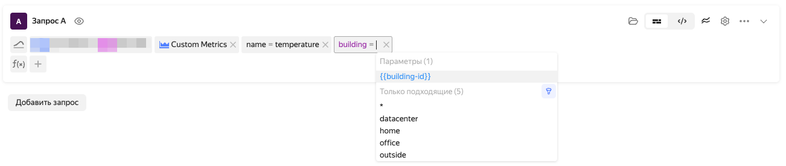

# Дашборд в {{ monitoring-name }}

*Дашборд* — набор виджетов: графиков, текстов и заголовков. Метрики на графиках дашборда отображаются за определенный временной интервал, общий для всех графиков.

По умолчанию интервал равен одному дню. Интервал может быть задан с помощью пресетов с заранее заданными диапазонами (`1h 3h 1d 1w 1mo`). Также вы можете указать время и дату начала и конца интервала.

Для более точной настройки интервала времени можно использовать таймлайн, расположенный над дашбордом.

Пользователям {{ yandex-cloud }} доступны сервисные дашборды, которые содержат преднастроенные виджеты с метриками о состоянии облачных ресурсов. Сервисные дашборды создаются автоматически.

## Параметры дашбордов {#parameterization}

Параметры позволяют создавать интерактивные дашборды, содержание которых изменяется в зависимости от выбора пользователя. Например, дашборд, показывающий сводную информацию о состоянии виртуальной машины, можно параметризовать идентификатором виртуальной машины.

Параметры отображаются в виде выпадающих меню над виджетами дашборда. При выборе значения параметра дашборд обновляется, а в запросах к данным подставляется выбранное значение.

Параметры дашбордов бывают следующих типов:

* *{{ ui-key.yacloud_monitoring.component.parametrizer.type.query }}* — параметр принимает множество значений указанной метки.
* *{{ ui-key.yacloud_monitoring.component.parametrizer.type.custom }}* — параметр принимает набор фиксированных значений, перечисленных через запятую.
* *{{ ui-key.yacloud_monitoring.component.parametrizer.type.text-field }}* — параметр принимает единственное значение, указанное в текстовом поле.

Для параметров типа *{{ ui-key.yacloud_monitoring.component.parametrizer.type.query }}* и *{{ ui-key.yacloud_monitoring.component.parametrizer.type.custom }}* доступна настройка *{{ ui-key.yacloud_monitoring.component.parametrizer.dashboard.multivalue-key-value }}*, позволяющая выбирать несколько значений параметра одновременно.

Для всех типов параметров доступно указание *{{ ui-key.yacloud_monitoring.component.parametrizer.default-value }}* — это значение параметра будет использоваться при загрузке дашборда в веб-интерфейсе {{ monitoring-full-name }}.

### Подстановка параметров {#templates}

Значения параметров дашборда используются в заголовках виджетов и в запросах к метрикам для фильтрации значений меток. Для подстановки значения параметра используется [mustache-шаблонизация](https://mustache.github.io/).



Использовать подстановку значений параметров в запросах к метрикам можно только в значениях меток.



#### Примеры подстановки значений параметров {#templates-examples}

* Подстановка значения в заголовок виджета.
    > В заголовок виджета `CPU usage on not_var{{host}}` будет подставлено значение параметра `host`.
* Подстановка значения метки в запросе.
    > В запросе `"cpu.iowait"{folderId="aoe6mk1r3b47lu994prn", service="not_var{{myparm}}", host="*"}` в значение метки `service` будет подставлено значение параметра `myparm`.

Подстановка значения параметра в строку запроса выглядит следующим образом:

### Фильтр значений меток {#common-labels-filter}

Фильтр значений меток позволяет ограничить список возможных значений параметров с типом *{{ ui-key.yacloud_monitoring.component.parametrizer.type.query }}*. В фильтре указываются метки и их значения. Фильтр применяется ко всем параметрам с типом *{{ ui-key.yacloud_monitoring.component.parametrizer.type.query }}* одновременно.

#### Примеры фильтрации значений меток {#common-labels-filter-example}

Допустим, у дашборда задан параметр с типом *{{ ui-key.yacloud_monitoring.component.parametrizer.type.query }}* для метки `cluster`, которая принимает значения `prod`, `preprod-1`, `preprod-2` и `testing`.

Настройки фильтрации и результат:

* Фильтр `cluster=*prod*` ограничит значения параметра списком `prod`, `preprod-1`.
* Фильтр `cluster=preprod-1|preprod-2` ограничит значения списком `preprod-1` и `preprod-2`.
* Фильтр `cluster=testing` ограничит значения одним значением `testing`.

Рассмотрим более сложный пример. Допустим, в системе есть следующие метрики: 

* `usage{cluster="prod", account="prodaccount"}`;
* `usage{cluster="preprod", account="preprodaccount"}`;
* `usage{cluster="testing", account="testingaccount"}`;
* `usage{cluster="prod", account="multiaccount"}`;
* `usage={cluster="testing", account="multiaccount"}`.

Настройки фильтрации:

* Фильтр содержит значение `cluster=*prod*`.
* У дашборда заданы параметры с типом *{{ ui-key.yacloud_monitoring.component.parametrizer.type.query }}* для меток `cluster` и `account`.

Результат:

* Возможные значения параметра `cluster` будут сокращены до `prod` и `preprod`. Значение `testing` будет исключено как не подпадающее под правило `cluster=*prod*`.
* Возможные значения параметра `account` будут сокращены до `prodaccount`, `preprodaccount` и `multiaccount`. Значение `testingaccount` будет исключено, так как не существует метрики с комбинацией меток `account="testingaccount"` и `cluster`, подпадающей под правило `cluster=*prod*` (тогда как для `multiaccount` такая комбинация существует).
