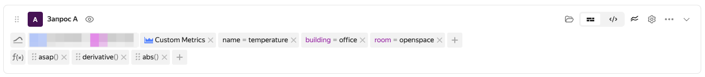
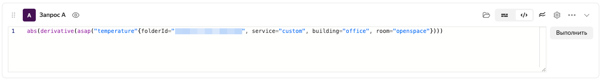

# Строка запроса

[Язык запросов](../querying.md) {{monitoring-full-name}} используется при настройке [дашбордов](./dashboard.md) и [алертов](../alerting.md). В строку запроса вводится выражение на языке запросов в токенизированном или текстовом режиме. Строка запроса позволяет применять функции к набору метрик, загруженному из определенного сервиса. Чтобы отобразить метрики из разных сервисов на графике дашборда, создайте несколько строк запросов.

В токенизированном режиме строка запроса состоит из двух частей: 
1. [Селекторов](../querying.md#selectors) для загрузки метрик.
1. Набора функций из [языка запросов](../querying.md). Функции применяются к метрикам последовательно слева направо.

Строка запроса в токенизированном режиме выглядит следующим образом:

В текстовом режиме:
* в строку запроса записываются функции, которым в качестве аргументов передается запрос к метрикам или результат, возвращенный другой функцией.
* работает подсветка синтаксиса, имена функций и значения меток селектора выделяются разными цветами.

Чтобы переключиться в текстовый режим, нажмите .

Строка запроса в текстовом режиме выглядит следующим образом:

