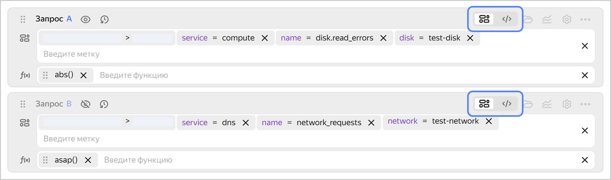
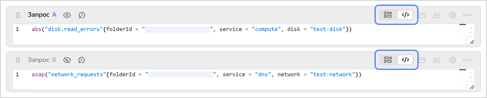

# Строка запроса

Строка запроса находится в разделах **{{ ui-key.yacloud_monitoring.aside-navigation.menu-item.dashboards.title }}**, **{{ ui-key.yacloud_monitoring.aside-navigation.menu-item.alerts.title }}** и **{{ ui-key.yacloud_monitoring.aside-navigation.menu-item.explorer.title }}** и позволяет указать параметры для построения графиков.

Вы можете ввести запрос в токенизированном или текстовом режиме.

## Запрос токенами {#query-token}

Этот режим активен по умолчанию. Внешний вид строки в токенизированном режиме:

В этом режиме строка запроса состоит из двух частей:

* **Токены** — набор метрик и меток, которые будут выбраны в результате выполнения запроса. Первый токен — всегда каталог в вашем облаке, далее выбирается сервис и индивидуальные метрики.
* **Функции** из [языка запросов](../querying.md) для преобразования метрик. Функции применяются к метрикам последовательно слева направо.

При выборе токена предлагается список возможных метрик и меток для построения графика. Для каждого следующего значения будут отображаться только те варианты, которые доступны для данной метрики. Если нужного значения нет в списке, его можно ввести вручную.

Вы можете выбирать токены с помощью курсора или вводить их названия. Для управления токенами используйте сочетания клавиш:

* **Cmd/Ctrl + →** и **Cmd/Ctrl + ←** — переход между токенами.
* **Option/Alt + →** и **Option/Alt + ←** — переход между полями токена.
* **Сmd/Ctrl + Delete** — удалить текущий токен.
* **Сmd/Ctrl + Z** — отменить действие.
* **Сmd + Shift + Z** или **Ctrl + Y** — повторить действие.
* **Shift + Space** — перейти к значению метки.
* **Сmd/Ctrl + I** — открыть меню подсказок.
* **Escape** — закрыть меню подсказок, повторное нажатие — убрать фокус.
* **Enter** — выбрать подсказку. Если меню подсказок закрыто, то закончить ввод текущего токена и перейти к следующему.
* **|** — режим пайпов, применяется только в значении метки.

## Запрос текстом {#query-text}

Чтобы переключиться в текстовый режим, нажмите . Если вы не знакомы с текстовым режимом, сначала введите запрос в виде токенов и функций. Затем включите текстовый режим — ваш запрос будет записан строкой. В текстовом виде можно более гибко использовать [язык запросов](../querying.md). Также в текстовом виде запрос передается при [чтении данных через API](../../api-ref/MetricsData/read.md).

Внешний вид строки запроса в текстовом режиме:

В текстовом режиме запросы к мониторингу записываются как функции. Аргументами функций выступают токены, результаты выполнения других функций или другие запросы. Поддерживается подсветка синтаксиса: имена функций, ключевые слова и значения меток выделяются разными цветами.

## Работа со строкой запроса {#query-working}

При работе со строкой запроса доступны следующие возможности:

* Отобразить на графике метрики из разных сервисов или для разных ресурсов.
  
    Для этого добавьте несколько строк запросов и укажите запросы для получения данных по каждому из ресурсов.

* Использовать значение из одного запроса в другом.

    Допустим, вы описали два запроса `A` и `B`, а на графике надо отобразить долю `B` от `A`. Тогда в запросе `C` введите формулу: `100 * B / A`. Таким же образом можно описывать запросы и строить графики не только по чистым значениям метрик, но и по сумме, отношению и другим производным значениям.

* Скрыть вспомогательные запросы на графике.
  
    Если какие-то запросы нужны только для использования в других запросах, нажмите , чтобы не отображать на графике вспомогательные линии.

* Посмотреть последние запросы.

    Чтобы открыть историю запросов, нажмите . Максимальное количество запросов в истории — `100`. Чтобы добавить запрос в избранное, нажмите . Избранные запросы остаются в списке и отображаются наверху.

* Посмотреть все значения токенов для выбранного сервиса или ресурса.

    Чтобы открыть каталог значений, нажмите . На панели каталога выбирайте метрики и селекторы. Для каждого набора значений будут отображаться доступные варианты токенов.
