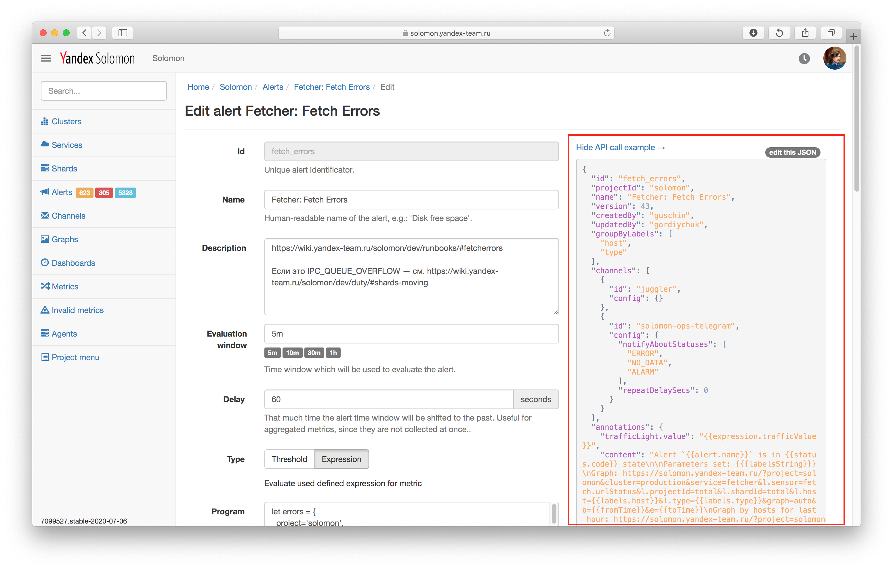

# Создание алерта и настройка уведомлений

Рассмотрим создание алерта на количество 500-х ошибок от метода `GET /movies/list` к API сервиса *helper* по всему кластеру за последние 5 минут, который отправляет уведомления о срабатывании в группу в Telegram.

## Веб-интерфейс

#### Шаг 1. Создание алерта {#alert-creation}

Чтобы создать алерт, выполните следующие шаги:

1. Откройте интерфейс [Admin UI](https://solomon.yandex-team.ru/admin), выберите свой проект, кликните в пункт *Alerts* в боковой панели, и нажмите кнопку *Create new*.
1. В открывшейся форме заполните поля следующим образом:
   * **Id** — идентификатор алерта. Если оставить пустым, он сгенерируется автоматически.
   * **Name** — человекочитаемое название алерта. Например, *500 errors from /movies/list*.
   * **Evaluation window** — временное окно расчета алерта. Укажите значение `5m` (5 минут).
   * **Delay** — задержка в секундах, позволяющая сдвинуть временное окно назад во времени. Оставьте значение по умолчанию — 0.
   * **Type** — тип алерта. Выберите Threshold — алерт будет срабатывать по пороговому значению.
   * **Selectors** — список селекторов, по которым будет загружена метрика. Укажите селекторы из Листинга 1.
  <small>Листинг 1 — Селекторы для загрузки метрики с количеством HTTP-запросов завершившихся кодом 500 к методу `/movies/list` Solomon API.</small>
   ```js
   project='monitoring-examples', cluster='helper', service='helper', host='cluster', method='GET', code='500', endpoint='/movies/list', sensor='http.requests.total'
   ```
   * **Predicate rules** — набор условий (предикатов), при выполнении которых алерт переходит в определенный статус. Нажмите , чтобы создать новое условие.
     * **Aggregation** — функция агрегации, которая будет использована для вычисления значения на временном окне. Выберите *Last* — алерт будет следить за последним значением метрики в указанном ранее окне в 5 минут.
     * **Comparison** — функция сравнения. Выберите `>` (больше).
     * **Threshold** — порог срабатывания условия. Укажите `0`.
     * **Target status** — статус, в который перейдет алерт при выполнении условия. Выберите *Alarm*.
   * **Channels** — канал уведомлений, который определяет получателя, транспорт и содержание уведомлений об определенных статусах алерта. Подключите уже существующий канал или создайте новый. Создание и настройка каналов подробно рассмотрены в разделе [{#T}](#notifications-settings).
   * **Annotations** — аннотации позволяют сохранить дополнительную информацию в момент вычисления алерта, которую можно вставить в текст уведомления. Создайте аннотацию *content* со значением `{{#isAlarm}}Alarm! API method ``/movies/list`` has 500 errors!{{/isAlarm}}`. Таким образом, когда алерт перейдет в состояние **<span style="color: red;">Alarm</span>**, в значении аннотации будет указанная строчка `Alarm! API method ``/movies/list`` has 500 errors!`.
1. Нажмите кнопку *Save*, чтобы сохранить алерт.

#### Шаг 2. Настройка уведомлений {#notifications-settings}


Чтобы создать канал уведомлений, отправляющий уведомления в групповой чат в Telegram, если алерт перешел в любое состояние отличное от **<span style="color: green;">OK</span>**, выполните следующие шаги.

1. Добавьте бота [@SolomonMonitoringBot](https://t.me/SolomonMonitoringBot) в **существующий** групповой чат в Telegram, после чего бот должен написать `bot was successfully added`, а в настройках канала уведомлений должна появиться возможность выбрать этот чат.
1. Создайте новый канал уведомлений. Для этого откройте интерфейс [Admin UI](https://solomon.yandex-team.ru/admin), выберите свой проект, кликните в пункт *Channels* в боковой панели, и нажмите кнопку *Create new*.
1. В открывшейся форме заполните поля следующим образом:
   * **Id** — идентификатор канала. Если оставить пустым, он сгенерируется автоматически.
   * **Name** — человекочитаемое название канала. Например, *Telegram чат Monitoring Examples*.
   * **Method** — выберите *Telegram*, чтобы получать уведомления в групповой чат в Telegram.
   * **Recipient** — выберите *Group Title*, чтобы добавить групповой чат
   * **Group Title** - выберите из списка свой групповой чат
   * **Text Template** - шаблон уведомления. Оставьте пустым, чтобы использовать шаблон по умолчанию.
   * **Send Screenshot** - включите опцию, чтобы получать скриншоты графиков в уведомлениях.
1. Вернитесь на страницу алерта, созданного на предыдущем шаге, нажмите кнопку *Edit*, чтобы перейти в режим редактирования алерта, нажмите  в разделе *Channels*, а затем заполните параметры следующим образом:
   * В параметре *Channel* укажите созданный канал, найдя его по имени.
   * Параметр **Notify about statuses** настраивает список статусов алерта, о которых будут отправлены уведомлений в указанный в канал. Выберите все статусы, кроме **<span style="color: green;">OK</span>**.
   * Параметр **Re-notification** указывает с каким периодом будут повторяться уведомления о том, что алерт находится в том же статусе. Оставьте значение по умолчанию — *Never*, чтобы получать уведомления только об изменениях статуса алерта и не получать повторных уведомлений.
1. Нажмите *Save*, чтобы сохранить алерт.

## API

Создавать и управлять алертами и каналами уведомлений можно при помощи [{#T}](../../api-ref/rest.md).

Пример создания простого алерта через API приведен в Листинге 2.

<small>Листинг 2 — Пример создания алерта через API при помощи утилиты *curl*.</small>


```bash
$ cat data.json
{
  "projectId": "solomon",
  "id": "alerting-deadline",
  "name": "alerting-deadline",
  "notificationChannels": [
    "email-gordiychuk"
  ],
  "type": {
    "expression": {
      "program": "let deadline = {'project'='solomon', 'cluster'='alerting_prod', 'service'='alerting', 'alertType'='total', 'host'='cluster', 'sensor'='evaluations.eval.status.total', 'projectId'='total', 'status'='DEADLINE'};\nlet avgDeadline = avg(deadline);",
      "checkExpression": "avgDeadline > 0"
    }
  },
  "periodMillis": 60000,
  "delaySeconds": 30
}
$ curl -X POST \
  -H 'Content-Type: application/json' \
  -H 'Authorization: OAuth ${SOLOMON_TOKEN}' \
  -d @data.json \
  "http://solomon-prestable.yandex.net/api/v2/projects/solomon/alerts/"
```

Примеры запросов отображаются в Admin UI: на странице редактирования алертов и каналов уведомлений в правой части экрана отображается содержание запроса, который нужно отправить в API, чтобы изменить объект согласно заполненной форме.

{ width="1552" }
<small>Рисунок 1 — Пример API запроса в Admin UI.</small>
