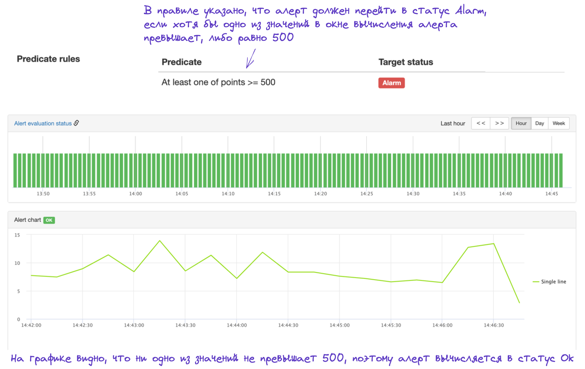

# Отладка срабатывания алерта

## Инструменты

Для отладки срабатывания алерта используйте виджет *Alert Evaluation status* и график *Alert chart* на странице алерта.

{ width="1552" }
<small>Рисунок 1 — Описание Alert Evaluation Status и Alert Chart.</small>

### Alert Evaluation status

1. Столбики в виджете *Alert Evaluation status* показывают историю результатов выполнения алерта. 
2. Контролы времени в правом верхнем углу позволяют изменять временной диапазон. 
3. Клик в столбик запускает вычисление  алерта на исторических данных. Результат вычисления отображается в заголовке графика *Alert Chart*.
4. Клик в столбик также меняет окно вычисления алерта на графике Alert Chart. 

### Alert Chart

1. В заголовке графика отображается результат вычисления, который был получен текущей версией алерта - либо результат последнего вычисления, либо, если использовать столбики в виджете *Alert evaluation status* для навигации по времени — на время, указанное в столбике. 
2. На  графике *Alert chart* отображаются временные ряды для  переменных, указанных в программе expression-алерта или временные ряды, указанные в селекторе threshold-алерта. 
3. Временной промежуток, показанный на графике, зависит от окна вычисления алерта, указанного в параметре *Evaluation window*. При отображении учитывается параметр Delay, заданный в настройках алерта.

## Проверка корректности срабатывания алерта

Для того, чтобы понять корректно ли сработал алерт, выполните следующие шаги: 

1. Перейдите на страницу алерта или под-алерта.
2. В правом верхнем углу виджета *Alert evaluation status* выберите временной промежуток, соответствующий времени срабатывания алерта.
3. В виджете *Alert evaluation status* кликните в столбик со временем срабатывания алерта.
4. Проверьте, совпадает ли статус вычисления алерта в выбранном столбике и в заголовке графика *Alert Chart*.

{ width="1552" }
<small>Рисунок 2 — Сравнение результатов вычисления алерта.</small>

    
## Если результаты вычислений совпадают

{ width="1552" }
<small>Рисунок 3 — Результаты вычислений совпадают.</small>
    
Если результат вычисления алерта, отображаемый в виджете Alert Evaluation Status, совпадает с результатом, отображаемым в заголовке графика Alert Chart, то это значит, что алерт отработал корректно. Если вы ожидаете, что результат вычисления алерта должен быть другим, то воспользуйтесь описанными ниже способами.
    

### Проверка Threshold-алерта
    
1. Проверьте, что в алерте используется корректный селектор.
2. Проверьте, что используются корректные правила вычисления алерта (*Predicate Rules*) и они расположены в правильном порядке.
3. Проверьте, что корректно указано окно вычисления алерта (параметр *Evaluation Window*) и с корректным смещением во времени (параметр *Delay*). Используемый временной промежуток показывается на графике *Alert Chart*.
4. Проверьте, что временные ряды возвращают ожидаемые вами значения. Для этого выберите нужный временной промежуток в виджете *Alert Evaluation Status*, нажмите на столбик со временем вычисления алерта и проверьте значения временных рядов, показанных на графике *Alert Status*.
    
{ width="1552" }
<small>Рисунок 4 — Сравнение получаемых данных и условия, указанного в алерте.</small>

    
### Проверка Expression-алерта
    
1. Проверьте, что в программе алерта используются корректные селекторы и условия срабатывания алерта.
2. Проверьте, что корректно указано окно вычисления алерта (параметр *Evaluation Window*) и с корректным смещением во времени (параметр *Delay*). Используемый временной промежуток показывается на графике *Alert Chart*.
3. Проверьте, что переменные, которые указаны в условиях срабатывания алерта, возвращают ожидаемые вами значения. Для этого добавьте эти переменные в аннотации алерта, как показано в примере ниже. 

В примере алерт настроен на значение отношения линий, выраженное переменной *ratio*. Для того, чтобы это значение показывалось на виджете *Alert Chart*, переменная ratio добавлена в аннотации.

{ width="1552" }
<small>Рисунок 5 — Добавление переменных из алерта в аннотации.</small>

Посмотреть значение переменной в момент вычисления алерта можно в нижней части виджета *Alert Chart*.

{ width="1552" }
<small>Рисунок 6 — Просмотр значений переменных на графике Alert Chart.</small>

На рисунке  видно, что алерт вычислился корректно, так как полученное значение переменной *ratio* равно 0,666..., что больше значения 0,5, указанного в условии срабатывания алерта.

## Если результаты вычислений не совпадают

{ width="1552" }
<small>Рисунок 7 — Результаты вычислений совпадают.</small>

Если результаты, отображаемые в двух графиках, не совпадают, то у этого может быть несколько причин, которые описаны ниже.

### Алерт вычисляется на неполных данных

Алерт может вычисляться в тот момент, когда мониторингом получены еще не все данные. Пример такой ситуации изображен на Рисунке 8.

{ width="1552" }
<small>Рисунок 8 — Накопление значения агрегата.</small>

Для избежания описанных выше проблем рекомендуется настроить задержку вычисления алерта (параметр *Delay*), равную значению двух интервалов сбора данных. Например, если интервал сбора метрик равен 15 секунд, то в параметре *Delay* указывается 30 секунд.

### Данные были изменены

Данные, которые находятся в хранилище сейчас, отличаются от данных, которые находились в хранилище на момент вычисления алерта. Обычно это вызвано либо ошибками, возникающими при сборе метрик, либо задержками с поставкой метрик. 

1. Проверьте, видны ли ошибки в сборе данных в момент срабатывания алерта

Для этого откройте страницу шарда, в котором хранятся метрики,  перейдите по ссылке *Shard Status* и откройте вкладку *Fetching* (в случае использования Pull-режима сбора данных) или вкладку *Push* (в случае использования Push-режима сбора данных). Далее выберите интервал времени, на котором сработал алерт и проверьте, видны ли в это время ошибки сбора данных. 

{ width="1552" }
<small>Рисунок 9 — График, показывающий статус сбора метрик.</small>

Если ошибки есть, то, вероятнее всего, ложное срабатывание алерта было вызвано ими. Для того, чтобы понять, что это были за ошибки и как их устранять, воспользуйтесь инструкцией по [диагностике проблем со сбором данных](../metric/troubleshooting.md).

2. Проверьте, видны ли провалы в сборе данных в момент срабатывания алерта

Если на графиках во  вкладке *Fetching* (в случае использования Pull-режима сбора данных) или во вкладке *Push* (в случае использования Push-режима сбора данных) видны провалы, то это означает, что метрики в это время не поставлялись или поставлялись в меньшем объеме. Обычно это связано с проблемами на стороне клиента и необходимо проверить логи за промежуток времени, в который сработал алерт.

В примере ниже алерт переходил в статус Alarm с 8:45 до 9:30.
На графике виден провал, который говорит о том, что количество передаваемых метрик уменьшилось. Далее видно, что данных передалось больше. Скорее всего это говорит о том, что недостающие данные были переданы и записались в хранилище.

{ width="1552" }
<small>Рисунок 10 — На графике видны провалы в сборе метрик.</small>

## Если инструкция не помогла

Если описанные выше шаги не помогли, заведите тикет в очереди [MONSUPPORT](https://st.yandex-team.ru/createTicket?queue=MONSUPPORT&_form=64135) и укажите в нем следующую информацию:
1. Подробное описание проблемы.
2. Ссылку на алерт.
3. Дату и время срабатывания алерта.
4. Собранную по инструкции выше информацию.
