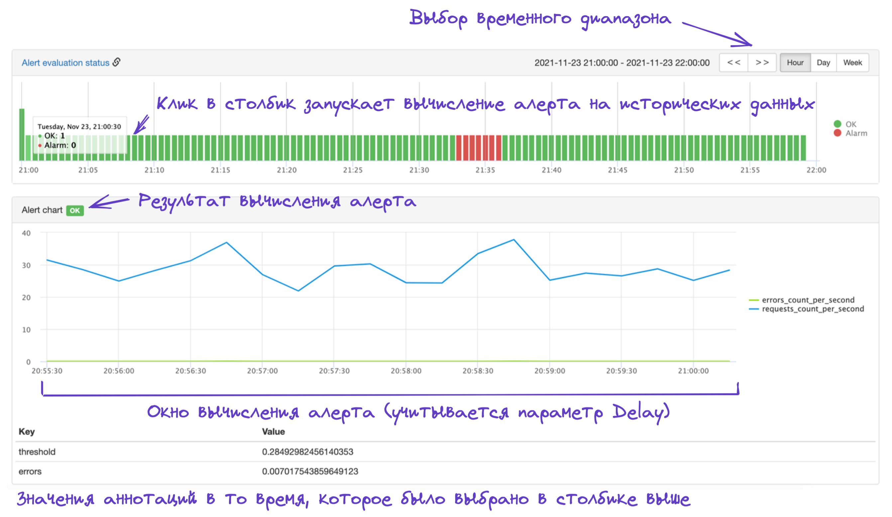

# Проверка результата вычисления алерта на исторических данных

Для проверки результата вычисления алерта на исторических данных используйте виджет *Alert Evaluation status* и график *Alert chart* на странице алерта, или под-алерта, если используется мульти-алерт.

{ width="1552" }
<small>Рисунок 1 — Описание Alert Evaluation Status и Alert Chart.</small>

1. Перейдите на страницу алерта или под-алерта.
2. В правом верхнем углу виджета *Alert evaluation status* выберите нужный временной промежуток.
3. В виджете *Alert evaluation status* кликните в столбик со временем, соответствующим тому моменту, в который вы хотите проверить результат вычисления алерта.
4. В заголовке графика *Alert chart* проверьте результат вычисления алерта. В заголовке всегда показывается результат вычисления, полученный актуальной версией алерта.

