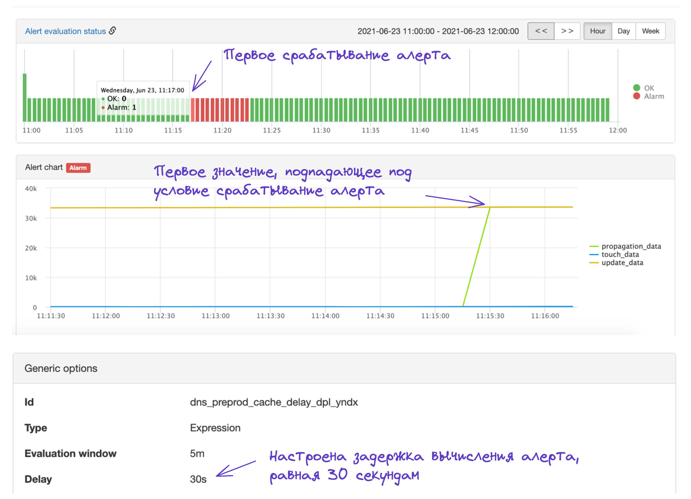

# Отладка задержек в срабатывании алерта

Алерт может сработать позже, чем ожидается, по нескольким причинам. 

## Настроен параметр Delay
Рассмотрим пример, в котором проблема проявилась в 11:15:30, а алерт сработал в 11:17:00.

{ width="1552" }
<small>Рисунок 1 — Пример позднего срабатывания алерта.</small>

Это вызвано несколькими обстоятельствами:

1. Метрики, используемые в алерте, собираются раз в 15 секунд. Первое значение, превышающее порог срабатывания алерта пришло в 11:15:30.

2. В алерте настроен параметр *Delay*, равный 30 секундам. В связи с этим окно вычисления алерта сдвигается на 30 секунд. Таким образом, первые данные для расчета алерта стали доступны в 11:16:00.

3. Алерты рассчитываются раз в минуту в случайном окне. Ближайший расчет алерта, попадающий под условие Alarm, после 11:16:00, произошел в 11:17:00.

## Задержки в создании под-алертов для новых метрик

Срабатывание под-алерта с задержкой может быть вызвано тем, что под-алерты перегенерируются раз в 10 минут. То есть от момента появления новой метрики, по которой формируется под-алерт, до момента создания соответствующего под-алерта может пройти до 10 минут.