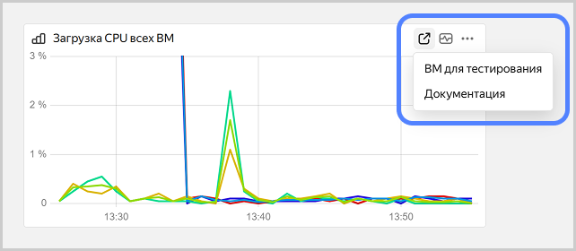

# Добавление виджета на дашборд

Дашборды — это визуальные панели, которые позволяют быстро оценить состояние и производительность ваших облачных ресурсов. Вы можете воспользоваться готовыми дашбордами, которые предоставляют многие сервисы, или создать свой собственный.

Дашборд состоит из виджетов, которые позволяют отображать информацию разного типа: [график](#graph), [алерт](#alert), [эскалация](#escalation). А также из виджетов, которые помогают структурировать информацию на дашборде: [заголовок](#heading), [текст](#text) и [секция](#group).

Общий порядок добавления виджета на дашборд:

1. Откройте или [создайте дашборд](create.md).
1. Справа вверху нажмите  и выберите виджет, который хотите добавить.
1. Укажите настройки виджета.
1. Справа вверху нажмите  **{{ ui-key.yacloud_monitoring.actions.common.save }}**.

Вы можете перемещать виджеты на дашборде, а также изменять их размер.

## График {#graph}

График позволяет отобразить изменение метрик во времени в графическом виде. Графики можно настроить на дашборде или добавить из раздела [Метрики](../metric/metric-explorer.md#add-to-dashboard).

1. Нажмите  **{{ ui-key.yacloud_monitoring.dashboard.widget-placeholder.add-graph }}**.
1. Настройте график, указав [запросы](../../concepts/querying.md) и отображение метрик.
1. (Опционально) Добавьте [параметры](add-parameters.md) и настройте [повторение графиков](add-parameters.md#repeated-graphs).
1. Нажмите  **{{ ui-key.yacloud_monitoring.actions.common.save }}**.

### Параметры графика {#chart-parameters}

Настройка графика на дашборде аналогична настройке графика в разделе [Метрики](../metric/metric-explorer.md#add-graph).

Чтобы настроить график:

1. Рядом с графиком нажмите  и выберите **{{ ui-key.yacloud_monitoring.dashboard.dash.edit }}**.
1. На панели графика справа вверху нажмите  **Настройки**.
1. Задайте параметры графика, приведенные ниже.

   Все указанные параметры сразу же применяются к графику, сохранять их не нужно.
1. После настройки закройте боковую панель.

#### Пороги {#thresholds}

Настройка, позволяющая отображать линии, соответствующие критическим или целевым значениям. Вы можете задать пороги через меню настроек графика или редактирование JSON:



- Настройки графика

  1. В разделе **{{ ui-key.yacloud_monitoring.wizard.tab.thresholds }}** нажмите **{{ ui-key.yacloud_monitoring.wizard.thresholds.add }}**.
  1. Укажите числовое значение порога. Чтобы указать дробное значение, используйте разделитель — точку, например `9.75`.
  1. Выберите цвет порога.
  1. Включите или отключите опцию **{{ ui-key.yacloud_monitoring.wizard.thresholds.show-on-graph }}**. Опция относится ко всем порогам.

- JSON

  1. В верхней части дашборда нажмите  **{{ ui-key.yacloud_monitoring.header.action.settings }}**.
  1. Выберите пункт **{{ ui-key.yacloud_monitoring.dashboard.settings.tab.json }}**.
  1. В параметрах нужного виджета измените значения в блоке `thresholds`:

      ```json
      "widgets": [
        ...
        "thresholds": {
                  "items": [
                    {
                      "color": "#d63232",
                      "value": 9.75,
                      "_value": "value"
                    },
                    ...
                    {
                      "color": "#92db00", // базовый порог
                    }
                  ],
                  "showMode": "CONSTANT_LINE" 
        }
      ```

      

      У порогов должно быть базовое значение — это элемент `items` без `value`. Все остальные пороги должны иметь числовое значение (`value`).

      

  1. Нажмите **{{ ui-key.yacloud_monitoring.actions.common.apply }}**.



#### Ссылки {#chart-links}

Можно добавить ссылку на внешний ресурс или дашборд.

1. В разделе **{{ ui-key.yacloud_monitoring.component.juggler-modal.form.juggler-links.title }}** нажмите **{{ ui-key.yacloud_monitoring.quicklinks.action.add-link }}**.
1. Введите заголовок, который будет отображаться для этой ссылки на графике.
1. Выберите **{{ ui-key.yacloud_monitoring.context-links.label.type.url }}** и введите текст ссылки в формате `http(s)://<адрес>`. Можно добавить ссылку на любой сайт или внешний ресурс.
1. Выберите **{{ ui-key.yacloud_monitoring.context-links.target.dashboard }}** и укажите:
   1. Облако и каталог, в котором расположен дашборд. В списке находятся все облака и каталоги, к которым у вас есть доступ.
   1. Дашборд, который будет открываться по ссылке.
   1. **Передавать временной интервал** — график откроется с тем же временным интервалом, который задан на исходном графике.
1. Включите или отключите опцию **Открывать в новом окне**.

    Добавленные ссылки появятся на графике вверху справа, в меню.

   

## Алерт {#alert}

Виджет алерта позволяет отображать на дашборде текущий статус алерта. Для добавления виджета на дашборд сначала [создайте алерт](../alert/create-alert.md).

1. Нажмите  **Алерт**.
1. В списке выберите алерт и введите произвольный заголовок для него.
1. Нажмите  **{{ ui-key.yacloud_monitoring.actions.common.save }}**.

## Эскалация {#escalation}



Виджет показывает на дашборде запущенные экземпляры эскалаций из одной политики эскалации. Для добавления виджета на дашборд сначала [создайте](../alert/create-escalation.md) политику эскалаций.

1. Нажмите **Эскалация**.
1. Введите произвольный заголовок для эскалации.
1. В списке выберите политику эскалаций.
1. (Опционально) Укажите, следует ли отображать на дашборде только запущенные эскалации или все эскалации.
1. (Опционально) Введите максимальное количество эскалаций, которое можно отобразить на дашборде.
1. Нажмите  **{{ ui-key.yacloud_monitoring.actions.common.save }}**.

## Текст {#text}

Виджет позволяет добавить поясняющий текст на дашборд. В тексте можно использовать форматирование, списки, заголовки, каты, ссылки, блоки кода, изображения и другие элементы.

1. Нажмите  **{{ ui-key.yacloud_monitoring.dashboard.widget-placeholder.add-text }}**.
1. Введите текст в поле ввода. При необходимости примените к тексту форматирование.
1. Чтобы добавить ссылку, изображение, блок кода или другой элемент, нажмите  и выберите нужный пункт.
1. Чтобы ввести текст в [формате Markdown](https://diplodoc.com/docs/ru/syntax/), нажмите  и выберите **Разметка Markdown**.
   Чтобы выйти из режима разметки, нажмите  и выберите **Визуальный редактор**.
1. Нажмите  **{{ ui-key.yacloud_monitoring.actions.common.save }}**.

## Заголовок {#heading}

Заголовок позволяет визуально разделить виджеты на дашборде.

1. Нажмите  **{{ ui-key.yacloud_monitoring.dashboard.widget-placeholder.add-title }}**.
1. Введите текст в поле ввода.
1. Выберите размер заголовка. Доступны четыре уровня заголовка.
1. Нажмите  **{{ ui-key.yacloud_monitoring.actions.common.save }}**.

## Секция {#group}

Секция позволяет группировать виджеты на дашборде и скрывать группы виджетов.

1. Нажмите  **{{ ui-key.yacloud_monitoring.dashboard.widget-placeholder.add-group }}**.
1. Перенесите виджеты в секцию.
1. Рядом с именем секции нажмите  и укажите:
   1. **Имя секции** — введите произвольное имя.
   1. **Состояние секции** — выберите, будет ли секция по умолчанию открыта или закрыта.
   1. **Повторить по параметру** — выберите параметр, по которому будут добавлены секции с графиками для каждого из значений параметра.
   1. Нажмите **{{ ui-key.yacloud_monitoring.actions.common.save }}**.
1. Нажмите  **{{ ui-key.yacloud_monitoring.actions.common.save }}**.

Чтобы поделиться секцией, рядом с именем секции нажмите . В буфер будет скопирована ссылка на секцию.

#### См. также

  * [Концепции виджетов](../../concepts/visualization/widget.md)
  * [{#T}](widget-management.md)
  * [Концепции дашбордов](../../concepts/visualization/dashboard.md)
