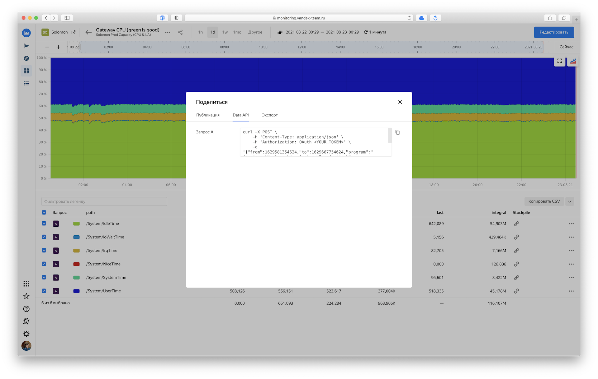
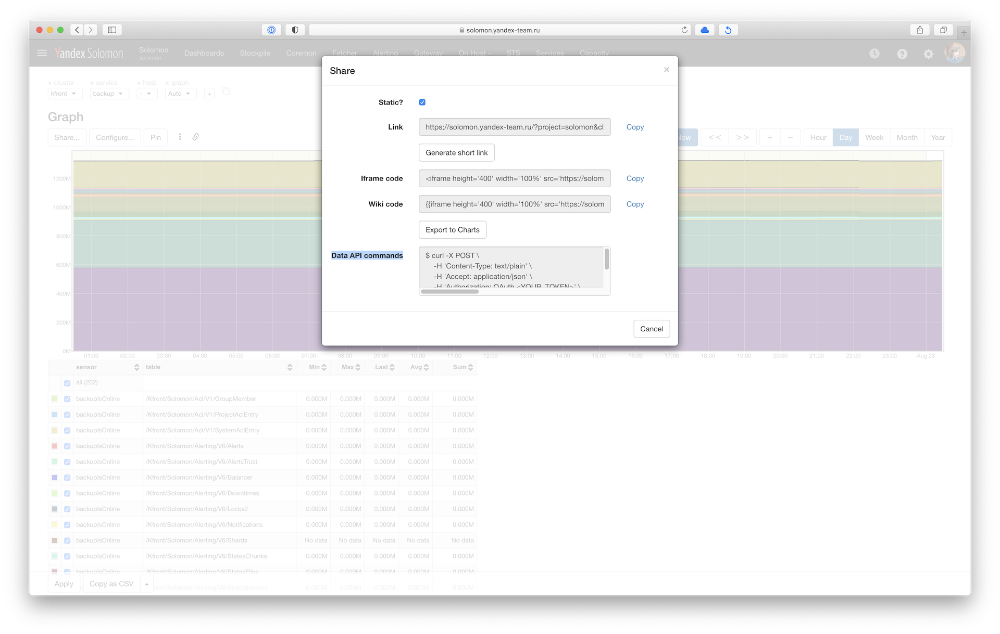

# Выгрузка метрик через API

Чтобы выгрузить метрику через Solomon API, воспользуйтесь методом [data](https://solomon.yandex-team.ru/swagger-ui/index.html#/data/readDataFromJsonUsingPOST).

Получить готовые команды для выгрузки метрик можно из веб-интерфейса мониторинга.


- Monitoring UI

  1. Откройте страницу с графиком метрики в [Monitoring UI](https://monitoring.yandex-team.ru).
  1. Нажмите кнопку  *Поделиться* (*Share*) в левом верхнем углу.
  1. Переключитесь на вкладку *Data API*.
  1. Скопируйте команды для соответствующего запроса в консоль и выполните команду.

    

- Solomon UI

  1. Откройте страницу с графиком метрики в [Solomon UI](https://solomon.yandex-team.ru).
  1. Нажмите кнопку *Share...* в левом верхнем углу.
  1. Скопируйте команды из блока *Data API commands* в консоль и выполните команду.

    


