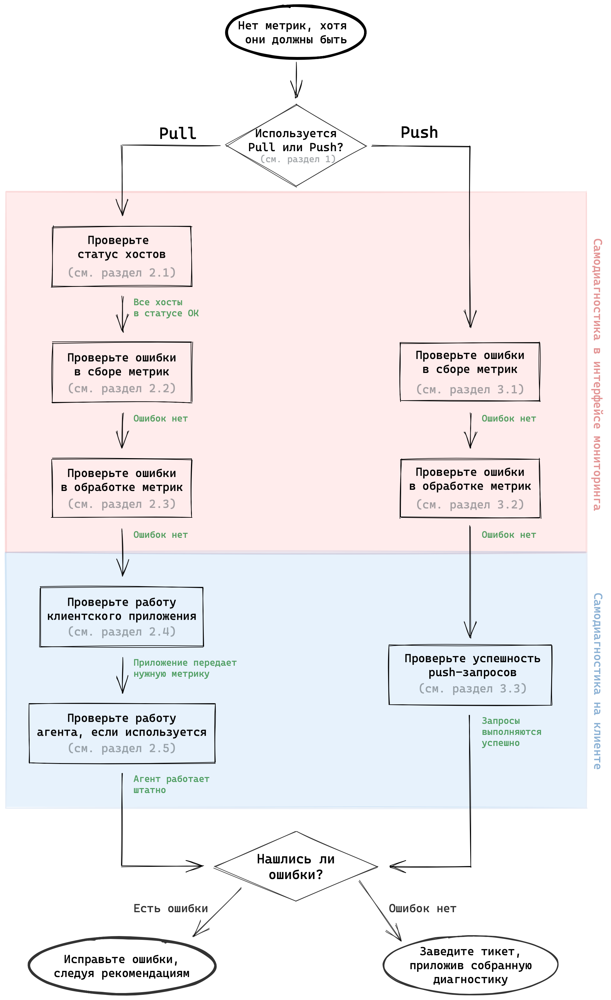
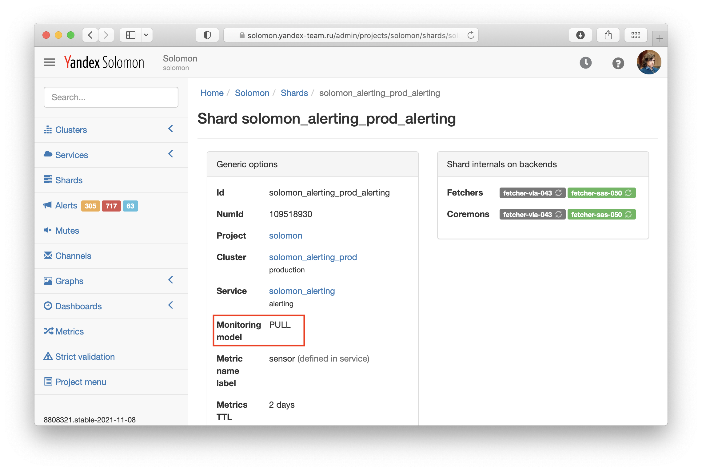
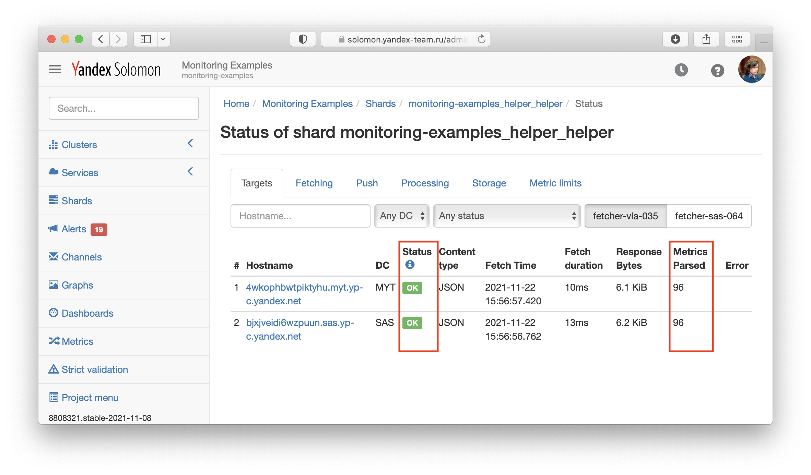
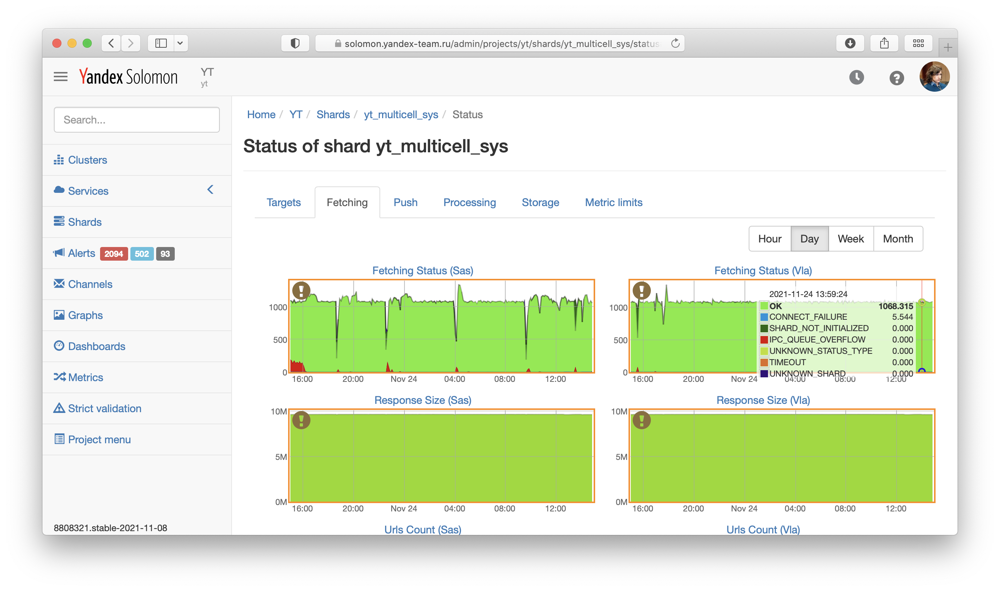
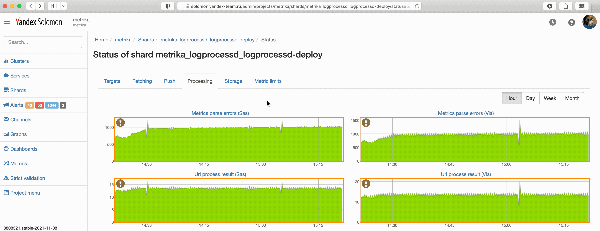
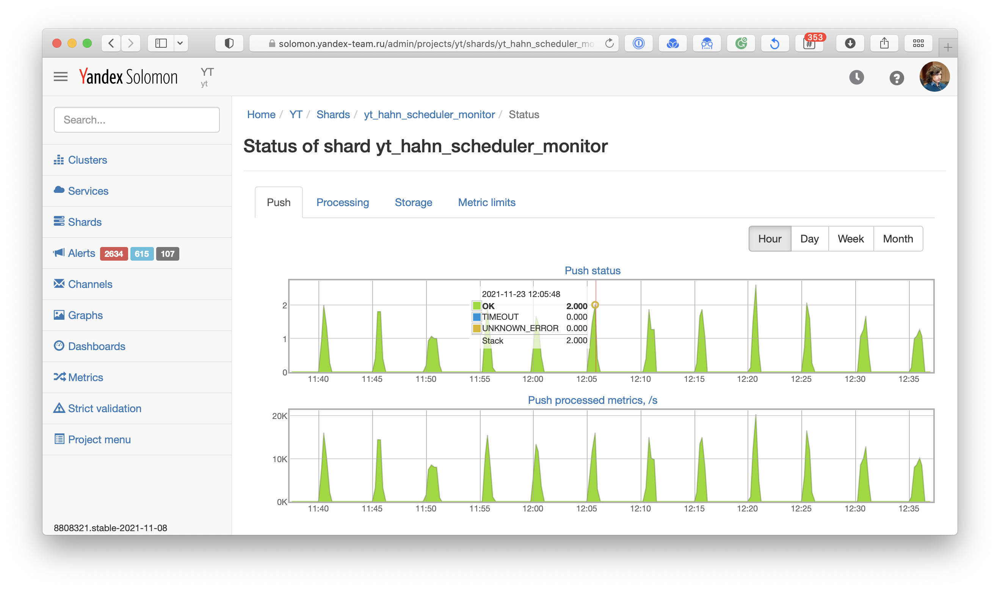

# Диагностика проблем

Данный раздел описывает типичные проблемы, связанные с отсутствием метрик в мониторинге. Например, если вы выполнили шаги из раздела "Начало работы" и не можете найти метрики в мониторинге. Или если вы добавляете новую метрику к уже передающимся метрикам и также не можете ее найти.

Последовательность шагов для самодиагностики отсутствия метрик изображена на Рисунке 1.



<small>Рисунок 1 — Последовательность шагов для самодиагностики отсутствия метрик.</small>

## 1. Определите режим передачи метрик {#pull-or-push}

Перед началом диагностики определите режим передачи метрик в шард — Pull или Push. Он указан в параметре _Monitoring model_ на странице шарда.



<small>Рисунок 2 — Параметр _Monitoring model_ на странице шарда.</small>

## 2. Самодиагностика отсутствия метрик в Pull-режиме {#no-metrics-pull}

Чтобы проверить, что метрики в Pull-режиме успешно передаются в мониторинг, воспользуйтесь страницей статуса шарда. Для этого перейдите по ссылке _Shard Status_ со страницы шарда, откроется страница статуса шарда на вкладке _Targets_. Если такой вкладки нет и открылась вкладка _Push_ — значит это push-шард. Диагностика проблем с такими шардами описана в разделе [{#T}](#no-metrics-push).

### 2.1 Проверьте статус хостов {#pull-shard-targets}

Чтобы проверить статус хостов, откройте страницу состояния шарда на вкладке _Targets_. На этой странице отображается список хостов, с которых собираются метрики, а также статус, временная метка (timestamp) и длительность последнего сбора, количество полученных байт и метрик (в штуках), сообщение об ошибке (если есть). 

В нормальном режиме, все хосты в этом списке имеют статус **<span style="color: green;">OK</span>**, а количество полученных метрик (колонка _Parsed Metrics_) число отличное от нуля, как показано на скриншоте ниже.

<!--TODO: Проверьте состояние в разных репликах? -->



<small>Рисунок 3 — Статус сбора метрик с хостов на вкладке _Targets_ страницы статуса шарда.</small>

В Таблице 1 приведен список возможных причин, по которым страница шарда может выглядеть иначе.

<small>Таблица 1 — Возможные причины ошибок на странице статуса хостов.</small>

Наблюдаемое поведение|Возможная причина|Рекомендации
---------------------|-----------------|--------------
Список хостов пустой или не содержит нужного хоста.| Неправильно настроено множество опрашиваемых хостов (service discovery) в настройках кластера. | Исправить конфигурацию кластера. Смотри раздел «Начало работы» (для [большого Яндекса](../../quickstart-yateam.md#cluster), для [Яндекс.Облака](../../quickstart-cloud.md#cluster)).
Статус хостов отличается от **<span style="color: green;">OK</span>** | Зависит от типа ошибки. | Смотри Таблицу 3 в разделе [{#T}](#pull-shard-fetching).
Статус хостов **<span style="color: green;">OK</span>**, но количество полученных метрик равно 0. | Клиентское приложение или агент не передает метрики. | Исправить работу клиентского приложения или проверить корректность конфигурации агента. Cмотри раздел [{#T}](#agent-diagnostics).

### 2.2 Проверьте наличие ошибок в сборе метрик {#pull-shard-fetching}

Чтобы проверить наличие ошибок в сборе метрик, откройте страницу статуса шарда на вкладке _Fetching_. На этой странице отображается график _Fetching Status_, который показывает количество (RPS) и статус запросов, выполняемых Solomon для сбора метрик в данный шард. Для кросс-датацентровых [инсталляций](../../overview/clusters.md) Solomon график приведен для каждой реплики, например, для реплик расположенных в датацентрах `Sas` и `Vla`.

В нормальном режиме график показывает только запросы со статусом **<span style="color: green;">OK</span>**. Описание ошибочных статусов и рекомендации по исправлению приведены в таблице ниже.



<small>Рисунок 4 — Ошибки в сборе метрик на вкладке _Fetching_ страницы статуса шарда.</small>

<small>Таблица 2 — Возможные причины ошибок в сборе метрик.</small>

Наблюдаемое поведение|Возможная причина|Рекомендации
---------------------|-----------------|--------------
График _Fetching Status_ показывает нулевые значения.| Неправильно настроено множество опрашиваемых хостов (service discovery) в настройках кластера. | Исправить конфигурацию кластера. Смотри раздел «Начало работы» (для [большого Яндекса](../../quickstart-yateam.md#cluster), для [Яндекс.Облака](../../quickstart-cloud.md#cluster)).
График _Fetching Status_ показывает не только **<span style="color: green;">OK</span>** запросы | Зависит от типа ошибки. | Смотри Таблицу 3.

<small>Таблица 3 — Статусы ошибок в сборе метрик и рекомендации по их исправлению.</small>



### 2.3 Проверьте наличие ошибок в обработке метрик {#pull-shard-processing}

Чтобы проверить наличие ошибок в обработке метрик, откройте страницу статуса шарда на вкладке _Processing_. На этой странице отображается график _Metrics parse errors_, который показывает количество метрик в секунду, записываемых в мониторинг, которые не соответствуют формату данных мониторинга.

В нормальном режиме вместо графика отображается предупреждение `No lines found`. Если график показывает ненулевое количество ошибок, для определения типа ошибки кликните в заголовок графика и откройте селектор метки `type`, как показано на Рисунке 5. Описание ошибочных статусов и рекомендации по исправлению приведены в Таблице 4.



<small>Рисунок 5 — Определение типа ошибки в обработке метрик.</small>

<small>Таблица 4 — Статусы ошибок в обработке метрик и рекомендации по их исправлению.</small>



### 2.4 Проверьте работу приложения {#check-app}

Чтобы проверить, что клиентское приложение передает нужную метрику, воспользуйтесь утилитами `curl`, `json_pp` и `grep` на хосте, где запущено приложение. 

Допустим, клиентское приложение запущено на 1337 порту и передает метрики в методе `/metrics`. Пример работы команды, которая ищет метрику с именем `storage.fetcher.lag` в передаваемых метриках выглядит так:

```bash
guschin@solomon-dev-myt-00:~$ curl -s "http://localhost:1337/metrics" | json_pp | grep "storage.fetcher.lag"
            "sensor" : "storage.fetcher.lag"
            "sensor" : "storage.fetcher.lag",
```

Если вывод команды пустой, значит клиентское приложение не передает такую метрику и следует исправить код приложения.



Если вывод команды не пустой и клиентское приложение передает метрику, а в мониторинге она не отображается, сохраните вывод команды для дальнейшей диагностики.



### 2.5 Проверьте работу агента {#agent-diagnostics}

#### Solomon Agent {#solmon-agent}

Подробнее про диагностику проблем в Solomon Agent смотри [в документации Solomon Agent](https://wiki.yandex-team.ru/solomon/agent/troubleshooting).

<!-- #### Unified Agent {#unified-agent} -->

#### Другой агент {#other-agent}

Если для сбора метрик использует не Solomon Agent и не Unified Agent, а другой агент — для помощи в диагностике следует обратиться к его авторам.

## 3. Самодиагностика отсутствия метрик в Push-режиме {#no-metrics-push}

Чтобы проверить, что метрики в Push-режиме успешно передаются в мониторинг, перейдите по ссылке _Shard Status_ со страницы шарда. Откроется страница состояния этого шарда на вкладке _Push_. Если открылась вкладка _Targets_ — значит это pull-шард. Диагностика проблем с такими шардами описана в разделе [{#T}](#no-metrics-pull).

### 3.1 Проверьте наличие ошибок в сборе метрик {#push-shard-status}

На вкладке _Push_ отображается график _Push status_, показывающий количество и статусы push-запросов на запись метрик в шард.



<small>Рисунок 6 — Ошибки в сборе метрик на вкладке _Push_ страницы статуса шарда.</small>

В нормальном режиме график _Push status_ показывает ненулевое количество **<span style="color: green;">OK</span>** запросов. Если вместо графика отображается сообщение `No lines found`, это значит, что в этот шард не поступают push-запросы и нужно проверить, что клиент выполняет push-запросы (смотри раздел [{#T}](#push-client-requests)). Описание ошибочных статусов и рекомендации по исправлению приведены в Таблице 5.

<small>Таблица 5 — Возможные причины ошибок в сборе метрик.</small>

Наблюдаемое поведение|Возможная причина|Рекомендации
---------------------|-----------------|--------------
График _Push status_ показывает нулевые значения.| Клиентское приложение не отправляет метрики в мониторинг. | Следует провести диагностику на стороне клиента по инструкции из раздела [{#T}](#push-client-requests).
График _Push status_ показывает не только **<span style="color: green;">OK</span>** запросы | Зависит от типа ошибки. | Смотри Таблицу 6.

<small>Таблица 6 — Статусы ошибок в сборе метрик и рекомендации по их исправлению.</small>



### 3.2 Проверьте наличие ошибок в обработке метрик {#push-shard-processing}

Чтобы проверить наличие ошибок в обработке метрик, откройте страницу статуса шарда на вкладке _Processing_. На этой странице отображается график _Metrics parse errors_, который показывает количество метрик в секунду, записываемых в мониторинг, которые не соответствуют формату данных мониторинга.

В нормальном режиме вместо графика отображается предупреждение `No lines found`. Если график показывает ненулевое количество ошибок, для определения типа ошибки кликните в заголовок графика и откройте селектор метки `type`, как показано на Рисунке 7. Описание ошибочных статусов и рекомендации по исправлению приведены в таблице ниже.


<small>Рисунок 7 — Определение типа ошибки в обработке метрик.</small>

<small>Таблица 7 — Статусы ошибок в обработке метрик и рекомендации по их исправлению.</small>



### 3.3 Проверьте успешность push-запросов на клиенте {#push-client-requests}

Чтобы проверить успешность push-запросов на клиенте, добавьте в лог клиентского приложения URL, тело и заголовки push-запроса, а также статус, заголовки и тело ответа от Solomon API. 

В нормальном режиме Solomon API отвечает кодом 200 и сообщением с количеством записанных метрик.

```bash
❯ curl -s "https://solomon.yandex-team.ru/api/v2/push?project=guschin&cluster=push&service=push" \
    -X POST \
    -H "Content-Type: application/json" \
    -H "Authorization: OAuth ${SOLOMON_TOKEN}" \
    -d @data_p.json
{"status":"OK","sensorsProcessed":44}
```



Если push-запрос завершается со статусом отличным от `200 OK` и проблему не удается решить самостоятельно, сохраните URL, тело и заголовки push-запроса, а также статус, заголовки и тело ответа от Solomon API для дальнейшей диагностики.



## 4. Передайте диагностику команде мониторинга {#report}

Если приведенные выше шаги не помогли определить проблему, заведите тикет в очереди [MONSUPPORT](https://st.yandex-team.ru/createTicket?queue=monsupport). Приложите в тикет диагностическую информацию, собранную на предыдущих шагах.
