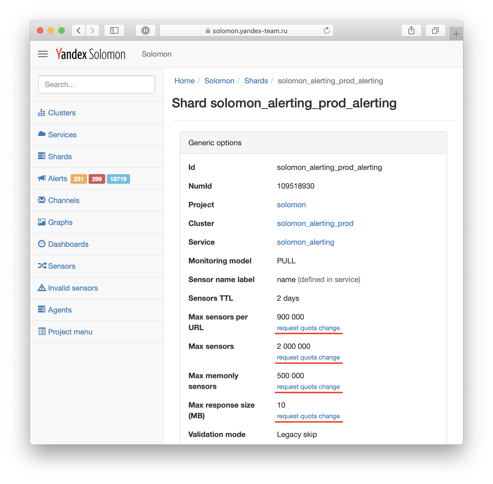
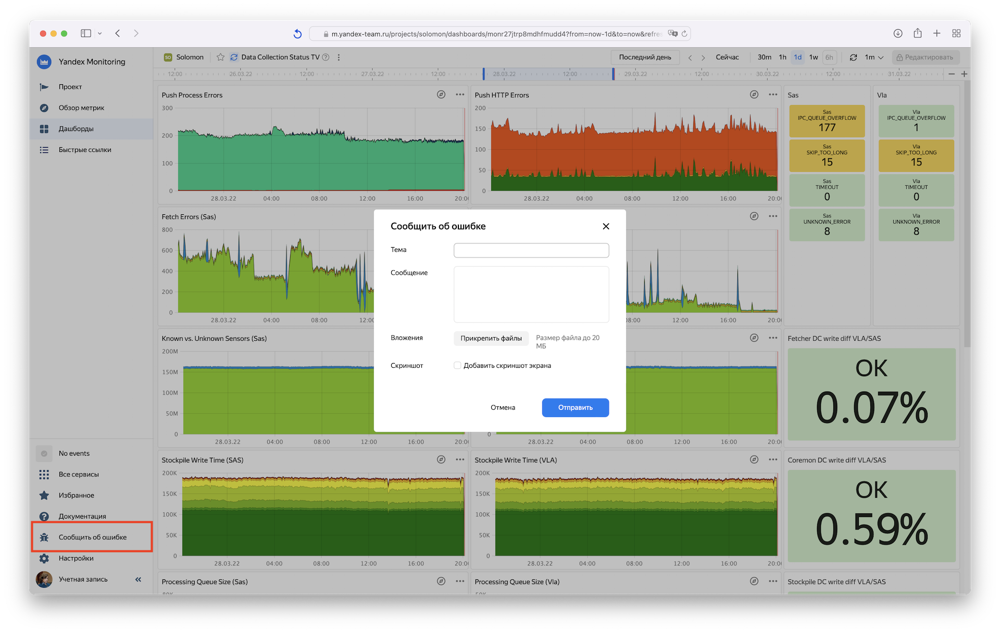
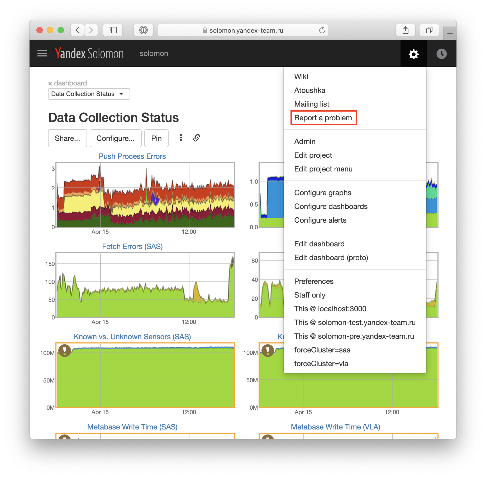

# Как сообщить о проблеме

В этом разделе описано в каких случаях, куда и как стоит обращаться за помощью при работе с системой Solomon. Все обращения пользователей, за исключением починки инцидентов, обрабатываются в тикетах.

## Инциденты и срочные вопросы {#urgent}

Если вы предполагаете, что происходит инцидент, нарушивший работоспособность сервиса Solomon, проверить состояние сервиса можно [на дашборде в Infra](https://infra.yandex-team.ru/timeline?preset=i7ZXss6dxeZ). 

Если на дашборде нет текущих открытых событий, но вы предполагаете наличие инцидента — свяжитесь с дежурным SRE. Если инцидент происходит в вашем сервисе и требуется экстренная помощь от команды мониторинга – также свяжитесь SRE.

Расписание дежурств SRE можно узнать на странице сервиса [в ABC](https://abc.yandex-team.ru/services/solomon/duty/?role=3284) или у телеграм-бота [@ycloud_duty_bot](https://t.me/ycloud_duty_bot) при помощи команды `/duty solomon-sre`.

Если связаться с дежурным не удалось — *звоните* [Владимиру Гордийчуку](https://staff.yandex-team.ru/gordiychuk), [Самару Чокутаеву](https://staff.yandex-team.ru/samarius) и [Андрею Столбовскому](https://staff.yandex-team.ru/andreyst).

## Вопросы от клиентов Яндекс Облака {#cloud}

Если у вас вопрос от клиента Яндекс Облака — воспользуйтесь [процессом эскалации](https://wiki.yandex-team.ru/cloud/support/howto/ui-monitoring/#processjeskalacii) тикетов в очереди CLOUDSUPPORT.

## Запрос на изменение квот {#quotas}

Чтобы создать запрос на изменение квоты, нажмите на кнопку *Request quota change* на странице шарда в админке Solomon (см. скриншот ниже). 

Откроется форма, в которой нужно указать тип запрашиваемой квоты и желаемое значение. После отправки заполненной формы автоматически сгенерируется тикет в очереди [MONITORINGREQ](http://st.yandex-team.ru/MONITORINGREQ), который будет обработан дежурным по Solomon в течение суток.

{ width="921" height="906" }

## Проблемы с отображением графиков и дашбордов {#ui}


- Monitoring UI

    Чтобы сообщить о проблемах, связанных с веб-интерфейсом, вёрсткой, особенностями отображения графиков и дашбордов (если нет причин предполагать проблемы со сбором данных), нажмите на кнопку *Сообщить об ошибке*.

    Откроется форма создания тикета в очереди [MONITORING](http://st.yandex-team.ru/MONITORING), содержащая первичную диагностическую информацию. Опишите в форме шаги, позволяющие воспроизвести проблемы, и ожидаемое поведение. При неоходимости выберите опцию «Добавить скриншот экрана».

    

- Solomon UI

    Чтобы сообщить о проблемах, связанных с веб-интерфейсом, вёрсткой, особенностями отображения графиков и дашбордов (если нет причин предполагать проблемы со сбором данных), нажмите на кнопку *Report a problem*.

    Откроется форма создания тикета в очереди [MONSUPPORT](http://st.yandex-team.ru/MONSUPPORT), содержащая первичную диагностическую информацию. Опишите в тикете шаги, позволяющие воспроизвести проблемы, и ожидаемое поведение.

    { width="921" height="906" }



## Проблемы со сбором данных {#data-collection}

При возникновении проблем со сбором данных рекомендуется выполнить [самостоятельную диагностику](../operations/metric/troubleshooting.md)самостоятельную диагностику.

В случае, если причину проблем определить не удалось, заведите тикет в очереди [MONSUPPORT](https://st.yandex-team.ru/createTicket?queue=monsupport), приложив ссылку на график, дашборд или страницу шарда, где наблюдаются проблемы со сбором данных. В случае использования Push API приложите содержимое запроса и ответа от API.

## Проблемы с solomon-agent {#agent}

Если возникают проблемы при использовании solomon-agent, заведите тикет в очереди [MONSUPPORT](https://st.yandex-team.ru/createTicket?queue=monsupport), и укажите в нем следующую информацию:
- версия пакета `yandex-solomon-agent-bin`. Узнать версию можно, например, командой `dpkg -l | grep solomon-agent` или `apt show yandex-solomon-agent-bin`;
- версия операционной системы, на которой запущен агент;
- конфигурационный файл агента, скопированный, например, на [paste.yandex-team.ru](https://paste.yandex-team.ru). Путь до конфига указан в аргументе `--config` команды которой запущен агент. Узнать можно, напимер, так: `ps aux | grep solomon-agent`;
- код python-плагина, если используется;
- ссылка на страницу шарда в админке Solomon, в котором собираются данные агента;
- описание проблемы и ожидаемое поведение.

## Общие вопросы {#general}

По общим вопросам и консультациям по работе системы можно обращайться в [community-чат](https://t.me/+QrWxhMvuCy7DUenC), в котором можно обсудить задачи и способы их решения с другими пользователями. 

Также ответы на вопросы можно найти в других разделах документации: часто задаваемые вопросы перечислены в разделе [FAQ](../faq.md).

Для получения ответа от дежурного по сервису заведите тикет в очереди [MONSUPPORT](https://st.yandex-team.ru/createTicket?queue=monsupport), подробно описав ваш вопрос.
