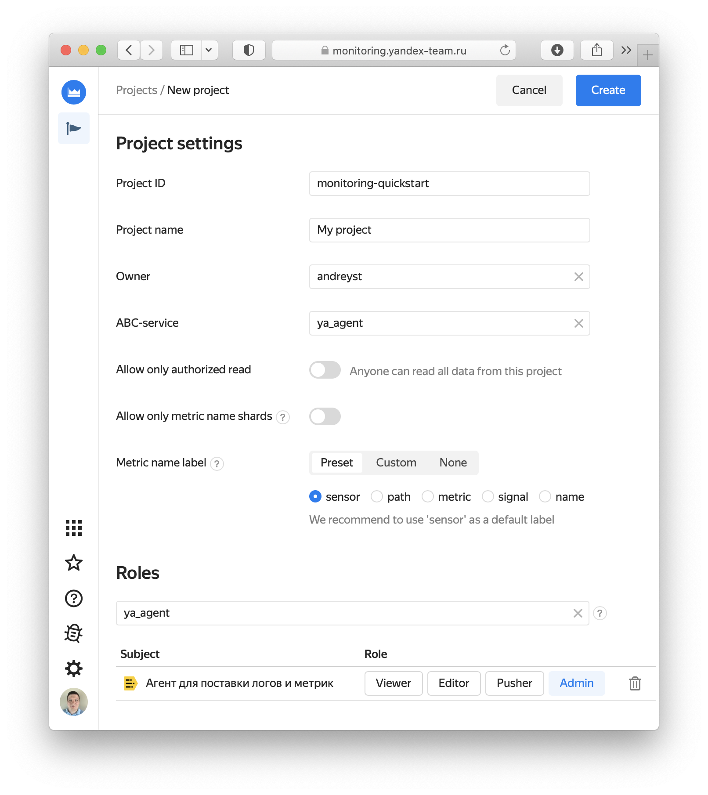

# Начало работы с Solomon

В этом документе приведена пошаговая инструкция, как начать работу с Solomon, для сервисов, развёрнутых в "большом Яндексе" — в RTC (Deploy, Nanny), на собственном железе или другим способом во внутренней сети Яндекса, а не в Яндекс.Облаке.

## Адреса инсталляции {#installation}
В "большом Яндексе" следует использовать внутреннюю инсталляцию Solomon `solomon.yandex-team.ru`.

Адреса веб-интерфейсов этой инсталляции:
- Monitoring UI: [https://monitoring.yandex-team.ru](https://monitoring.yandex-team.ru).
- Solomon UI: [https://solomon.yandex-team.ru](https://solomon.yandex-team.ru).

## Получение сетевых доступов {#access}

Для получения сетевых доступов необходимо создать заявку через Puncher от `_SOLOMONNETS_` к хостам, на которых вы развернёте демонстрационное приложение ([шаблон заявки](https://puncher.yandex-team.ru/?create_sources=_SOLOMONNETS_&create_protocol=tcp&create_locations=office&create_locations=vpn&create_comment=Solomon%20собирает%20метрики%20в%20pull-режиме&create_ports=3451)) .



Во внутренней сети уже есть доступ к макросу `_HBFPROJECTSNETS_` (хосты в Deploy/Nanny/Qloud/RTC) по портам 3400-3499. Проверить наличие доступа к вашим хостам можно [через Puncher](https://puncher.yandex-team.ru/?rules=exclude_inactive&sort=source&source=_SOLOMONNETS_), указав хост своего приложения в поле "Назначения" и порт в поле "Порты".


  
Подробная инструкция приведена в разделе ["Получение сетевых доступов"](network_access.md).

## Создание проекта {#project}

Прежде чем передавать метрики в Solomon, необходимо создать проект и настроить права доступа к нему в интерфейсе [Monitoring UI](https://monitoring.yandex-team.ru/projectCreate). На странице создания проекта необходимо указать следующие параметры:

- **Project ID** – уникальный идентификатор проекта, значение метки `project` у метрик. Рекомендуется делать идентичным slug-у ABC-сервиса;

- **Project name** – человекочитаемое название проекта, которое будет отображаться в списке проектов;

- **ABC service** — имя (slug) ABC-сервиса, к которому относится проект.

- **Roles** — пользователи, стафф-группы, ABC-сервисы или ролевые скоупы ABC, которым нужно предоставить доступ к проекту. Рекомендуется выдавать права Admin вашему ABC-сервису или его части.

{ width="650" }
<small>Рисунок 1 — Страница создания проекта.</small>





- Deploy

	- Нажмите кнопку _"+"_ в блоке _Cluster hosts_;
	- Выберите пункт _YP clusters_ в левом меню;
	- Укажите идентификатор endpoint set в поле _Endpoint set ID_ (в формате `<stage ID>.<deploy unit ID>.<endpoint set ID>`) - не копируйте из UI Deploy, а напишите вручную, так как при копировании в хвосте идентификатора добавляются лишние невидимые символы;
	- Укажите кластер Deploy в поле _Cluster_ (если поды разворачиваются в нескольких кластерах, операцию добавления хостов необходимо проделать для каждого кластера отдельно);
	- Остальные поля оставьте без изменений;
	- Нажмите кнопку _OK_.

- Nanny

	- Нажмите кнопку _"+"_ в блоке _Cluster hosts_;
	- Выберите пункт _Nanny_ в левом меню;
	- Укажите название сервиса в поле _Group name_;
	- Остальные поля оставьте без изменений;
	- Нажмите кнопку _OK_.

- Conductor

	- Нажмите кнопку _"+"_ в блоке _Cluster hosts_;
	- Выберите пункт _Conductor_ или _Conductor tag_ в левом меню;
	- Укажите название кондукторной группы или тег кондуктора, остальные поля оставьте пустыми;
	- Нажмите кнопку _OK_.

- Список хостов

	- Нажмите кнопку _"+"_ в блоке _Cluster hosts_;
	- Выберите пункт _Hosts_ в левом меню;
	- Укажите FQDN хоста в поле _URL pattern_, остальные поля оставьте пустыми;
	- Нажмите кнопку _OK_.

- Другие способы

	В Solomon также реализованы другие способы обнаружения хостов:
	- динамически через вызов API-метода (_Host URLs_);
	- контейнеры в Qloud по компоненту/окружению/приложению/проекту/развёртыванию (_Qloud_);
	- подсеть в формате CIDR (_Network_);
	- поды в YP по идентификатору pod set (_YP clusters_, поле _Pod set ID_);
	- в Яндекс.Облаке доступны [дополнительные способы](./quickstart-cloud.md#cluster) обнаружения хостов.





1. Откройте веб-интерфейс [Monitoring](https://monitoring.yandex-team.ru);
1. Выберите ваш проект в списке;



