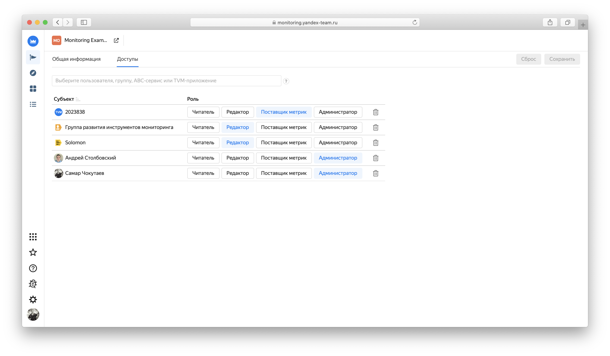

# Управление доступом в {{ monitoring-name }}



Пользователь {{ yandex-cloud }} может выполнять только те операции над ресурсами, которые разрешены назначенными ему ролями. Пока у пользователя нет никаких ролей, почти все операции ему запрещены.

Чтобы разрешить доступ к ресурсам сервиса {{ monitoring-full-name }}, назначьте пользователю нужные роли из приведенного ниже списка. 

На данный момент роль может быть назначена только на родительский ресурс (каталог или облако), роли которого наследуются вложенными ресурсами.



Подробнее о наследовании ролей читайте в разделе [{#T}](../../resource-manager/concepts/resources-hierarchy.md#access-rights-inheritance) документации сервиса {{ resmgr-full-name }}.



## Назначение ролей {#grant-roles}

Чтобы назначить пользователю роль:



## Роли {#roles}

Ниже перечислены все роли, которые учитываются при проверке прав доступа в сервисе {{ monitoring-full-name }}.



### {{ roles-monitoring-viewer }} {#monitoring-viewer}

Пользователь с ролью `{{ roles-monitoring-viewer }}` может просматривать созданные дашборды и виджеты, а также загруженные метрики.

### {{ roles-monitoring-editor }} {#monitoring-editor}

Пользователь с ролью `{{ roles-monitoring-editor }}` может создавать дашборды и виджеты, загружать метрики и управлять алертами.

Помимо этого роль `{{ roles-monitoring-editor }}` включает в себя все разрешения роли `{{ roles-monitoring-viewer }}`.

### {{ roles-monitoring-admin }} {#monitoring-admin}

Пользователь с ролью `{{ roles-monitoring-admin }}` может создавать дашборды и виджеты, загружать метрики и управлять алертами.

Помимо этого роль `{{ roles-monitoring-admin }}` включает в себя все разрешения роли `{{ roles-monitoring-editor }}`.





Для разграничения доступа к конфигурации и данным проекта используется механизм ролей. Роли можно выдавать staff-пользователям, staff-группам, ABC-сервисам, ролевым скоупам ABC и TVM-приложениям.

Выдача и отзыв ролей осуществляется на вкладке *Доступ (Access)* в настройках проекта в интерфейсе [Monitoring UI](https://monitoring.yandex-team.ru). 

{ width="1552" }
<small>Рисунок 1 — Страница управления доступом.</small>

Ниже перечислены возможные роли, а также права, которые они выдают:

- *Читатель (Viewer)* – может просматривать конфигурацию проекта и метрики в проекте. Права проверяются, только если у проекта выставлена настройка «Запретить чтение неавторизованным пользователям»;

- *Редактор (Editor)* — может просматривать метрики в проекте, а также просматривать и редактировать конфигурацию проекта: настройки проекта, кластера, сервисы, шарды, графики, дашборды, алерты, быстрые ссылки;

- *Поставщик метрик (Pusher)* — может поставлять метрики в проект, но не может их читать. Как правило, роль выдается роботным пользователям, поставляющим метрики в Push-режиме; 

- *Администратор (Admin)* – может выполнять любые действия в проекте, в том числе выдавать, изменять и удалять роли.



Для того, чтобы выдать доступ TVM-приложению, используйте формат *tvm-XXXXXX*, где *XXXXXX* – это номер TVM-приложения.




