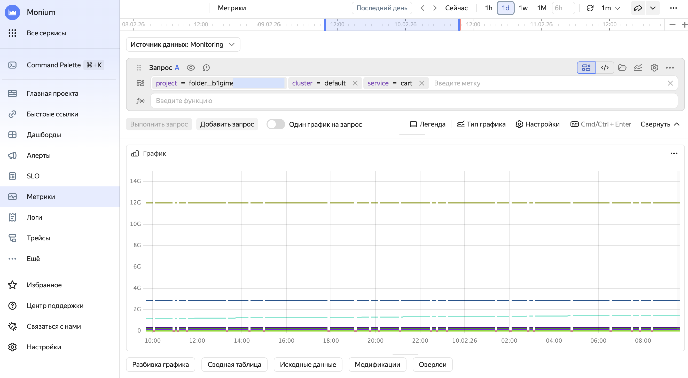
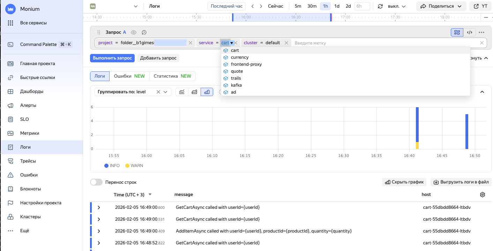
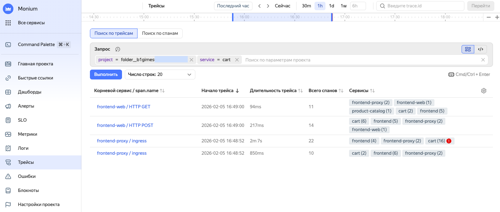

# Настройка демо-приложения и сбор телеметрии в {{ k8s }}

Вы настроите демо-приложение в кластере {{ k8s }} и передадите телеметрию приложения в {{ monium-name }}. В инструкции для разворачивания кластера используется сервис {{ managed-k8s-name }}, но вы можете использовать любой ваш кластер {{ k8s }}.

## Перед началом работы {#before-you-begin}



### Необходимые платные ресурсы {#paid-resources}

В стоимость ресурсов для работы с {{ monium-name }} входит:
* Плата за использование [мастера {{ managed-k8s-name }}](../../managed-kubernetes/concepts/index.md#master) (см. [тарифы {{ managed-k8s-name }}](../../managed-kubernetes/pricing.md)).
* Плата за [вычислительные ресурсы](../../compute/concepts/vm-platforms.md) и [диски](../../compute/concepts/disk.md) [группы узлов {{ managed-k8s-name }}](../../managed-kubernetes/concepts/index.md#node-group) (см. [тарифы {{ compute-full-name }}](../../compute/pricing.md)).
* Плата за использование {{ monium-name }} (см. [тарифы {{ monium-name }}](../pricing.md)).

## Настройка кластера {#preparation}



- Консоль управления {#console}

  1. Создайте кластер [{{ k8s }}](../../managed-kubernetes/quickstart.md).

  1. 

  1. 

  1. Добавьте репозиторий Helm-чартов OpenTelemetry:
      
      ```bash
      helm repo add open-telemetry https://open-telemetry.github.io/opentelemetry-helm-charts
      helm repo update
      ```

      Из этого репозитория будет установлен агент OpenTelemetry Collector для сборки телеметрии из приложений в кластере {{ k8s }} и демо-приложение OpenTelemetry Demo — интернет-магазин.

  1. Создайте [сервисный аккаунт](../../iam/operations/sa/create.md) с ролью `monium.telemetry.writer` и [API-ключ](../../iam/operations/authentication/manage-api-keys.md) с областью действия `yc.monium.telemetry.write`.

  1. Добавьте API-ключ в секреты кластера:
      
      ```bash
      export NS=default
      kubectl -n $NS create secret generic monium-secrets \
      --from-literal=MONIUM_API_KEY='<API-ключ>'
      ```



## Поставка и просмотр телеметрии {#view-telemetry}

1. Создайте файл со следующей конфигурацией `otel-demo-monium.yml`:

    ```yaml
    # https://github.com/open-telemetry/opentelemetry-helm-charts/blob/main/charts/opentelemetry-demo/README.md
    opentelemetry-collector:
    extraEnvsFrom:
        - secretRef:
            name: monium-secrets

    config:
        receivers:
        # Сбор метрик grafana, по умолчанию не настроено в демо-приложении
        prometheus:
            config:
            scrape_configs:
                - job_name: "grafana"
                kubernetes_sd_configs:
                    - role: pod
                relabel_configs:
                    # Фильтр по метке (оставляем только grafana)
                    - source_labels: [__meta_kubernetes_pod_label_app_kubernetes_io_name]
                    action: keep
                    regex: grafana

                    # Заменяем адрес на IP пода и порт 3000
                    - source_labels: [__address__]
                    action: replace
                    regex: "([^:]+)(?::\\d+)?"
                    replacement: "$1:3000"
                    target_label: __address__

                    # Указываем путь к метрикам
                    - action: replace
                    target_label: __metrics_path__
                    replacement: /grafana/metrics

        exporters:
        debug:
            verbosity: detailed

        otlp/monium:
            compression: none
            endpoint: {{ api-host-monium }}:443
            headers:
            Authorization: "Api-Key ${env:MONIUM_API_KEY}"
            x-monium-project: folder__<идентификатор_каталога>

        service:
        extensions: [health_check]
        pipelines:
            traces:
            receivers: [otlp]
            exporters: [otlp, spanmetrics, otlp/monium]

            logs:
            receivers: [otlp]
            exporters: [opensearch, otlp/monium]

            metrics:
            receivers: [httpcheck/frontend-proxy, otlp, prometheus, redis, spanmetrics]
            exporters: [otlphttp/prometheus, otlp/monium]

        telemetry:
            resource:
            service: otel-collector
            metrics:
            level: detailed
            readers:
                - periodic:
                    exporter:
                    otlp:
                        endpoint: ${env:MY_POD_IP}:4317
                        protocol: grpc
                    interval: 10000
                    timeout: 5000
    ```

1. Установите демо-приложение с поставкой логов, метрик и трейсов в {{ monium-name }}:

    ```bash
    helm uninstall otel-demo-monium -n $NS --ignore-not-found
    helm install otel-demo-monium open-telemetry/opentelemetry-demo \
    --version 0.37 \
    -n $NS \
    --values otel-demo-monium.yml
    ```
1. Создайте трафик, чтобы отправлять телеметрию.

     1. Настройте проброс портов для сервиса `frontend-proxy`:

        ```bash
        kubectl --namespace default port-forward svc/frontend-proxy 8080:8080
        ```
     1. В браузере откройте интернет-магазин по адресу `http://localhost:8080/` и совершайте действия пользователя. Например, добавьте товар в корзину.

## Посмотрите данные телеметрии {#view-telemetry}



- Интерфейс {{ monium-name }} {#console}

  1. На главной странице [{{ monium-name }}]({{ link-monium }}) слева выберите **{{ ui-key.yacloud_monitoring.aside-navigation.menu-item.shards.title }}**.
  1. В списке выберите шард с названием сервиса, который работает внутри интернет-магазина. Например, `cart` или `product-catalog`.

     Имя шарда формируется как `<имя_проекта>_<имя_кластера>_<имя_сервиса>`, например `folder__{{ folder-id-example }}_default_cart`.
  
  1. Чтобы посмотреть отдельный тип данных, слева выберите:

     * **{{ ui-key.yacloud_monitoring.aside-navigation.menu-item.explorer.title }}**.
       
       В строке запроса последовательно выберите:
             * `project=folder__<идентификатор_каталога>`; 
             * `cluster=default`, 
             * `service=cart` 
             * и нажмите **{{ ui-key.yacloud_monitoring.querystring.action.execute-query }}**.

       
       
       
       
       

       Подробнее о [работе с метриками](../operations/metric/metric-explorer.md).

     * **{{ ui-key.yacloud_monitoring.aside-navigation.menu-item.logs.title }}**.
     
       В строке запроса последовательно выберите `project`, `cluster`, `service` и нажмите **{{ ui-key.yacloud_monitoring.querystring.action.execute-query }}**.

       
       
       
       
       

       Подробнее о [работе с логами](../logs/).
     
     * **{{ ui-key.yacloud_monitoring.aside-navigation.menu-item.traces.title }}**.

       В строке запроса последовательно выберите `project` и `service` и нажмите **Выполнить**.

       
       
       
       
       

       Подробнее о [работе с трейсами](../traces/operations/traces-explorer.md).



Для использования данных телеметрии создайте [дашборд](../operations/dashboard/create.md) и [алерты](../operations/alert/create-alert.md).

## Если телеметрия не отображается в {{ monium-name }} {#troubleshooting}

* [Убедитесь](#preparation), что сервисный аккаунт и API-ключ имеют нужные роли и области действия.

* Проверьте, что в секретах указан верный API-ключ:

    ```bash
    kubectl get secret monium-secrets -n $NS -o jsonpath='{.data.MONIUM_API_KEY}' | base64 -d
    ```

* Проверьте логи OTel Collector:

    ```bash
    kubectl logs -l app.kubernetes.io/name=opentelemetry-collector -n $NS
    ```

* Убедитесь, что эндпоинт {{ monium-name }} доступен:

    ```bash
    kubectl run -it --rm debug --image=curlimages/curl --restart=Never -- \
    curl -v https://ingest.monium.yandex.cloud
    ```

