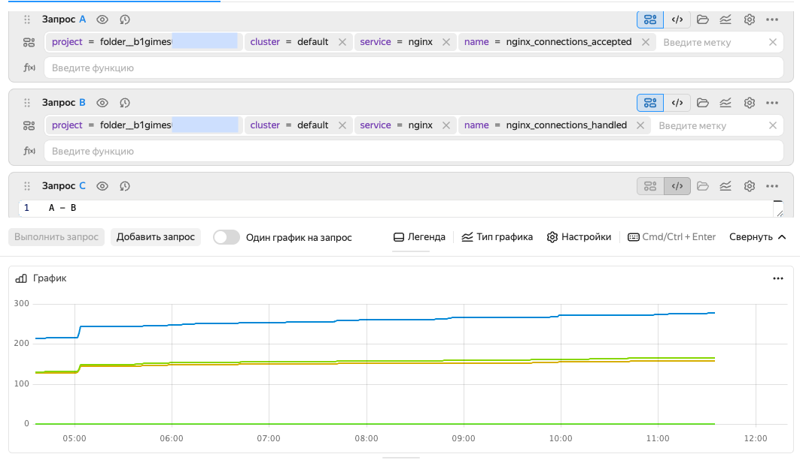
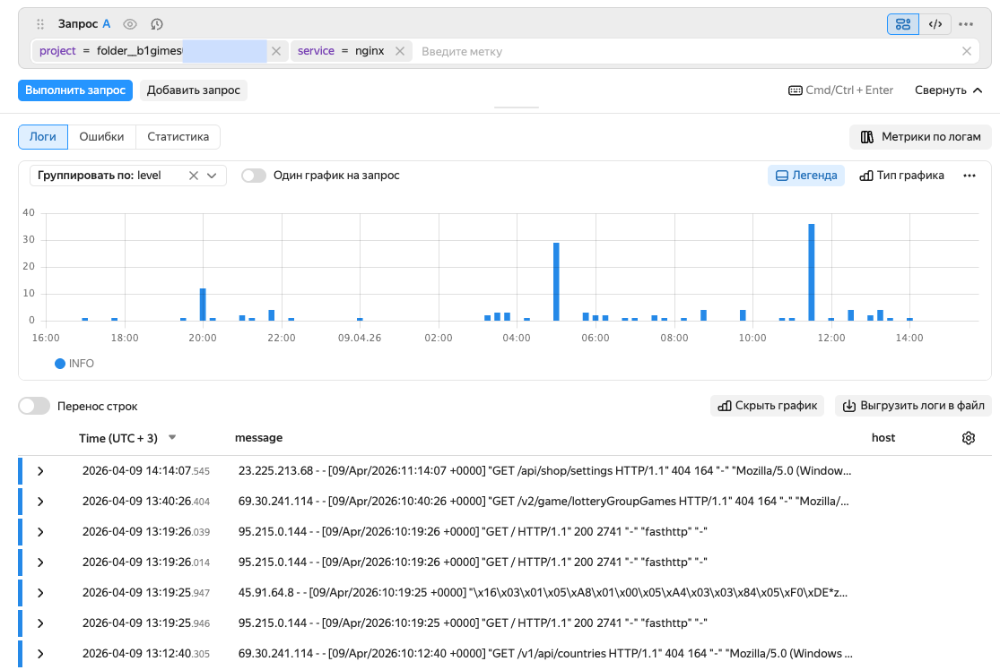
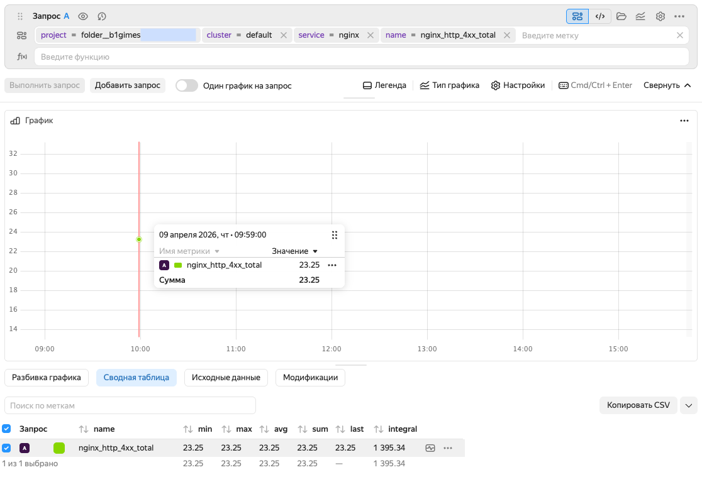

# Настройка сбора телеметрии Nginx в {{ k8s }}

Вы настроите веб-сервер Nginx в кластере {{ k8s }} и передадите его метрики и логи в {{ monium-name }}. В инструкции для разворачивания кластера используется сервис {{ managed-k8s-name }}, но вы можете использовать любой ваш кластер {{ k8s }}.

Чтобы настроить сбор телеметрии веб-сервера в кластере:

1. [Настройте кластер {{ k8s }}](#cluster-settings).
1. [Настройте аутентификацию](#auth-settings) — создайте сервисный аккаунт и API-ключ для отправки данных в {{ monium-name }}.
1. [Установите и настройте Nginx](#nginx-install) — разверните веб-сервер с экспортером метрик.
1. [Установите OpenTelemetry Collector](#install-otel-collector) — настройте сбор и отправку метрик.
1. [Просмотрите метрики в {{ monium-name }}](#view-metrics).
1. [Настройте сбор логов](#logs-settings).
1. [Просмотрите логи в {{ monium-name }}](#view-logs).
1. [Настройте дополнительные метрики по логам](#metrics-from-logs).
1. [Создайте дашборд и алерты](#dashboard-alerts).

## Перед началом работы {#before-you-begin}



### Необходимые платные ресурсы {#paid-resources}

В стоимость ресурсов для работы с {{ monium-name }} входит:
* Плата за использование [мастера {{ managed-k8s-name }}](../../managed-kubernetes/concepts/index.md#master) — [тарифы {{ managed-k8s-name }}](../../managed-kubernetes/pricing.md).
* Плата за [вычислительные ресурсы](../../compute/concepts/vm-platforms.md) и [диски](../../compute/concepts/disk.md) [группы узлов {{ managed-k8s-name }}](../../managed-kubernetes/concepts/index.md#node-group) — [тарифы {{ compute-full-name }}](../../compute/pricing.md).
* Плата за использование {{ monium-name }} — [тарифы {{ monium-name }}](../pricing.md).

## Настройка кластера {#cluster-settings}



- Консоль управления {#console}

  1. Создайте кластер [{{ k8s }}](../../managed-kubernetes/quickstart.md).

  1. 




## Настройка аутентификации {#auth-settings}

На этом шаге вам нужно получить и сохранить API-ключ и идентификатор каталога, которые используются на шаге [настройки OpenTelemetry Collector](#install-otel-collector).



- Консоль управления {#console}

  1. Создайте [сервисный аккаунт](../../iam/operations/sa/create.md) с ролью `monium.telemetry.writer`:
     1. [Перейдите](../../console/operations/select-service.md#select-service) в сервис **{{ ui-key.yacloud.iam.folder.dashboard.label_iam }}**.
     1. Нажмите кнопку **{{ ui-key.yacloud.iam.folder.service-accounts.button_add }}**.
     1. Введите имя сервисного аккаунта, например, `monium-ca`.
     1. Нажмите  **{{ ui-key.yacloud_components.acl.button.add-role }}** и выберите `monium.telemetry.writer`.
     1. Нажмите **{{ ui-key.yacloud.iam.folder.service-account.popup-robot_button_add }}**.
  
  1. Создайте [API-ключ](../../iam/operations/authentication/manage-api-keys.md) с областью действия `yc.monium.telemetry.write`:
     1. Выберите в списке созданный сервисный аккаунт.
     1. Нажмите кнопку  **{{ ui-key.yacloud.iam.folder.service-account.overview.button_create-key-popup }}** и выберите пункт **{{ ui-key.yacloud.iam.folder.service-account.overview.button_create_api_key }}**.
     1. В поле **{{ ui-key.yacloud.iam.folder.service-account.overview.field_key-scope }}** выберите `yc.monium.telemetry.write`.
     1. Нажмите кнопку **{{ ui-key.yacloud.iam.folder.service-account.overview.popup-key_button_create }}**.
  
  1. Скопируйте API-ключ и сохраните его в безопасном месте, он понадобится дальше.
  1. Скопируйте идентификатор каталога, в котором создан кластер и сервисный аккаунт. Для этого вверху нажмите название каталога и в списке напротив нужного каталога нажмите  →  **Копировать ID**.
  



## Установка и настройка Nginx {#nginx-install}

1. Создайте файл с конфигурацией веб-сервера и HTML-страницей Nginx:
  
     

     
     
      

1. Создайте файл для управления запуском и масштабированием подов с Nginx.

     

     
     
     
   
   Для мониторинга Nginx в {{ k8s }} потребуется экспортер (nginx-exporter), который преобразует внутреннюю статистику Nginx в формат для OpenTelemetry Collector.

   В файле `deployment.yaml` экспортер добавлен в виде сайдкара:

   ```yaml
   - name: nginx-exporter
     image: nginx/nginx-prometheus-exporter:0.10.0
     args:
       - -nginx.scrape-uri=http://localhost/nginx_status
     ports:
       - name: metrics
         containerPort: 9113
     resources:
       limits:
         memory: 128Mi
         cpu: 500m
   ```

   Каждый под приложения Nginx будет содержать в себе два контейнера: `nginx` и `nginx-exporter`.
  
     
1. Создайте файл с параметрами доступа к Nginx:
  
     

     
     
     

1. Разверните Nginx:

    ```bash
    kubectl create namespace nginx-demo
    kubectl apply -f configmap.yaml
    kubectl apply -f deployment.yaml
    kubectl apply -f services.yaml
    ```

1. Проверьте, что приложение запустилось:

    ```bash
    kubectl get service -n nginx-demo nginx-web
    ```

    Результат:
    ```bash
    NAME        TYPE           CLUSTER-IP      EXTERNAL-IP     PORT(S)        AGE
    nginx-web   LoadBalancer   10.96.238.139   158.260.329.4   80:32761/TCP   104s
    ```

1. Откройте в браузере адрес, указанный в столбце `EXTERNAL-IP`. Например: `http://158.260.329.4`. Должна быть показана HTML-страница из файла `configmap.yaml`.

   
        
   
        
   

## Установка и настройка OpenTelemetry Collector {#install-otel-collector}

На этом шаге вы установите [OpenTelemetry Collector Contrib](https://github.com/open-telemetry/opentelemetry-collector-contrib) — расширенную версию коллектора с дополнительными компонентами для сбора логов, парсинга и других задач. Для сбора только метрик достаточно базовой версии [OpenTelemetry Collector](https://github.com/open-telemetry/opentelemetry-collector), но для работы с логами требуется Contrib-версия, будем сразу использовать ее.

1. Создайте файл для установки OpenTelemetry Collector и отправки метрик в {{ monium-name }}:
  
     

     
     
     

    В этом файле подставьте свои значения `<API-ключ>` и `<идентификатор_каталога>`, сохраненные на шаге [Настройка аутентификации](#auth-settings).

1. Установите OTel Collector и начните отправку метрик:

    ```bash
    kubectl apply -f otel-config.yaml
    ```

1. Проверьте, что появился новый под `otel-collector`:

    ```bash
    kubectl get pods --namespace nginx-demo
    ```

    Результат:
    ```bash
    NAME                              READY   STATUS    RESTARTS   AGE
    nginx-server-949d9f98b-kzlrd      2/2     Running   0          2d2h
    nginx-server-949d9f98b-ngtsp      2/2     Running   0          2d2h
    nginx-server-949d9f98b-tclvh      2/2     Running   0          2d2h
    otel-collector-6cd848c59d-k6g2p   1/1     Running   0          12s
    ```

## Просмотр метрик в {{ monium-name }} {#view-metrics}



- Интерфейс {{ monium-name }} {#console}

  1. На главной странице [{{ monium-name }}]({{ link-monium }}) слева выберите **{{ ui-key.yacloud_monitoring.aside-navigation.menu-item.explorer.title }}**.
       
  1. В строке запроса последовательно выберите:
     * `project=folder__<идентификатор_каталога>`; 
     * `cluster=default`;
     * `service=nginx`;
     * `name=nginx_up`.
     
     Для запроса можно использовать [текстовый режим](../concepts/visualization/query-string#query-text). Для этого нажмите кнопку  и введите запрос текстом:

     ```text
     `project=folder__<идентификатор_каталога>; cluster=default; service=nginx; name=nginx_up`.
     ```
     
     Метрика показывает статус доступности Nginx: `1` — доступен, `0` — недоступен. Агрегированное значение равно `3` по количеству подов.

  1. Нажмите **{{ ui-key.yacloud_monitoring.querystring.action.execute-query }}**.



Подробнее о [работе с метриками](../operations/metric/metric-explorer.md).

Если данные не появились в {{ monium-name }}, см. раздел [{#T}](../collector/troubleshooting.md).

Комбинируя различные метрики в запросах, вы можете определять, справляется ли веб-сервер с текущей нагрузкой, есть ли отброшенные соединения из-за нехватки ресурсов, как быстро обрабатываются запросы.

### Количество активных соединений {#active-connections}

Чтобы оценить количество активных соединений, для метрики `name` укажите значение:
* `nginx_connections_accepted` — количество принятых соединений с момента запуска Nginx. Используется для отслеживания общей нагрузки.
* `nginx_connections_reading` — количество соединений, из которых Nginx читает запросы клиентов. Показывает активность входящих запросов.
* `nginx_connections_writing` — количество соединений, в которые Nginx отправляет ответы клиентам. Показывает активность исходящих ответов.

### Количество необработанных соединений {#unprocessed-connections}

Чтобы оценить количество соединений, которые Nginx не обрабатывает, используются метрики:
* `nginx_connections_accepted` — количество принятых соединений.
* `nginx_connections_handled` — количество обработанных соединений.

Разница между обработанными и принятыми соединениями покажет количество соединений, которые были приняты, но не были корректно обработаны Nginx.

Создайте три запроса: `Запрос A` — для метрики `nginx_connections_accepted`, `Запрос B` — для метрики `nginx_connections_handled`, `Запрос C` — для вычисления разницы между метриками. Чтобы создать дополнительный запрос, нажмите кнопку **{{ ui-key.yacloud_monitoring.querystring.action.add-query }}**.

* Запрос A:
  ```text
  `project=folder__<идентификатор_каталога>; cluster=default; service=nginx; name=nginx_connections_accepted`.
  ```

* Запрос B:
  ```text
  `project=folder__<идентификатор_каталога>; cluster=default; service=nginx; name=nginx_connections_handled`.
  ```
* Запрос C: в строке запроса введите `A - B`.


       

       


Чтобы отображать на графике только результирующий запрос, рядом с запросами `A` и `B` нажмите  — графики будут скрыты. Чтобы показать скрытые графики, нажмите .

В тестовом примере необработанных соединений нет, поэтому в запросе `C` все значения нулевые. Для реальных систем эти значения удобно отображать в виде отношения `(A - B) / A` — доля соединений, которые Nginx принял, но не обработал. На этот показатель можно завести [алерт](../concepts/alerting/alert.md), который будет уведомлять, например, когда доля отброшенных соединений больше `5%`.

## Настройка сбора логов {#logs-settings}

1. Создайте новый файл конфигурации для сбора логов:
  
    

    
        
    
    
    В этом файле добавлен блок с ресивером:

    ```yaml
    filelog:
      include:
        - /var/log/pods/nginx-demo_nginx-server-*/nginx/*.log
      operators:
        - type: container
          id: container-parser
    ```

    А также маршрут (`pipeline`) для сбора логов и параметры монтирования (`volumeMounts`, `volumes`) для доступа к логам подов.

1. Удалите прежний файл конфигурации и примените новый:

   ```bash
   kubectl delete -f otel-config.yaml
   kubectl apply -f otel-config-logs.yaml
   ```

## Просмотр логов в {{ monium-name }} {#view-logs}



- Интерфейс {{ monium-name }} {#console}

  1. На главной странице [{{ monium-name }}]({{ link-monium }}) слева выберите **{{ ui-key.yacloud_monitoring.aside-navigation.menu-item.logs.title }}**.
       
  1. В строке запроса выберите:
     * `project=folder__<идентификатор_каталога>`; 
     * `service=nginx`.

  1. Нажмите **{{ ui-key.yacloud_monitoring.querystring.action.execute-query }}**.

   
        
   
        
   



Подробнее о [работе с логами](../logs/logs-explorer.md).

## Настройка сбора метрик из логов {#metrics-from-logs}

Помимо стандартных метрик, которые Nginx отправляет через экспортер {{ prometheus-name }}, OTel Collector позволяет извлекать дополнительные метрики из логов приложения. Например, подсчитывать количество HTTP-ответов с разными кодами статуса.

Для получения этих метрик создайте и примените новый файл конфигурации:




        


В этой конфигурации есть следующие дополнения:

1. Извлечение данных из логов.

   В блок `filelog` добавлен оператор `regex_parser`, который будет извлекать из строки access-лога Nginx нужные поля (метод запроса, URL, HTTP-код ответа и другие):

   ```yaml
   filelog:
     include:
       - /var/log/pods/nginx-demo_nginx-server-*/nginx/*.log
     operators:
       - type: container
         id: container-parser

       - type: regex_parser
         id: nginx-access
         parse_from: body
         regex: '^(?P<remote_addr>\S+) - (?P<remote_user>\S+) \[(?P<time_local>[^\]]+)\] "(?P<method>\S+) (?P<target>\S+) (?P<protocol>[^"]+)" (?P<status>\d{3}) (?P<body_bytes_sent>\d+)'
   ```

   Этот оператор извлечет из каждой строки лога поле `status` (HTTP-код ответа), которое будем использовать для создания метрик.

1. Создание метрик из логов.

   Добавлен коннектор `count` для подсчета количества записей в логах по заданным условиям. В примере подсчитываются ответы с кодами `2xx`, `4xx` и `5xx`:

   ```yaml
   connectors:
     count/nginx:
       logs:
         nginx_http_2xx_total:
           description: Количество успешных ответов (2xx)
           conditions:
             - 'IsMatch(attributes["status"], "^2..$")'

         nginx_http_4xx_total:
           description: Количество клиентских ошибок (4xx)
           conditions:
             - 'IsMatch(attributes["status"], "^4..$")'

         nginx_http_5xx_total:
           description: Количество серверных ошибок (5xx)
           conditions:
             - 'IsMatch(attributes["status"], "^5..$")'
   ```

1. Настройка маршрутов (pipelines).

   Добавлен pipeline `metrics/logs`, который будет получать метрики от коннектора `count/nginx` и отправлять их в {{ monium-name }} вместе с остальными метриками:

   ```yaml
   service:
     extensions: [zpages]
     pipelines:
       metrics:
         receivers: [prometheus]
         processors: [memory_limiter, resource, batch]
         exporters: [otlp/monium, debug]
       
       logs:
         receivers: [filelog]
         processors: [memory_limiter, resource, batch]
         exporters: [count/nginx, otlp/monium, debug]
       
       metrics/logs:
         receivers: [count/nginx]
         processors: [memory_limiter, resource, batch]
         exporters: [otlp/monium, debug]
   ```

После применения конфигурации в {{ monium-name }} будут доступны новые метрики:
* `nginx_http_2xx_total` — количество успешных ответов.
* `nginx_http_4xx_total` — количество клиентских ошибок.
* `nginx_http_5xx_total` — количество серверных ошибок.


        

        


Эти метрики полезны для мониторинга качества обслуживания и выявления проблем. Например, резкий рост `5xx` ошибок может указывать на сбой в приложении.

## Создание дашборда и алертов {#dashboard-alerts}

Для постоянного мониторинга состояния Nginx [создайте дашборд](../operations/dashboard/create.md) с ключевыми метриками и [настройте алерты](../operations/alert/create-alert.md) для оповещения о проблемах.

Для Nginx рекомендуется добавить на дашборд графики с метриками:

* `nginx_connections_accepted` — количество принятых соединений с момента запуска.
* `nginx_connections_active` — количество активных соединений в данный момент.
* `nginx_connections_handled` — количество обработанных соединений.
* `nginx_connections_reading` — количество соединений, из которых Nginx читает запросы.
* `nginx_connections_waiting` — количество соединений в режиме ожидания.
* `nginx_connections_writing` — количество соединений, в которые Nginx отправляет ответы.
* `nginx_requests_total` — общее количество обработанных запросов.
* `nginx_http_2xx_total` — количество успешных ответов (код 2xx).
* `nginx_http_4xx_total` — количество клиентских ошибок (код 4xx).
* `nginx_http_5xx_total` — количество серверных ошибок (код 5xx).

Для уведомления о критических ситуациях рекомендуются алерты:

* **Рост серверных ошибок** — увеличение `nginx_http_5xx_total`.
   
   Условие срабатывания: значение больше `10` в течение пяти минут.

* **Рост клиентских ошибок** — увеличение `nginx_http_4xx_total`.
   
   Условие срабатывания: значение больше `50` в течение пяти минут.   

* [Необработанные соединения](#unprocessed-connections) — разница между принятыми и обработанными соединениями.

   Условие срабатывания: значение больше `0` в течение пяти минут.

Пороговые значения и временные интервалы настраивайте в соответствии с требованиями вашего приложения.
