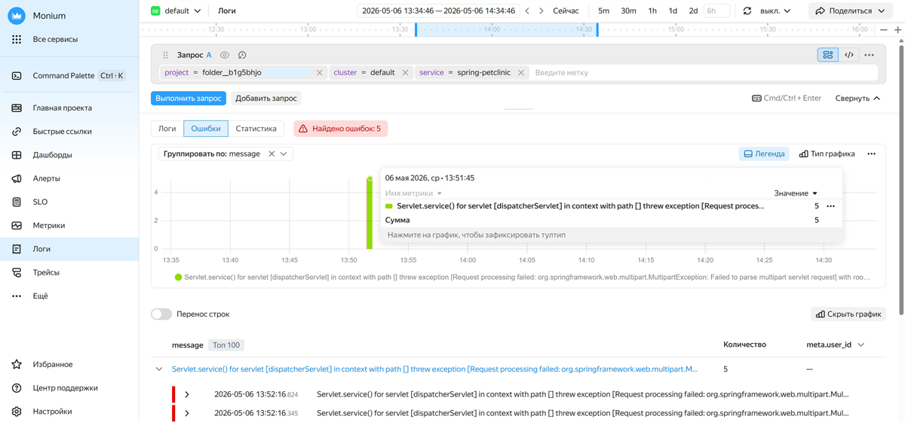
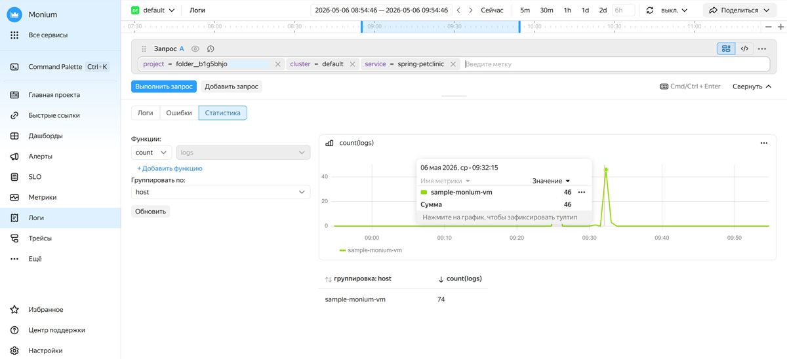

# Работать с ошибками и статистикой

Интерфейс для работы с логами содержит дополнительные разделы **[{{ ui-key.yacloud_monitoring.aside-navigation.menu-item.logs-analytics.title }}](#view-errors)** и **[Статистика](#view-stats)**, позволяющие более удобно исследовать логи, содержащие ошибки, а также формировать и анализировать статистику объема и распределения логов.

## Просмотр ошибок {#view-errors}

Вкладка **{{ ui-key.yacloud_monitoring.aside-navigation.menu-item.logs-analytics.title }}** показывает отдельный график и записи логов, содержащих поле `level="ERROR"`.

Раздел может быть полезен, если вам необходимо быстро выделить ошибки в общем потоке логов без необходимости создания отдельного запроса вручную или отследить динамику ошибок во времени. Например, так можно быстро обнаружить всплеск количества ошибок после релиза.





- Интерфейс {{ monium-name }} {#console}

  1. На главной странице сервиса [{{ monium-name }}]({{ link-monium }}) в меню слева выберите **{{ ui-key.yacloud_monitoring.aside-navigation.menu-item.logs.title }}**.
  1. В центральной части экрана выберите вкладку **{{ ui-key.yacloud_monitoring.aside-navigation.menu-item.logs-analytics.title }}**.
  1. В верхней части экрана задайте промежуток поиска данных одним из способов:

      * выберите варианты интервалов: `5m`, `30m` и так далее — будут показаны данные за последние 5, 30 минут;
      * введите интервал времени вручную;
      * в поле с точным временным промежутком укажите границы **От** и **До**;
      * на шкале времени перетащите границы промежутка.
  1. В строке запроса выберите метки для поиска логов.

      Телеметрия в {{ monium-name }} организована в иерархии «проект → кластер → сервис». Поэтому в строке запроса необходимо выбрать параметры `project`, `cluster` и `service`.

      * Для поиска логов с ошибками приложения укажите:

          

      * Для поиска логов с ошибками ресурса {{ yandex-cloud }} укажите:

          

      Запрос можно вводить в режиме токенов, выбирая метки из списка, или в текстовом режиме. Чтобы переключиться в текстовый режим, нажмите  и введите запрос в формате:

      ```json
      { <key>="<value>", <key>="<value>", ... }
      ```

      Подробнее о составлении запросов см. в разделах [{#T}](../concepts/data-model.md) и [{#T}](../concepts/querying.md).

      Пример запроса для поиска логов приложения:

      ```json
      {project = "market", cluster = "production", service = "basket"}
      ```

  1. Нажмите **{{ ui-key.yacloud_monitoring.querystring.action.execute-query }}**.



В результате сервис выведет информацию о найденных в заданном интервале логах с ошибками:

* общее количество зафиксированных ошибок;
* [визуализацию данных об ошибках](#error-visualization);
* [подробные сведения о записях с ошибками](#error-records).

### Визуализация записей с ошибками {#error-visualization}

На графике отображается количество записей логов с ошибками во времени. График автоматически обновляется при изменении запроса или временного диапазона.

При работе с графиком доступны возможности:

* **Окно информации**:

    * Чтобы открыть окно с информацией об ошибках, поступивших в конкретный момент времени, подведите курсор к нужной части графика.
    * Чтобы зафиксировать окно информации, нажмите на нужную часть графика.
    * Чтобы перейти к записям логов, напротив нужной строки нажмите  → **Перейти к логам**.
* **Легенда** — показывает значения меток для каждой серии данных на графике.
* **Тип графика** позволяет выбрать вид графика с количеством логов:

    * **Линия** — линии.
    * **Область** — закрашенные области.
    * **Столбец** (по умолчанию) — столбцы.
* **Группировка логов** — выберите параметр группировки в списке **Группировать по**. Например, группировка по `host` покажет распределение ошибок по хостам.
* При работе с несколькими запросами можно для каждого построить собственный график. Для этого включите **Один график на запрос** или выберите, сколько графиков разместить в одном ряду.
* Чтобы детально изучить график или поделиться им, в правом верхнем углу графика нажмите  и выберите:

    * **Показать график на весь экран**.
    * **Скопировать ссылку на скриншот**.
    * **Скопировать скриншот в буфер**.
    * **Выключить infra события** или **Показать infra события**.

Если визуализация не нужна, нажмите **Скрыть график**. Чтобы отобразить график, нажмите **Показать график**.

### Подробные сведения о записях с ошибками {#error-records}

Ниже графика визуализации отображается список, содержащий информацию о `ТОП 100` наиболее часто встречающихся в логах ошибках за выбранный период времени:

* Если описания логов не помещаются в ширину экрана, включите **Перенос строк**.
* Для исследования определенной записи лога с ошибкой разверните ее и напротив нужной строки лога выберите одно из действий:

    * **=** — добавить в запрос метку ключа из строки;
    * **!=** — исключить из запроса метку ключа из строки;
    *  — скрыть строку лога;
    *  — скопировать строку лога.

    При необходимости нажмите кнопку  **Перейти в логи**, чтобы открыть текущую группу ошибок в общем интерфейсе работы с логами.

Ниже списка с наиболее часто встречающимися текстами ошибок отображается раздел **Метки**, в котором вы можете посмотреть `ТОП 5` меток каждого типа, встречающихся в логах с ошибками за выбранный период времени.

## Анализ статистики {#view-stats}

На вкладке **Статистика** вы можете обрабатывать большие объемы логов и получать агрегированные результаты с помощью агрегатных функций.

Раздел может быть полезен, если вам необходимо:

* оценить объем логов и выявить пиковые нагрузки на приложение или инфраструктуру по времени;
* проанализировать числовые поля, например время ответа, чтобы обнаружить момент возможной деградации сервиса;
* построить метрики по меткам без перехода в раздел метрик;
* сравнить распределение логов по хостам или типам ресурсов;
* получить обобщенные данные из логов для любых других задач.





- Интерфейс {{ monium-name }} {#console}

  1. На главной странице сервиса [{{ monium-name }}]({{ link-monium }}) в меню слева выберите **{{ ui-key.yacloud_monitoring.aside-navigation.menu-item.logs.title }}**.
  1. В центральной части экрана выберите вкладку **Статистика**.
  1. В верхней части экрана задайте промежуток поиска данных одним из способов:

      * выберите варианты интервалов: `5m`, `30m` и так далее — будут показаны данные за последние 5, 30 минут;
      * введите интервал времени вручную;
      * в поле с точным временным промежутком укажите границы **От** и **До**;
      * на шкале времени перетащите границы промежутка.
  1. В строке запроса выберите метки для поиска логов.

      Телеметрия в {{ monium-name }} организована в иерархии «проект → кластер → сервис». Поэтому в строке запроса необходимо выбрать параметры `project`, `cluster` и `service`.

      * Для анализа логов приложения укажите:

          

      * Для анализа логов ресурса {{ yandex-cloud }} укажите:

          

      Запрос можно вводить в режиме токенов, выбирая метки из списка, или в текстовом режиме. Чтобы переключиться в текстовый режим, нажмите  и введите запрос в формате:

      ```json
      { <key>="<value>", <key>="<value>", ... }
      ```

      Подробнее о составлении запросов см. в разделах [{#T}](../concepts/data-model.md) и [{#T}](../concepts/querying.md).

      Пример запроса для поиска логов приложения:

      ```json
      {project = "market", cluster = "production", service = "basket"}
      ```

  1. Нажмите **{{ ui-key.yacloud_monitoring.querystring.action.execute-query }}**.

      В результате сервис выведет график количества записанных логов во времени в течение заданного периода. График автоматически обновляется при изменении запроса или временного диапазона.
  1. Чтобы вывести в график данные логов, агрегированные иным образом:

      1. В поле **Функции:** выберите агрегатную функцию, которую вы хотите применить к логам за выбранный период:

          * `count` — значение по умолчанию. На графике отображается общее количество записей логов за период.
          * `uniq` — на графике показывается количество уникальных значений поля за период. В списке справа выберите поле, по которому нужно вычислить уникальные значения.
          * `sum` — на графике показывается сумма значений поля за период. В списке справа выберите поле, по которому нужно вычислить сумму.
          * `min` — на графике показывается минимальное значение поля за период. В списке справа выберите поле, по которому нужно вычислить минимальное значение.
          * `max` — на графике показывается максимальное значение поля за период. В списке справа выберите поле, по которому нужно вычислить максимальное значение.
          * `avg` — на графике показывается среднее значение поля за период. В списке справа выберите поле, по которому нужно вычислить среднее значение.
          * `p50` — на графике показывается 50 процентиль для значения поля за период. В списке справа выберите поле, по которому нужно вычислить процентиль.
          * `p75` — на графике показывается 75 процентиль для значения поля за период. В списке справа выберите поле, по которому нужно вычислить процентиль.
          * `p90` — на графике показывается 90 процентиль для значения поля за период. В списке справа выберите поле, по которому нужно вычислить процентиль.
          * `p95` — на графике показывается 95 процентиль для значения поля за период. В списке справа выберите поле, по которому нужно вычислить процентиль.
          * `p99` — на графике показывается 99 процентиль для значения поля за период. В списке справа выберите поле, по которому нужно вычислить процентиль.
      1. В поле **Группировать по** выберите параметр для группировки результатов. Например, группировка по `host` покажет распределение логов по хостам.
      1. Нажмите кнопку **Обновить**.

      В результате сервис выведет обновленный график с новыми агрегированными данными.

